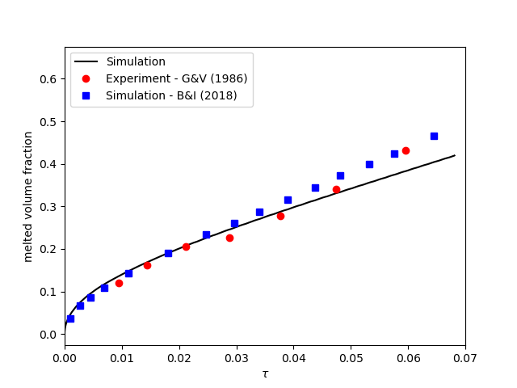
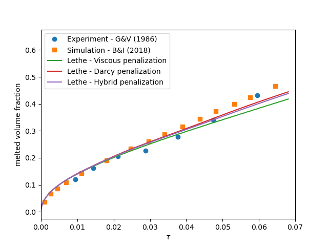

==========================
Melting Cavity
==========================

This example simulates a two-dimensional gallium melting cavity and is inspired by the work of Blais and Ilinca [#blais2018]_.

.. _two-dimensional gallium melting cavity: https://www.sciencedirect.com/science/article/pii/S0045793018301415

----------------------------------
Features
----------------------------------

- Solver: ``lethe-fluid`` 
- Phase change (solid-liquid)
- Buoyant force (natural convection)
- Temperature-dependent stasis constraint
- Unsteady problem handled by an adaptive BDF2 time-stepping scheme 
- Usage of a python script for post-processing data

---------------------------
Files Used in This Example
---------------------------

All files mentioned below are located in the example's folder (``examples/multiphysics/melting-cavity``).

- Parameter files: ``melting-cavity.prm``, ``melting-cavity-stasis-constraint.prm``, ``melting-cavity-darcy.prm``
- Postprocessing Python scripts: ``melting-cavity.py``, ``compare-melting-cavity.py``
- Python script to calculate the dimensionless numbers: ``dimensionless_number_calculator.py``

-----------------------------
Description of the Case
-----------------------------

The melting of metals (gallium in this example) with natural convection within a cavity is a well-known benchmark. The following schematic describes the geometry and dimensions of the simulation in the :math:`(x,y)` plane:

The incompressible Navier-Stokes equations with a Boussinesq approximation for the buoyant force are:
    .. math::
        \nabla \cdot {\bf{u}} = 0

    .. math::
        \rho \frac{\partial {\bf{u}}}{\partial t} + \rho ({\bf{u}} \cdot \nabla) {\bf{u}} = -\nabla p + \nabla \cdot {\bf{\tau}} - \rho \beta {\bf{g}} (T - T_{ref})

where :math:`\beta` and :math:`T_{ref}` denote thermal expansion coefficient and a reference temperature, respectively.

A two-dimensional block of gallium (initially in solid phase) is heated from its left wall at :math:`t = 0` s. Its initial temperature is close to (but slightly smaller than) the melting point and the temperature of the left wall is higher than the melting point. Hence, the block starts melting from the left wall. In the melted zone, close to the left wall, the buoyant force (natural convection) creates vortices inside the liquid.

The simulation parameters are selected according to the references [#blais2018]_ [#gau1986]_ to satisfy the desired values for the dimensionless numbers
    .. math::
        \text{Ra} = \frac{\rho^2 \beta g (T_w - T_m) L^3 c_p}{k \mu} = 10^5

    .. math::
        \text{Gr} = \frac{g \beta (T_w - T_m) L^3}{\nu^2} = 5.5 \cdot 10^6

    .. math::
        \text{St}_l = \frac{c_p (T_w - T_m)}{\lambda} = 0.041

where :math:`\rho` is the fluid density, :math:`\beta` denotes the thermal expansion coefficient, :math:`g` is the magnitude of gravitational acceleration, :math:`T_w` and :math:`T_m` are the hot wall and the melting point temperatures, :math:`L` denotes the characteristic length, :math:`k` is the thermal conduction coefficient, and :math:`\mu` and :math:`\nu` are the dynamic and kinematic viscosities, :math:`c_p` is the specific thermal capacity, and :math:`\lambda` is the enthalpy of melting.

.. note:: 
    All the four boundary conditions are ``noslip``, and an external 
    gravity field of :math:`-1` is applied in the :math:`y` direction. For the heat transfer boundary conditions the temperatures of the left (:math:`T_l = 38 \, ^{\circ} \text{C}`) and the right (:math:`T_l = 28 \, ^{\circ} \text{C}`) walls are defined.

--------------
Parameter File
--------------

Simulation Control
~~~~~~~~~~~~~~~~~~

Time integration is handled by a first order backward differentiation scheme 
`(bdf1)`, for a :math:`41` s simulation time with an initial 
time step of :math:`0.01` second.

.. note::   
    This example uses an adaptive time-stepping method, where the 
    time-step is modified during the simulation to keep the maximum value of the CFL condition below a given threshold (0.9 here). 

.. note::   
    Note that the melting process is slow compared to the time-scale of the velocity. Hence we expect a large number of time-steps and a long simulation.

.. code-block:: text

    subsection simulation control
      set method                       = bdf1
      set time end                     = 41
      set time step                    = 0.01
      set adapt                        = true 
      set max cfl                      = 0.8
      set adaptative time step scaling = 1.1
      set output name                  = melting
      set output control               = iteration
      set output frequency             = 100
      set output path                  = ./output/
    end

Multiphysics
~~~~~~~~~~~~

The ``multiphysics`` subsection enables to turn on `(true)` and off `(false)` the physics of interest. Here ``heat transfer``, ``buoyancy force``, and ``fluid dynamics`` are chosen.

.. code-block:: text

    subsection multiphysics
      set heat transfer  = true
      set buoyancy force = true
      set fluid dynamics = true
    end 
    
Initial Conditions
~~~~~~~~~~~~~~~~~~

In the ``initial condition``, the initial velocity and initial temperature in the simulation domain are defined. The initial velocity is equal to zero as the block is in the solid phase at :math:`t = 0` s. 

.. code-block:: text

    subsection initial conditions
      set type = nodal
      subsection uvwp
        set Function expression = 0; 0; 0
      end
      subsection temperature
        set Function expression = 28
      end
    end

Source Term
~~~~~~~~~~~

The ``source term`` subsection defines the gravitational acceleration. The value of the gravitational acceleration in this example is selected to satisfy the desired values of Ra and Gr numbers.

.. code-block:: text
    
    subsection source term
      subsection fluid dynamics
        set Function expression = 0 ; -1 ; 0
      end
    end

Physical Properties
~~~~~~~~~~~~~~~~~~~

The solid block melts into liquid in this example, hence in the ``physical properties`` subsection, we define the phase change parameters. Similar to gravitational acceleration, the latent enthalphy of phase change is selected to satisfy the value of Stefan number. A :math:`\Delta T = 0.2 \, ^{\circ} \text{C}` is selected between the solidus and liquidus temperatures. For more information about the phase change model in Lethe, visit the :doc:`Stefan problem <../stefan-problem/stefan-problem>` example. The kinematic viscosity of the solid phase is chosen :math:`\approx 10000` times larger than the kinematic viscosity of the liquid phase. The reference temperature is set to the liquidus temperature and a phase change thermal expansion model is used to ensure that there is no Boussinesq forcing term in the solid phase.

.. code-block:: text

    subsection physical properties
      set number of fluids = 1
      set reference temperature = 29.8
      subsection fluid 0
        set thermal conductivity model = constant
        set thermal conductivity       = 0.040516842071415184
    
        set thermal expansion model = phase_change
        set thermal expansion       = 1
    
        set rheological model   = phase_change
        set specific heat model = phase_change
    
        set density = 1
    
        subsection phase change
          # Enthalpy of the phase change
          set latent enthalpy = 200
    
          # Temperature of the liquidus
          set liquidus temperature = 29.8
    
          # Temperature of the solidus
          set solidus temperature = 29.6
    
          # Specific heat of the liquid phase
          set specific heat liquid = 1
    
          # Specific heat of the solid phase
          set specific heat solid = 1
    
          # Kinematic viscosity of the liquid phase
          set viscosity liquid = 0.0007366698558439125
    
          # Kinematic viscosity of the solid phase
          set viscosity solid = 10
    
          # Thermal expansion of the liquid phase
          set thermal expansion liquid       = 1
    
          # Thermal expansion of the solid phase
          set thermal expansion solid        = 0
    
        end
      end
    end

---------------------------
Running the Simulation
---------------------------

Launching the simulation is as simple as specifying the executable name and the parameter file. Assuming that the ``lethe-fluid`` executable is within your path, the simulation can be launched by typing:

.. code-block:: text
  :class: copy-button

  mpirun -np 16 lethe-fluid melting-cavity.prm

to run the simulation using sixteen CPU cores. Feel free to use more.

.. warning:: 
    Make sure to compile lethe in `Release` mode and 
    run in parallel using mpirun. This simulation takes
    :math:`\approx` 1 hours on 16 processes.

-------
Results
-------

The following animation shows the results of this simulation:

.. raw:: html
  
    

    <iframe width="492" height="566" src="https://www.youtube.com/embed/kftZ3lj6uTg?si=UYPbLhWx7uqx4cdw" frameborder="0" allowfullscreen ></iframe>
    

A python post-processing code `(melting-cavity.py)` 
is added to the example folder to post-process the results.
Run ``python3 ./melting-cavity.py ./output`` to execute this 
post-processing code, where ``./output`` is the directory that 
contains the simulation results. In post-processing, the position of the solid-liquid interface at the top, center and bottom of the cavity, as well as the melted volume fraction are plotted and compared with experiments of Gau and Viskanta [#gau1986]_. Note that the discrepancies in the interfaces are attributed to the two-dimensional simulations and they were also observed and reported by Blais and Ilinca [#blais2018]_.

-------------------------------------------------------------
Improving Computational Performances with Stasis Constraints
-------------------------------------------------------------

Lethe is able to :doc:`constrain temperature-dependent stasis <../../../parameters/cfd/constrain_stasis>` on fluids.
To use this feature, the ``constrain stasis`` subsection is added to the parameter file (see ``melting-cavity-stasis-constraint.prm``):

.. code-block:: text

  subsection constrain stasis
    set enable                = true
    set number of constraints = 1
    subsection constraint 0
      set fluid id        = 0
      set min temperature = 0
      set max temperature = 28.5
    end
  end

Employing this feature enables a more effective conditioning of the global matrix by imposing homogeneous velocity and pressure constraints on degrees of freedom (DoFs) of cells within the specified temperature range, consequently reducing computation time. For example, running the simulation with 16 CPU cores and the stasis constraint specified above only takes :math:`\sim 24 \; \mathrm{minutes}` while the solved quantities of interest remain unchanged.

.. caution::
  When using this feature, ensure that the imposed ``max temperature`` value is lower than the solidus temperature of the material. Additionally, we advise maintaining a buffer zone to prevent disruption to fluid flow resolution near the melting zone.

--------------------------------------------
Darcy Penalization: An Alternative Approach
--------------------------------------------

Lethe supports an alternative strategy to impose stasis (no motion) within the solidified material using a Darcy-like penalization. This penalization adds a forcing term to the momentum equation to prohibit the motion of the solid instead of increasing its viscosity. This has the advantage of leading to a better matrix conditioning, at the expense of potentially increased motion within the solid phase. To enable this forcing term, a velocity source term must be specified:

.. code-block:: text

  subsection velocity source
  set Darcy type = phase_change
  end

Furthermore, the ``phase change`` subsection within the physical properties but also be modified to specify the Darcy penalty of the solid and liquid phase:

.. code-block:: text

    subsection physical properties
      set number of fluids      = 1
      set reference temperature = 29.8
      subsection fluid 0
        set thermal conductivity model = constant
        set thermal conductivity       = 0.040516842071415184
    
        set thermal expansion model = phase_change
        set thermal expansion       = 1
    
        set rheological model   = phase_change
        set specific heat model = phase_change
    
        set density = 1
    
        subsection phase change
          # Enthalpy of the phase change
          set latent enthalpy = 200
    
          # Temperature of the liquidus
          set liquidus temperature = 29.8
    
          # Temperature of the solidus
          set solidus temperature = 29.6
    
          # Specific heat of the liquid phase
          set specific heat liquid = 1
    
          # Specific heat of the solid phase
          set specific heat solid = 1
    
          # Kinematic viscosity of the liquid phase
          set viscosity liquid = 0.0007366698558439125
    
          # Kinematic viscosity of the solid phase
          set viscosity solid = 0.0007366698558439125
    
          # Thermal expansion of the liquid phase
          set thermal expansion liquid = 1
    
          # Thermal expansion of the solid phase
          set thermal expansion solid = 0
    
          # Permeability of the liquid phase
          set Darcy penalty liquid = 0
    
          # Permeability of the  solid phase
          set Darcy penalty solid = 1e4
        end
      end
    end
  
Note that the viscosity of the liquid and the solid phase are now identical and that a very strong Darcy penalty coefficient is applied on the solid phase to restrict its motion. A third approach would be to combine this Darcy term with the viscosity model used above, resulting in an hybrid approach.

The following graph shows the evolution of the liquid fraction as a function of time using the viscous penalty, Darcy penalty and hybrid penalty strategy. We see that the viscous penalty tends to increase the amount of molten material. Whether or not this is a physical phenomenon cannot be assessed here.

-----------
References
-----------

.. [#blais2018] \B. Blais and F. Ilinca, “Development and validation of a stabilized immersed boundary CFD model for freezing and melting with natural convection,” *Comput. Fluids*, vol. 172, pp. 564–581, Aug. 2018, doi: `10.1016/j.compfluid.2018.03.037 <https://doi.org/10.1016/j.compfluid.2018.03.037>`_\.

.. [#gau1986] \C. Gau and R. Viskanta, “Melting and Solidification of a Pure Metal on a Vertical Wall,” *J. Heat Transf.*, vol. 108, no. 1, pp. 174–181, Feb. 1986, doi: `10.1115/1.3246884 <https://doi.org/10.1115/1.3246884>`_\.
