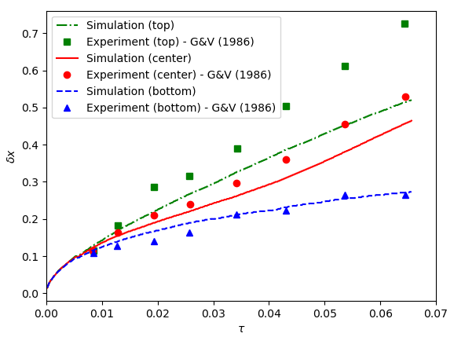
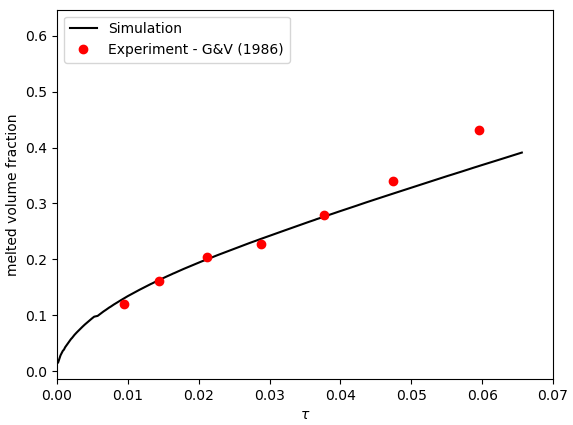

==========================
Melting Cavity
==========================

This example simulates a `two-dimensional gallium melting cavity`_. 

.. _two-dimensional gallium melting cavity: https://www.sciencedirect.com/science/article/pii/S0045793018301415

----------------------------------
Features
----------------------------------
- Solver: ``gls_navier_stokes_2d`` 
- Phase change (solid-liquid)
- Buoyant force (natural convection)
- Unsteady problem handled by an adaptive BDF2 time-stepping scheme 
- Usage of a python script for post-processing data

------------------------
Location of the example
------------------------
``examples/multiphysics/melting_cavity/melting_cavity.prm``

-----------------------------
Description of the case
-----------------------------

The melting of metals (gallium in this example) with natural convection within a cavity is a well-known benchmark. The following schematic describes the geometry and dimensions of the simulation in the :math:`(x,y)` plane:

.. image:: images/melting_cavity.png
    :alt: Schematic
    :align: center
    :width: 400

The incompressible Navier-Stokes equations with a Boussinesq approximation for the buoyant force are:
    .. math::
        \nabla \cdot {\bf{u}} = 0

    .. math::
        \rho \frac{\partial {\bf{u}}}{\partial t} + \rho ({\bf{u}} \cdot \nabla) {\bf{u}} = -\nabla p + \nabla \cdot {\bf{\tau}} - \rho \beta {\bf{g}} (T - T_0)

where :math:`\beta` and :math:`T_0` denote thermal expansion coefficient and a reference temperature, respectively.

A two-dimensional block of gallium (initially in solid phase) is heated from its left wall at :math:`t = 0` s. Its initial temperature is close to (but slightly smaller than) the melting point and the temperature of the left wall is higher than the melting point. Hence, the block starts melting from the left wall. In the melted zone, close to the left wall, the buoyant force (natural convection) creates vortices inside the liquid.

The simulation parameters are selected according to the references [`1 <https://doi.org/10.1016/j.compfluid.2018.03.037>`_, `2 <https://doi.org/10.1115/1.3246884>`_] to satisfy the desired values for the dimensionless numbers
    .. math::
        \text{Ra} = \frac{\rho^2 \beta g (T_w - T_m) L^3 c_p}{k \mu} = 10^5

    .. math::
        \text{Gr} = \frac{g \beta (T_w - T_m) L^3}{\nu^2} = 5.5 \cdot 10^6

    .. math::
        \text{St}_l = \frac{c_p (T_w - T_m)}{\lambda} = 0.041

where :math:`\rho` is the fluid density, :math:`\beta` denotes the thermal expansion coefficient, :math:`g` is the magnitude of gravitational acceleration, :math:`T_w` and :math:`T_m` are the hot wall and the melting point temperatures, :math:`L` denotes the characteristic length, :math:`k` is the thermal conduction coefficient, and :math:`\mu` and :math:`\nu` are the dynamic and kinematic viscosities, :math:`c_p` is the specific thermal capacity, and :math:`\lambda` is the enthalpy of melting.

.. note:: 
    All the four boundary conditions are ``noslip``, and an external 
    gravity field of :math:`-0.00516` is applied in the :math:`y` direction. For the heat transfer boundary conditions the temperatures of the left (:math:`T_l = 108 ^{\circ} C`) and the right (:math:`T_l = 104.9 ^{\circ} C`) walls are defined.

--------------
Parameter file
--------------

Time integration is handled by a 2nd order backward differentiation scheme 
`(bdf2)`, for a :math:`40000` s simulation time with an initial 
time step of :math:`0.1` second.

.. note::   
    This example uses an adaptive time-stepping method, where the 
    time-step is modified during the simulation to keep the maximum value of the CFL condition below a given threshold (0.5 here). Using ``output control = time``, and ``output time = 100`` the simulation results are written every 100 s.

.. note::   
    Note that the melting process is slow, and the velocity magnitude is small in the melted region. Hence, we expect large time-steps and a long simulation.

.. code-block:: text

    # --------------------------------------------------
    # Simulation Control
    #---------------------------------------------------
    subsection simulation control
        set method                          = bdf2
        set time end                        = 40000
        set time step                       = 0.1
        set max cfl                         = 0.5
        set adaptative time step scaling    = 1.3
        set output name                     = melting
        set output control                  = time
        set output time                     = 100
        set output path                     = ./output/      
    end

The ``multiphysics`` subsection enables to turn on `(true)` and off `(false)` the physics of interest. Here ``heat transfer``, ``buoyancy force``, and ``fluid dynamics`` are chosen.

.. code-block:: text

    #---------------------------------------------------
    # Multiphysics
    #---------------------------------------------------
    subsection multiphysics
        set heat transfer  		= true
        set buoyancy force 		= true
        set fluid dynamics 		= true
    end 
    

In the ``initial condition``, the initial velocity and initial temperature in the simulation domain are defined. The initial velocity is equal to zero as the block is in the solid phase at :math:`t = 0` s. The initial temperature is chosen slightly (0.1 :math:`^{\circ} C`) smaller than the melting point temperature.

.. code-block:: text

    #---------------------------------------------------
    # Initial condition
    #---------------------------------------------------
    subsection initial conditions
        set type = nodal
        subsection uvwp
            set Function expression 	= 0; 0; 0
        end
        subsection temperature
            set Function expression 	= 104.9
        end
    end

The ``source term`` subsection defines the gravitational acceleration. The value of the gravitational acceleration in this example is selected to satisfy the desired values of Ra and Gr numbers.

.. code-block:: text
    
    #---------------------------------------------------
    # Source term
    #---------------------------------------------------
    subsection source term
        set enable                 		= true
        subsection xyz
                set Function expression 	= 0 ; -0.00516 ; 0
        end
    end

The solid block melts into liquid in this example, hence in the ``physical properties`` subsection, we define the phase change parameters. Similar to gravitational acceleration, the latent enthalphy of phase change is selected to satisfy the value of Stefan number. A :math:`\Delta T = 0.1 ^{\circ} C` is selected between the solidus and liquidus temperatures. For more information about the phase change model in Lethe, visit the :doc:`Stefan problem <../stefan_problem/stefan_problem>` example. The viscosity of the solid phase is chosen :math:`\approx 10000` times larger than the viscosity of the liquid phase.

.. code-block:: text

    #---------------------------------------------------
    # Physical Properties
    #---------------------------------------------------
    subsection physical properties
          set number of fluids     		= 1
          subsection fluid 0
            set thermal conductivity model 	= constant
            set thermal conductivity 	        = 60
                  
            set thermal expansion model 	= constant
            set thermal expansion 		= 0.0002
            
            set rheological model 		= phase_change
            set specific heat model 		= phase_change
            
            set density 			= 7500
            
            subsection phase change
              # Enthalpy of the phase change
              set latent enthalpy      		= 14634.1463
        
              # Temperature of the liquidus
              set liquidus temperature 		= 105.1
        
              # Temperature of the solidus
              set solidus temperature  		= 105
        
              # Specific heat of the liquid phase
              set specific heat liquid 		= 200
        
              # Specific heat of the solid phase
              set specific heat solid  		= 200
        
              # viscosity of the liquid phase
              set viscosity liquid 		= 0.00000075
                  
              # viscosity of the solid phase
              set viscosity solid  		= 0.008
            end
          end
      end

---------------------------
Running the simulation
---------------------------

Call the gls_navier_stokes_2d by invoking:  

``mpirun -np 12 gls_navier_stokes_2d melting_cavity.prm``

to run the simulation using twelve CPU cores. Feel free to use more.

.. warning:: 
    Make sure to compile lethe in `Release` mode and 
    run in parallel using mpirun. This simulation takes
    :math:`\approx` 24 hours on 12 processes.

-------
Results
-------

The following animation shows the results of this simulation:

.. raw:: html

    <iframe width="560" height="315" src="https://www.youtube.com/embed/tivAPjdCJeA" frameborder="0" allowfullscreen></iframe>

A python post-processing code `(melting_cavity.py)` 
is added to the example folder to post-process the results.
Run ``python3 ./melting_cavity.py ./output`` to execute this 
post-processing code, where ``./output`` is the directory that 
contains the simulation results. In post-processing, the position of the solid-liquid interface at the top, center and bottom of the cavity, as well as the melted volume fraction are plotted and compared with experiments of Gau and Viskanta `[2] <https://doi.org/10.1115/1.3246884>`_. Note that the discrepancies in the interfaces are attributed to the two-dimensional simulations and they were also observed and reported by Blais et al. `[1] <https://doi.org/10.1016/j.compfluid.2018.03.037>`_.

-----------
References
-----------
`[1] <https://doi.org/10.1016/j.compfluid.2018.03.037>`_ Blais, B. and Ilinca, F., 2018. Development and validation of a stabilized immersed boundary CFD model for freezing and melting with natural convection. Computers & Fluids, 172, pp.564-581.

`[2] <https://doi.org/10.1115/1.3246884>`_ Gau, C. and Viskanta, R., 1986. Melting and solidification of a pure metal on a vertical wall.
