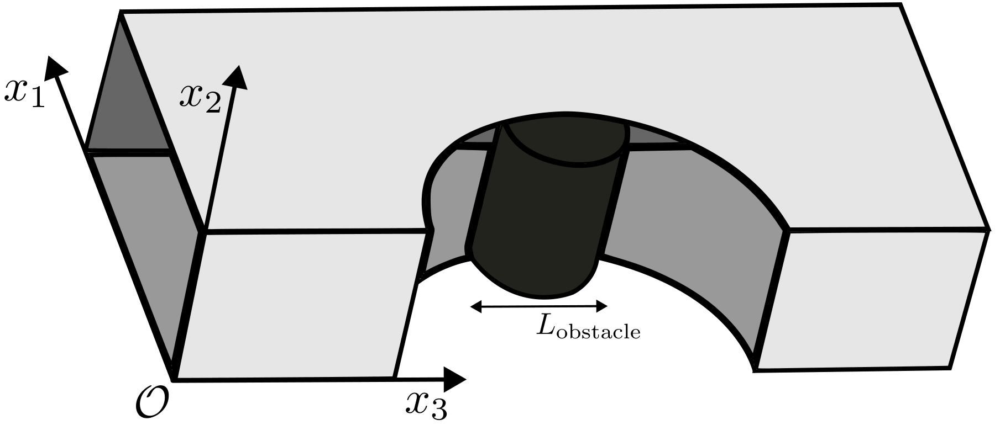
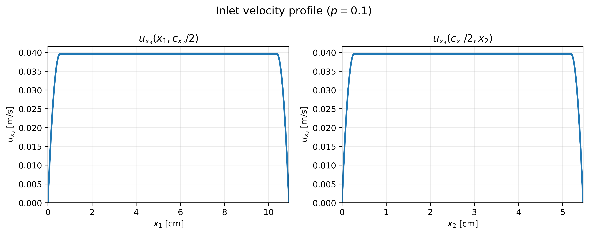
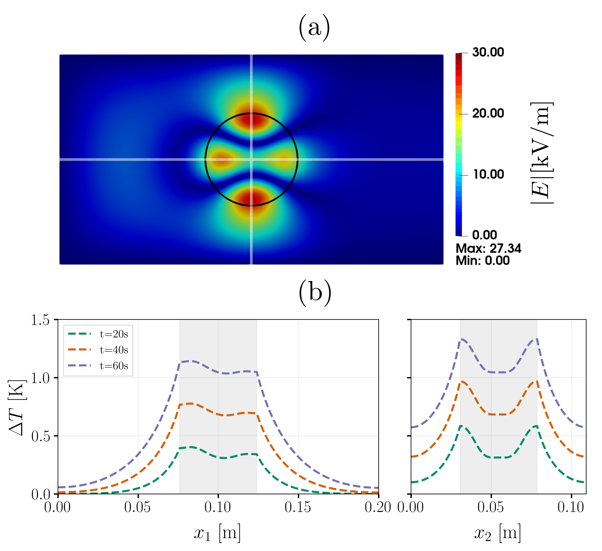
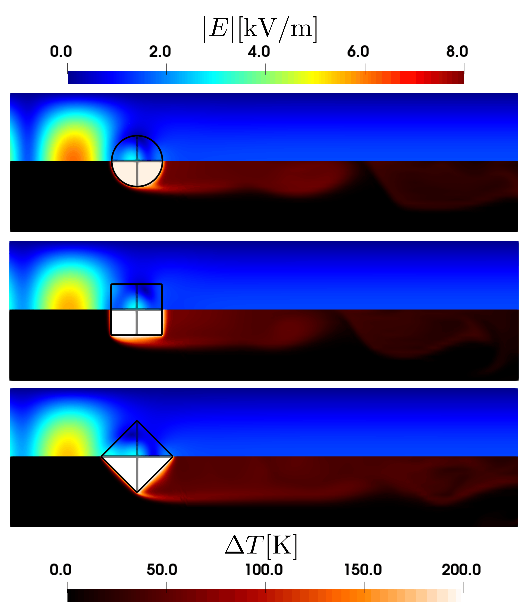

..
    SPDX-FileCopyrightText: Copyright (c) 2026 The Lethe Authors
    SPDX-License-Identifier: Apache-2.0 WITH LLVM-exception OR LGPL-2.1-or-later

Microwave Heating
=========================

This example couples the time-harmonic Maxwell solver with heat transfer to simulate the **microwave heating** of a dielectric cylinder sitting inside a rectangular waveguide. A first case reproduces, without any fluid flow, the resonance-driven heating of a low-loss ceramic cylinder studied by Peng *et al.* [#Peng2024]_. A second case builds on the first one and shows how a fluid flow can be added to the same setup to convectively cool the microwave-heated object.

Features
--------

- Solver: ``lethe-fluid`` or ``lethe-fluid-matrix-free``
- Transient problem
- Coupling of the time-harmonic Maxwell solver with heat transfer through the ``microwave heating = true`` parameter
- Excitation of a rectangular waveguide through a ``waveguide port`` boundary condition and absorption of outgoing waves through a matched ``impedance boundary``
- Use of the built-in ``uniform_channel_with_meshed_cylinder`` grid, in which a solid cylinder is meshed and embedded in a rectangular channel

Files Used in This Example
--------------------------

Both parameter files below are located in the example's folder (``examples/multiphysics/microwave-heating``).

- Parameter file, static heating of an alumina cylinder: ``filled_waveguide_cylinder_Al.prm``
- Parameter file, heating of a silicon carbide cylinder cooled by an air flow: ``filled_waveguide_cylinder_SiC.prm``

.. note::
    Additional parameter files for the square and tilted square obstacle are also available to make the results easily reproducable, but are not discussed in this example since they follow the same logic as the ``filled_waveguide_cylinder_SiC.prm`` case, but using another geometry. See the :ref:`Uniform Channel with Meshed Square Prism <channel-prism>` for details on this grid and its arguments.

Description of the Case
-----------------------

Geometry
~~~~~~~~

Both cases share the same base geometry: a section of rectangular waveguide, with a cylindrical dielectric sample standing across its narrow dimension, meshed with the built-in ``uniform_channel_with_meshed_cylinder`` grid (see the :ref:`Uniform Channel with Meshed Cylinder <channel-cylinder>` documentation for the full description of this grid and its arguments).

The waveguide's cross-section is :math:`109.2\ \mathrm{mm}\times54.6\ \mathrm{mm}` in both cases (a standard WR-430 rectangular waveguide), with the cylinder's axis pointing in the :math:`x_3`-direction. The cylinder itself is meshed (``mesh_obstacle = true``) so that the temperature field can be resolved inside it. In the case with fluid flow, the channel is longer to allow the flow to develop vortex downstream of the cylinder before reaching the outlet boundary condition. Note that because of how the ``uniform_channel_with_meshed_cylinder`` grid is built, the `x_3`-direction corresponds to the `x` axis, the `x_1`-direction to the `y` axis, and the `x_2`-direction to the `z` axis in the parameter files. 

- In ``filled_waveguide_cylinder_Al.prm``, the channel is :math:`200\ \mathrm{mm}` long, and the cylinder has a radius of :math:`24\ \mathrm{mm}`, centered midway along the channel.
- In ``filled_waveguide_cylinder_SiC.prm``, the channel is :math:`400\ \mathrm{mm}` long to leave room for the flow to develop, and the cylinder has a radius of :math:`20\ \mathrm{mm}`.

.. _microwave-heating-cases:

Physical Problem
~~~~~~~~~~~~~~~~

The amount of power absorbed by a dielectric cylinder placed in a waveguide is strongly dependent on its radius and permittivity: for specific combinations of these two parameters, the internal electromagnetic field can build up through constructive interference. The ``filled_waveguide_cylinder_Al.prm`` case reproduces this behavior for a low-loss alumina cylinder and is meant to be compared against the results of Peng *et al.* [#Peng2024]_, who studied this exact resonance-driven heating mechanism, both theoretically (using Mie theory) and numerically, for low-loss cylindrical samples of alumina in a waveguide.

The first test case follow their numerical and experimental setup. Like what is described in the :doc:`waveguide example <../waveguide/waveguide>`, the time-harmonic Maxwell solver excites a single rectangular waveguide mode (here, the fundamental :math:`\mathrm{TE}_{10}` mode) through a ``waveguide port`` boundary condition, and absorbs the wave transmitted past the cylinder through a matched ``impedance boundary`` condition, which mimics a semi-infinite waveguide by preventing spurious reflections back toward the cylinder.

Since ``set microwave heating = true`` is used in both cases, the power dissipated by the dielectric losses of the cylinder is automatically computed from the electromagnetic solution and added as a source term to the heat transfer equation,

.. math::
    Q_\mathrm{em} = \frac{1}{2}\sigma|\mathbf{E}|^2 + \frac{1}{2}\omega\varepsilon_0\varepsilon_\mathrm{im}|\mathbf{E}|^2 + \frac{1}{2}\omega\mu_0\mu_\mathrm{im}|\mathbf{H}|^2,

see the :doc:`multiphysics <../../../parameters/cfd/multiphysics>` documentation for details. Since both materials considered here are non-magnetic and non-conductive (:math:`\mu_\mathrm{im}=\sigma=0`), only the dielectric loss term, proportional to :math:`\varepsilon_\mathrm{im}|\mathbf{E}|^2`, contributes to the heating.

.. tip::
    Because none of the physical properties used in this example depend on temperature, the electromagnetic fields do not need to be recomputed as the cylinder heats up. Both parameter files therefore rely on (or default to) ``subsection time coupling strategy`` with ``set type = none``: the electromagnetic problem is solved once, before the first time step, and the resulting heat source is then reused throughout the transient heat transfer solve. See the :doc:`../../../parameters/cfd/time_harmonic_maxwell` documentation for the other available coupling strategies, needed when the physical properties depend on the temperature.

The heat transfer equation is then solved in time for 60 seconds, with the whole domain initially at a uniform reference temperature of 39.6 °C (without loss of generality, we use a rescaled temperature of 0 in the parameter files because in the post processing we compute the change in temperature). In the first case, the cylinder is surrounded by stagnant air, which is not allowed to flow (``fluid dynamics = false``), so that it can only lose heat by conduction through the surrounding air until it reaches the walls of the waveguide, which are all assumed to be insulated (``noflux``). 

In the second case, we build on the first case and introduce a laminar air flow along the channel with an imposed temperature of 0 °C, which is also the initial temperature of the domain, and keep the same ``noflux`` boundary condition on the channel walls and on the outlet. Additionally, the cylinder is now made of silicon carbide (SiC), a much lossier ceramic than the alumina used in the first case, so that it heats up in a more noticeable way. Now, for the fluid problem, the air flow is bounded by no-slip conditions at the walls of the waveguide, has an imposed velocity profile at the inlet, and a do-nothing boundary condition at the outlet. For the inlet air flow velocity profile, it is built using a separable two-dimensional smoothed top-hat profile. The velocity is constant in the central region of the inlet cross-section and decreases quadratically to zero over a layer extending over a prescribed percent of the channel width and height adjacent to each wall. The resulting profile therefore provides a uniform core while ensuring a smooth transition to the no-slip condition at the walls. The profile is scaled according to the specified Reynolds number (here, Re = 400). Mathematically, the condition is defined as :

.. math::

   \mathbf{u} = (0,0,u_{x_3}(x_1,x_2)),

with,

.. math::

   u_{x_3}(x_1,x_2) =
   \mathrm{Re}\,\alpha\,
   \left|f_{x_1}(x_1)f_{x_2}(x_2)\right|,

with :math:`c_{x_1}` and :math:`c_{x_2}` the channel width and height, respectively, :math:`p` the fraction of each dimension over which the velocity is smoothed quadratically to zero, and where both :math:`f_{x_1}` and :math:`f_{x_2}` are given by the following piecewise function:

.. math::

   f_\xi(\xi)=
   \begin{cases}
      \xi(\xi-pc_\xi),
      & \xi < \dfrac{pc_\xi}{2}, \\[4pt]
      \dfrac{(pc_\xi)^2}{4},
      & \dfrac{pc_\xi}{2}\leq\xi
        \leq c_\xi-\dfrac{pc_\xi}{2}, \\[6pt]
      (\xi-c_\xi)(\xi-c_\xi+pc_\xi),
      & \xi > c_\xi-\dfrac{pc_\xi}{2}.
   \end{cases}

The parameter :math:`\alpha` in the above equations is a scaling factor so it is more convenient to specify the Reynolds number, defined here as :math:`\mathrm{Re} = \dfrac{u_\mathrm{avg}L_\mathrm{obstacle}}{\nu}`, then recomputing the average velocity :math:`u_\mathrm{avg}` using the volumetric flow rate each time ones want to modify the velocity without changing the inlet profile shape. Finally, the parameters used in the ``filled_waveguide_cylinder_SiC.prm`` case are:

.. math::

   c_{x_1}=10.92,\qquad
   c_{x_2}=5.46,\qquad
   \mathrm{Re}=400,\qquad
   \alpha=1.78212272417098,\qquad
   p=0.1.

It gives the following velocity profiles at the inlet:

Parameter Files
---------------

Case 1: Static Heating of an Alumina Cylinder
~~~~~~~~~~~~~~~~~~~~~~~~~~~~~~~~~~~~~~~~~~~~~

This case (``filled_waveguide_cylinder_Al.prm``) solves the coupled electromagnetics/heat transfer problem without any fluid flow.

Simulation Control
^^^^^^^^^^^^^^^^^^

.. code-block:: text

    subsection simulation control
        set method                         = bdf1
        set time step                      = 0.05
        set time end                       = 60
        set output time frequency          = 0.05
        set output path                    = ./cylinder_resonance/
        set subdivision                    = 3
    end

The heat transfer equation is integrated in time with a first-order backward difference scheme (``bdf1``) up to :math:`t=60\ \mathrm{s}`. Since ``fluid dynamics = false`` (see below), no velocity field is solved for and the CFL condition is trivially satisfied at every time step; the time step therefore is set to a specific value of :math:`0.05` that is equal to the output frequency based on the simulation time, so that the solution is saved at every time step. 

.. note::
    The ``subdivision`` parameter is used to subdivided each cell into smaller sub-cells to produce smoother visualizations of the solution since here we are using higher order polynomial, but Paraview only supports linear interpolation between the vertices of each cell. 

Mesh Adaptation
^^^^^^^^^^^^^^^

.. code-block:: text

    subsection mesh adaptation
        set type = none
    end

No adaptive mesh refinement is used in this example; the mesh resolution is instead controlled entirely by the ``mesh`` subsection below. An analysis of the mesh convergence and an optimization of the refinement area as also been performed prior to the simulation of the microwave-heating of the cylinder to ensure that the mesh is sufficiently refined to capture the electromagnetic, velocity and temperature fields accurately without requiring an excessive number of degrees of freedom (degrees of freedom are hard to keep bounded when performing mesh adaptation in a multiphysics problem, especially when the different physics have different mesh refinement requirements). 

Multiphysics
^^^^^^^^^^^^

.. code-block:: text

    subsection multiphysics
        set fluid dynamics    = false
        set microwave heating = true
        set electromagnetics  = true
        set heat transfer     = true
    end

The fluid dynamics solver is disabled: only the electromagnetics and heat transfer physics are solved, coupled through the ``microwave heating`` source term described above.

Mesh
^^^^

.. code-block:: text

    subsection mesh
        set type               = lethe
        set grid type          = uniform_channel_with_meshed_cylinder
        set grid arguments     = 0., 0. : 0.2, 0.1092 : 0.1, 0.0546 : 0.024 : 0.04 : 1 : 1 : 2 : 2 : 0.0546 : 2 : false : true : true
        set initial refinement = 2
    end

This builds the :math:`200\ \mathrm{mm} \times 109.2\ \mathrm{mm}` channel cross-section extruded to a height of :math:`54.6\ \mathrm{mm}`, with a meshed cylinder of radius :math:`24\ \mathrm{mm}` (``mesh_obstacle = true``) centered at mid-length and mid-height of the channel, and colorized (``colorize = true``) boundaries.

Time Harmonic Maxwell
^^^^^^^^^^^^^^^^^^^^^

.. code-block:: text

    subsection time harmonic maxwell
        set electromagnetic frequency    = 2.45e9
        set number of waveguide inlets   = 1
        set electromagnetic scaling type = power

        subsection waveguide inlet 0
            set port boundary id = 0

            set waveguide power = 50

            set corner 0 = 0,0,0
            set corner 1 = 0.,10.92,0
            set corner 2 = 0., 0., 5.46
            set corner 3 = 0., 10.92, 5.46

            subsection waveguide mode
                set mode type    = TE
                set mode order m = 1
                set mode order n = 0
            end
        end
    end

The waveguide is excited at the standard industrial microwave frequency of :math:`2.45\ \mathrm{GHz}` with a :math:`\mathrm{TE}_{10}` mode (:math:`m=1`, :math:`n=0`), fed through boundary id ``0`` (the left face of the channel) at a power of :math:`50\ \mathrm{W}`. Since ``electromagnetic scaling type = power`` is used, the solution is rescaled after solving so that the power flowing through this inlet matches this value (see the :doc:`../../../parameters/cfd/time_harmonic_maxwell` documentation for details).

Boundary Conditions
^^^^^^^^^^^^^^^^^^^

.. code-block:: text

    subsection boundary conditions time harmonic maxwell
        set number = 3
        subsection bc 0
            set id   = 2, 3, 4, 5
            set type = pec
        end
        subsection bc 1
            set id   = 0
            set type = waveguide port
        end
        subsection bc 2
            set id   = 1
            set type = impedance boundary
            subsection excitation x real part
                set Function expression = 0
            end
            subsection excitation x imag part
                set Function expression = 0
            end
            subsection excitation y real part
                set Function expression = 0
            end
            subsection excitation y imag part
                set Function expression = 0
            end
            subsection excitation z real part
                set Function expression = 0
            end
            subsection excitation z imag part
                set Function expression = 0
            end
            subsection surface admittance real part
                set Function expression = 0.828306014816808
            end
            subsection surface admittance imag part
                set Function expression = 0.
            end
        end
    end

- ``bc 0`` (ids ``2`` to ``5``, the four channel walls) is a ``pec`` boundary.
- ``bc 1`` (id ``0``, the left face) is the ``waveguide port`` used to excite the :math:`\mathrm{TE}_{10}` mode.
- ``bc 2`` (id ``1``, the right face) is an ``impedance boundary`` whose surface admittance is matched to the :math:`\mathrm{TE}_{10}` wave admittance of the empty guide, with no additional excitation, so that the wave transmitted past the cylinder is absorbed rather than reflected back.

.. code-block:: text

    subsection boundary conditions heat transfer
        set number = 1
        subsection bc 0
            set id   = 0, 1, 2, 3, 4, 5
            set type = noflux
        end
    end

Every wall of the channel is insulated (``noflux``): in this first case.

.. attention::
    As in the :doc:`waveguide <../waveguide/waveguide>` and :doc:`Fichera oven <../fichera-oven/fichera-oven>` examples, the ``subsection boundary conditions`` for the fluid dynamics boundaries cannot be removed from the parameter file, even though the fluid solver is disabled:

    .. code-block:: text

        subsection boundary conditions
            set number = 1
            subsection bc 0
                set id   = 0, 1, 2, 3, 4, 5
                set type = noslip
            end
        end

FEM
^^^
.. code-block:: text

    subsection FEM
        set temperature degree            = 3
        set electromagnetics trial degree = 2
        set electromagnetics test degree  = 3
    end

The choice of polynomial degrees for the finite element spaces is based on the mesh-convergence analysis and the optimization of the refinement region described above.

.. tip::
    The finite elements used to solve the time-harmonic Maxwell equations are first-kind Nédélec elements, which have substantially more degrees of freedom per cell than the elements used for the heat-transfer problem (or the fluid-dynamics problem, when enabled). As a result, using the same polynomial degree for all physics can make the electromagnetic problem disproportionately expensive. We therefore use a lower polynomial degree for the electromagnetic trial space to limit its computational cost.

    On the other hand, higher-order shape functions generally provide greater accuracy for a given number of degrees of freedom for the time-harmonic Maxwell problem. The choice of polynomial degree therefore involves a trade-off between the efficiency of the electromagnetic discretization and its accuracy. Achieving an efficient balance also requires an appropriately refined mesh, so that computational resources are not spent on unnecessary cells.

Physical Properties
^^^^^^^^^^^^^^^^^^^

.. code-block:: text

    subsection physical properties
        set number of fluids = 1
        set number of solids = 1
        subsection fluid 0
            set electric conductivity model = constant
            set electric conductivity       = 0.

            set electric permittivity model     = constant
            set electric permittivity real part = 1.
            set electric permittivity imag part = 0.

            set magnetic permeability model     = constant
            set magnetic permeability real part = 1.
            set magnetic permeability imag part = 0.

            set kinematic viscosity  = 1.48e-5
            set specific heat        = 1006
            set density              = 1.225
            set thermal conductivity = 2.6e-2
        end

        subsection solid 0
            set electric conductivity model = constant
            set electric conductivity       = 0.

            set electric permittivity model     = constant
            set electric permittivity real part = 9.2
            set electric permittivity imag part = 0.005

            set magnetic permeability model     = constant
            set magnetic permeability real part = 1.
            set magnetic permeability imag part = 0.

            set thermal conductivity = 26
            set specific heat        = 1046
            set density              = 3750
        end
    end

The waveguide is filled with air (``fluid 0``) where the material properties have been taken to be approximatly the one at International Standard Atmosphere. The cylinder (``solid 0``) is alumina (:math:`\mathrm{Al_2O_3}`): a low-loss ceramic with a relative permittivity of :math:`\varepsilon_r \approx 9.2 - 0.005i`. All its properties have been taken from Peng *et al.* [#Peng2024]_.

Non-Linear and Linear Solver Control
^^^^^^^^^^^^^^^^^^^^^^^^^^^^^^^^^^^^

.. code-block:: text

    subsection non-linear solver
        subsection fluid dynamics
            set verbosity = quiet
        end
        subsection heat transfer
            set verbosity      = verbose
            set tolerance      = 1e-4
            set max iterations = 10
        end
    end

    subsection linear solver
        subsection electromagnetics
            set verbosity         = verbose
            set relative residual = 1e-4
            set minimum residual  = 1e-8
            set preconditioner    = none
        end
        subsection heat transfer
            set max iters          = 1000
            set relative residual  = 1e-3
            set minimum residual   = 1e-6
            set max krylov vectors = 1000
        end
    end

Lethe always solve the heat transfer problem in a non-linear fashion, even though the physical properties are constant in this case, using Newton's method. The linear system arising from heat-transfer is solved with a GMRES iterative solver, while the time-harmonic Maxwell problem is solved with a Conjugate Gradient iterative solver. The preconditionner for the heat-transfer problem is the default ILU preconditioner, while the time-harmonic Maxwell problem is solved without any preconditioner. 

Case 2: Adding Fluid Flow
~~~~~~~~~~~~~~~~~~~~~~~~~

This second case (``filled_waveguide_cylinder_SiC.prm``) starts from the same base setup and adds a air flow along the channel, so that the cylinder is now convectively cooled while being heated by the electromagnetic field. Only the parameters that differ from, or are added to, Case 1 are detailed below.

Simulation Control
^^^^^^^^^^^^^^^^^^

.. code-block:: text

    subsection simulation control
        set method                         = bdf1
        set time step                      = 0.00005
        set adapt time step to respect CFL = true
        set adaptative time step scaling   = 1.005
        set output control                 = time
        set time end                       = 60
        set output time frequency          = 0.05
        set output path                    = ./output_cylinder/
        set subdivision                    = 3
        set max cfl = 1
    end

Since now there is a fluid flow, the time step is now adapted to respect the CFL condition, with a maximum CFL number of 1. The initial time step is set to :math:`5\times10^{-5}\ \mathrm{s}` and is increased by a factor of :math:`1.005` at each time step until the CFL condition is violated, in which case the time step is reduced to satisfy the CFL condition again.    

Multiphysics
^^^^^^^^^^^^

.. code-block:: text

    subsection multiphysics
        set fluid dynamics    = true
        set microwave heating = true
        set electromagnetics  = true
        set heat transfer     = true
    end

The only difference with Case 1 is ``set fluid dynamics = true``: the incompressible Navier-Stokes equations are now solved, in addition to electromagnetics and heat transfer.

Mesh and Box Refinement
^^^^^^^^^^^^^^^^^^^^^^^

.. code-block:: text

    subsection mesh
        set type                         = lethe
        set grid type                    = uniform_channel_with_meshed_cylinder
        set grid arguments               = 0., 0. : 40, 10.92 : 10, 5.56 : 2 : 4 : 1 : 1 : 2 : 8 : 5.46 : 3 : false : true : true
        set initial refinement           = 2
        set initial boundary refinement  = 1
        set boundaries refined           = 2,3,4,5
    end

    subsection box refinement
        set number of refinement boxes = 1
        subsection box 0
            subsection mesh
                set type                = dealii
                set grid type           = cylinder_shell
                set grid arguments      = 5.46: 2: 2.3: 20:20:false
                set initial translation = 10, 5.56, 0
            end
            set additional refinement = 2
        end
    end

The channel is now :math:`400\ \mathrm{mm}` long (to leave room for the flow to develop) and the cylinder radius is reduced to :math:`20\ \mathrm{mm}` to note be in the resonance mode. All lengths are given in centimeters here rather than meters (see the ``dimensionality`` subsection below), and the four channel walls (ids ``2`` to ``5``) receive one extra level of boundary refinement to better resolve the developing boundary layers.

A ``box refinement`` region, a thin cylindrical shell wrapped around the physical cylinder, is also added, providing two additional levels of refinement in the vicinity of the object to better resolve both the thermal and momentum boundary layers there. See the :doc:`../../../parameters/cfd/box_refinement` documentation for details.

Initial Conditions
^^^^^^^^^^^^^^^^^^

.. code-block:: text

    subsection initial conditions
        set type = nodal
        subsection uvwp
            set Function constants  = c_width = 10.92, c_height = 5.46, Re = 400, scaling = 1.782122724170977, percent = 0.1
            set Function expression = Re*scaling*abs((if(y < percent*c_width/2, y*(y-percent*c_width), if(y < c_width-(percent*c_width/2), (percent*c_width * percent*c_width)/4 , (y-c_width)*(y-c_width+ percent*c_width)))) * (if(z < percent*c_height/2, z*(z-percent*c_height), if(z < c_height-(percent*c_height/2), (percent*c_height * percent*c_height)/4, (z-c_height)*(z-c_height+percent*c_height)))));0;0;0
        end
        subsection temperature
            set Function expression = 0
        end
    end

The velocity field is initialized with an approximate fully-developed laminar profile for a rectangular duct, scaled to reach a Reynolds number of :math:`400` based on the channel's transverse dimensions, and rounded off near the walls (over ``percent = 10%`` of each transverse dimension) to avoid an unphysical discontinuity in the wall-normal velocity gradient at the channel edges. The same expression is reused verbatim as the inlet boundary condition below. Note that this velocity profile does not respect the presence of the cylinder, and results in oscillations in the flow field as the simulation starts, which are quickly damped by viscous effects over the first few time steps. This profile is chosen because it is the simplest one that respects the boundary conditions that are imposed at the inlet and on the walls.

The temperature field is initialized at :math:`0`.

Boundary Conditions
^^^^^^^^^^^^^^^^^^^

.. code-block:: text

    subsection boundary conditions
        set number = 3
        subsection bc 0
            set id   = 2, 3, 4, 5
            set type = noslip
        end
        subsection bc 1
            set id   = 0
            set type = function
            subsection u
                set Function constants  = c_width = 10.92, c_height = 5.46, Re = 400, scaling = 1.782122724170977, percent = 0.1
                set Function expression = Re*scaling*abs((if(y < percent*c_width/2, y*(y-percent*c_width), if(y < c_width-(percent*c_width/2), (percent*c_width * percent*c_width)/4 , (y-c_width)*(y-c_width+ percent*c_width)))) * (if(z < percent*c_height/2, z*(z-percent*c_height), if(z < c_height-(percent*c_height/2), (percent*c_height * percent*c_height)/4, (z-c_height)*(z-c_height+percent*c_height)))))
            end
            subsection v
                set Function expression = 0
            end
            subsection w
                set Function expression = 0
            end
        end
        subsection bc 2
            set id   = 1
            set type = outlet
        end
    end

    subsection boundary conditions heat transfer
        set number = 2
        subsection bc 0
            set id   = 1, 2, 3, 4, 5
            set type = noflux
        end
        subsection bc 1
            set id   = 0
            set type = temperature
            subsection value
                set Function expression = 0
            end
        end
    end

The left face (id ``0``) is now a velocity inlet, driven by the profile described in the `physical problem section <microwave-heating-cases_>`_, while the right face (id ``1``) is an ``outlet``. The incoming air is also imposed at a fixed temperature of :math:`0` on that same inlet face, while every other wall remains adiabatic (``noflux``); note that the electromagnetic boundary conditions (not repeated here) are unchanged from Case 1.

Physical Properties
^^^^^^^^^^^^^^^^^^^

.. code-block:: text

    subsection physical properties
        set number of fluids = 1
        set number of solids = 1
        subsection fluid 0
            # ... identical to Case 1 (air) ...
        end
        subsection solid 0
            set electric conductivity model = constant
            set electric conductivity       = 0.

            set electric permittivity model     = constant
            set electric permittivity real part = 9.72
            set electric permittivity imag part = 2.01

            set magnetic permeability model     = constant
            set magnetic permeability real part = 1.
            set magnetic permeability imag part = 0.

            set thermal conductivity = 120.92
            set specific heat        = 676.63
            set density              = 3210
        end
    end

The cylinder is now silicon carbide (SiC), a much lossier ceramic than the alumina used in Case 1 (:math:`\varepsilon_r \approx 9.72 - 2.01i`) where the properties have been taken from the CRC Materials Science and Engineering Handbook [#CRC2006]_. 

Dimensionality
^^^^^^^^^^^^^^
.. code-block:: text

    subsection dimensionality
        set length           = 0.01  #meter
        set mass             = 1     #kilogram
        set time             = 1     #second
        set temperature      = 1     #kelvin
        set electric current = 0.01  #ampere
    end

For this second case, the length unit is set to :math:`0.01\ \mathrm{m}` (1 cm) rather than :math:`1\ \mathrm{m}` as in Case 1. This is because when using the matrix-free solver for the Navier-Stokes equations, the geometric multigrid preconditioner works better when the quantities involved are of order 1. So here, the average velocity with our geometry and a Reynolds number of 400 is :math:`\approx 14.8\ \mathrm{cm/s}`, so the length unit is set to 1 cm to keep the velocity closer to order 1. The electric current unit is also set to :math:`0.01\ \mathrm{A}` so the electromagnetic electric field is is directly outputed in :math:`\mathrm{V/m}` since :math:`\mathrm{V/m} \propto m/A`.

Linear Solver Control
^^^^^^^^^^^^^^^^^^^^^

.. code-block:: text

    subsection linear solver
        subsection fluid dynamics
            set method             = gmres
            set max iters          = 1000
            set relative residual  = 1e-4
            set minimum residual   = 1e-8
            set preconditioner     = gcmg
            set verbosity          = verbose
            set max krylov vectors = 500

            # MG parameters
            set mg verbosity                   = quiet
            set mg enable hessians in jacobian = false
            set mg coarsening type             = ph
            set mg p coarsening type           = decrease by one

            # Smoother
            set mg smoother iterations          = 3
            set mg smoother eig estimation      = true
            set mg smoother preconditioner type = inverse diagonal

            # Eigenvalue estimation parameters
            set eig estimation smoothing range = 20
            set eig estimation cg n iterations = 20
            set eig estimation verbosity       = quiet

            # Coarse-grid solver
            set mg coarse grid solver = direct
        end
        subsection heat transfer
            set max iters          = 1000
            set relative residual  = 1e-4
            set minimum residual   = 1e-8
            set max krylov vectors = 1000
        end
        subsection electromagnetics
            set verbosity         = verbose
            set relative residual = 1e-4
            set minimum residual  = 1e-8
            set preconditioner    = none
        end
    end

The fluid dynamics equations are solved with the matrix-free solver, preconditioned by a global coarsening multigrid (``gcmg``) method. Refer to the :doc:`../../../parameters/cfd/linear_solver_control` documentation for more details on the multigrid parameters. The other linear solver parameters are identical to those of Case 1.

Restart
^^^^^^^

.. code-block:: text

    subsection restart
        set checkpoint = true
        set frequency  = 200
        set filename   = restart
        set restart    = false
    end

Since this second case is significantly more expensive than Case 1, the simulation has been run on the clusters of the Digital Research Alliance of Canada. Consequently, checkpointing is enabled so that the simulation can be resumed if it needs to be interrupted or does not finish in the requested time. See the :doc:`../../../parameters/cfd/restart` documentation for details.

Running the Simulations
-----------------------

.. code-block:: text
    :class: copy-button

    mpirun -np 8 lethe-fluid filled_waveguide_cylinder_Al.prm

.. code-block:: text
    :class: copy-button

    mpirun -np 8 lethe-fluid-matrix-free filled_waveguide_cylinder_SiC.prm

.. warning::
    Both cases are too expensive in memory to be run on a desktop computer except for really coarse meshes (where the simulation would not be converged). The first case has been run on a node with 128 cores and 1 TB of RAM, while the second case has been run on 8 nodes with 192 cores and 749 GB of RAM. The second case is also significantly more expensive in CPU time than the first one, due to the added cost of solving the fluid dynamics equations at every time step, it took approximately a day to run on the cluster. 

Results and Discussion
----------------------

The first figure reproduces the results of Peng *et al.* [#Peng2024]_ for the alumina cylinder, showing the electromagnetic field amplitude solution in the :math:`x_1x_2`-plane at mid height and the evolution of the temperature field at two crossing lines (:math:`x_1=0.0546` and :math:`x_2=0.0273` m, denoted by the white stripes) :

Because the cylinder's radius and permittivity place it near a resonant condition of the waveguide-cylinder system, the internal electric field, and therefore the heating rate, are strongly enhanced. The overall field distribution pattern is in agreement with the resonance-driven heating mechanism described by Peng *et al.* [#Peng2024]_. If the amplitude of the solution is compared, in our solution the amplitude of the electric field is lower than what they report, which is caused by a difference in the definition of the input power in the waveguide. To recover the same amplitude, one would need to scale the solution field by a factor of :math:`\sqrt{P_\mathrm{inlet}/P_\mathrm{total}} \approx 1.51`, where :math:`P_\mathrm{inlet}` is the power flowing through the waveguide inlet (the parameter ``input_power``) and :math:`P_\mathrm{total}` is total power passing through the waveguide accounting for the reflected component of the electromagnetic wave (this needs to be computed numerically by integrating the Poynting vector over the waveguide cross-section).

The second figure shows a summary of the second test case, showing the corresponding temperature field and electric field amplitude after 60 seconds of simulation for different obstacle geometries. It also shows the average change in temperature (:math:`\Delta T`) in the obstacle along the crossing plane at :math:`x_1=0.0556` m (:math:`x_2x_3`-plane), and the crossing plane at :math:`x_3=0.1` m (:math:`x_1x_2`-plane), and the difference in average temperature with respect to the cylinder case (:math:`\delta \overline{T}`) along those same planes. The dashed lines bound the region between the :math:`\mathrm{P}_1` and :math:`\mathrm{P}_{99}` percentiles. Note that the gray lines in (a) indicate where the profiles of (b) have been taken.

Unlike Case 1, the air flow continuously removes heat from the cylinder by forced convection, which skews the temperature field toward the downstream side of the cylinder. By looking at the figure, one can see that the different geometries lead to different heating patterns and rates. The tilted square prism shows slightly greater temperature non-uniformity, although the variations remain small compared with the overall temperature increase. Interestingly, the cylinder heats more slowly than the two square prisms, despite having a smaller volume. This demonstrates that microwave heating depends not only on the amount of material, but also how much of it can absorb electromagnetic energy. Consequently, at the end of the simulation, the square obstacles are significantly hotter than the cylinder and none has reached thermal equilibrium. Finally, we can also see the impact of the flow on the temperature distribution. Changing only the orientation of the square prism changes its heating rate and that even though the electromagnetic properties are identical and remain constant.

On a final note, we present an animation of the transient heating and flow fields for the SiC cylinder case, showing the evolution of the temperature field and the velocity field in the :math:`x_1x_2`-plane at mid height:

.. raw:: html

    
<iframe width="720" height="405" src="https://www.youtube.com/shorts/WOHd7Wl-siE" title="Microwave heating of a SiC cylinder in an air-cooled waveguide" frameborder="0" allow="accelerometer; autoplay; clipboard-write; encrypted-media; gyroscope; picture-in-picture; web-share" referrerpolicy="strict-origin-when-cross-origin" allowfullscreen></iframe>

Possibilities for Extension
---------------------------

- **Temperature-dependent properties:** Replace the ``constant`` electric permittivity and conductivity models by temperature-dependent ones, and switch the ``time coupling strategy`` from ``none`` to ``iteration`` or ``threshold`` so that the electromagnetic field is periodically recomputed as the material heats up and its properties drift.
- **Increase the flow rate:** Increase the Reynolds number ``Re`` used in the initial and boundary conditions of Case 2 to study how stronger convective cooling affects the peak temperature reached by the cylinder.

References
----------

.. [#Peng2024] \Y. Peng, D. Zhou, H. Chen, M. Liu, Z. Tang, and T. Hong, "Resonance-Driven Microwave Heating of Low-Loss Cylindrical Substances in Waveguide Systems," *IEEE Transactions on Microwave Theory and Techniques*, vol. 72, no. 6, pp. 3722-3733, June 2024, doi: `10.1109/TMTT.2023.3327488 <https://doi.org/10.1109/TMTT.2023.3327488>`_\.

.. [#CRC2006] \Shackelford, J.F., CRC Press (Eds.), 2016. CRC Materials Science and Engineering Handbook. Fourth edition ed., CRC Press, Taylor & Francis Group, Boca Raton.