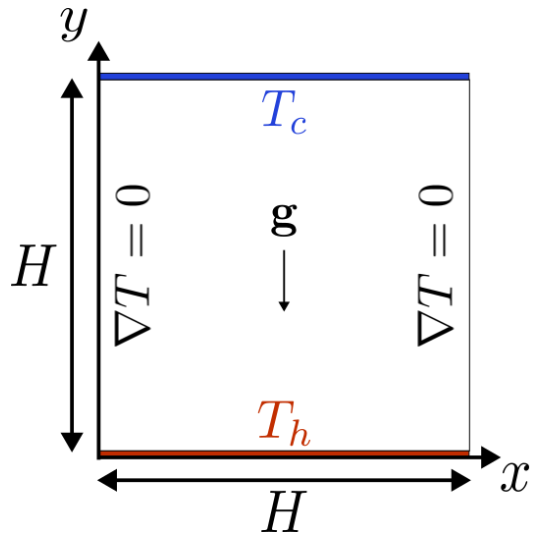
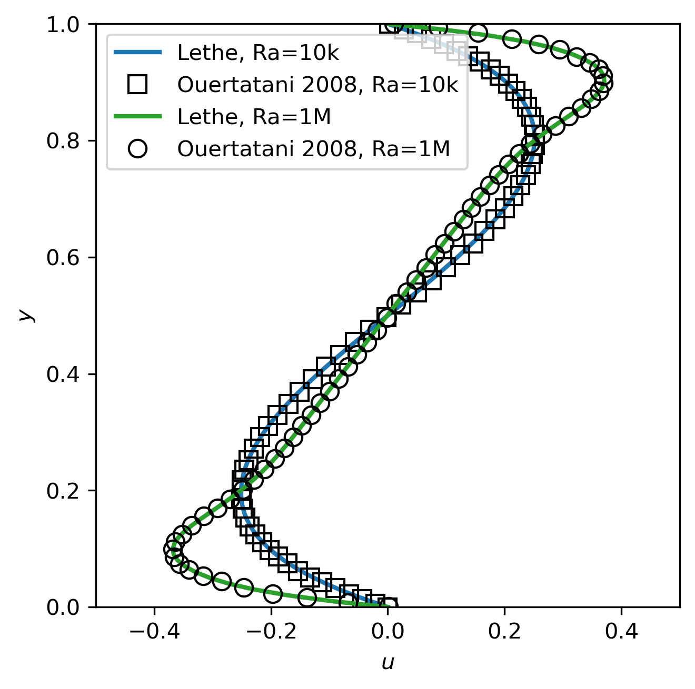
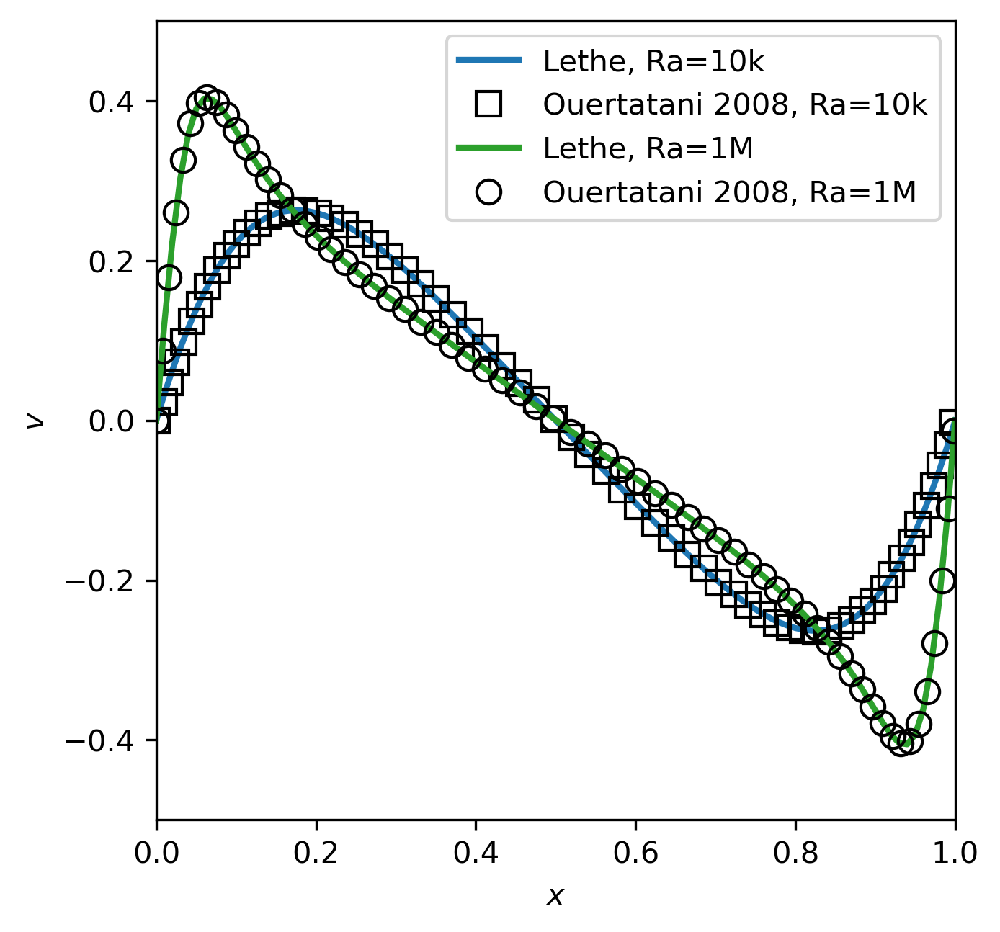

==========================
Rayleigh-Bénard Convection
==========================

This example simulates a two-dimensional Rayleigh–Bénard convection [#ouertatani]_ [#venturi2010]_ [#mpi2022]_ at Rayleigh numbers of :math:`10^4` and :math:`10^6` .

----------------------------------
Features
----------------------------------

- Solver: ``lethe-fluid`` 
- Buoyant force (natural convection)
- Unsteady problem handled by an adaptive BDF1 time-stepping scheme 

---------------------------
Files Used in This Example
---------------------------

Both files mentioned below are located in the example's folder (``examples/multiphysics/rayleigh-benard-convection``).

- Parameter file for :math:`Ra=10^4`: ``rayleigh-benard-convection-Ra10k.prm``
- Parameter file for :math:`Ra=10^6`: ``rayleigh-benard-convection-Ra1M.prm``

-----------------------------
Description of the Case
-----------------------------

In this example, we evaluate the performance of the ``lethe-fluid`` solver in the simulation of the stability of natural convection within a two-dimensional square domain. Our results are tested against the benchmark presented by Ouertatani *et al.* [#ouertatani]_ . The following schematic describes the geometry and dimensions of the simulation:

The incompressible Navier-Stokes equations with a Boussinesq approximation for the buoyant force are:

.. math::
  \nabla \cdot {\bf{u}} &= 0 \\
  \rho \frac{\partial {\bf{u}}}{\partial t} + \rho ({\bf{u}} \cdot \nabla) {\bf{u}} &= -\nabla p + \nabla \cdot {\bf{\tau}} - \rho \beta {\bf{g}} (T - T_0)

where :math:`\beta` and :math:`T_0` denote thermal expansion coefficient and a reference temperature, respectively.

A two-dimensional block of fluid is heated from its bottom wall at :math:`t = 0` s. The temperature of the bottom wall is equal to :math:`T_\text{h}=10`, the temperature of the top wall is equal to :math:`T_\text{c}=0`, and the left and right walls are insulated. By heating the fluid from the bottom wall, the buoyant force (natural convection) creates vortices inside the fluid. The shape and count of these vortices depend on the Rayleigh number and the Prandtl dimensionless numbers [#ouertatani]_ [#venturi2010]_ :

.. math::
  Ra &= \frac{\rho^2 \beta g (T_\text{h} - T_\text{c}) H^3 c_\text{p}}{k \mu} \\
  Pr &= \frac{\mu c_\text{p}}{k}

where :math:`\rho` is the fluid density, :math:`g` is the magnitude of gravitational acceleration, :math:`H` denotes the characteristic length, :math:`k` is the thermal conduction coefficient, :math:`\mu` is the dynamic viscosity, and :math:`c_\text{p}` is the specific heat capacity.

In this example, we simulate the Rayleigh-Bénard convection problem at two Rayleigh numbers ( :math:`Ra=10^4` and :math:`Ra=10^6` ) with a Prandtl number of :math:`Pr=0.71` which correspond to air. According to the literature [#ouertatani]_ , we should see one big convective cell at steady-state for both :math:`Ra=10^4` and :math:`Ra=10^6`, but for the latter, there should also be two small vortices in opposite corners rotating in the reverse direction of the big vortex. For simplicity, the gravity magnitude is set to 10 pointing in the opposite direction of the y-axis for both simulations. Additionally, because the two dimensionless numbers above are the only thing that characterize the flow we may choose the remaining parameters as we want. Here we chose to fix :math:`\rho = 1`, :math:`H = 1`, :math:`c_\text{p} = 100` and :math:`\mu = 0.071`. Thus, the Rayleigh number is controlled only by the thermal expansion coefficient (:math:`\beta = 0.71` or :math:`\beta = 71`).

.. note:: 
    All four boundary conditions for the velocity are ``noslip``. The sides wall are set to ``convection-radiation-flux`` with a heat transfer coefficient of 0 to have isolated walls. The top and bottom walls are set to a ``temperature`` to force a value of 0 and 10, respectively. 

--------------
Parameter File
--------------

For simplicity, we present only the parameter file for :math:`Ra=10^4`.

.. note::   
    Note that the resolution (256x256) is set to match the one of the article results [#ouertatani]_ . If desired, you can choose to reduced to 7 or 6 the ``initial refinement level`` in the parameter files to reduce the simulation time without loosing too much accuracy.

Simulation Control
~~~~~~~~~~~~~~~~~~

The time integration is handled by a 1st order backward differentiation scheme 
`(bdf1)`. A simulation time of :math:`24` s has been selected to ensure that the system reaches a quasi-steady state. The initial time-step is set to :math:`0.001` s, but this will be adapted during the simulation.

.. note::   
    This example uses an adaptive time-stepping method, where the 
    time-step is modified during the simulation to keep the maximum value of the CFL condition below a given threshold (0.9 here). Using ``output control = time``, and ``output time frequency = 0.5`` the simulation results are written every 0.5 seconds regardless of the time-steps.

.. code-block:: text

    subsection simulation control
      set method                       = bdf1
      set time end                     = 24
      set time step                    = 0.01
      set adapt                        = true
      set max cfl                      = 0.9
      set stop tolerance               = 1e-5
      set adaptative time step scaling = 1.3
      set number mesh adapt            = 0
      set output name                  = rayleigh-benard_convection
      set output control               = time
      set output time frequency        = 0.5
      set output path                  = ./output/
    end

Multiphysics
~~~~~~~~~~~~

The ``multiphysics`` subsection enables to turn on ``true`` and off ``false`` the physics of interest. Here ``heat transfer``, ``buoyancy force``, and ``fluid dynamics`` are chosen.

.. code-block:: text

    subsection multiphysics
      set buoyancy force = true
      set heat transfer  = true
      set fluid dynamics = true
    end

Source Term
~~~~~~~~~~~

The ``source term`` subsection defines gravitational acceleration.

.. code-block:: text
    
    subsection source term
      subsection fluid dynamics
        set Function expression = 0 ; -10 ; 0
      end
    end

Physical Properties
~~~~~~~~~~~~~~~~~~~

The ``physical properties`` subsection defines the physical properties of the fluid.

.. code-block:: text

    subsection physical properties
      set number of fluids = 1
      subsection fluid 0
        set density              = 1
        set kinematic viscosity  = 0.071
        set thermal expansion    = 0.71
        set thermal conductivity = 10
        set specific heat        = 100
      end
    end

---------------------------
Running the Simulation
---------------------------

Call the ``lethe-fluid`` by invoking:

.. code-block:: text
  :class: copy-button

  mpirun -np 8 lethe-fluid rayleigh-benard-convection-Ra10k.prm

or

.. code-block:: text
  :class: copy-button

  mpirun -np 8 lethe-fluid rayleigh-benard-convection-Ra1M.prm

to run the simulations using eight CPU cores for the :math:`Ra=10^4` and :math:`Ra=10^6` cases respectively. Feel free to use more CPU if available. 

.. warning:: 
    Make sure to compile lethe in `Release` mode and 
    run in parallel using mpirun. The first simulation takes
    :math:`\approx` 20 minutes on 8 processes and the second at :math:`Ra=10^6` can take a few hours because of the much smaller time-step required to respect the CFL condition.

-------
Results
-------

The following animation shows the evolution of the temperature field with the flow direction for the simulation at :math:`Ra=10^6`:

.. raw:: html

    <iframe width="640" height="360" src="https://www.youtube.com/embed/NSJJpPauiXo" frameborder="0" allowfullscreen></iframe>

Below, we also present the velocity profiles at steady-state of our simulation compared to the ones presented by Ouertatani *et al.* [#ouertatani]_ as a verfification of the Lethe software. 

|fig1| |fig2|

The results can be postprocessed using the provided Python script (``rayleigh-benard-convection.py``). Here is an example of how to call the script:

.. code-block:: text
  :class: copy-button

  python3 rayleigh-benard-convection.py -f ./output_10k -f ./output_1M -Ra 10k -Ra 1M

This script extracts the velocity in the :math:`x` and :math:`y` directions at the mid-width (:math:`x=0.5`) and mid-height (:math:`y=0.5`) respectively and create the above plots.

.. warning::
  The orientation of the vortex rotation obtained with the simulation may differ from the one above due to machine precision that generates the initial instability.

.. important::
  You need to ensure that the ``lethe_pyvista_tools`` is working on your machine. Click :doc:`here <../../../tools/postprocessing/postprocessing_pyvista>` for details.

-----------
References
-----------

.. [#ouertatani] \N. Ouertatani, N. Ben Cheikh, B. Ben Beya, T. Lili, "Numerical simulation of two-dimensional Rayleigh-Bénard convection in an enclosure," Comptes Rendus – Mec. 2008;336(5):464–70. `10.1016/j.crme.2008.02.004 <https://comptes-rendus.academie-sciences.fr/mecanique/articles/10.1016/j.crme.2008.02.004/>`_\.

.. [#venturi2010] \D. Venturi, X. Wan, and G. E. Karniadakis, “Stochastic bifurcation analysis of Rayleigh–Bénard convection,” *J. Fluid Mech.*, vol. 650, pp. 391–413, May 2010, doi: `10.1017/S0022112009993685 <https://doi.org/10.1017/S0022112009993685>`_\.

.. [#mpi2022] \“Rayleigh-Bénard Convection” *Max Planck Institute*, Accessed: 17 Jul. 2024, Available: https://archive.ph/XrJXx\.
