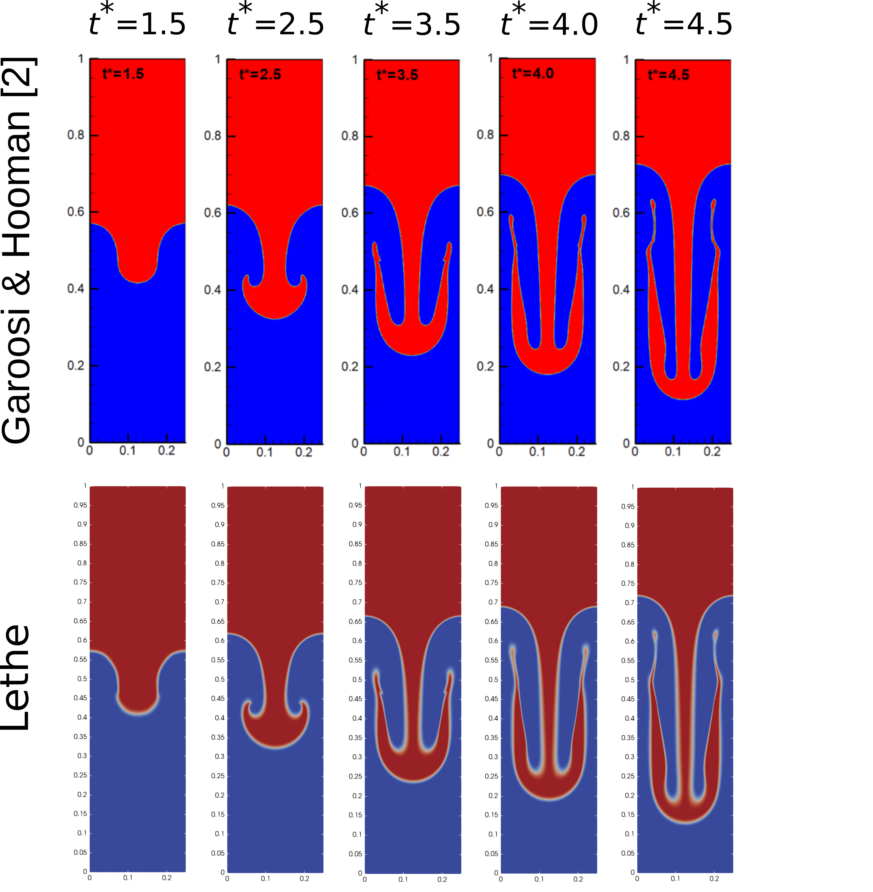

Rayleigh-Taylor Instability
============================

This example simulates the dynamic evolution of the single-mode Rayleigh-Taylor instability [#he1999]_ generated by a density difference.

****

--------
Features
--------

- Solver: ``lethe-fluid`` 
- Mesh adaptation using phase fraction
- Periodic boundary condition
- Unsteady problem handled by an adaptive BDF2 time-stepping scheme
- Monitoring mass conservation
- Projection-based interface sharpening

****

--------------------------
Files Used in This Example
--------------------------
All files mentioned below are located in the example's folder (``examples/multiphysics/rayleigh-taylor-instability``).

- Parameter file: ``rayleigh-taylor-instability.prm``
- Postprocessing Python script: ``rayleigh-taylor_postprocess.py``

****

-----------------------
Description of the Case
-----------------------

In this example, we simulate the Rayleigh-Taylor instability benchmark. In this benchmark, a dense fluid, as shown in the following figure, is located on top of a fluid with a smaller density. 

+-----------------------------------------------------------------+
| .. image:: images/rayleigh-taylor-instability-initial-state.svg |
|     :alt: Schematic                                             |
|     :align: center                                              |
|     :width: 350                                                 |
|                                                                 |
+-----------------------------------------------------------------+

The density ratio and viscosity ratio of the heavy (``fluid 1``) and light (``fluid 0``) fluids are
    .. math::
        \rho_r = \frac{\rho_h}{\rho_l} = 3

    .. math::
        \mu_r = \frac{\mu_h}{\mu_l} = 3

which result in Reynolds and Atwood numbers equal to
    .. math::
        Re = \frac{\rho_h H \sqrt{H \bf{g} }}{\mu_h} = 256

    .. math::
        At = \frac{\rho_r - 1}{\rho_r + 1} = 0.5

A perturbed interface defined as :math:`y = 2H + 0.1 H \cos{(2 \pi x / H)}` separates the fluids. At the top and bottom boundaries, a ``no-slip`` boundary condition is applied, while on the left and right walls, ``periodic`` boundary conditions are used (although we could also use slip boundary conditions and obtain identical results). The temporal evolution of the interface is visually compared with the simulations of Garoosi and Hooman [#garoosi2022]_ at dimensionless times (:math:`t^* = t \sqrt{\mathbf{g} / H}`) of :math:`1.5`, :math:`2.5`, :math:`3.5`, :math:`4.0` and :math:`4.5`. The temporal evolution of the spike and the bubble positions are then compared to the results of He *et al.* [#he1999]_ The term "spike" refers to the lowest point of ``fluid 1`` and the term "bubble" refers to the highest point of ``fluid 0``.

****

--------------
Parameter File
--------------

Simulation Control
~~~~~~~~~~~~~~~~~~

Time integration is handled by a 2nd order backward differentiation scheme
(``bdf2``), for a :math:`0.75\, \text{s}` simulation time with an initial
time-step of :math:`0.0002` seconds. Time-step adaptation is enabled using ``adapt = true``
and the max CFL is :math:`0.8`.

.. note::   
    This example uses an adaptive time-stepping method, where the 
    time-step is modified during the simulation to keep the maximum value of the CFL condition below a given threshold (:math:`0.8` here).

.. code-block:: text

    subsection simulation control
      set method           = bdf2
      set time end         = 0.75
      set time step        = 0.001
      set adapt            = true
      set max cfl          = 0.8
      set output control   = iteration
      set output frequency = 10
      set output name      = rayleigh-taylor
      set output path      = ./output/
    end

Multiphysics
~~~~~~~~~~~~

The ``multiphysics`` subsection enables to turn on (``true``) and off (``false``) the physics of interest. Here ``VOF`` and ``fluid dynamics`` are chosen (``fluid dynamics`` is ``true`` by default).

.. code-block:: text

    subsection multiphysics
      set VOF = true
    end 

Source Term
~~~~~~~~~~~

The ``source term`` subsection defines gravitational acceleration.

.. code-block:: text
    
    subsection source term
      subsection fluid dynamics
        set Function expression = 0 ; -9.81 ; 0
      end
    end

Physical Properties
~~~~~~~~~~~~~~~~~~~

The ``physical properties`` subsection defines the physical properties of the fluid. In this example, we need two fluids with densities of :math:`100` and :math:`300` and with an equal kinematic viscosity (:math:`0.00153`).

.. code-block:: text

   subsection physical properties
     set number of fluids = 2
     subsection fluid 0
       set density             = 100
       set kinematic viscosity = 0.00153
     end
     subsection fluid 1
       set density             = 300
       set kinematic viscosity = 0.00153
     end
   end

Initial Conditions
~~~~~~~~~~~~~~~~~~

In the ``initial conditions`` subsection, we need to define the interface between the heavy and light fluids. We define this interface by using a ``Function expression`` in the ``VOF`` subsection of the ``initial conditions``. The interface between the two fluids is made smoother with the :doc:`geometric smoother <../../../parameters/cfd/initial_conditions>`  by setting the parameter ``smoothing type`` to ``geometric``. Essentially, the geometric smoother converts the initial function expression into a signed distance function using the geometric redistanciation algorithm. This defines a smooth initial condition that is coherent with the resdistanciation used within the simulation.

.. code-block:: text

  subsection initial conditions
    set type = nodal
    subsection uvwp
      set Function expression = 0; 0; 0
    end
    subsection VOF
      set Function expression = y - (0.5 + 0.1 * 0.25 * cos(2 *3.1415 * x / 0.25)) + 0.5
      set smoothing type      = geometric
    end
  end

Mesh
~~~~

In the ``mesh`` subsection we configure the simulation domain. The ``initial refinement`` of the mesh is equal to :math:`5`, but we use mesh adaptation to coarsen the mesh in cells far from the interface to improve the computation performance.

.. code-block:: text
    
    subsection mesh
      set type               = dealii
      set grid type          = subdivided_hyper_rectangle
      set grid arguments     = 1, 4 : 0.25, 1 : 0 , 0 : true
      set initial refinement = 5
    end

Mesh Adaptation
~~~~~~~~~~~~~~~

The ``mesh adaptation`` section controls the dynamic mesh adaptation. Here, we choose ``phase`` as the ``refinement variable`` and :math:`5` as the ``min refinement level``.
We set ``initial refinement steps = 4`` to adapt the mesh to the initial value of the VOF field. 

.. code-block:: text

    subsection mesh adaptation
      set type                     = kelly
      set variable                 = phase
      set fraction type            = fraction
      set max refinement level     = 7
      set min refinement level     = 5
      set frequency                = 1
      set fraction refinement      = 0.99
      set fraction coarsening      = 0.01
      set initial refinement steps = 4
    end

Boundary Conditions
~~~~~~~~~~~~~~~~~~~

The boundary conditions applied on the left and right boundaries are ``periodic``, while a ``noslip`` boundary condition is used for the top and bottom walls.

.. code-block:: text

  subsection boundary conditions
    set number = 3
    subsection bc 0
      set id                 = 0
      set type               = periodic
      set periodic_id        = 1
      set periodic_direction = 0
    end
    subsection bc 1
      set id   = 2
      set type = noslip
    end
    subsection bc 2
      set id   = 3
      set type = noslip
    end
  end

For VOF, we specify the periodic boundary conditions on the sides and no-flux boundary conditions on the top and bottom.

.. code-block:: text

  subsection boundary conditions VOF
    set number = 3
    subsection bc 0
      set id   = 0
      set type = periodic
      set periodic_id = 1
      set periodic_direction = 0
    end
    subsection bc 1
     set id = 2
     set type = none
    end
    subsection bc 2
     set id = 3
     set type = none
    end
  end

VOF
~~~

In the ``VOF`` subsection, we select the ``geometric interface reinitialization`` in the ``interface regularization method`` subsection to reconstruct the interface and keep it sharp during the simulation. This approach is currently the most robust method available in Lethe.

.. code-block:: text

  subsection VOF
    subsection interface regularization method
      set type      = geometric interface reinitialization
      set frequency = 20
      set verbosity = verbose
      subsection geometric interface reinitialization
        set max reinitialization distance = 0.03
        set transformation type           = tanh
        set tanh thickness                = 0.015
      end
    end
  
    subsection phase filtration
      set type      = tanh
      set beta      = 10
    end
  end

The ``phase filtration`` is enabled in this example.
We refer the reader to the :doc:`../../../../parameters/cfd/volume_of_fluid` documentation for more explanation on the phase filtration.

Post-processing
~~~~~~~~~~~~~~~

In the ``post-processing`` subsection, the output of the area of each fluid is enabled and allows to track to mass conservation throughout the simulation. If the area is conserved in a 2D simulation, then the mass per unit length is too. The mass conservation is tracked both from a geometric perspective and from the volumetric integral of the VOF field.

.. code-block:: text

    subsection post-processing
      set verbosity                   = verbose
      set calculate mass conservation = true
    end

****

---------------------------
Running the Simulation
---------------------------

Call ``lethe-fluid`` by invoking:

.. code-block:: text
  :class: copy-button

  mpirun -np 8 lethe-fluid rayleigh-taylor-instability.prm

to run the simulations using eight CPU cores. Feel free to use more.

.. warning:: 
    Make sure to compile lethe in `Release` mode and 
    run in parallel using mpirun. On :math:`8` processes, this simulation takes :math:`\sim` :math:`10` minutes.

****

-----------------------
Results and Discussion
-----------------------

The following animation shows the results of this simulation:

.. raw:: html

  

    <iframe width="600" height="338" src="https://www.youtube.com/embed/RcJaU0GP7UI?si=LpsXNMFGmiqYBW1T" frameborder="0" allowfullscreen></iframe>
  

In the following figure, we compare the simulation results with that of Garoosi and Hooman (2022) [#garoosi2022]_.

By invoking the ``rayleigh-taylor_postprocess.py`` postprocessing script found within the example folder with

.. code-block:: text
  :class: copy-button

  python3 rayleigh-taylor_postprocess.py -f . -p ./rayleigh-taylor-instability.prm

we compare the position of the spike and the bubble with the results of He *et al.* [#he1999]_

In the figure below, it can be seen that as :math:`t^*` increases, there is a growing difference between the spike position of the current simulation and that of He *et al.* [#he1999]_  Nevertheless, the bubble position follows the same evolution as the reference.

+---------------------------------------------------------------------------------------+
| .. image:: images/spike_and_bubble_evolution.png                                      |
|     :alt: Comparison of the spike and bubble positions with He et al (1999) values.   |
|     :align: center                                                                    |
|     :width: 800                                                                       |
|                                                                                       |
+---------------------------------------------------------------------------------------+

With one higher level of refinement, we can see a similar correspondence between the values and there is still a gap between the spike positions for larger values of :math:`t^*`.

+---------------------------------------------------------------------------------------+
|  .. image:: images/spike_and_bubble_evolution_ref_max_8_min_6.png                     |
|     :alt: He et al comparison for a max refinement of 8 and a min refinement of 6.    |
|           We see a better correspondence in the positions of the spike and the bubble.|
|           However, for large values of t*, there is still gap between the positions.  |
|     :align: center                                                                    |
|     :width: 800                                                                       |
|                                                                                       |
+---------------------------------------------------------------------------------------+

The following figures show the relative area of ``fluid 1`` throughout the simulation from a geometric perspective and from the volumetric integral of the VOF field. The left figure displays the result for the coarser mesh resolution of the example whereas the right figure shows area conservation for the finer mesh. We see that area conservation is not fully preserved once the interface has been significantly stretched and deformed, but it improves as the mesh is refined.

+--------------------------------------------------------------+--------------------------------------------------------------+
|  .. image:: images/mass_of_fluid_1.png                       |  .. image:: images/mass_of_fluid_1_ref_max_8_min_6.png       |
|      :alt: Schematic                                         |      :alt: Schematic                                         |
|      :align: center                                          |      :align: center                                          |
|      :width: 400                                             |      :width: 400                                             |
|                                                              |                                                              |
+--------------------------------------------------------------+--------------------------------------------------------------+

****

-----------
References
-----------

.. [#he1999] \X. He, S. Chen, and R. Zhang, “A Lattice Boltzmann Scheme for Incompressible Multiphase Flow and Its Application in Simulation of Rayleigh–Taylor Instability,” *J. Comput. Phys.*, vol. 152, no. 2, pp. 642–663, Jul. 1999, doi: `10.1006/jcph.1999.6257 <https://doi.org/10.1006/jcph.1999.6257>`_\.

.. [#garoosi2022] \F. Garoosi and K. Hooman, “Numerical simulation of multiphase flows using an enhanced Volume-of-Fluid (VOF) method,” *Int. J. Mech. Sci.*, vol. 215, p. 106956, Feb. 2022, doi: `10.1016/j.ijmecsci.2021.106956 <https://doi.org/10.1016/j.ijmecsci.2021.106956>`_\.
