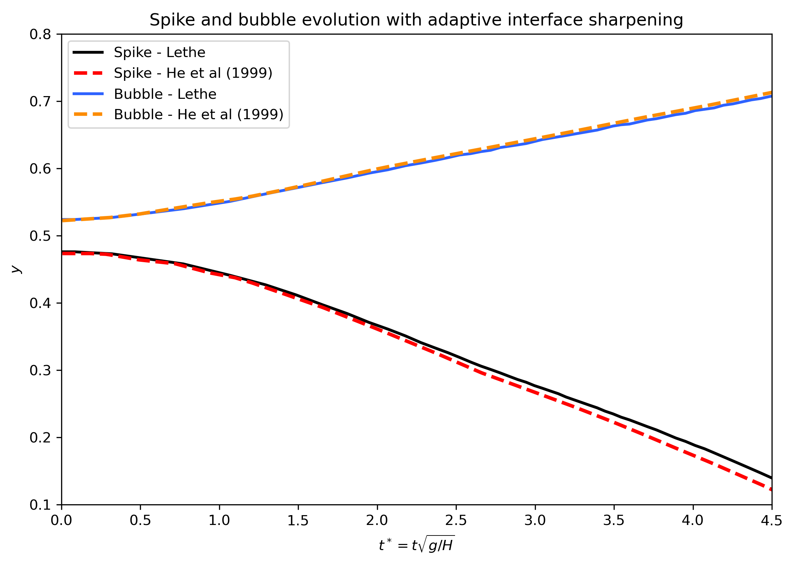

============================
Rayleigh-Taylor instability
============================

This example simulates the dynamic evolution of the single-mode `Rayleigh-Taylor instability`_ by density contrast. 

.. _Rayleigh-Taylor instability: https://www.sciencedirect.com/science/article/pii/S0021999199962575

----------------------------------
Features
----------------------------------
- Solver: ``gls_navier_stokes_2d`` 
- Mesh adaptation using phase fraction
- Periodic boundary condition
- Unsteady problem handled by an adaptive BDF1 time-stepping scheme 
- Monitoring mass conservation
- Interface sharpening

---------------------------
Files used in this example
---------------------------
``examples/multiphysics/rayleigh-taylor-instability/rayleigh-taylor-instability-constant-sharpening.prm``

``examples/multiphysics/rayleigh-taylor-instability/rayleigh-taylor-instability-adaptive-sharpening.prm``

-----------------------------
Description of the case
-----------------------------

In this example, we simulate the Rayleigh-Taylor instability benchmark. In this benchmark, a dense fluid, as shown in the following figure, is located on top of a fluid with a smaller density. 

.. image:: images/geometry.png
    :alt: Schematic
    :align: center
    :width: 200

The density ratio and viscosity ratio of the heavy and light fluids are
    .. math::
        \rho_r = \frac{\rho_h}{\rho_l} = 3

    .. math::
        \mu_r = \frac{\mu_h}{\mu_l} = 3

which result in Reynolds and Atwood numbers equal to
    .. math::
        Re = \frac{\rho_h H \sqrt{H \bf{g} }}{\mu_h} = 256

    .. math::
        At = \frac{\rho_r - 1}{\rho_r + 1} = 0.5

A perturbed interface defined as :math:`2H + 0.1 H \cos{(2 \pi x / H)}` separates the fluids. At the top and bottom boundaries, a no-slip boundary condition is applied, while on the left and right walls, a periodic boundary condition is used. The temporal evolution of the interface is visually compared with the simulations of Garoosi and Hooman (2022) `<[2]_>`_ at dimensionless times (:math:`t^* = t \sqrt{\bf{g} / H}`) of 1.5, 2.5, 3.5, 4.0 and 4.5. The temporal evolution of the spike and the bubble positions are then compared to the results of He et al (1999) `<[1]_>`_. The term "spike" refers to the lowest point of fluid 1 and the term "bubble" refers to the highest point of fluid 0. 

--------------
Parameter file
--------------

Time integration is handled by a 1st order backward differentiation scheme 
(`bdf1`), for a :math:`0.75` s simulation time with an initial 
time step of :math:`0.0002` seconds. Time-step adaptation is enabled using ``adapt=true``
and the max CFL is :math:`0.9`.

.. note::   
    This example uses an adaptive time-stepping method, where the 
    time-step is modified during the simulation to keep the maximum value of the CFL condition below a given threshold (0.9 here). Using ``output control = time``, and ``output time = 0.005`` the simulation results are written every 0.005 s.

.. code-block:: text

    # --------------------------------------------------
    # Simulation Control
    #---------------------------------------------------
    subsection simulation control
      set method         = bdf1
      set time end       = 0.75
      set time step      = 0.0002
      set adapt          = true
      set max cfl        = 0.9
      set output name    = rayleigh-taylor
      set output path    = ./output/
      set output control = time
      set output time    = 0.005
    end

The ``multiphysics`` subsection enables to turn on ``true`` and off ``false`` the physics of interest. Here ``VOF`` and ``fluid dynamics`` are chosen (``fluid dynamics`` is true by default).

.. code-block:: text

    #---------------------------------------------------
    # Multiphysics
    #---------------------------------------------------
    subsection multiphysics
      set VOF = true
    end 
    
The ``source term`` subsection defines gravitational acceleration.

.. code-block:: text
    
    #---------------------------------------------------
    # Source term
    #---------------------------------------------------
    subsection source term
      set enable = true
      subsection xyz
        set Function expression = 0 ; -9.81 ; 0
      end
    end

The ``physical properties`` subsection defines the physical properties of the fluid. In this example, we need two fluids with densities of 100 and 300 and with an equal kinematic viscosity (0.00153).

.. code-block:: text

   #---------------------------------------------------
   # Physical Properties
   #---------------------------------------------------
   subsection physical properties
     set number of fluids = 2
     subsection fluid 0
       set density             = 100
       set kinematic viscosity = 0.00153
     end
     subsection fluid 1
       set density             = 300
       set kinematic viscosity = 0.00153
     end
   end

In the ``initial condition`` subsection, we need to define the interface between the heavy and light fluids. We define this interface by using a function expression in the ``VOF`` subsection of the ``initial condition``. The interface between the two fluids is made smoother with the `projection step`_ parameter.

.. _projection step: https://lethe-cfd.github.io/lethe/parameters/cfd/initial_conditions.html

.. code-block:: text

   #---------------------------------------------------
   # Initial Condition
   #---------------------------------------------------

   subsection initial conditions
     set type = nodal
     subsection uvwp
       set Function expression = 0; 0; 0
     end

     subsection VOF
       set Function expression = if (y>(0.5 + 0.1 * 0.25 * cos(2 *3.1415 * x / 0.25)) , 1, 0)
    
       subsection projection step
         set enable           = true
         set diffusion factor = 1
       end
    
     end
   end

In the ``mesh`` subsection we configure the simulation domain. The ``initial refinement`` of the mesh is equal to 5, but we use mesh adaptation to coarsen the mesh in cells far from the interface to improve the computation performance.

.. code-block:: text
    
    #---------------------------------------------------
    # Mesh
    #---------------------------------------------------
    
    subsection mesh
      set type               = dealii
      set grid type          = subdivided_hyper_rectangle
      set grid arguments     = 1, 4 : 0.25, 1 : 0 , 0 : true
      set initial refinement = 5
    end

The ``mesh adaptation`` section controls the dynamic mesh adaptation. Here, we choose ``phase`` as the ``refinement variable`` and 5 as the ``min refinement level``.
We set ``initial refinement steps = 4`` to adapt the mesh to the initial value of the VOF field. 

.. code-block:: text

    #---------------------------------------------------
    # Mesh Adaptation
    #---------------------------------------------------
    subsection mesh adaptation
      set type                     = kelly
      set variable                 = phase
      set fraction type            = fraction
      set max refinement level     = 7
      set min refinement level     = 5
      set frequency                = 1
      set fraction refinement      = 0.99
      set fraction coarsening      = 0.01
      set initial refinement steps = 4
    end

The boundary conditions applied on the left and right boundaries are ``periodic``, while a ``noslip`` boundary condition is used for the top and bottom walls. In the definition of a ``periodic`` boundary, we need to specify the ``periodic_id`` and the ``periodic_direction`` (in this example, 0 which shows the x direction).

.. code-block:: text

    #---------------------------------------------------
    # Boundary Conditions
    #---------------------------------------------------
    subsection boundary conditions
      set number = 3
      subsection bc 0
        set id                 = 0
        set type               = periodic
        set periodic_id        = 1
        set periodic_direction = 0
      end
      subsection bc 1
        set id   = 2
        set type = noslip
      end
      subsection bc 2
        set id   = 3
        set type = noslip
      end
    end

In the ``VOF`` subsection, we enable ``interface sharpening`` to reconstruct the interface and keep it sharp during the simulation. Note that here we use the ``constant`` and ``adaptive`` methods for interface sharpening. The ``mass conservation`` results show that choosing a ``constant`` method does not affect the mass conservation significantly. Hence, the results of both methods are almost identical. For the ``constant`` refinement we use

.. code-block:: text

   #---------------------------------------------------
   # VOF
   #---------------------------------------------------

   subsection VOF
     subsection interface sharpening
       set enable              = true
       set threshold           = 0.5
       set interface sharpness = 1.5
       set frequency           = 25
       set type                = constant
     end

     subsection mass conservation
       set monitoring      = true
       set monitored fluid = fluid 1
       set tolerance       = 1e-2
       set verbosity       = extra verbose
     end

     subsection phase filtration
       set type  = tanh
       set verbosity = verbose
       set beta = 10
     end
   end

and for the ``adaptive`` refinement

.. code-block:: text

   #---------------------------------------------------
   # VOF
   #---------------------------------------------------

   subsection VOF
     subsection interface sharpening
       set enable                  = true
       set threshold               = 0.5
       set interface sharpness     = 1.5
       set frequency               = 25
       set type                    = adaptative
       set threshold max deviation = 0.2
       set max iterations          = 50
     end

     subsection mass conservation
       set monitoring      = true
       set monitored fluid = fluid 1
       set tolerance       = 1e-2
       set verbosity       = extra verbose
     end

     subsection phase filtration
       set type  = tanh
       set verbosity = verbose
       set beta = 10
     end
   end

The ``phase filtration`` is enabled in this example. We refer the reader to the :doc:`../../../../parameters/cfd/volume_of_fluid`
documentation for more explanation on the phase filtration.

---------------------------
Running the simulation
---------------------------

Call the gls_navier_stokes_2d by invoking:  

``mpirun -np 8 gls_navier_stokes_2d rayleigh-taylor-instability-adaptive-sharpening.prm``

to run the simulations using eight CPU cores. Feel free to use more.

.. warning:: 
    Make sure to compile lethe in `Release` mode and 
    run in parallel using mpirun. This simulation takes
    :math:`\approx` 10 minutes on 8 processes.

-------
Results
-------

In the following picture, the boundary between the two fluids is compared with (right) and without (left) ``projection step`` :

.. image:: images/smoothedInitialCondition.png
    :alt: Schematic
    :align: center
    :width: 800

The following animation shows the results of this simulation:

.. raw:: html

    <iframe width="560" height="315" src="https://www.youtube.com/embed/hZwbFob_Jj4" frameborder="0" allowfullscreen></iframe>

In the following figure, we compare the simulation results with that of Garoosi and Hooman (2022) `<[2]_>`_.

.. image:: images/comparison.png
    :alt: Schematic
    :align: center
    :width: 400

In the figure below, we compare the position of the spike and the bubble with the results of He et al (1999) `<[1]_>`_. It can be seen that as :math:`t^*` increases, there is a growing difference between the spike position of the current simulation and that of He et al (1999) `<[1]_>`_. Nevertheless, the bubble position follows the same evolution as the reference.

With higher levels of refinement, we can see better correspondence between the values. However, there is still a gap between the spike positions for larger values of :math:`t^*`.

.. image:: images/spike_and_bubble_evolution_ref_max_10_ref_min_8.png
    :alt: He et al comparison for a max refinement of 10 and a min refinement of 8. We see a better correspondence in the positions of the spike and the bubble. However, for large values of t*, there is still gap between the positions.
    :align: center
    :width: 800

The following figures shows the mass of fluid 1 throughout the simulation with a constant (top) and adaptive (bottom) interface sharpening.

.. image:: images/constant_mass.png
    :alt: Schematic
    :align: center
    :width: 400
    
.. image:: images/adaptive_mass.png
    :alt: Schematic
    :align: center
    :width: 400

-----------
References
-----------

.. _[1]:

[1] He, X., Chen, S. and Zhang, R., 1999. A lattice Boltzmann scheme for incompressible multiphase flow and its application in simulation of Rayleigh–Taylor instability. Journal of computational physics, 152(2), pp.642-663. https://doi.org/10.1006/jcph.1999.6257

.. _[2]:

[2] Garoosi, F. and Hooman, K., 2022. Numerical simulation of multiphase flows using an enhanced Volume-of-Fluid (VOF) method. International Journal of Mechanical Sciences, 215, p.106956. https://doi.org/10.1016/j.ijmecsci.2021.106956
