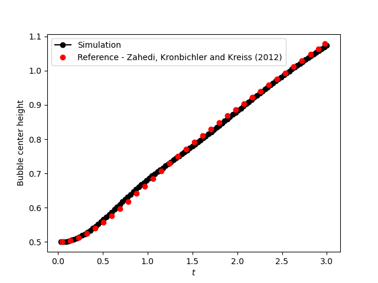
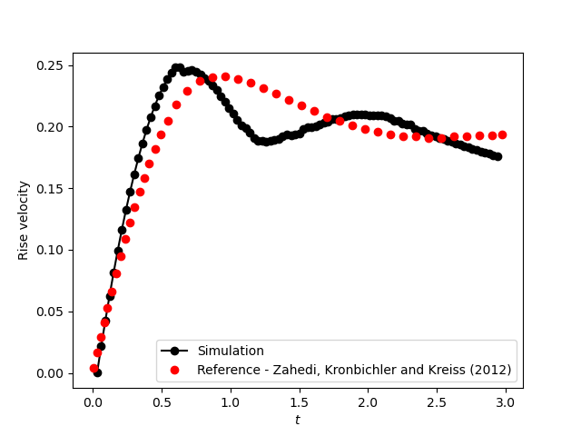

==========================
Rising bubble VOF
==========================

This example simulates a `two-dimensional rising bubble`_. 

.. _two-dimensional rising bubble: https://onlinelibrary.wiley.com/doi/full/10.1002/fld.2643

----------------------------------
Features
----------------------------------
- Solver: ``gls_navier_stokes_2d`` 
- Two phase flow handled by the Volume of fluids (VOF) approach, with a phase fraction limiter, phase sharpening, and surface tension force
- Calculation of filtered phase fraction gradient and curvature fields
- Unsteady problem handled by an adaptive BDF1 time-stepping scheme 
- The use of a python script for post-processing data

------------------------
Location of the example
------------------------
``examples/multiphysics/rising_bubble_VOF/rising_bubble_VOF.prm``

-----------------------------
Description of the case
-----------------------------

A circular bubble with density of 100 and kinematic viscosity of 0.01 (all the units in this example are dimensionless) is defined at an initial location (0.5, 0.5) in a rectangular column filled with a denser fluid (with a density of 1000 and kinematic viscosity of 0.01). At :math:`t = 0` the bubble is released to rise inside the denser fluid column. The corresponding parameter file is 
``rising_bubble_VOF.prm``.

The following schematic describes the geometry and dimensions of the simulation in the :math:`(x,y)` plane:

.. note:: 
    All the four boundary conditions are ``noslip``, and an external 
    gravity field of :math:`-0.98`` is applied in the y direction.

--------------
Parameter file
--------------

Time integration is handled by a 1st order backward differentiation scheme `(bdf1)`, for a :math:`3~\text{s}` simulation time with an initial time step of :math:`0.001~\text{s}`.

.. note::   
    This example uses an adaptive time-stepping method, where the 
    time-step is modified during the simulation to keep the maximum value of the CFL condition below a given threshold. Using ``output control = time``, and ``output time = 0.03`` the simulation results are written every :math:`0.03~\text{s}`.

.. code-block:: text

    # --------------------------------------------------
    # Simulation Control
    #---------------------------------------------------
    subsection simulation control
        set method                         = bdf1
        set time end                       = 3
        set time step                      = 0.001
        set adapt                          = true
        set max cfl                        = 0.4
        set stop tolerance                 = 1e-5
        set adaptative time step scaling   = 1.1
        set number mesh adapt              = 0
        set output name                    = rising_bubble_VOF
        set output control                 = time
        set output time                    = 0.03
        set output path                    = ./output/
        set subdivision                    = 1      
    end

.. warning::
    Make sure to create a directory named ``output`` in the same directory 
    you are calling the solver from.  Otherwise, the solver will be unable to generate the results files and will break.

The ``multiphysics`` subsection enables to turn on `(true)` 
and off `(false)` the physics of interest. Here ``VOF`` is chosen. The ``interface sharpening``, and ``surface tension force`` are enabled in the VOF subsection.

.. code-block:: text

    #---------------------------------------------------
    # Multiphysics
    #---------------------------------------------------
    subsection multiphysics
        set VOF = true
    end 

The ``source term`` subsection defines the gravitational acceleration:

.. code-block:: text
    
    #---------------------------------------------------
    # Source term
    #---------------------------------------------------
    subsection source term
        set enable = true
        subsection xyz
            set Function expression = 0;-0.98; 0
        end
    end
    
""""""""""""""""""""""""""""""""
Volume of Fluid (VOF)
""""""""""""""""""""""""""""""""

In Lethe, the surface tension force (:math:`{\bf{F_{\sigma}}}`) is calculated using the following equation [1, 2]:

    .. math::
        {\bf{F_{\sigma}}} = 2 \frac{\rho}{\rho_0 + \rho_1} \sigma k {\bf{\psi}}

where :math:`\sigma`, :math:`k` and :math:`\bf{\psi}` denote respectively the surface tension coefficient, the filtered curvature and the filtered phase fraction gradient. :math:`\rho`, :math:`\rho_1`, and :math:`\rho_2` are the density of the flow, the density of phase 0, and the density of phase 1, respectively.

The following equations calculate the filtered phase fraction gradient and filtered curvature, respectively.

    .. math:: 
        \int_\Omega \left( {\bf{v}} \cdot {\bf{\psi}} + \eta_n \nabla {\bf{v}} \cdot \nabla {\bf{\psi}} \right) d\Omega = \int_\Omega \left( {\bf{v}} \cdot \nabla {\phi} \right) d\Omega

    .. math:: 
        \int_\Omega \left( v k + \eta_k \nabla v \cdot \nabla k \right) d\Omega = \int_\Omega \left( \nabla v \cdot \frac{\bf{\psi}}{|\bf{\psi}|} \right) d\Omega

where :math:`v`, :math:`\bf{\psi}`, :math:`\eta_n \geq 0`, :math:`\phi`, :math:`k`, and :math:`\eta_k \geq 0` denote a test function, filtered phase fraction gradient, phase fraction gradient filter value, phase fraction, filtered curvature, and curvature filter value, respectively.

.. tip::

  Phase fraction gradient filter value (:math:`\eta_n`) and curvature filter value (:math:`\eta_k`) must be small values larger than 0. We recommend the following procedure to choose a proper value for these parameters: 

  1. Enable ``output auxiliary fields`` to write filtered phase fraction gradient and filtered curvature fields.
  2. Choose a small value for :math:`\eta = h/10`, where :math:`h` is the smallest mesh size. 
  3. Run the simulation and check whether the filtered phase fraction gradient and filtered curvature fields are smooth and without oscillation.
  4. If the filtered phase fraction gradient and filtered curvature fields show oscillations, increase the value :math:`\eta` to a larger value (:math:`\eta = h/5`, for example), and repeat this process until reaching smooth filtered phase fraction gradient and filtered curvature fields without oscillations.

The interface sharpening method and its parameters are explained in :doc:`../dam-break-VOF/dam-break-VOF`

.. code-block:: text

	#---------------------------------------------------
	# VOF
	#---------------------------------------------------
	subsection VOF
	  subsection interface sharpening
	    set enable      = true
	    set threshold   = 0.5
	    set interface sharpness	= 1.4
	    set frequency   = 50
	  end
	  subsection surface tension force
	    set enable      = true
	    set surface tension coefficient 	= 24.5
	    set phase fraction gradient filter 	= 0.0005
	    set curvature filter		= 0.0005
	    set output auxiliary fields 	= true
	  end
	end

.. warning:: 
     If the interface sharpening is not enabled, the interface between phases will become blurry (due to diffusion). 

""""""""""""""""""""""""""""""""
Initial condition
""""""""""""""""""""""""""""""""
In the ``initial condition``, the initial velocity and initial position 
of the liquid phase are defined. The light phase is initially 
defined as a circle with radius :math:`= 0.25` at :math:`0.5, 0.5`.

.. code-block:: text

    #---------------------------------------------------
    # Initial condition
    #---------------------------------------------------
    subsection initial conditions
        set type = nodal
        subsection uvwp
            set Function expression = 0; 0; 0
        end
        subsection VOF
             set Function expression = if if ((x-0.5) * (x-0.5) + (y-0.5) * (y-0.5) < 0.25 * 0.25 , 1, 0)
        end
    end

""""""""""""""""""""""""""""""""
Physical Properties
""""""""""""""""""""""""""""""""
Two fluids are present in this simulation, hence in the ``physical 
properties`` subsection, their physical properties should be defined:

.. code-block:: text

    #---------------------------------------------------
    # Physical Properties
    #---------------------------------------------------
    subsection physical properties
        set number of fluids         = 2
        subsection fluid 0
            set density              = 1000
            set kinematic viscosity  = 0.01
        end
        subsection fluid 1
            set density              = 100
            set kinematic viscosity  = 0.01
        end
    end

We define two fluids here simply by setting the number of fluids to be :math:`2`.
In ``subsection fluid 0``, we set the density and the kinematic viscosity for the phase associated with a VOF indicator of 0. 
A similar procedure is done for the phase associated with a VOF indicator of 1 in ``subsection fluid 1``.

""""""""""""""""""""""""""""""""
Mesh
""""""""""""""""""""""""""""""""

We start off with a rectangular mesh that spans the domain defined by the corner points situated at the origin and at point
:math:`[1,2]`. The first :math:`1,2` couple defines that number of initial grid subdivisions along the length and height of the rectangle. 
This makes our initial mesh composed of perfect squares. We proceed then to redefine the mesh globally eight times by setting
``set initial refinement=8``. 

.. code-block:: text
        
    #---------------------------------------------------
    # Mesh
    #---------------------------------------------------
    subsection mesh
            set type = dealii
            set grid type = subdivided_hyper_rectangle
            set grid arguments = 1, 2 : 0, 0 : 1, 2 : true
            set initial refinement = 8
    end
    
In the ``mesh adaptation subsection``, adaptive mesh refinement is 
defined for ``phase``. ``min refinement level`` and ``max refinement level`` are 6 and 8, respectively. Since the bubble rises and changes its location, we choose a rather large ``fraction refinement`` (0.97) and moderate ``fraction coarsening`` (0.02).

.. code-block:: text

    #---------------------------------------------------
    # Mesh Adaptation
    #---------------------------------------------------
    subsection mesh adaptation
        set type                    = kelly
        set variable                = phase
        set fraction type           = fraction
        set max refinement level    = 8
        set min refinement level    = 6
        set frequency               = 1
        set fraction refinement     = 0.97
        set fraction coarsening     = 0.02
    end

---------------------------
Running the simulation
---------------------------

Call the gls_navier_stokes_2d by invoking:  

``mpirun -np 8 gls_navier_stokes_2d rising_bubble_VOF.prm``

to run the simulation using eight CPU cores. Feel free to use more.

.. warning:: 
    Make sure to compile lethe in `Release` mode and 
    run in parallel using mpirun. This simulation takes
    :math:`\approx` 20 mins on 8 processes.

-------
Results
-------

The following image shows the shape and dimensions of the bubble after 3 seconds of simulation, and compares it with results of [`1 <https://doi.org/10.1016/0021-9991(92)90240-Y>`_, `2 <https://doi.org/10.1002/fld.2643>`_].

A python post-processing code `(rising_bubble.py)` 
is added to the example folder to post-process the results.
Run ``python3 ./rising_bubble.py ./output`` to execute this 
post-processing code, where ``./output`` is the directory that 
contains the simulation results. In post-processing, the maximum and minimum axial positions of the light phase (bubble) are tracked to monitor the location of the center of the bubble as a function of time. Then, the bubble rise velocity is calculated as the derivation of the bubble axial position. These results are compared with the simulations of Zahedi, Kronbichler, and Kreiss [2]. The following images show the results of these comparisons. The oscillations in the bubble rise velocity are attributed to the different methods used for finding the centroid of the bubble, first order derivation, and smoothing of the bubble location and rise velocity.

Animation of the rising bubble example:

.. raw:: html

    <iframe width="560" height="315" src="https://www.youtube.com/embed/h5aRpA4chXE" frameborder="0" allowfullscreen></iframe>

-----------
References
-----------
`[1] <https://doi.org/10.1016/0021-9991(92)90240-Y>`_ Brackbill, J.U., Kothe, D.B. and Zemach, C., 1992. A continuum method for modeling surface tension. Journal of computational physics, 100(2), pp.335-354.

`[2] <https://doi.org/10.1002/fld.2643>`_ Zahedi, S., Kronbichler, M. and Kreiss, G., 2012. Spurious currents in finite element based level set methods for two‐phase flow. International Journal for Numerical Methods in Fluids, 69(9), pp.1433-1456.
