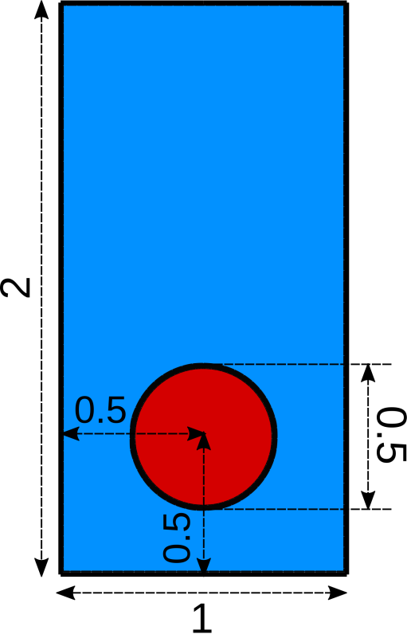
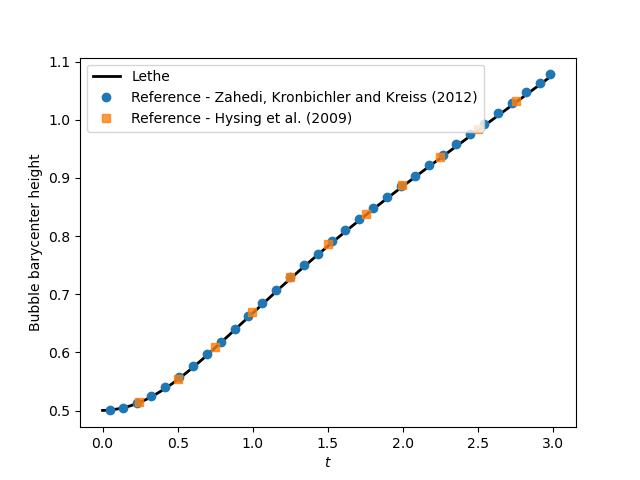
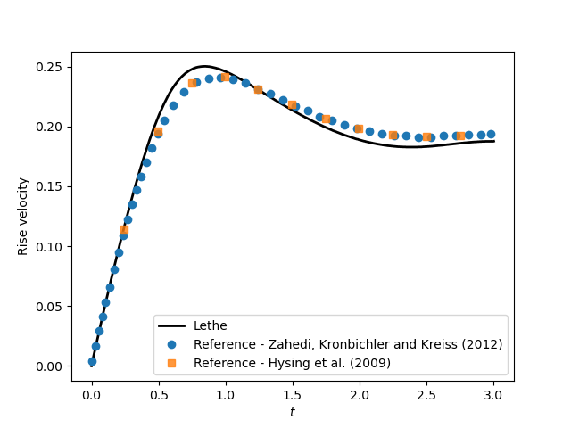

==========================
Rising Bubble
==========================

This example simulates a two-dimensional rising bubble [#zahedi2012]_.

--------
Features
--------

- Solver: ``lethe-fluid`` 
- Two phase flow handled by the Volume of fluids (VOF) approach with phase filtering, phase sharpening, and surface tension force
- Calculation of filtered phase fraction gradient and curvature fields
- Unsteady problem handled by an adaptive BDF1 time-stepping scheme 
- Post-processing of a fluid barycentric coordinate and velocity

--------------------------
Files Used in This Example
--------------------------

Both files mentioned below are located in the example's folder (``examples/multiphysics/rising-bubble``).

- Parameter file: ``rising_bubble.prm``
- Postprocessing Python script: ``rising_bubble.py``

-----------------------
Description of the Case
-----------------------

A circular bubble with density of :math:`100` and kinematic viscosity of :math:`0.01` (all the units in this example are dimensionless) is defined at an initial location :math:`(0.5, 0.5)` in a rectangular column filled with a denser fluid (with a density of :math:`1000` and kinematic viscosity of :math:`0.01`). At :math:`t = 0` the bubble is released to rise inside the denser fluid column. The corresponding parameter file is
``rising-bubble.prm``.

The following schematic describes the geometry and dimensions of the simulation in the :math:`(x,y)` plane:

.. note:: 
    On the upper and bottom walls ``slip`` boundary conditions are applied, and on side walls the boundary conditions are ``noslip``.
    An external gravity field of :math:`-0.98` is applied in the :math:`y` direction.

--------------
Parameter File
--------------

Simulation Control
~~~~~~~~~~~~~~~~~~

Time integration is handled by a 1st order backward differentiation scheme (``bdf1``), for a :math:`3~\text{s}` simulation time with an initial time step of :math:`0.001~\text{s}`.

.. note::   
    This example uses an adaptive time-stepping method, where the 
    time-step is modified during the simulation to keep the maximum value of the CFL condition below a given threshold. Using ``output frequency = 20`` ensures that the results are written every :math:`20` iterations. Consequently, the time increment between each vtu file is not constant.

.. code-block:: text

    subsection simulation control
      set method           = bdf1
      set time end         = 3
      set time step        = 0.001
      set adapt            = true
      set max cfl          = 0.8
      set output name      = rising-bubble
      set output frequency = 20
      set output path      = ./output/
    end

Multiphysics
~~~~~~~~~~~~

The ``multiphysics`` subsection enables to turn on (``true``)
and off (``false``) the physics of interest. Here ``VOF`` is chosen. The ``phase filtration``, ``interface sharpening``, and ``surface tension force`` are enabled in the VOF subsection.

.. code-block:: text

    subsection multiphysics
      set VOF = true
    end

Source Term
~~~~~~~~~~~

The ``source term`` subsection defines the gravitational acceleration:

.. code-block:: text
    
    subsection source term
      subsection fluid dynamics
        set Function expression = 0; -0.98; 0
      end
    end

VOF
~~~

In the ``VOF`` subsection, three features are enabled : the ``interface sharpening``, the ``phase filtration`` and the ``surface tension force``.

The interface sharpening method and its parameters are explained in the :doc:`../dam-break/dam-break` example. The phase filtration filters the phase field used for the calculation of physical properties by stiffening the value of the phase fraction. We refer the reader to :doc:`../../../theory/multiphase/cfd/vof` theory guide for more explanation on the phase filtration. Finally, the surface tension force computation is explained in the :doc:`../static-bubble/static-bubble` example.

.. code-block:: text

  subsection VOF
    subsection interface sharpening
      set enable              = true
      set threshold           = 0.5
      set interface sharpness = 1.5
      set frequency           = 50
    end

    subsection phase filtration
      set type      = tanh
      set verbosity = quiet
      set beta      = 10
    end

    subsection surface tension force
      set enable                                = true
      set phase fraction gradient filter factor = 4
      set curvature filter factor               = 1
      set output auxiliary fields               = true
    end
  end

Initial Conditions
~~~~~~~~~~~~~~~~~~

In the ``initial conditions``, the initial velocity and initial position
of the liquid phase are defined. The light phase is initially
defined as a circle with a radius :math:`r= 0.25` at :math:`(x,y)=(0.5, 0.5)`. We enable the use of a projection step to ensure that the initial phase distribution is
sufficiently smooth, as explained in the :doc:`../static-bubble/static-bubble` example.

.. code-block:: text

    subsection initial conditions
      set type = nodal
      subsection uvwp
        set Function expression = 0; 0; 0
      end
      subsection VOF
        set Function expression = if ((x-0.5) * (x-0.5) + (y-0.5) * (y-0.5) < 0.25 * 0.25 , 1, 0)
      
        subsection projection step
          set enable           = true
          set diffusion factor = 1
        end
      end
    end

Physical Properties
~~~~~~~~~~~~~~~~~~~~

We define two fluids here simply by setting the number of fluids to be :math:`2`.
In ``subsection fluid 0``, we set the density and the kinematic viscosity for the phase associated with a VOF indicator of :math:`0`.
A similar procedure is done for the phase associated with a VOF indicator of :math:`1` in ``subsection fluid 1``. Then a ``fluid-fluid`` type of ``material interaction`` is added to specify the ``surface tension model``. In this case, it is set to ``constant`` with the ``surface tension coefficient`` :math:`\sigma` set to :math:`24.5`.

.. code-block:: text

    subsection physical properties
      set number of fluids = 2
      subsection fluid 0
        set density             = 1000
        set kinematic viscosity = 0.01
      end
      subsection fluid 1
        set density             = 100
        set kinematic viscosity = 0.01
      end
      set number of material interactions = 1
      subsection material interaction 0
        set type = fluid-fluid
        subsection fluid-fluid interaction
          set first fluid id              = 0
          set second fluid id             = 1
          set surface tension model       = constant
          set surface tension coefficient = 24.5
        end
      end
    end

Mesh
~~~~

We start off with a rectangular mesh that spans the domain defined by the corner points situated at the origin and at point
:math:`(1,2)`. The first :math:`1,2` couple defines that number of initial grid subdivisions along the length and height of the rectangle. 
This makes our initial mesh composed of perfect squares. We proceed then to redefine the mesh globally six times by setting
``set initial refinement = 6``. 

.. code-block:: text
        
    subsection mesh
      set type               = dealii
      set grid type          = subdivided_hyper_rectangle
      set grid arguments     = 1, 2 : 0, 0 : 1, 2 : true
      set initial refinement = 6
    end

Mesh Adaptation
~~~~~~~~~~~~~~~

In the ``mesh adaptation subsection``, adaptive mesh refinement is 
defined for ``phase``. ``min refinement level`` and ``max refinement level`` are :math:`6` and :math:`9`, respectively. Since the bubble rises and changes its location, we choose a rather large ``fraction refinement`` (:math:`0.99`) and moderate ``fraction coarsening`` (:math:`0.01`).
To capture the bubble adequately, we set ``initial refinement steps = 5`` so that the initial mesh is adapted to ensure that the initial condition is imposed for the VOF phase with maximal accuracy.

.. code-block:: text

    subsection mesh adaptation
      set type                     = kelly
      set variable                 = phase
      set fraction type            = fraction
      set max refinement level     = 9
      set min refinement level     = 6
      set frequency                = 1
      set fraction refinement      = 0.99
      set fraction coarsening      = 0.01
      set initial refinement steps = 5
    end

Post-processing: Fluid Barycenter Position and Velocity
~~~~~~~~~~~~~~~~~~~~~~~~~~~~~~~~~~~~~~~~~~~~~~~~~~~~~~~

To compare our simulation results to the literature, we extract the position and the velocity of the barycenter of the bubble. This generates a ``vof_barycenter_information.dat`` file which contains the position and the velocity of the barycenter of the bubble.

.. code-block:: text

    subsection post-processing
      set verbosity            = quiet
      set calculate barycenter = true
      set barycenter name      = vof_barycenter_information
    end

---------------------------
Running the Simulation
---------------------------

Call ``lethe-fluid`` by invoking:

.. code-block:: text
  :class: copy-button

  mpirun -np 8 lethe-fluid rising-bubble.prm

to run the simulation using eight CPU cores. Feel free to use more.

.. warning:: 
    Make sure to compile lethe in `Release` mode and 
    run in parallel using mpirun. This simulation takes
    :math:`\sim \,7` minutes on :math:`8` processes.

-----------------------
Results and Discussion
-----------------------

The following image shows the shape and dimensions of the bubble after :math:`3` seconds of simulation, and compares it with results of [#zahedi2012]_.

.. image:: images/bubble.png
    :alt: bubble
    :align: center
    :width: 400

A python post-processing code (``rising-bubble.py``) is added to the example folder to post-process the data files generated by the barycenter post-processing.
Run

.. code-block:: text
  :class: copy-button

  python3 ./rising-bubble.py output

to execute this post-processing code, where ``output`` is the directory that
contains the simulation results. The results for the barycenter position and velocity of the bubble are compared with the simulations of Zahedi *et al.* [#zahedi2012]_ and Hysing *et al.* [#hysing2009]_. The following images show the results of these comparisons. The agreement between the two simulations is remarkable considering the coarse mesh used within this example.

Animation of the rising bubble example:

.. raw:: html

    <iframe width="800" height="450" src="https://www.youtube.com/embed/o73WJ36-2zo"  frameborder="0" allowfullscreen></iframe>

-----------
References
-----------

.. [#zahedi2012] \S. Zahedi, M. Kronbichler, and G. Kreiss, “Spurious currents in finite element based level set methods for two-phase flow,” *Int. J. Numer. Methods Fluids*, vol. 69, no. 9, pp. 1433–1456, 2012, doi: `10.1002/fld.2643 <https://doi.org/10.1002/fld.2643>`_\.

.. [#hysing2009] \S. Hysing *et al.*, “Quantitative benchmark computations of two-dimensional bubble dynamics,” *Int. J. Numer. Methods Fluids*, vol. 60, no. 11, pp. 1259–1288, 2009, doi: `10.1002/fld.1934 <https://doi.org/10.1002/fld.1934>`_\.

.. [#brackbill1992] \J. U. Brackbill, D. B. Kothe, and C. Zemach, “A continuum method for modeling surface tension,” *J. Comput. Phys.*, vol. 100, no. 2, pp. 335–354, Jun. 1992, doi: `10.1016/0021-9991(92)90240-Y <https://doi.org/10.1016/0021-9991(92)90240-Y>`_\.
