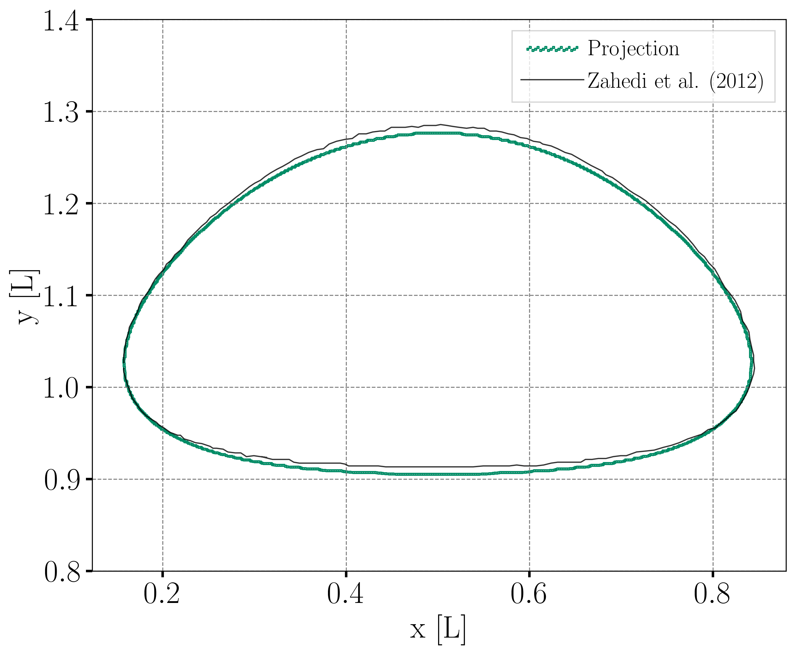
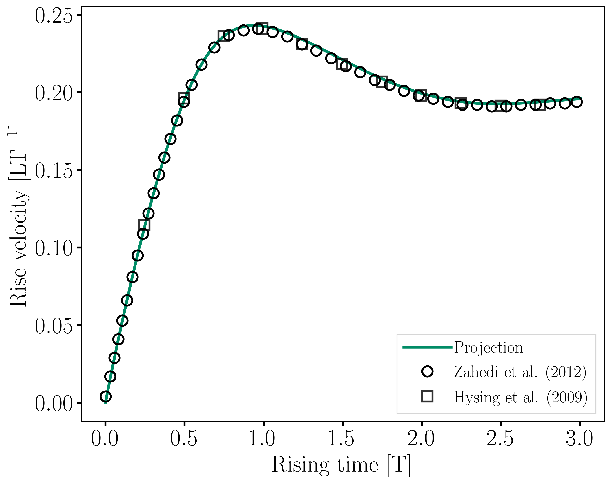
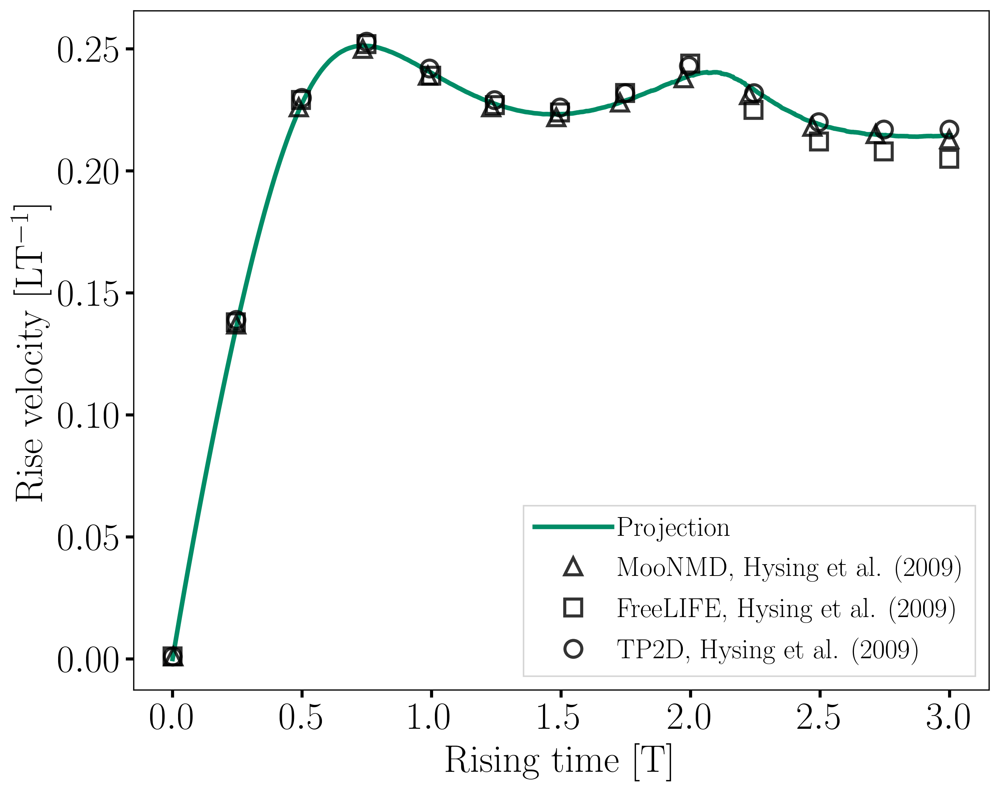

==========================
Rising Bubble
==========================

This example simulates a two-dimensional rising bubble [#hysing2009]_. In the first part, we are interested in two different rising regimes: ellipsoidal and skirted. The second part, :ref:`Interface Regularization Methods Comparison`, focuses on the effects of the interface regularization methods on the results.

--------
Features
--------

- Solver: ``lethe-fluid`` 
- Two phase flow handled by the Volume of fluids (VOF) approach with phase filtering, interface regularization, and surface tension force
- Calculation of filtered phase fraction gradient and curvature fields
- Unsteady problem handled by an adaptive BDF2 time-stepping scheme 
- Post-processing of a fluid barycentric coordinate and velocity
- Comparison of interface regularization methods

--------------------------
Files Used in This Example
--------------------------

All files mentioned below are located in the example's folder (``examples/multiphysics/rising-bubble``).

- Parameter files: ``rising-bubble-proj.prm``, ``rising-bubble-alge.prm``, ``rising-bubble-geo.prm``
- Postprocessing Python script: ``rising-bubble.py``

-----------------------
Description of the Case
-----------------------

The two test cases simulated by Hysing et al. [#hysing2009]_ are reproduced in this example. In the first test case, a circular bubble with a density of :math:`100` and a kinematic viscosity of :math:`0.01` is initialized with its centroid at :math:`(0.5, 0.5)` in a rectangular column filled with a denser fluid. The density of the latter is :math:`1000` and its is kinematic viscosity is :math:`0.01`. The surface tension coefficient is taken as :math:`24.5`. The second test case corresponds to a bubble density of :math:`1`, a kinematic viscosity of :math:`0.1`, and a surface tension value of :math:`1.96`. The remaining properties are kept the same as in the first test case.

At :math:`t = 0` the bubble is released and rises inside the denser fluid column.

The following schematic describes the geometry and dimensions of the simulation in the :math:`(x,y)` plane:

.. image:: images/bubble-initial-configuration.png
    :alt: Schematic
    :align: center
    :width: 400

.. note:: 
    On the upper and bottom walls ``slip`` boundary conditions are applied, and on side walls the boundary conditions are ``noslip``.
    An external gravity field of :math:`-0.98` is applied in the :math:`y` direction.

--------------
Parameter File
--------------

Simulation Control
~~~~~~~~~~~~~~~~~~

Time integration is handled by a 2nd order backward differentiation scheme (``bdf2``), for a :math:`3~\text{s}` simulation time with an initial time step of :math:`0.001~\text{s}`.

.. note::   
    This example uses an adaptive time-stepping method, where the 
    time-step is modified during the simulation to keep the maximum value of the CFL condition below a given threshold. Using ``output frequency = 20`` ensures that the results are written every :math:`20` iterations. Consequently, the time increment between each vtu file is not constant.

.. code-block:: text

    subsection simulation control
      set method           = bdf2
      set time end         = 3
      set time step        = 0.001
      set adapt            = true
      set max cfl          = 0.8
      set output name      = rising-bubble
      set output frequency = 20
      set output path      = ./rising-bubble-proj/
    end

Multiphysics
~~~~~~~~~~~~

The ``multiphysics`` subsection enables to turn on (``true``)
and off (``false``) the physics of interest. Here ``VOF`` is chosen.

.. code-block:: text

    subsection multiphysics
      set VOF = true
    end

Source Term
~~~~~~~~~~~

The ``source term`` subsection defines the gravitational acceleration:

.. code-block:: text
    
    subsection source term
      subsection fluid dynamics
        set Function expression = 0; -0.98; 0
      end
    end

VOF
~~~

In the ``VOF`` subsection, two features are enabled : the ``phase filtration`` and the ``surface tension force``. 
The ``phase filtration`` method filters the phase field used for the calculation of physical properties by stiffening the value of the phase fraction.  The ``surface tension force`` computation is explained in the :doc:`../static-bubble/static-bubble` example.

Since a straightforward advection of the phase fraction typically leads to significant interface diffusion, an interface regularization method is required. 
This is addressed in the ``interface regularization method`` subsection. Lethe provides three regularization techniques to maintain a sharp interface:  the ``projection-based interface sharpening``, the ``algebraic interface reinitialization``, and the ``geometric interface reinitialization``. The desired method can be selected using the ``type`` parameter.

We refer the reader to :doc:`../../../theory/multiphase/cfd/vof` theory guide for more explanation on phase filtration and the interface regularization methods.

For the first part of this example, the ``projection-based interface sharpening`` method is selected and its parameters are defined in the ``subsection projection-based interface sharpening``. The selection of the parameters for this method is explained in the :doc:`../dam-break/dam-break` example. The other regularization methods available are described in the second part of this example (:ref:`Interface Regularization Methods Comparison`).

.. code-block:: text

  subsection VOF
    subsection interface regularization method
      set type      = projection-based interface sharpening
      set frequency = 20
      set verbosity = verbose
      subsection projection-based interface sharpening
        set threshold           = 0.5
        set interface sharpness = 1.5
      end
    end

    subsection phase filtration
      set type      = tanh
      set verbosity = quiet
      set beta      = 20
    end

    subsection surface tension force
      set enable                                = true
      set phase fraction gradient filter factor = 4
      set curvature filter factor               = 1
      set output auxiliary fields               = true
    end
  end

Stabilization
~~~~~~~~~~~~~

The ``vof dcdd stabilization`` is turned off as it had a negative impact on volume conservation.

.. code-block:: text

    subsection stabilization
      set vof dcdd stabilization = false
    end

Initial Conditions
~~~~~~~~~~~~~~~~~~

In the ``initial conditions`` subsection, the initial velocity and initial position of the liquid phase are defined. The light phase is initially defined as a circle with a radius :math:`r= 0.25` and a center located at :math:`(x,y)=(0.5, 0.5)`. We enable the use of a projection step to ensure that the initial phase distribution is sufficiently smooth, as explained in the :doc:`../static-bubble/static-bubble` example.

.. code-block:: text

    subsection initial conditions
      set type = nodal
      subsection uvwp
        set Function expression = 0; 0; 0
      end
      subsection VOF
        set Function expression = if ((x-0.5) * (x-0.5) + (y-0.5) * (y-0.5) < 0.25 * 0.25 , 1, 0)
      
        subsection projection step
          set enable           = true
          set diffusion factor = 1
        end
      end
    end

Physical Properties
~~~~~~~~~~~~~~~~~~~~

We define two fluids simply by setting the number of fluids to be :math:`2`. In ``subsection fluid 0``, we set the density and the kinematic viscosity for the phase associated with a VOF indicator of :math:`0`, depending on the test case. A similar procedure is done for the phase associated with a VOF indicator of :math:`1` in ``subsection fluid 1``. 

Then a ``fluid-fluid`` type of ``material interaction`` is added to specify the ``surface tension model``. In this example, it is set to ``constant`` with the ``surface tension coefficient`` depending on the test case [#hysing2009]_.

The values in the provided parameter files correspond to case 1. When launching case 2, the density and the kinematic viscosity of ``fluid 1`` and the ``surface tension coefficient`` for case 1 should be commented to use the ones for case 2 instead.

.. code-block:: text

    subsection physical properties
      set number of fluids = 2
      subsection fluid 0
        set density             = 1000
        set kinematic viscosity = 0.01
      end
      subsection fluid 1
        # case 1
        set density             = 100
        set kinematic viscosity = 0.01
        # case 2
        # set density             = 1
        # set kinematic viscosity = 0.1
      end
      set number of material interactions = 1
      subsection material interaction 0
        set type = fluid-fluid
        subsection fluid-fluid interaction
          set first fluid id              = 0
          set second fluid id             = 1
          set surface tension model       = constant
          # case 1
          set surface tension coefficient = 24.5
          # case 2
          # set surface tension coefficient = 1.96
        end
      end
    end

Mesh
~~~~

We start off with a rectangular mesh that spans the domain defined by the corner points situated at the origin and at point
:math:`(1,2)`. The first :math:`1,2` couple defines that number of initial grid subdivisions along the length and height of the rectangle. 
This makes our initial mesh composed of perfect squares. We proceed then to redefine the mesh globally six times by setting
``set initial refinement = 6``. 

.. code-block:: text
        
    subsection mesh
      set type               = dealii
      set grid type          = subdivided_hyper_rectangle
      set grid arguments     = 1, 2 : 0, 0 : 1, 2 : true
      set initial refinement = 6
    end

Mesh Adaptation
~~~~~~~~~~~~~~~

In the ``mesh adaptation subsection``, adaptive mesh refinement is 
defined for ``phase``. ``min refinement level`` and ``max refinement level`` are :math:`6` and :math:`9`, respectively. Since the bubble rises and changes its location, we choose a rather large ``fraction refinement`` (:math:`0.99`) and moderate ``fraction coarsening`` (:math:`0.01`).
To capture the bubble adequately, we set ``initial refinement steps = 5`` so that the initial mesh is adapted to ensure that the initial condition is imposed for the VOF phase with maximal accuracy.

.. code-block:: text

    subsection mesh adaptation
      set type                     = kelly
      set variable                 = phase
      set fraction type            = fraction
      set max refinement level     = 9
      set min refinement level     = 6
      set frequency                = 1
      set fraction refinement      = 0.99
      set fraction coarsening      = 0.01
      set initial refinement steps = 5
    end

Post-processing: Fluid Barycenter Position and Velocity
~~~~~~~~~~~~~~~~~~~~~~~~~~~~~~~~~~~~~~~~~~~~~~~~~~~~~~~

To compare our simulation results to the literature, we extract the position and the velocity of the barycenter of the bubble. This generates a ``vof_barycenter_information.dat`` file which contains the position and the velocity of the barycenter of the bubble.

.. code-block:: text

    subsection post-processing
      set verbosity            = quiet
      set calculate barycenter = true
      set barycenter name      = vof_barycenter_information
    end

---------------------------
Running the Simulation
---------------------------

Call ``lethe-fluid`` by invoking:

.. code-block:: text
  :class: copy-button

  mpirun -np 8 lethe-fluid rising-bubble-proj.prm

to run the simulation using eight CPU cores. Feel free to use more.

.. warning:: 
    Make sure to compile lethe in `Release` mode and 
    run in parallel using mpirun. This simulation takes
    :math:`\sim \,7` minutes on :math:`8` processes.

-----------------------
Results and Discussion
-----------------------

Case 1
~~~~~~~

A python post-processing code (``rising-bubble.py``) is added to the example folder to post-process the data files generated by the barycenter post-processing and produce the bubble contour.
Run

.. code-block:: text
  :class: copy-button

  python3 ./rising-bubble.py -p rising-bubble-proj -c 1

to execute this post-processing code, where ``rising-bubble-proj`` is the directory that contains the simulation results and ``-c 1`` is used for test case 1. 

The following image shows the shape and dimensions of the bubble after :math:`3` seconds of simulation, and compares them with results of Zahedi *et al.* [#zahedi2012]_

The evolution of the position and velocity of the barycenter of the bubble is compared with the results of Zahedi *et al.* [#zahedi2012]_ and Hysing *et al.* [#hysing2009]_ The following images show the results of these comparisons. The agreement between the simulations is remarkable considering the coarse mesh used within this example.

.. image:: images/proj-ymean-t-case1.png
    :alt: ymean_t
    :align: center
    :width: 500

Animation of the rising bubble example (test case 1):

.. raw:: html

    <iframe width="800" height="450" src="https://www.youtube.com/embed/o73WJ36-2zo"  frameborder="0" allowfullscreen></iframe>

Case 2
~~~~~~~

The same python post-processing code (``rising-bubble.py``) is used for test case 2, with ``-c 2`` instead.

.. code-block:: text
  :class: copy-button

  python3 ./rising-bubble.py -f rising-bubble-proj -c 2
  
The following image shows the shape of the bubble after :math:`3` seconds of simulation, and compares it with results obtained by three different codes reported in the work of Hysing *et al.* [#hysing2009]_: TP2D, FreeLIFE and MooNMD.

.. image:: images/proj-bubble-contour-case2.png
    :alt: bubble
    :align: center
    :width: 500

The evolution of the position and velocity of the barycenter of the bubble is also compared with the results from [#hysing2009]_. The following figures show good agreement with the reference.

.. image:: images/proj-ymean-t-case2.png
    :alt: ymean_t
    :align: center
    :width: 500

.. _Interface Regularization Methods Comparison:

---------------------------------------------
Interface Regularization Methods Comparison
---------------------------------------------

Parameter Files
~~~~~~~~~~~~~~~~

For the methods other than ``projection-based interface sharpening``, the ``.prm`` file is modified as follows. In the ``VOF`` subsection, the ``interface regularization method`` is changed to ``geometric interface reinitialization`` or ``algebraic interface reinitialization``. The associated parameter files, ``rising-bubble-geo.prm`` and ``rising-bubble-alge.prm`` respectively, are available in the example's folder. The subsections are modified according to each regularization method: 

* With the geometric method, the phase fraction field is regularized using the signed distance from the interface, as described in :doc:`../../../theory/multiphase/cfd/vof` theory guide. The ``max reinitialization distance`` parameter is set to :math:`0.032` and we select the ``piecewise polynomial`` function to transform the signed distance in a phase fraction field.

.. code-block:: text

    subsection interface regularization method
      set type       = geometric interface reinitialization
      set frequency  = 20
      set verbosity  = verbose
      subsection geometric interface reinitialization
        set max reinitialization distance = 0.032
        set transformation type           = piecewise polynomial
      end
    end

* For the algebraic method, an intermidiary PDE is solved to compress the interface until reaching a pseudo-steady-state. This PDE is described in :doc:`../../../theory/multiphase/cfd/vof` theory guide. Setting the ``steady-state criterion`` to :math:`10^{-3}` yields good results.

.. code-block:: text

    subsection interface regularization method
      set type      = algebraic interface reinitialization
      set frequency = 20
      set verbosity = verbose
      subsection algebraic interface reinitialization
        set steady-state criterion = 1e-3
      end
    end

Running the Simulations
~~~~~~~~~~~~~~~~~~~~~~~

To run the simulations for the geometric and algebraic regularization methods:

.. code-block:: text
  :class: copy-button

  mpirun -np 8 lethe-fluid rising-bubble-geo.prm

.. code-block:: text
  :class: copy-button

  mpirun -np 8 lethe-fluid rising-bubble-alge.prm

We are interested in four metrics for this comparison: the barycenter position and velocity, the bubble shape, and the volume conservation. To compare these metrics between the three regularization methods, the python post-processing script ``rising-bubble-comparison.py`` is used:

.. code-block:: text
  :class: copy-button

  python3 ./rising-bubble-comparison.py -s rising-bubble-proj -g rising-bubble-geo -a rising-bubble-alge -c 1
  
where ``rising-bubble-proj``, ``rising-bubble-geo``, and ``rising-bubble-alge`` are the folders that contain the simulation results. Additionally, ``-c 1`` is used for test case 1 and ``-c 2`` for test case 2. 
  
Case 1
~~~~~~~

* Barycenter Position and Velocity

  The evolution of the height and velocity of the barycenter of the bubble when using either of the three regularization methods appears to be in great agreement with the results obtained by Zahedi *et al.* [#zahedi2012]_ and Hysing *et al.* [#hysing2009]_.

  .. image:: images/bubble-rise-velocity-case1.png
      :align: center
      :width: 400

  .. image:: images/ymean-t-case1.png
      :align: center
      :width: 400

* Bubble Contour

  For the final shape and dimensions of the bubble, the geometric and algebraic methods seem to reproduce the results from  Zahedi *et al.* [#zahedi2012]_ more accurately than the projection-based method. 

  .. image:: images/proj-bubble-contour-case1.png
      :width: 350
      
  .. image:: images/geo-bubble-contour-case1.png
      :width: 350

  .. image:: images/alge-bubble-contour-case1.png
      :width: 350
      
  .. image:: images/bubble-contour-case1.png
      :width: 350
      
* Volume Conservation

  The following two definitions of the volume of the bubble are considered for this comparison:

  * :math:`V =\int_\Omega \phi \, d\Omega`, denoted the global volume
  * :math:`V =\int_{\Omega_\mathrm{1}} 1 \, d\Omega`, denoted the geometric volume
    where :math:`\Omega_1` represents the domain occupied by fluid 1, corresponding to the bubble in this case.
    
  The following images show the evolution of their ratio to the initial volume throughout the simulation, with the global volume shown on the left and the geometric volume, on the right. The PDE-based method has a smaller volume variation, while the projection-based method has a maximum volume variation of about :math:`0.25 %` and the geometric method has a maximum volume loss of :math:`0.6%` at the end of the simulation.

  .. image:: images/global-mass-conservation-case1.png
      :width: 350

  .. image:: images/geo-mass-conservation-case1.png
      :width: 350

Case 2
~~~~~~~

* Barycenter Position and Velocity

  For this case also, the evolution of the height and velocity of the barycenter of the bubble when using either of the three regularization methods appears to be in agreement with the results obtained by the three solvers in the work of Hysing *et al.* [#hysing2009]_.

  .. image:: images/bubble-rise-velocity-case2.png
      :align: center
      :width: 400

  .. image:: images/ymean-t-case2.png
      :align: center
      :width: 400

* Bubble Contour

  Regarding the final shape and dimensions of the bubble, the geometric and algebraic methods seem to reproduce the results from  Hysing *et al.* [#hysing2009]_ more accurately than the projection-based method. However, the three regularization methods capture the skirt of the bubble differently: the geometric and projection-based methods result, respectively, in a continuous and discontinuous skirt, while the PDE-based does not capture this feature.

  .. image:: images/proj-bubble-contour-case2.png
      :width: 350

  .. image:: images/geo-bubble-contour-case2.png
      :width: 350

  .. image:: images/alge-bubble-contour-case2.png
      :width: 350
      
  .. image:: images/bubble-contour-case2.png
      :width: 350

* Volume Conservation

  The following images show the evolution of the ratio of the bubble volume over its initial counterpart throughout the simulation, with the global volume shown on the left and the geometric volume, on the right. Overall, the volume variation in this test case is higher than for case 1. For the projection-based and geometric methods, the likely cause of the increase of the volume, and particularly the global volume, is the presence of unresolved filaments that are thin enough to prevent the phase fraction from attaining a value of 1 within them.

  .. image:: images/global-mass-conservation-case2.png
      :width: 350

  .. image:: images/geo-mass-conservation-case2.png
      :width: 350

-----------
References
-----------

.. [#hysing2009] \S. Hysing *et al.*, “Quantitative benchmark computations of two-dimensional bubble dynamics,” *Int. J. Numer. Methods Fluids*, vol. 60, no. 11, pp. 1259–1288, 2009, doi: `10.1002/fld.1934 <https://doi.org/10.1002/fld.1934>`_\.

.. [#zahedi2012] \S. Zahedi, M. Kronbichler, and G. Kreiss, “Spurious currents in finite element based level set methods for two-phase flow,” *Int. J. Numer. Methods Fluids*, vol. 69, no. 9, pp. 1433–1456, 2012, doi: `10.1002/fld.2643 <https://doi.org/10.1002/fld.2643>`_\.