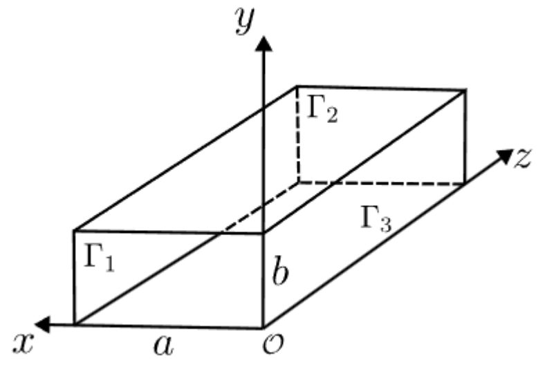

=============================
Waveguide
=============================

This example showcases an electromagnetic problem that we can solve analytically, allowing us to test the results of our simulation. It is the first example using the DPG method (Discontinuous Petrov-Gallerkin method) of the time-harmonic section of lethe.

-----------------------------
Features
-----------------------------

- Solvers: ``lethe-fluid``
- Steady-state problem
- Time-harmonic functions

----------------------------
Files Used In This Example
----------------------------

All files mentioned below are located in the example's folder (``examples/multiphysics/waveguide``)

- Base case parameter file (:math:`\mathrm{f=2.45 GHz}`): ``parameters.prm``
- Postprocessing Python script for the :math:`\mathrm{Re}=400` case: ``convergence.py``

---------------------------
Description of the Case
---------------------------

Geometry
~~~~~~~~

The waveguide at stake has a square cross section.It consists of four perfectly reflective walls and two empty sections: one for the wave’s entry and the other for its exit. The wave propagates along the z-axis. It is described on the next figure:

The dimensions chosen here are a width a = 0.25m,  a height b = 0.25m and a length L = 1m.

Physical problem
~~~~~~~~~~~~~~~~

This simulation calculates the stationnary electromagnetic field in the waveguide. Even though the waveguide is empty, we aim to calculate the fields in matter when we will add the particle flow in our problem. Thus, we start with Maxwell's equations in matter, where :math:`E` and :math:`H` denote the electric and magnetic fields:

:math:`\nabla \times \mathbf(E) = \frac{\partial (\mu \mathbf(H))}{\partial t} \quad \mathrm{(Farady's law)}`

:math:`\nabla \times \mathbf(H) = \mathbf(J) - \frac{\partial (\epsilon \mathbf(E))}{\partial t} \quad \mathrm{(Ampère-Maxwell's law)}`

Then, we use the time-harmonic ansatz : :math:`\begin{align}
\mathbf{E}(\mathbf{x}, t) &= \Re\left\{\mathbf{E}_{\text{spatial}}(\mathbf{x})\, e^{-i\omega t}\right\} \\
\mathbf{H}(\mathbf{x}, t) &= \Re\left\{\mathbf{H}_{\text{spatial}}(\mathbf{x})\, e^{-i\omega t}\right\}
\end{align}`

This form of solution introduces :math:`\omega`, the angular frequency of the electromagnetic wave, and 12 unknowns. In fact, for each of the :math:`E` and :math:`H` fields, we calculate the real and imaginary parts in each of the three spatial directions. 

Boundary conditions
~~~~~~~~~~~~~~~~~~~

There are three types of boundary conditions in this problem, this explains why the surfaces of the waveguide are sorted in three groups. There is first the inlet :math:`\Gamma_1`, the outlet :math:`\Gamma_2` and finally the metal walls :math:`\Gamma_3`.

- Inlet :math:`\Gamma_1`: waveguide port boundary condition at the inlet of the waveguide to excite the :math:`\mathrm{TE}_{mn}` mode at z = 0
- Outlet :math:`\Gamma_2`: impedance matching boundary condition to minimize the reflections
- Metal walls :math:`\Gamma_3`: perfect electric conductor (PEC) boundary conditions

This results in the three following equations:

.. math::
    \begin{align}
    \nabla \times \mathbf{H} + \frac{k_z}{\omega \mu_r} \mathbf{n} \times (\mathbf{E} \times \mathbf{n}) &=  \nabla \times \mathbf{H}_{\mathrm{TE}_{mn}} + \frac{k_z}{\omega \mu_r} \mathbf{n} \times (\mathbf{E}_{\mathrm{TE}_{mn}} \times \mathbf{n}) \quad (\text{on } \Gamma_1) \\
    \nabla \times \mathbf{H} + \frac{k_z}{\omega \mu_r} \mathbf{n} \times (\mathbf{E} \times \mathbf{n}) = 0 \quad (\text{on } \Gamma_2) \\
    \mathbf{n} \times \mathbf{E} = 0 \quad (\text{on } \Gamma_3)
    \end{align}

.. note:: 
    :math:`\mathrm{TE_mn}` refers to "Tranverse electric mode". This means that regardless of the values of m and n, the z-component of the vector E is always zero. Therefore, the pair (m,n) refers to the fact that the x-component of the electric field is excited in the m-th mode and the y-component of the electric field is excited on the n-th mode. 

Analytical solution
~~~~~~~~~~~~~~~~~~~
Solution of a TEmn mode that we use for this test case is given by:

.. math::
    \mathbf{E} = i\frac{\omega\mu_r}{k_c^2} \begin{bmatrix}
    -k_y \cos(k_x x) \sin(k_y y) \\
    k_x \sin(k_x x) \cos(k_y y) \\
    0
    \end{bmatrix} e^{ik_z z}

.. math::
    \mathbf{H} =  \begin{bmatrix}
    -i\frac{k_z k_x}{k_c^2} \sin(k_x x) \cos(k_y y) \\
    -i\frac{k_z k_y}{k_c^2} \cos(k_x x) \sin(k_y y) \\
    \cos(k_x x)\cos(k_y y)
    \end{bmatrix} e^{ik_z z}
    
With:
:math:`k_x = \frac{m\pi}{a} \ , \ k_y = \frac{n\pi}{b} \ , \ k_c^2 = k_x^2 + k_y^2 \ \text{and} \ k_z = \sqrt{\omega^2 \epsilon_{r,eff}\mu_r - k_c^2}`

And:
--------------
Parameter File
--------------

Mesh adaptation
~~~~~~~~~~~~~~~
The first parameter we can change is the the number n of mesh adaptations:

.. code-block:: text

    subsection simulation control
        set method            = steady
        set output frequency  = 1
        set output path = ./degree_1/
        set number mesh adapt = n
    end

.. warning:: 
    Note that a normal lab PC (12 cores, 64 Go RAM) can only deal with 3 mesh adaptations. 

The following figure represents a visualation of the results on paraview with the default settings and 4 mesh adptations.

.. image:: images/Mesh_adaptation.png
    :alt: standing-wave-mesh
    :align: center
    :name: standing-wave-mesh
    :width: 500

Frequence of the electromagnetic wave
~~~~~~~~~~~~~~~~~~~~~~~~~~~~~~~~~~~~~

The frequence of the inlet is originally set up to :math:`f = \mathrm{2.45 GHz}` because it the nominal frequency of the MW in the industry. This value can still be modified at line 84 : ``set electromagnetic frequency  = 2.45e9``

.. warning:: 
    Not only has the frequency to be changed, but also :math:`k,\ and \ k_z` at line 153, because they depend on :math:`f` through :math:`\omega = 2\pi f`

The different Transverse Electric mode
~~~~~~~~~~~~~~~~~~~~~~~~~~~~~~~~~~~~~~

Order of the FEM solver
~~~~~~~~~~~~~~~~~~~~~~~

--------------
The DPG method
--------------

-----------------------
Running the Simulations
-----------------------

-----------------------
Results and Discussion
-----------------------

.. image:: images/model_validation.png
    :alt: final graph
    :align: center

