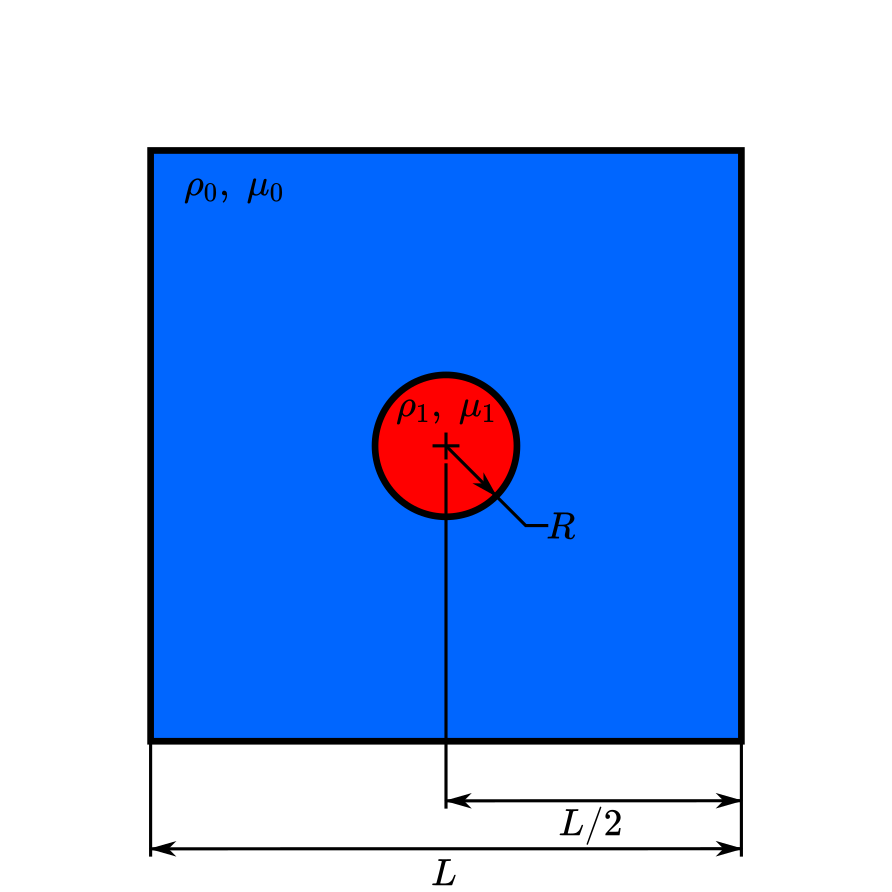

==========================
Static bubble
==========================

This example simulates a `two-dimensional static bubble`_.

.. _two-dimensional static bubble: https://onlinelibrary.wiley.com/doi/full/10.1002/fld.2643

----------------------------------
Features
----------------------------------

- Solver: ``gls_navier_stokes_2d``
- Two phase flow handled by the Volume of fluids (VOF) approach with surface tension force
- Calculation of filtered phase fraction gradient and curvature fields
- Unsteady problem handled by an adaptive BDF1 time-stepping scheme

---------------------------
Files used in this example
---------------------------

- Parameter file: ``examples/multiphysics/static-bubble/static_bubble.prm``
- Python file to generate plots: ``examples/multiphysics/static-bubble/static_bubble.py``

-----------------------------
Description of the case
-----------------------------

A circular bubble of radius :math:`R=0.5` is in equilibrium in the center of a two-dimensional squared domain of side length :math:`L=5.0` filled with air. The gravitational force is neglected, such as in a microgravity environment, and the ratio of density between the droplet and the air is 1, meaning that buoancy is also neglected. Therefore, without any external force, the bubble and the air are at rest and only the surface tension effects are involved, maintaining the droplet in its circular shape. The following schematic describes the geometry and dimensions of the simulation in the :math:`(x,y)` plane:

""""""""""""""""""""""""""""""""
Surface tension force
""""""""""""""""""""""""""""""""

As its name suggests, the surface tension :math:`\bf{f_{\sigma}}` is a surface force. It is applied at the interface between two immisible fluids and is given by :

.. math::

    {\bf{f_{\sigma}}} = \sigma \kappa {\bf{n}}

where :math:`\sigma` is the surface tension coefficient, :math:`\kappa` is the curvature and :math:`\bf{n}` is the normal vector of the free surface. Here, :math:`{\bf{f_{\sigma}}}` is a force per unit of area. To account for its effect in the Navier-Stokes equations, the surface force is transformed in a volumetric surface force :math:`\bf{F_{\sigma}}` using the continuous surface force (CSF) model [`1 <https://doi.org/10.1016/0021-9991(92)90240-Y>`_], that is :

.. math::

    {\bf{F_{\sigma}}} = \bf{f_{\sigma}} \delta = \sigma \kappa {\bf{n}}\delta

where :math:`\delta` is a Dirac delta measure with support on the interface. A good approximation for the term :math:`{\bf{n}}\delta` is :math:`{\bf{n}}\delta = \nabla \phi`, where :math:`\phi` is the phase fraction. Thus, the volumetric surface force is given by :

.. math::

    {\bf{F_{\sigma}}} =  \sigma \kappa \nabla \phi

where the curvature :math:`\kappa` is computed according to:

.. math::

    \kappa = - \nabla \cdot \bf{n}

and the unit normal vector of the free surface is obtained with:

.. math::

    \bf{n} = \frac{\nabla \phi}{|\phi|}

When including the surface tension force in the resolution of the Navier-Stokes equations, the numerical computation of the curvature can give rise to parasitic flows near the interface between the two fluids. To avoid such spurious currents, the phase fraction gradient and curvature are filtered using projection steps, as presented in section :ref:`Normal and curvature computations`.

The static bubble case is a relevant case to study the spurious currents, since the analyical solution is zero for the velocity. Therefore, nonzero velocities in the computed velocity field are considered as spurious currents [`2 <https://doi.org/10.1002/fld.2643>`_]. The analytical pressure drop between the interior (:math:`p_{int}`) and exterior (:math:`p_{ext}`) of the bubble is given by the Young-Laplace relation:

.. math::

    \Delta p = p_{int} - p_{ext} = \sigma \kappa

with the analyical curvature of the 2D bubble : :math:`\kappa = 1/R`. This example is based on the static droplet case reported in [`2 <https://doi.org/10.1002/fld.2643>`_].

.. _Normal and curvature computations:

"""""""""""""""""""""""""""""""""
Normal and curvature computations
"""""""""""""""""""""""""""""""""
The following equations compute the filtered phase fraction gradient and filtered curvature, respectively.

.. math::

    \int_\Omega \left( {\bf{v}} \cdot {\bf{\psi}} + \eta_n \nabla {\bf{v}} \cdot \nabla {\bf{\psi}} \right) d\Omega = \int_\Omega \left( {\bf{v}} \cdot \nabla {\phi} \right) d\Omega

where :math:`{\bf{v}}` is a vector test function, :math:`\bf{\psi}` is the filtered phase fraction gradient, :math:`\eta_n` is the phase fraction gradient filter value, and :math:`\phi` is the phase fraction.

.. math::

    \int_\Omega \left( v k + \eta_k \nabla v \cdot \nabla k \right) d\Omega = \int_\Omega \left( \nabla v \cdot \frac{\bf{\psi}}{|\bf{\psi}|} \right) d\Omega

where :math:`k` is the filtered curvature, and :math:`\eta_k` is the curvature filter value, and :math:`v` is a test function.

The phase fraction gradient filter :math:`\eta_n` and the curvature filter value :math:`\eta_k` are respectively computed according to:

.. math::

  \eta_n = \alpha h^2

  \eta_k = \beta h^2

where :math:`\alpha` and :math:`\beta` are user-defined factors, and :math:`h` is the cell size.

--------------
Parameter file
--------------

Time integration is handled by a 1st order backward differentiation scheme `(bdf1)`, for a :math:`3~\text{s}` simulation time with an constant time step of :math:`0.005~\text{s}`.

.. code-block:: text

    # --------------------------------------------------
    # Simulation Control
    #---------------------------------------------------
    subsection simulation control
      set method           = bdf1
      set time end         = 3
      set time step        = 0.005
      set output name      = static-bubble
      set output frequency = 20
      set output path      = ./output/
    end

The ``multiphysics`` subsection enables to turn on `(true)`
and off `(false)` the physics of interest. Here ``VOF`` is chosen. The ``surface tension force`` are enabled in the VOF subsection.

.. code-block:: text

    #---------------------------------------------------
    # Multiphysics
    #---------------------------------------------------
    subsection multiphysics
      set VOF = true
    end

""""""""""""""""""""""""""""""""
Volume of Fluid (VOF)
""""""""""""""""""""""""""""""""

The surface tension force computation is enable in the ``VOF`` subsection. The surface tension coefficient :math:`\sigma` is set by the parameter ``surface tension coefficient``. The value of the filter factors :math:`\alpha` and :math:`\beta` described in section :ref:`Normal and curvature computations` are controlled respectively by the parameters ``phase fraction gradient filter factor`` and ``curvature filter factor``. Finally, the parameter ``output auxiliary fields`` set at ``true`` enables the output of the filtered phase fraction gradient and filtered curvature fields.

.. code-block:: text

    #---------------------------------------------------
    # VOF
    #---------------------------------------------------

    subsection VOF
      subsection surface tension force
        set enable                                = true
        set surface tension coefficient           = 1
        set phase fraction gradient filter factor = 4
        set curvature filter factor               = 1
        set output auxiliary fields               = true
      end
    end

.. tip::

  The phase fraction gradient filter value (:math:`\eta_n = \alpha h^2`) and curvature filter value (:math:`\eta_k = \beta h^2`) must be small values larger than 0. We recommend the following procedure to choose a proper value for these parameters:

  1. Enable ``output auxiliary fields`` to write filtered phase fraction gradient and filtered curvature fields.
  2. Choose a value close to 1, for example, the default values  :math:`\alpha = 4` and :math:`\beta = 1`.
  3. Run the simulation and check whether the filtered phase fraction gradient and filtered curvature fields are smooth and without oscillation.
  4. If the filtered phase fraction gradient and filtered curvature fields show oscillations, increase the value :math:`\alpha` and :math:`\beta` to larger values, and repeat this process until reaching smooth filtered phase fraction gradient and filtered curvature fields without oscillations. Generally, the default values should be sufficient.

""""""""""""""""""""""""""""""""
Initial conditions
""""""""""""""""""""""""""""""""

In the ``initial condition``, the initial velocity and initial position of the droplet are defined. The droplet is initially
defined as a circle with a radius :math:`R= 0.5` at :math:`(x,y)=(0.0, 0.0)`. We enable the use of a projection step with diffusion in the subsection ``projection step`` to ensure that the initial phase distribution sufficiently smooth and avoid a staircase respresentation of the interface. This projection step is implemented in the same way as described in section :ref:`Normal and curvature computations`. We refer to the parameter guide :doc:`../../../../parameters/cfd/initial_conditions` for more details.

.. code-block:: text

    #---------------------------------------------------
    # Initial condition
    #---------------------------------------------------

    subsection initial conditions
      set type = nodal
      subsection uvwp
        set Function expression = 0; 0; 0
      end
      subsection VOF
        set Function expression = if ((x-0) * (x-0) + (y-0) * (y-0) < 0.5 * 0.5 , 1, 0)
        subsection projection step
          set enable = true
          set diffusion factor = 1
        end
      end
    end

-----------
References
-----------
`[1] <https://doi.org/10.1016/0021-9991(92)90240-Y>`_ Brackbill, J.U., Kothe, D.B. and Zemach, C., 1992. A continuum method for modeling surface tension. Journal of computational physics, 100(2), pp.335-354.

`[2] <https://doi.org/10.1002/fld.2643>`_ Zahedi, S., Kronbichler, M. and Kreiss, G., 2012. Spurious currents in finite element based level set methods for two‐phase flow. International Journal for Numerical Methods in Fluids, 69(9), pp.1433-1456.
