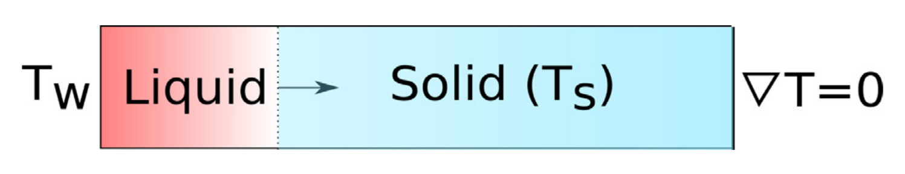
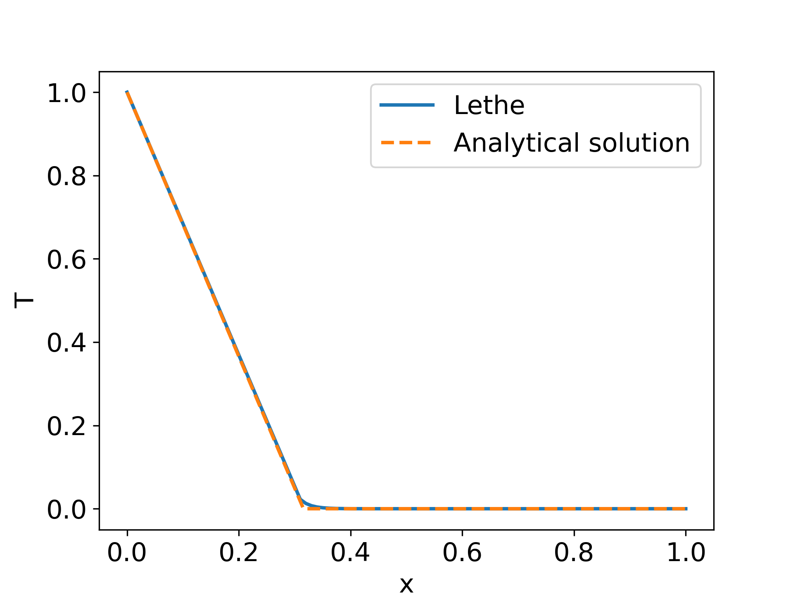

====================================
Stefan Problem: Melting of a Solid
====================================

This example simulates the Stefan `[1] <https://en.wikipedia.org/wiki/Stefan_problem>`_ problem following the approach taken by Blais and Ilinca (2018) `[2] <https://doi.org/10.1016/j.compfluid.2018.03.037>`_.

----------------------------------
Features
----------------------------------

- Solver: ``lethe-fluid`` 
- Heat transfer physics
- Unsteady problem handled by a BDF1 time-stepping scheme
- Phase change specific heat model

---------------------------
Files Used in This Example
---------------------------

Both files mentioned below are located in the example's folder (``examples/multiphysics/stefan-problem``).

- Parameter file: ``stefan.prm``
- Postprocessing Python script: ``stefan-problem-postprocessing.py``

-------------------------
Description of the Case
-------------------------

The Stefan problem describes the melting or the solidification of a pure substance by conduction in a 1D semi-infinite domain. This classical problem, extensively described in the literature `[3] <https://doi.org/10.1016/j.applthermaleng.2007.01.008>`_, is often used as the core test case to establish the accuracy and the robustness of numerical models for phase change. Although it is established for a semi-infinite domain, it can be solved on a finite domain provided that it is sufficiently long. This problem is illustrated in the following figure:

The analytical solution for the temperature in the liquid is given by:

.. math::

    T(x,t) = T_W + (T_S-T_W) \frac{erf\left(\frac{x}{2\sqrt{\alpha t}} \right)}{\beta}

 
with :math:`\alpha = \frac{k}{\rho C_p}` the thermal diffusivity, :math:`k` the thermal conductivity, :math:`\rho` the density,  :math:`T_W` is the wall temperature and :math:`T_S` is the melting (or solidification) point of a pure substance. The parameter :math:`\beta` is obtained by solving the non-linear algebraic equation:

.. math::
    \beta \exp^{\beta^2} erf \beta = \frac{St}{\sqrt{\pi}}

with :math:`St` is the Stefan number which is defined as:

.. math::
    St = \frac{C_p \left ( T_{W}-T_{S}\right)}{h_l}

where :math:`C_p` is the specific heat (which is the same for the liquid and the solid phase) and :math:`h_l` is the latent heat of fusion. 

In this example, this equation is solved using the SciPy package and Python. The displacement of the solid–liquid (the dashed lined in Fig. 1) is given by:

.. math::

  \delta (t) = 2 \beta \sqrt{\alpha t}

the diffusivity coefficient in the liquid phase and :math:`\delta (t)` the melting front displacement. In this example, we consider the case where :math:`\alpha=1`, :math:`h_l=100`, :math:`T_W=1` and :math:`T_S=0`. This corresponds to :math:`St=100`. However, the model within Lethe is sufficiently robust to manage any values of the Stefan number.

Although simple, this problem can be challenging to solve numerically because of the sharp impact of the phase change on the specific heat within the solidification interval. Even if this problem is inherently a 1D problem, we analyse it in 2D by generating structured quadrilateral meshes on a [0, 0]X[1, 0.1] domain. The number of nodes in the y direction is kept at 2 (one cell), but it is adjusted to 101 in the x direction which is the direction in which the heat transfer occurs and in which the interface displaces. 

Lethe uses a specific heat phase change model to solve this type of problem. This model is quasi-identical to the one described by Blais and Ilinca (2018) `[2] <https://doi.org/10.1016/j.compfluid.2018.03.037>`_. It is also described in the :doc:`../../../parameters/cfd/physical_properties` section of the documentation.

--------------
Parameter File
--------------

Mesh
~~~~

We first define the geometry in which the simulation is carried out using the mesh subsection:

.. code-block:: text

    subsection mesh
      set type               = dealii
      set grid type          = subdivided_hyper_rectangle
      set grid arguments     = 100, 1 : 0, 0 : 1, 0.1 : true
      set initial refinement = 0
    end

We use the ``dealii`` GridGenerator to generate a ``subdivided_hyper_rectangle``. This rectangle contains 100 cells in the x direction and 1 in the y direction. It is created from two points, :math:`(0,0)` and :math:`(1,0.1)`. Finally, we give a different id to each boundary of the domain, hence the colorize option is set to true.

Boundary Conditions
~~~~~~~~~~~~~~~~~~~

The next step is establishing the boundary conditions:

.. code-block:: text

    subsection boundary conditions heat transfer
      set number = 1
      subsection bc 0
        set id    = 0
        set type  = temperature
        subsection value
          set Function expression = 1
        end
      end
    end

Note that we only set one boundary condition for the temperature, which is a constant temperature on the wall which bears the ID 0 (the left wall). By default, boundaries on which boundary conditions are not specified are no-flux Neumann boundary conditions which, for a heat transfer problem results in:

.. math::
  \nabla T \cdot \mathbf{n} = 0

Physical Properties
~~~~~~~~~~~~~~~~~~~

Next, we define the physical properties:

.. code-block:: text

    subsection physical properties
      set number of fluids = 1
      subsection fluid 0
        set thermal conductivity model = constant
        set thermal conductivity       = 1
    
        set specific heat model = phase_change
        subsection phase change
          # Enthalpy of the phase change
          set latent enthalpy = 100
    
          # Temperature of the liquidus
          set liquidus temperature = 0.02
    
          # Temperature of the solidus
          set solidus temperature = 0
    
          # Specific heat of the liquid phase
          set specific heat liquid = 1
    
          # Specific heat of the solid phase
          set specific heat solid = 1
        end
      end
    end

This subsection defines the various parameters of the specific heat model for phase change. Key parameters to note are the solidus and liquidus temperatures. These parameters define the phase change interval, that is the temperature interval over which the phase change occurs. For pure substance, this interval should, in theory, be infinitely small. However, this leads to a numerically unstable solution. Consequently, we set a finite value which should be relatively small, but not too small as to lead to numerical instabilities. In the present case, we set this interval to 0.02C, which is sufficient to guarantee a high degree of accuracy while maintaining numerical stability. The impact of this parameter on the stability and the accuracy of the model has been studied in depth by Blais and Ilinca (2018) `[2] <https://doi.org/10.1016/j.compfluid.2018.03.037>`_.

Simulation Control
~~~~~~~~~~~~~~~~~~

Finally, the only remaining section is the ``simulation control``, which controls the flow of the simulation. We simulate until a :math:`t=5s` using a time step of :math:`\Delta t=0.02s` using a BDF1 (implicit Euler) time integration scheme and we output the solution at every iteration.

.. code-block:: text

    subsection simulation control
      set method           = bdf1
      set output frequency = 1
      set output name      = stefan
      set output path      = ./output/
      set time end         = 5
      set time step        = 0.02
    end

----------------------
Running the Simulation
----------------------

Launching the simulation is as simple as specifying the executable name and the parameter file. Assuming that the ``lethe-fluid`` executable is within your path, the simulation can be launched by typing:

.. code-block:: text
  :class: copy-button

  lethe-fluid stefan.prm

-------
Results
-------

Once the simulation is done, the results can be postprocessed using:

.. code-block:: text
  :class: copy-button

  python3 stefan-problem-postprocessing.py

The following image compares the results obtained with Lethe with the analytical solution for the Stefan problem at :math:`t=5`. This data is extracted through the use of a python script available in the folder of the example. We see that a quasi perfect agreement can be obtained with the analytical solution of the Stefan problem. 

Refining the mesh, decreasing the time step and decreasing the phase change interval (by decreasing ``liquidus temperature``) would increase the accuracy of the solution since the analytical solution of the Stefan problem is defined for a pure fluid (for which the liquid and the solidus temperatures are equal).

----------------------------
Possibilities for Extension
----------------------------

- **Consider different Stefan numbers:** The solver in Lethe is sufficiently robust to simulate a large range of Stefan numbers. You can try to simulate the problem with different Stefan number and see how the value of the Stefan number affects the solution.

- **Simulate a more complex geometry:** The phase change model can be readily used in any sort of geometry using, for example, a simplex mesh. An easy extension of this problem is to consider any 2D or 3D geometry.

----------------------------
References
----------------------------

`[1] <https://en.wikipedia.org/wiki/Stefan_problem>`_ “Stefan problem,” Wikipedia. Jul. 29, 2023. Accessed: Feb. 19, 2022. [Online]. Available: https://en.wikipedia.org/wiki/Stefan_problem

`[2] <https://doi.org/10.1016/j.compfluid.2018.03.037>`_ B. Blais and F. Ilinca, “Development and validation of a stabilized immersed boundary CFD model for freezing and melting with natural convection,” *Comput. Fluids*, vol. 172, pp. 564–581, Aug. 2018, doi: 10.1016/j.compfluid.2018.03.037.

`[3] <https://doi.org/10.1016/j.applthermaleng.2007.01.008>`_ S. aus der Wiesche, “Numerical heat transfer and thermal engineering of AdBlue (SCR) tanks for combustion engine emission reduction,” *Appl. Therm. Eng.*, vol. 27, no. 11, pp. 1790–1798, Aug. 2007, doi: 10.1016/j.applthermaleng.2007.01.008.