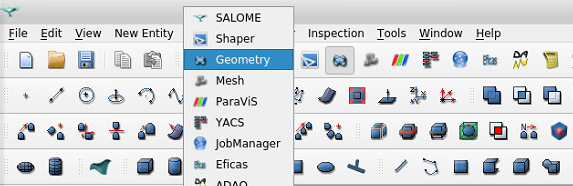
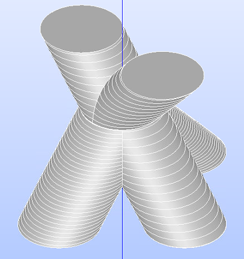
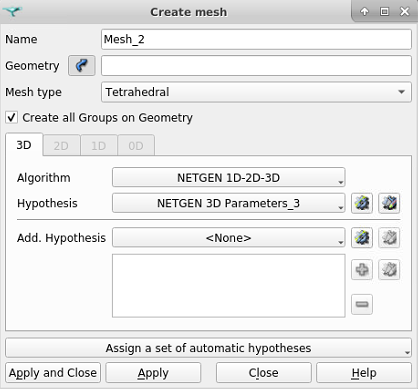
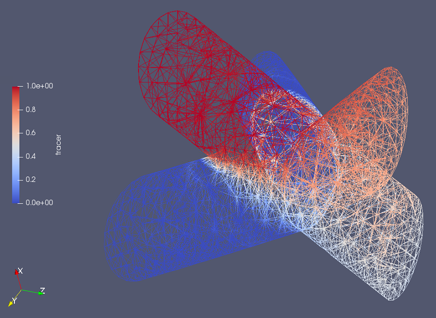

============================================================
Tracer Transport Through a CAD Generated Junction in Simplex
============================================================

In this example, we solve a problem using the simplex capabilities of Lethe. The simplex grids can be generated easily to represent complex geometries, such as a junction of channels made a boolean addition. The tracer physics usage will also be demonstrated.

Generating a geometry with SALOME
---------------------------------

Complex geometries can be set up and meshed with the SALOME platform. 

First, the geometry module must be loaded as such, and geometric shapes can be added. For example, here, disks are drawn alongside sinusoidal curves that will be used for pipe generation through extrusion. The Fuse command can then be used to obtain a single geometry.

Second, the mesh module can be loaded to generate a ``.mesh`` file. A new mesh must be created with an associated geometry, algorithm and hypothesis. NETGEN 1D-2D-3D works well, and automatic hypothesis selection can be used. The element sizes can be edited to specific requirements, and then the Compute command must be used to generate the grid. Through File->Export->GMF File, the ``.mesh`` file can be output.

Adding the boundary IDs from Gmsh
---------------------------------

A criterion for the use of ``.msh`` file in Lethe is that the boundaries have an associated ID number. These numbers can be added in Gmsh.

The boundaries from the mesh must be linked to a Physical object. In 3D for example, the inlet, outlet and walls must be specified as physical surfaces. Selecting the surface for the inlet and outlet can be done easily, and then the ``.geo`` file can be text-edited to add a new physical surface with the remaining surfaces. The physical volume must also be specified.
In this specific case, there are four boundaries: inlets with no tracer (1), inlet with tracer (2), walls (3) and outlets (4).

.. code-block:: text

    Merge "Mesh_1.mesh";
    Physical Surface(1) = {729, 712};
    Physical Surface(2) = {10};
    Physical Surface(3) = {1:9,11:711,713:728,730:848,850,852:5000};
    Physical Surface(4) = {849, 851};
    Physical Volume(1) = {1};

The last step in Gmsh is to generate the 3D mesh, and then save it to a ``.msh`` file.

Building the .prm file
----------------------

Using Lethe requires a solver executable, in this case ``gls_navier_stokes_3d``, and a .prm file. This second one can be setup in many ways, but for this specific case two aspects must be treated with more care: the enabling of simplex mode, and the setup of the tracer physics. 

Enabling the Simplex mode
^^^^^^^^^^^^^^^^^^^^^^^^^

The simplex mode can be used by setting a boolean to true and making sure the ``.msh`` file used has the proper type of elements. However, it is also crucial to consider a current (2022-01-18) limitation : simplex grid refinement isn't implemented.

.. code-block:: text

    #---------------------------------------------------
    # Mesh
    #---------------------------------------------------
    subsection mesh
        set type                 = gmsh
        set file name            = vessels.msh
        set initial refinement   = 0
        set simplex              = true
    end

.. warning:: 
    If the mesh type is set to ``deal.II`` instead of ``gmsh``, making sure the imported mesh is built with simplices doesn't make sense; the deal.II generated mesh will be built properly.

Setting up the tracer physics
^^^^^^^^^^^^^^^^^^^^^^^^^^^^^

Using the tracer physics requires four elements: activating the physics, setting the tracer diffusivity, setting the tracer elements order and setting the boundary conditions. These elements are provided as such:

.. code-block:: text

    #---------------------------------------------------
    # Multiphysics
    #---------------------------------------------------
    subsection multiphysics
        set tracer = true
    end

.. code-block:: text

    #---------------------------------------------------
    # Physical Properties
    #---------------------------------------------------
    subsection physical properties
        set kinematic viscosity            = 1
        set tracer diffusivity             = 0.001
    end

.. code-block:: text

    #---------------------------------------------------
    # FEM
    #---------------------------------------------------
    subsection FEM
        set velocity order            = 1
        set pressure order            = 1
        set tracer order              = 1
    end

.. code-block:: text

    # --------------------------------------------------
    # Boundary Conditions
    #---------------------------------------------------
    subsection boundary conditions tracer
    set number                  = 2
        subsection bc 0
        set id = 1
        set type              = dirichlet
            subsection dirichlet
                    set Function expression =  0 
            end
        end
        subsection bc 1
        set id = 2
        set type              = dirichlet
            subsection dirichlet
                    set Function expression =  1 
            end
        end
    end

The boundary conditions are written in a specific way. We have a number of specified 2 boundaries, a Dirichlet condition of 1 for an inlet, and another Dirichlet condition of 0 for the two other inlets; all the remaining boundaries are unspecified. An unspecified boundary condition in Lethe is considered as the natural condition of finite elements, which is a zero Neumann condition. This is the condition needed in that case for the walls and outlets: the walls must not let any tracer out, and the outlets must not apply any constraint on their tracer level.

Simulation
----------
The case must be run with the solver and the parameter file. Then, the results can be viewed using software such as Paraview.

