==========================
Warming up a Viscous Fluid
==========================

This example introduces how to solve another physics along with the CFD solver.

--------------
Features
--------------

* Solver: ``lethe-fluid``
* Transient problem
* Multiphysics
* Displays the use of heat transfer physics
* Analytical solution

---------------------------
Files Used in This Example
---------------------------

- Parameter file: ``examples/multiphysics/warming-up-viscous-fluid.prm``

------------------------
Description of the Case
------------------------

A viscous fluid lays between two parallel plates: one fixed and insulated, and the other moving and heated. The velocity profile and the temperature evolution are simulated. The parameter file used is ``warming-up-viscous-fluid.prm``.

The following schematic describes the simulation.

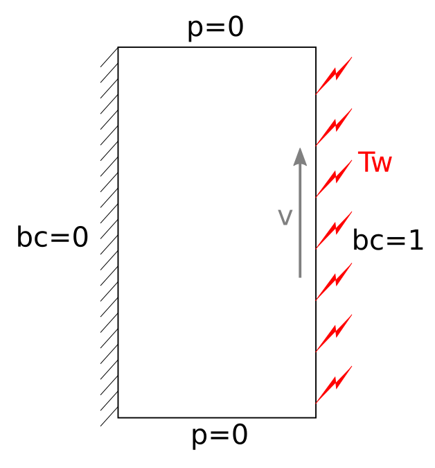

* bc = 0 : no slip and thermal insulation boundary condition
* bc = 1 : flow in the y-direction (:math:`v=2`) and heating at Tw

.. important:: 
    The whole simulation is carried out in the frame of one-way coupling: the fluid velocity influences the heat generated through viscous dissipation, but the heat transfer does not influence the fluid velocity. Moreover, fluid state changes are not considered.

---------------
Parameter File
---------------

Simulation Control
~~~~~~~~~~~~~~~~~~

Time integration is defined by a 2nd order backward differentiation (``bdf2``), for a 7.0 seconds simulation (``time end``) with a 0.05 second ``time step``, as stated in the subsection ``simulation control``:

.. code-block:: text

    subsection simulation control
      set method           = bdf2
      set time step        = 0.05
      set time end         = 7.0
      set output name      = warming-up
      set output frequency = 1
    end

.. note:: 
    Heat transfer phenomenon occur at a much larger characteristic time than fluid transport phenomenon. To reach a stable state for the system, the end time much be quite big, but the time step can also be increased (in the limit of numerical stability).

FEM
~~~~~~~~~~~~~~

The order of resolution for the ``velocity``, ``pressure`` and ``temperature`` are given in the subsection FEM:

.. code-block:: text

    subsection FEM
      set velocity order    = 1
      set pressure order    = 1
      set temperature order = 2
    end

Physical Properties
~~~~~~~~~~~~~~~~~~~

The fluid's ``physical properties`` are defined in the following subsection, according to the properties of oil.

.. code-block:: text

    subsection physical properties
      subsection fluid 0
        set density              = 0.9
        set kinematic viscosity  = 0.5
        set thermal conductivity = 0.12
      end
      # water = 1 density, 0.01 kinematic viscosity, 0.59 conductivity
      # oil = 0.9 density, 0.5 kinematic viscosity, 0.12 conductivity
    end

.. warning:: 
    If no physical properties are defined, default values (of 1.0) are taken for the simulation.

Mesh
~~~~~~~~~~~~~~

The ``mesh`` considered is a very basic rectangle, using the ``dealii`` grid type `hyper_rectangle <https://www.dealii.org/current/doxygen/deal.II/namespaceGridGenerator.html#a56019d263ae45708302d5d7599f0d458>`_, to represent the fluid volume considered between the two plates. Here, the width between the two plates is set to ``0.5``.

.. code-block:: text

    subsection mesh
      set type               = dealii
      set grid type          = hyper_rectangle
      set grid arguments     = 0, 0 : 0.5, 1 : true
      set initial refinement = 4
    end

.. note::
    As the fluid velocity is not influenced by heat transfer (one-way coupling), the fluid velocity will remain constant for the whole simulation across the domain, and as heat transfer occurs at a larger scale, the mesh can be coarse.

Multiphysics
~~~~~~~~~~~~~~

The ``multiphysics`` subsection enable to turn on (``true``) and off (``false``) the physics of interest. Here ``heat transfer`` and ``viscous dissipation`` must be set (see Bonuses for results without viscous dissipation).

.. code-block:: text

    subsection multiphysics
      set heat transfer       = true
      set viscous dissipation = true
    end

Analytical Solution
~~~~~~~~~~~~~~~~~~~

The ``analytical solution`` is defined, according to the fluid and simulation properties:

.. math::
    T(x) = T_\omega + \frac{\rho \nu v^2}{2K}\left ( 1 - \left ( \frac{x}{B} \right )^2 \right )

with :math:`x` the axis perpendicular to the plates, :math:`\rho` the density, :math:`\nu` the kinematic viscosity, :math:`K` the thermal conductivity, :math:`T_\omega` the heating temperature and :math:`v` the velocity of the right plate (bc 1), and :math:`B` is the width between the two plates.

.. code-block:: text

    subsection analytical solution
      set enable    = true
      set verbosity = verbose
      subsection uvwp
        set Function expression = 0 ; 0 ; 0
      end
      subsection temperature
        set Function constants  = rho=0.9, nu=0.5, K=0.12, Tw=80, v=2, B=0.5
        set Function expression = Tw+(((rho*nu)*v*v)/(2*K))*(1-(x/B)*(x/B))
      end
    end

Boundary Conditions
~~~~~~~~~~~~~~~~~~~

The ``boundary conditions`` are set for:

* the fluid dynamic in ``subsection boundary conditions``, with ``noslip`` at the left wall (``bc 0``) and a velocity of ``2`` in the y-direction at the right wall (``bc 1``),
* the heat transfer in ``subsection boundary conditions heat transfer``, with a ``convection`` imposed at the left wall (``bc 0``) with a heat transfer coefficient ``h = 0`` to represent an insulation condition, and an imposed ``temperature`` of ``80`` at the right wall.

.. code-block:: text

    subsection boundary conditions
      set number = 2
      subsection bc 0
        set id   = 0
        set type = noslip
      end
      subsection bc 1
        set id   = 1
        set type = function
        subsection u
          set Function expression = 0
        end
        subsection v
          set Function expression = 2
        end
      end
    end

    subsection boundary conditions heat transfer
      set number = 2
      subsection bc 0
        set id   = 0
        set type = convection-radiation
        subsection h
          set Function expression = 0
        end
        subsection Tinf
          set Function expression = 0
        end
      end
      subsection bc 1
        set id    = 1
        set type  = temperature
        subsection value
          set Function expression = 80
        end
      end
    end

-----------------------
Running the Simulation
-----------------------

The simulation is launched in the same folder as the ``.prm`` file, using the ``lethe-fluid`` solver. It takes only about 5 seconds with one cpu. Assuming that the ``lethe-fluid`` executable is within your path, the simulation can be launched by typing:

.. code-block:: text
  :class: copy-button

  lethe-fluid warming-up-viscous-fluid.prm

--------------
Results
--------------

Visualizations
~~~~~~~~~~~~~~

Convergence with regards to the analytical solution on the temperature:

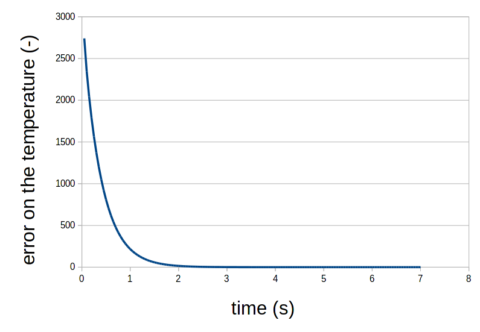

Domain with temperature:

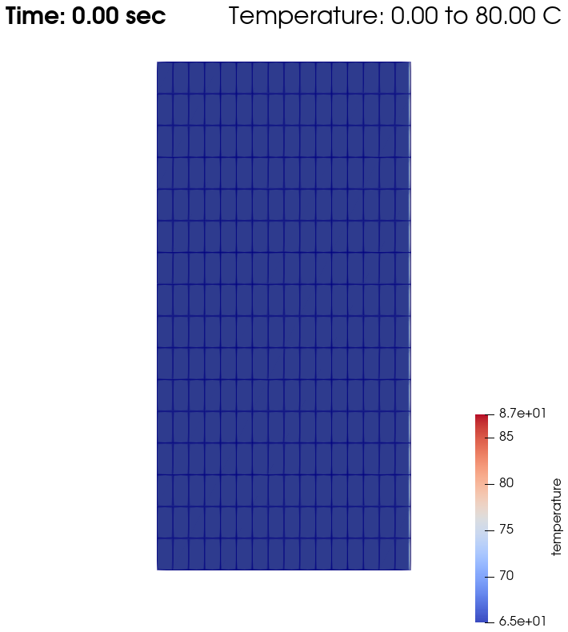

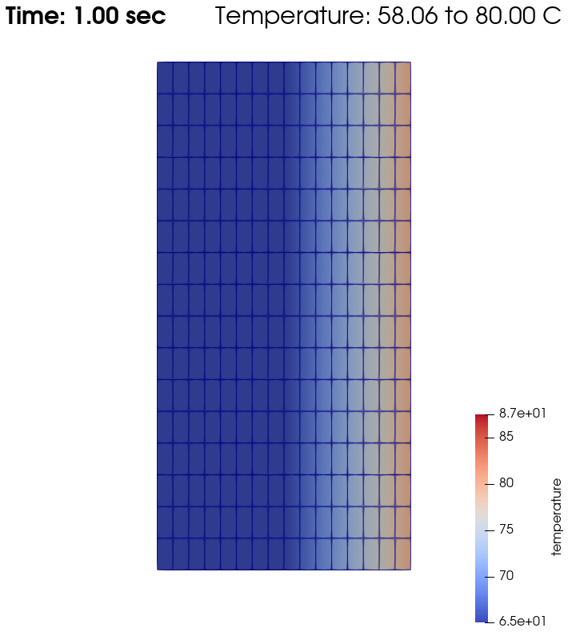

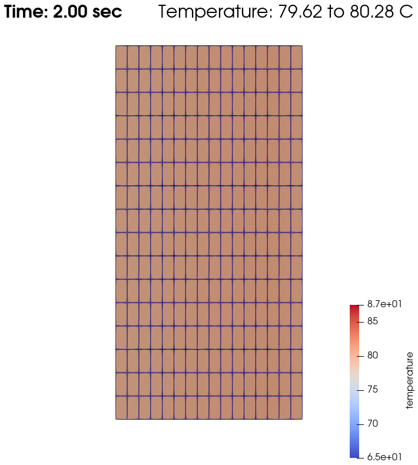

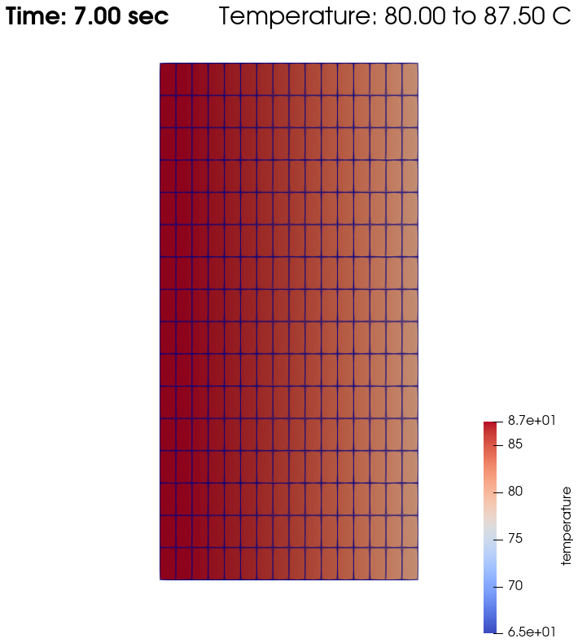

Temperature evolution over time:

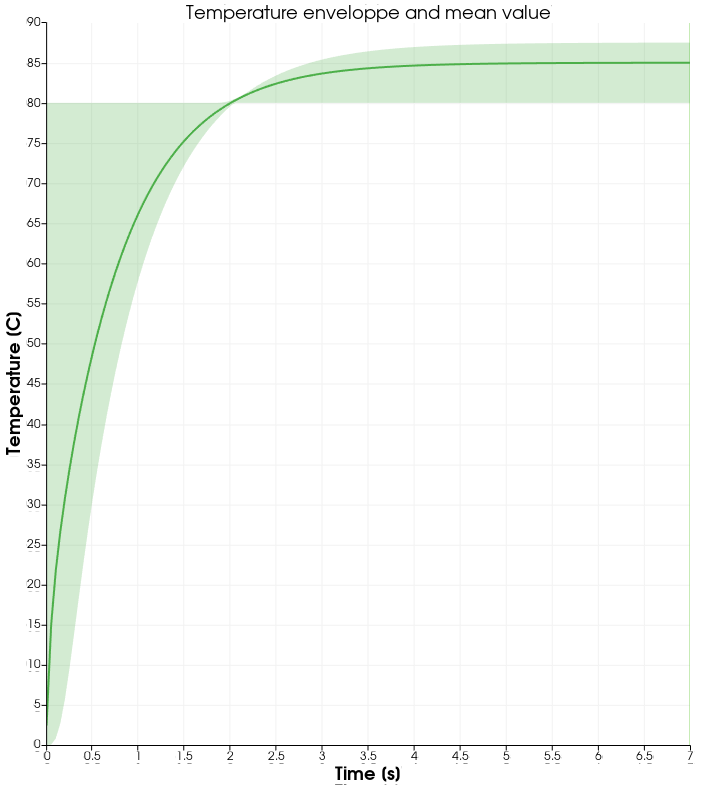

Physical Interpretation
~~~~~~~~~~~~~~~~~~~~~~~~

From :math:`t=0s` to :math:`t=2s`, the right plate (:math:`T=80^\circ`) heats up the fluid (initially at :math:`T=0^\circ`). At :math:`t=2s`, the temperature is quasi-homogeneous in the fluid, with :math:`T=80^\circ`. As the fluid continues to be forced to flow at the right wall, viscous dissipation generates more heat, so that the wall with a fixed temperature of :math:`T=80^\circ` now cools down the fluid. A steady state between viscous dissipation heating and the fixed temperature cooling is reached at about :math:`t=4.5s`.

--------------
Bonuses
--------------

Results for Water
~~~~~~~~~~~~~~~~~

For water, ``physical properties`` are:

.. code-block:: text

    subsection physical properties
      subsection fluid 0
       set density              = 1
       set kinematic viscosity  = 0.01
       set thermal conductivity = 0.59
      end
    # water = 1 density, 0.01 kinematic viscosity, 0.59 conductivity
    # oil = 0.9 density, 0.5 kinematic viscosity, 0.12 conductivity
    end

As water has a higher thermal conductivity than oil, the temperature becomes quasi-homogeneous sooner (around :math:`t=1s`). And as it is far less viscous, the heat generated by viscous dissipation is not visible on the temperature-over-time plot. However it still exists, as seen when the temperature scale is adapted.

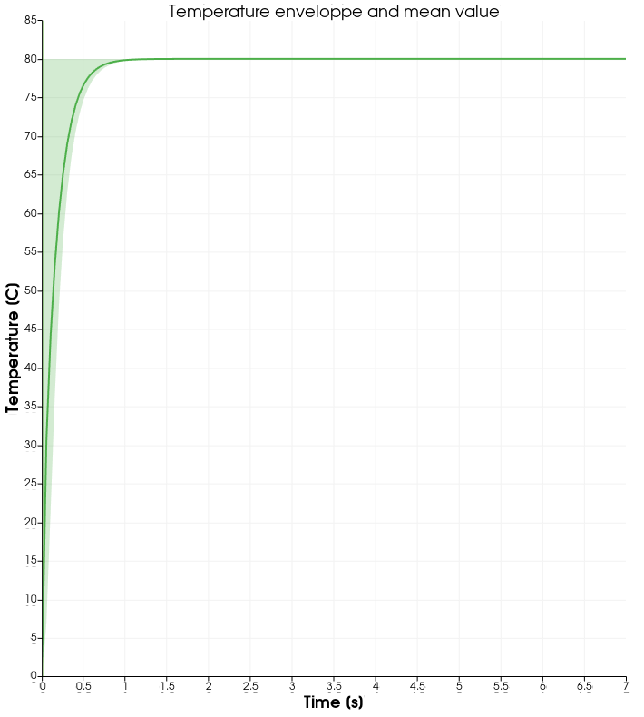

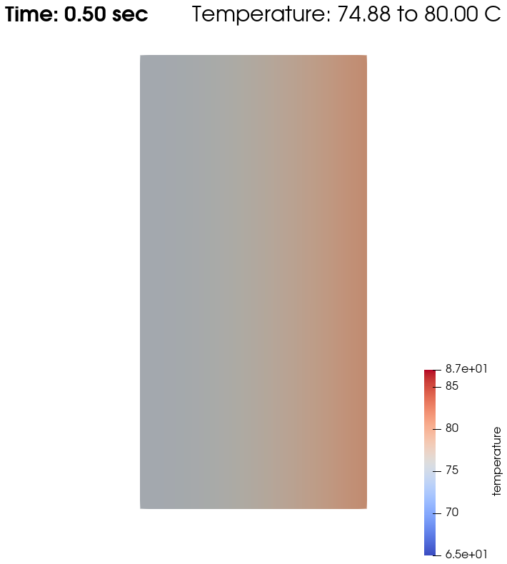

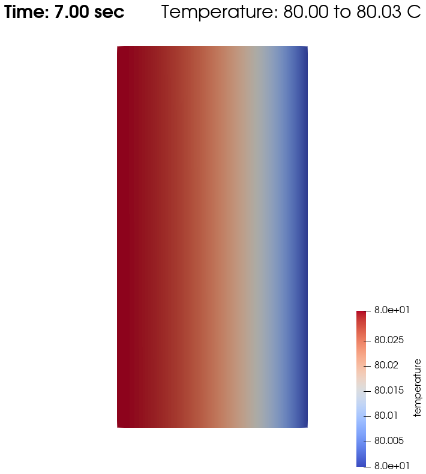

Results without Viscous Dissipation
~~~~~~~~~~~~~~~~~~~~~~~~~~~~~~~~~~~

The viscous dissipation can be disabled physically, if the two plates remain fixed (``v=0`` for ``bc 1``), or numerically with ``set viscous dissipation = false``. Both cases give the same results shown below. The fluid considered is still water.

After the fluid has been heated up by the right plate, the temperature is really homogeneous throughout the domain, and both minimum and maximum temperatures stay at :math:`T_\omega=80^\circ`. Adapting the temperature scale shows that there is no viscous dissipation at all.

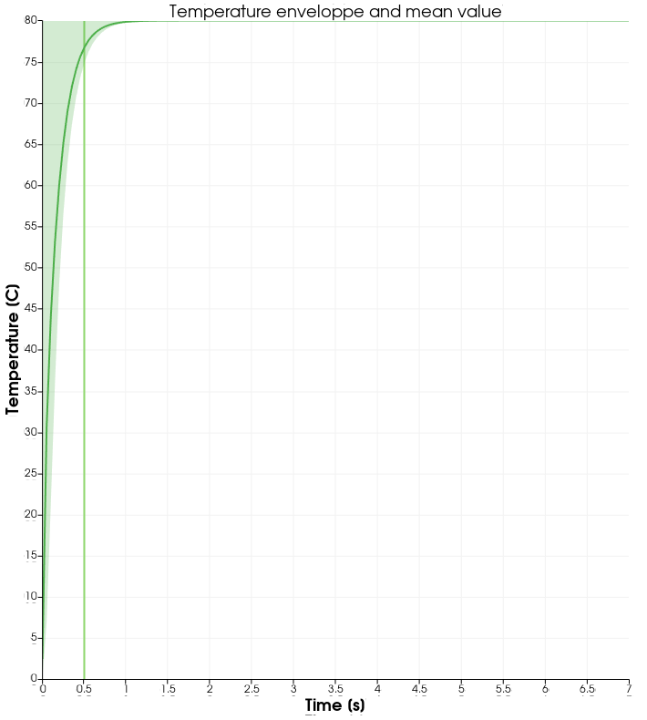

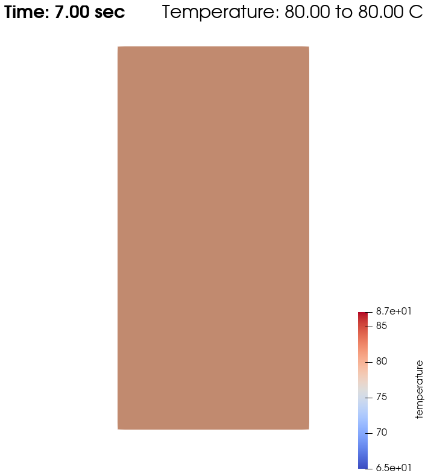

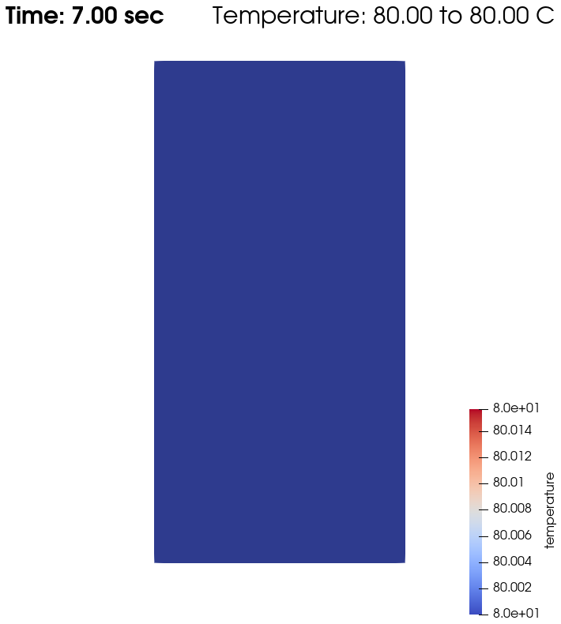

Horizontal Domain
~~~~~~~~~~~~~~~~~

Several adjustments have to be made in the `.prm` to turn the domain clockwise, so that it becomes horizontal, with the upper wall being the no slip and thermal insulation boundary condition, and the lower wall with the flow in the y-direction (:math:`v=2`) and heating at Tw:

* in ``subsection mesh``: ``set grid arguments = 0, 0 : 1, 0.5 : true``
* in ``subsection analytical solution``, ``subsection temperature``: 
   ``set Function expression = Tw+(((rho*nu)*v*v)/(2*K))*(1-(y/B)*(y/B))``
* and most importantly, the ``id`` of ``boundary conditions`` should be adapted to use the bottom and top wall (see the `deal.II documentation on hyper_rectangle grid generator <https://www.dealii.org/current/doxygen/deal.II/namespaceGridGenerator.html#a56019d263ae45708302d5d7599f0d458>`_ for further details):

.. code-block:: text

    subsection boundary conditions
      set number = 2
      subsection bc 0
        set id   = 2
        set type = noslip
      end
      subsection bc 1
        set id   = 3
        set type = function
        subsection u
          set Function expression = 2
        end
        subsection v
          set Function expression = 0
        end
      end
    end

    subsection boundary conditions heat transfer
      set number = 4
      subsection bc 2
        set id   = 2
        set type = convection-radiation
        subsection h
          set Function expression = 0
        end
        subsection Tinf
          set Function expression = 0
        end
      end
      subsection bc 3
        set id    = 3
        set type  = temperature
        subsection value
          set Function expression = 80
        end
      end
    end

.. important::
	For the fluid ``boundary conditions``, we use ``set number = 2``, whereas for ``boundary conditions heat transfer`` we use ``set number = 4``. These two notations are perfectly equivalent, as the boundary conditions are ``none`` by default (or ``noflux`` in the case of heat transfer, see :doc:`../../../parameters/cfd/boundary_conditions_multiphysics`). However, it is important to make sure that:

	* the index in ``subsection bc ..`` is coherent with the ``number`` set (if ``number = 2``, ``bc 0`` and ``bc 1`` are created but ``bc 2`` does not exist),
	* the index in ``set id = ..`` is coherent with the ``id`` of the boundary in the mesh (here, the deal.II generated mesh).

----------------------------
Possibilities for Extension
----------------------------

* Study the **sensitivity to the time step**, namely to assess how large the ``time step`` can be before stating any difference in the heat transfer solution.
* Test a **different time integration scheme** and see if there is any difference in the computational cost and/or the precision with regards to the analytical solution.
* See how the **resolution order** (``velocity order``, ``pressure order`` and ``temperature order``) affects the precision with regards to the analytical solution.
