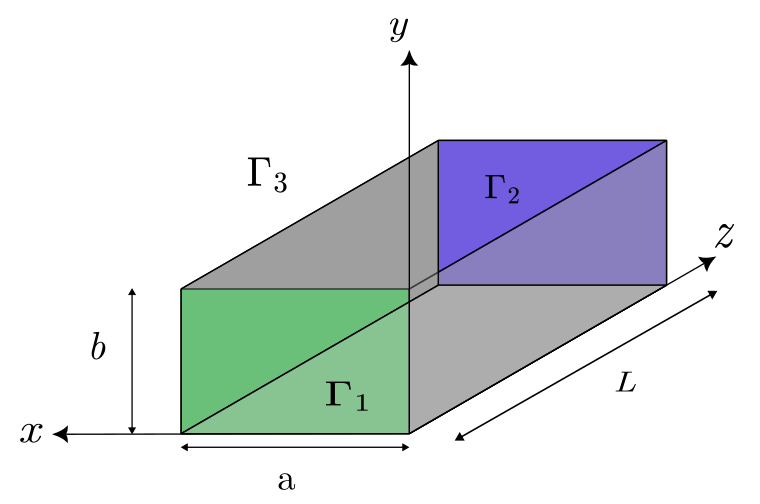
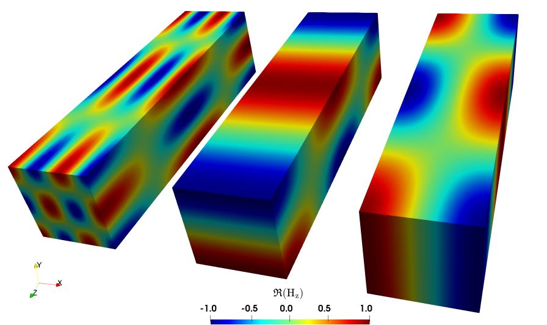
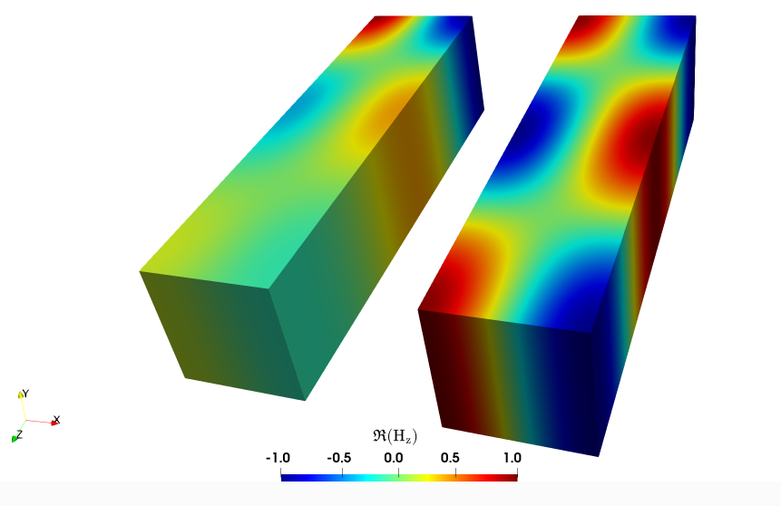

..
    SPDX-FileCopyrightText: Copyright (c) 2026 The Lethe Authors
    SPDX-License-Identifier: Apache-2.0 WITH LLVM-exception OR LGPL-2.1-or-later

=========
Waveguide
=========

This example is used to verify the implementation of the electromagnetic solver. It considers the propagation of an electromagnetic (EM) wave in a waveguide, a problem for which an analytical solution is available, thereby allowing us to assess whether the method recovers the expected order of convergence.

--------
Features
--------

- Solvers: ``lethe-fluid`` or ``lethe-fluid-matrix-free``
- Steady-state problem
- Use of discontinuous Petrov-Galerkin (DPG) method

--------------------------
Files Used In This Example
--------------------------

The file mentioned below is located in the example's folder (``examples/multiphysics/waveguide``).

- Base case parameter file (:math:`\mathrm{f=2.45 GHz}` and :math:`\mathrm{TE}_{10}`): ``waveguide.prm``

-----------------------
Description of the Case
-----------------------

Geometry
~~~~~~~~

The simulated waveguide has a square cross section. It is made of four perfectly conductive lateral walls, an inlet port for the wave’s entry, and an outlet for its exit as shown in the figure below. The wave propagates along the :math:`z`-axis.

The dimensions chosen here are a width :math:`a = 0.25 \, \mathrm{m}`,  a height :math:`b = 0.25\, \mathrm{m}` and a length :math:`L = 1\, \mathrm{m}`.

Physical Problem
~~~~~~~~~~~~~~~~
.. note::
    Lethe time-harmonic solver always solve the set of equations in a dimensionless form; therefore, the same convention will be used in the following mathematical descriptions. 

This simulation computes the stationary electromagnetic field in the above waveguide filled with void. We recall that the time-harmonic Maxwell equations in their dimensionless form, as used in this example, are:

.. math::
    \begin{align*}
    \tag{Faraday's law} \nabla \times \mathbf{E} - i\omega \mu_{\mathrm{r}}\mathbf{H} &= 0 \\
    \tag{Ampère-Maxwell's law} \nabla \times \mathbf{H} + i \omega \varepsilon_{\mathrm{r,eff}} \mathbf{E} &= \mathbf{J} 
    \end{align*}

with the parameters of the problem:

- Dielectric characteristics of the medium : :math:`\mu_{\mathrm{r}}` the relative permeability and :math:`\varepsilon_{\mathrm{r,eff}}` the effective relative permittivity. This characteristic is noted "effective" because it takes into account the electric conductivity.   
- Excitation: :math:`\mathbf{J}` the current density and :math:`\omega = \frac{L2\pi f}{c}` the angular frequency of the electromagnetic wave normalized by the speed of light in the void :math:`c` .

When solving a time-harmonic electromagnetic problem with Lethe, there are 12 unknowns: two for each component of the dimensionless :math:`\mathbf{E}` and :math:`\mathbf{H}` fields (the real and imaginary parts in each of the three spatial directions). 

In addition, to describe an electromagnetic wave problem, it is useful to  introduce the following dimensionless wavenumbers to ease notation in the following parts of this example :

- Wavenumbers corresponding to a standing wave caused by the walls: :math:`k_\mathrm{x} = \frac{Lm\pi}{a} \ , \ k_\mathrm{y} = \frac{Ln\pi}{b}`
- Wavenumber in the transverse direction of propagation: :math:`k_\mathrm{c} = \sqrt{k_\mathrm{x}^2 + k_\mathrm{y}^2}`
- Total wavenumber: :math:`k = \omega \sqrt{\mu_{\mathrm{r}} \varepsilon_{\mathrm{eff,r}}} = \sqrt{k_\mathrm{x}^2 +k_\mathrm{y}^2 + k_\mathrm{z}^2}`
- Wavenumber corresponding to a wave propagating along the :math:`z`-axis: :math:`k_\mathrm{z} = \sqrt{\omega^2 \varepsilon_\mathrm{eff,r}\mu_\mathrm{r} - k_\mathrm{c}^2}`

.. note::
    Note that if :math:`k \leq k_\mathrm{c}`, the wave does not propagate because :math:`k_\mathrm{z}^2 \leq 0`. This remark is important for the following part on the frequency and the different modes.

In Lethe, the ``electromagnetics`` solver is enabled within the ``multiphysics`` subsection of the parameter file. We also disable the ``fluid dynamics`` solver there since it is enabled by default.

.. code-block:: text

    subsection multiphysics
        set fluid dynamics   = false
        set electromagnetics = true
    end

The Different Transverse Modes And The Frequency Modification
~~~~~~~~~~~~~~~~~~~~~~~~~~~~~~~~~~~~~~~~~~~~~~~~~~~~~~~~~~~~~

:math:`\mathrm{TE}_{mn}` mode refers to "Transverse electric mode". This means that regardless of the values of :math:`m` and :math:`n`, the :math:`z`-component of :math:`\mathbf{E}` is always zero. Therefore, the pair :math:`(m,n)` refers to the :math:`x`-component of the electric field being excited in the :math:`m`-th mode and the :math:`y`-component of the electric field being excited on the :math:`n`-th mode. 

The :math:`\mathrm{TE}_{mn}` modes can be specified in the subsection `waveguide mode` of the parameter file. Here we used the following :

.. code-block:: text

    subsection waveguide mode
      set mode type    = TE
      set mode order m = 1
      set mode order n = 0
    end

To apply a transverse magnetic mode, simply modify the ``mode type`` with “TM”.

The frequency of the inlet is originally set to :math:`f = \mathrm{2.45}\, \mathrm{GHz}` because it is the nominal frequency of microwave reactors in the industry. This value can be modified in the parameter file in the subsection ``time harmonic maxwell``: ``set electromagnetic frequency = 2.45e9``

.. caution::
     If :math:`\mathrm{TE}_{mn}` or :math:`f` is changed, the wavenumber :math:`k_\mathrm{z} = \sqrt{\omega^2 \varepsilon_{\mathrm{eff,r}}\mu_\mathrm{r} - k_\mathrm{x}^2 - k_\mathrm{y}^2 }`  specified in the subsection ``analytical solution``, the dimensionless admittance real part :math:`Y_\mathrm{s}=\frac{1}{Z_\mathrm{s}}=\frac{k_\mathrm{z}}{\omega \mu_\mathrm{r}}` specified within the subsection ``surface admittance real part`` must be changed because it depends on :math:`(m,n)` and :math:`f` through :math:`k_\mathrm{x} = \frac{m \pi}{a}`, :math:`k_\mathrm{y} = \frac{n \pi}{b}` and :math:`\omega`.

.. warning:: 
    The simulation may not run for low frequencies or high modes. You have to adapt one of these parameters in order for :math:`k_z` to keep a real value. Indeed, the number :math:`k_z^2 = \omega^2 \varepsilon_{\mathrm{eff,r}}\mu_\mathrm{r} - k_x^2 - k_y^2` cannot be negative.

Here are Paraview visuals of different modes. In order to maximise the resolution, we calculated the parameters with :math:`\lambda = L = 1\, \mathrm{m}`, which is equivalent to fix the dimensionless parameter :math:`k_\mathrm{z} = 2\pi`. This represents only one spatial period of the wave. Results of :math:`\mathrm{TE}_{32}`, :math:`\mathrm{TE}_{01}` and :math:`\mathrm{TE}_{10}` (respectively, from left to right) are presented below:

Boundary Conditions
~~~~~~~~~~~~~~~~~~~

.. Attention::
    Although we are not using the fluid solver, note that we cannot remove the ``subsection boundary conditions`` for the fluid boundaries in the parameter file otherwise the simulation fails to execute.

There are three types of boundary conditions in this problem, this explains why the surfaces of the waveguide are sorted in three groups. First, there is the inlet :math:`\Gamma_1`, then the outlet :math:`\Gamma_2` and finally the metal walls :math:`\Gamma_3`.

- Inlet :math:`\Gamma_1`: ``waveguide port`` boundary condition at the inlet of the waveguide to excite the :math:`\mathrm{TE}_{mn}` mode at :math:`z` = 0
- Outlet :math:`\Gamma_2`: ``impedance boundary`` condition tuned to the waveguide impedance to minimize the reflections (the waveguide is theoretically infinite). The dimensionless admittance in such conditions is:

  .. math::

    Y_\mathrm{s} = \frac{1}{Z_\mathrm{s}}=\frac{k_\mathrm{z}}{\omega \mu_\mathrm{r}} = \frac{k_\mathrm{z} c}{2\pi f \mathrm{L} \mu_\mathrm{r}} \approx 0.968987646

  .. caution::
    Changes in mode will affect this value as mentioned before.

- Metal walls :math:`\Gamma_3`: ``pec`` (perfect electric conductor) boundary conditions

These translate into the three following equations:

.. math::
    \begin{align*}
    \tag{on $\Gamma_1$} \nabla \times \mathbf{H} + \frac{k_\mathrm{z}}{\omega \mu_\mathrm{r}} \mathbf{n} \times (\mathbf{E} \times \mathbf{n}) &=  \nabla \times \mathbf{H}_{\mathrm{TE}_{mn}} + \frac{k_\mathrm{z}}{\omega \mu_\mathrm{r}} \mathbf{n} \times (\mathbf{E}_{\mathrm{TE}_{mn}} \times \mathbf{n})\\
    \tag{on $\Gamma_2$}\nabla \times \mathbf{H} + \frac{k_\mathrm{z}}{\omega \mu_\mathrm{r}} \mathbf{n} \times (\mathbf{E} \times \mathbf{n}) &= 0 \\
    \tag{on $\Gamma_3$}\mathbf{n} \times \mathbf{E} &= 0
    \end{align*}

    
These boundary conditions are specified within the ``boundary conditions time harmonic maxwell`` subsection of the parameter file:

.. code-block:: text

    subsection boundary conditions time harmonic maxwell
        set number = 3
        subsection bc 0
            set id   = 0, 1, 2, 3,
            set type = pec
        end
        subsection bc 1
            set id   = 4
            set type = waveguide port
        end
        subsection bc 2
            set id   = 5
            set type = impedance boundary
            subsection excitation x real part
                set Function expression = 0
            end
            subsection excitation x imag part
                set Function expression = 0
            end
            subsection excitation y real part
                set Function expression = 0
            end
            subsection excitation y imag part
                set Function expression = 0
            end
            subsection excitation z real part
                set Function expression = 0
            end
            subsection excitation z imag part
                set Function expression = 0
            end
            subsection surface admittance real part
                set Function expression = 0.968987646
            end
            subsection surface admittance imag part
                set Function expression = 0.
            end
        end
    end

Dimensionless Analytical Solution
~~~~~~~~~~~~~~~~~~~~~~~~~~~~~~~~~

The solution for a :math:`\mathrm{TE}_{mn}` mode, which will be used to assess convergence for this test case, is given by:

.. math::
    \mathbf{E} = i\frac{\omega\mu_r}{k_c^2} \begin{bmatrix}
    -k_\mathrm{y} \cos(k_\mathrm{x} x) \sin(k_\mathrm{y} y) \\
    k_\mathrm{x} \sin(k_\mathrm{x} x) \cos(k_\mathrm{y} y) \\
    0
    \end{bmatrix} e^{ik_\mathrm{z} z}

.. math::
    \mathbf{H} =  \begin{bmatrix}
    -i\frac{k_\mathrm{z} k_\mathrm{x}}{k_c^2} \sin(k_\mathrm{x} x) \cos(k_\mathrm{y} y) \\
    -i\frac{k_\mathrm{z} k_\mathrm{y}}{k_c^2} \cos(k_\mathrm{x} x) \sin(k_\mathrm{y} y) \\
    \cos(k_\mathrm{x} x)\cos(k_\mathrm{y} y)
    \end{bmatrix} e^{ik_\mathrm{z} z}
    

The solution is specified in the ``analytical solution`` subsection of the parameter file: 

.. code-block:: text 

    subsection analytical solution
        set enable    = true
        set verbosity = verbose
        subsection electromagnetics
            set Function constants  = k = 51.348203, k_x = 12.5663706, k_z = 49.78678822
            set Function expression = 0. ; (-k/k_x)* sin(k_x*x) * sin(k_z*z);  0.;0; (k/k_x)* sin(k_x*x) * cos(k_z*z);   0;  (k_z/k_x)* sin(k_x*x) * sin(k_z*z);    0.;   cos(k_x * x)*cos(k_z*z) ; -(k_z/k_x)* sin(k_x*x) * cos(k_z*z);    0.;  cos(k_x * x) *sin(k_z*z)
        end
    end 

.. note::
    The parameters defined here are only used to calculate the error, they are not taken into account in the simulation.

Mesh Adaptation
~~~~~~~~~~~~~~~

In this tutorial, we want to perform a convergence analysis. Therefore, the mesh needs to be successively refined uniformly across the domain. This is achieved with the subsection ``mesh adaptation``, by setting the ``type`` to be ``uniform``:

.. code-block:: text

    subsection mesh adaptation
      set type = uniform
    end

and by changing the number ``n`` of mesh adaptations in the subsection ``simulation control``:

.. code-block:: text

    subsection simulation control
        set method            = steady
        set output frequency  = 1
        set output path       = ./degree_1/
        set number mesh adapt = n
    end

If you try a new order :math:`m`, you can change the name of the path with ``set output path = ./degree_m/``.

.. Note::
   - The output folder specified with ``output path`` is automatically created when the simulation is run if it does not already exist.
   - A typical computer with 12 cores and 64 Gb of RAM can compute up to 3 mesh adaptations, after that the systems becomes too heavy in memory. 

Degree of the FEM Solver
~~~~~~~~~~~~~~~~~~~~~~~~
You can also change the degree of the polynomials used in the Finite Element Method (FEM) in subsection ``FEM``: 

.. code-block:: text

    subsection FEM
        set electromagnetics trial degree = 1
        set electromagnetics test degree  = 2
    end

.. caution::
    The time-harmonic Maxwell solver requires the degree of the test space to always be greater than the degree of the trial space. Consequently, if the trial space degree is changed, the test degree also needs to be adjusted. 

Physical Properties
~~~~~~~~~~~~~~~~~~~

You can also change the electromagnetic properties of the medium at the subsection ``phytsical properties``. Here are the default settings for air or void:

.. code-block:: text
    
    subsection physical properties
        set number of fluids = 1
        subsection fluid 0
            set electric conductivity model = constant
            set electric conductivity       = 0.

            set electric permittivity model     = constant
            set electric permittivity real part = 1.
            set electric permittivity imag part = 0.

            set magnetic permeability model     = constant
            set magnetic permeability real part = 1.
            set magnetic permeability imag part = 0.
        end
    end

Adding an imaginary part to the permeability and the permittivity makes the medium dissipative. 
    
Here is a comparison of the result in a dissipative medium (left) with :math:`\Im(\mu_\mathrm{r})=0.06 \ , \ \Im(\varepsilon_\mathrm{eff,r})=0.06` and a non-dissipative one (right):

----------------------
Running The Simulation
----------------------

Call ``lethe-fluid`` by invoking:

.. code-block:: text

    mpirun -np 10 lethe-fluid waveguide.prm

to run the simulation using ten CPU cores.

.. warning:: 
    Make sure to compile lethe in `Release` mode and 
    run in parallel using mpirun. With three mesh adaptations, this simulation takes
    :math:`\sim \,6` minutes on :math:`10` processes. 

.. tip::

   Alternatively, the application ``lethe-fluid-matrix-free`` can be used to run the simulation (``mpirun -np 10 lethe-fluid-matrix-free waveguide.prm``). For three mesh adaptation, it takes :math:`\sim \, 4` minutes on :math:`10` processes.

----------------------
Results and Discussion
----------------------

The following figure shows the :math:`\Re(\mathbf{H}_\mathrm{z})` field of 4 increasing mesh adaptations (``set number mesh adapt = 4``) with the default settings of the waveguide.prm file. As expected, with decreasing element size, we capture more and more the oscillating behavior of the solution.

.. image:: images/Mesh_adaptation.png
    :alt: standing-wave-mesh
    :align: center
    :name: standing-wave-mesh
    :width: 500

Here is the error of the default setting simulation in function of the element size (:math:`h`) and the polynomial degree (:math:`p`):

.. image:: images/model_validation.png
    :alt: final graph
    :align: center

As expected, the error is :math:`\mathcal{O}(h^{p+1})` in the :math:`\|L^2\|` norm for the interior trial space, which verifies the implementation of the solver. 

