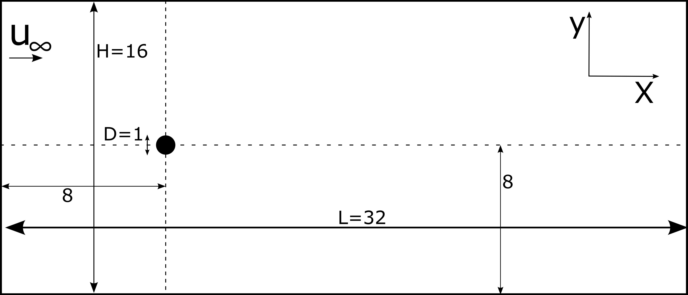
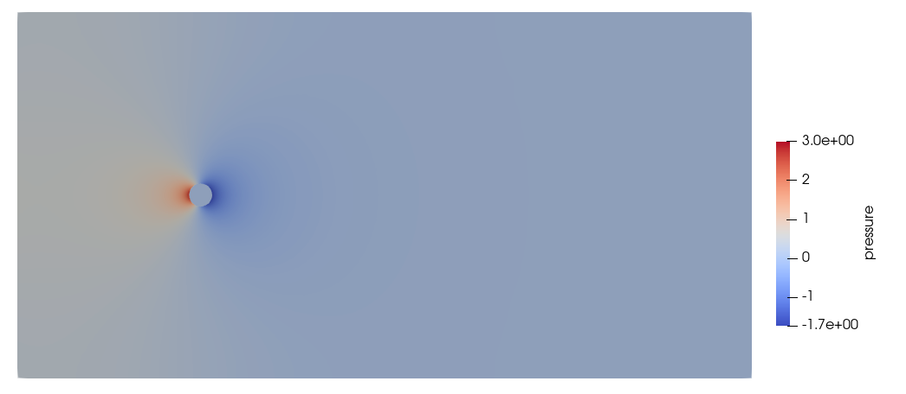

==============================================================================
Flow around a cylinder using the sharp interface method
==============================================================================

In this example we study the flow around a static cylinder in 2D using the sharp-interface method to represent the cylinder. The geometry of the flow takes the same basic case defined in 
`Example 3 <../../incompressible-flow/2d-flow-around-cylinder/2d-flow-around-cylinder.html>`_. As such we use the parameter file associated with `Example 3 <../../incompressible-flow/2d-flow-around-cylinder/2d-flow-around-cylinder.html>`_ as the base for this exemple. The exact dimensions for this example can be found in the following figure. 

This case use a cartesian structuresd rectangular mesh and we define the position and radius of the immersed boundary.
    
The mesh is defined with the following parameter.

.. code-block:: text

	#---------------------------------------------------
	# Mesh
	#---------------------------------------------------
	subsection mesh
	    set type                 = dealii
	    set grid type            = subdivided_hyper_rectangle
	    set grid arguments       = 2,1: 0,0 : 32 , 16  : true
	    set initial refinement   = 6
	end
	
As for the `Example 3 <../../incompressible-flow/2d-flow-around-cylinder/2d-flow-around-cylinder.html>`_ we define the boundary condition in order to have a inlet on the left and 2 slip boundary condition on the top and bottom and an outlet on the right of the domain.

.. code-block:: text

	# --------------------------------------------------
	# Boundary Conditions
	#---------------------------------------------------

	subsection boundary conditions
	set number                  = 3
	   
	    subsection bc 0
	set id = 0
		set type              = function
		subsection u
		    set Function expression = 1
		end
		subsection v
		    set Function expression = 0
		end
		subsection w
		    set Function expression = 0
		end
	    end
	    subsection bc 1
	set id = 2
		set type              = slip
	    end
	    subsection bc 2
	set id = 3
		set type              = slip
	    end
	end
	
The only thing that is left to define is the immersed boundary. At this point the immersed boundary tool only allow the representation of spherical objects. This mean the immersed boundary can represent a infinitely tine cylinder in 2D and a spherical shell in 3d. We refer to the parameter definition of the immersed boundary in `this <../../../parameters/resolved_cfd-dem/resolved_cfd-dem.html>`_ section of the documentation.

In this case we want to define a cylindrical boundary of radius 0.5 center at (8,8) that have no velocity.

.. code-block:: text

	# --------------------------------------------------
	# IB particules
	#---------------------------------------------------
		subsection particles
			set number of particles = 1
			set stencil order = 2
			set refine mesh inside radius factor = 0.8
			set refine mesh outside radius factor = 1.2
			set initial refinement = 4
			set integrate motion = false
			set assemble Navier-Stokes inside particles = false
		    subsection particle info 0 
			subsection position
			    set Function expression =8;8
			end
			subsection velocity
			    set Function expression =0;0
			end
			    set radius = 0.5
		    end
		end

* The ``number of particles`` is set to one as we only want one cylinder.

* The ``stencil order`` is set to 2 as this results is the highiest order we can use and it won't lead to Runge instability.

* The ``refine mesh inside radius factor`` is set to 0.8. This will create a mesh refinement around the particle that avoid having hangning node use in the calculation and help having a fine enough mesh around the particle.

* The ``refine mesh outside radius factor`` is set to 1.2 This will create a mesh refinement around the particle that avoid having hangning node use in the calculation and help having a fine enough mesh around the particle.

* The ``initial refinement`` is set to 4. This means that the cell that have at least one vertex in the refinement zone around the particle will be refined 4 times.

* The ``integrate motion`` is set to false because we are not interested in the dynamic of the particle  as this is a steady case.

* The ``assemble Navier-Stokes inside particles`` is set to false because we are not interested in the flow dynamic inside of the particle.

* The ``position`` Function expression is set to 8;8 as the position of the particle is constant in time and the center of the particle is at this position. 

* The ``velocity`` Function expression is set to 0;0 as the velocity of the particle is 0 and the case is steady. 

All the other parameter have been set to there default value as they don't play a role in this case.

This lead to the following solution for the velocity and pressure field. 

Velocity:
 
.. image:: images/exemple10_velocite.png
    :alt: Simulation schematic
    :align: center

Pressure: 

