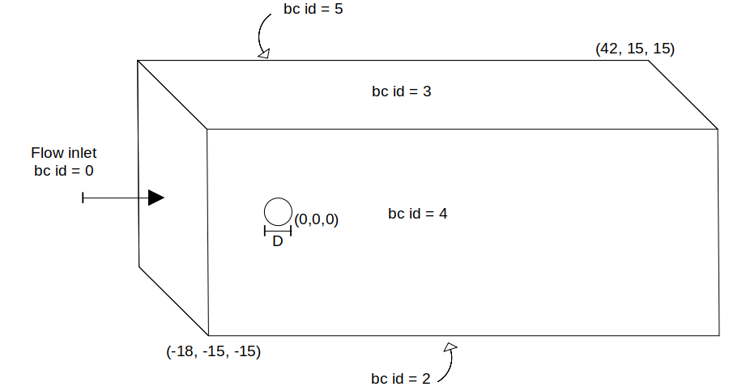

================================
Non-Newtonian flow past a sphere
================================

This example showcases a laminar non-Newtonian flow around a sphere, with an *a priori* Reynolds number Re = 50, using the Carreau rheological model.

Features
----------------------------------
- Solvers: ``gls_sharp_navier_stokes_3d`` (with Q1-Q1) 
- Steady-state problem
- Non-Newtonian behavior
- Ramping initial condition
- Displays the use of non-uniform mesh adaptation 

Location of the example
------------------------

- Parameter file: ``/examples/resolved_cfd-dem/sphere_carreau_with_sharp_inferface/sphere_carreau_with_sharp_inferface.prm``

Description of the case
-----------------------

In this example, we study the flow around a static sphere using the sharp-interface method to represent the sphere. The geometry of the flow is the following, with a particle of diameter D = 1.0 located at (0,0,0)
and the flow domain located between (-18,-15,-15) and (42,15,15).

Parameter file
-----------------------

Mesh
~~~~~

The mesh is defined using the following subsection.

.. code-block:: text
	
	subsection mesh
		set type                 = dealii
		set grid type            = subdivided_hyper_rectangle
		set grid arguments       = 2,1,1 : -18,-15,-15 : 42,15,15 : true
		set initial refinement   = 4
	end
	
Using an ``initial refinement`` of 4, the initial size of the cubic cells is 1.875. Since the particle size is small in regards to the mesh size, a refinement zone is generated around the particle to better capture it (See :doc:`../../../parameters/cfd/box_refinement`).

.. code-block:: text

	subsection  box refinement
		set initial refinement   = 3
		subsection mesh
		set type                 = dealii
		set grid type            = subdivided_hyper_rectangle
		set grid arguments       = 1,1,1: -2,-2,-2 : 6,2,2 : true
		set initial refinement   = 0
		end
	end

Boundary conditions
~~~~~~~~~~~~~~~~~~~~
We define the boundary conditions in order to have an inlet velocity of 1 m/s on the left, ``slip`` boundary conditions parallel to the flow direction, and an outlet on the right of the domain.

.. code-block:: text

	subsection boundary conditions
		set number                  = 5
		subsection bc 0
			set id 		= 0
			set type    = function
			subsection u
				set Function expression = 1
			end
			subsection v
				set Function expression = 0
			end
			subsection w
				set Function expression = 0
			end
		end
		subsection bc 1
			set id 		= 2
			set type    = slip
		end    
		subsection bc 2
			set id 		= 3
			set type    = slip
		end
		subsection bc 3
			set id 		= 4
			set type    = slip
		end
		subsection bc 4
			set id 		= 5
			set type    = slip
		end
	end

Physical properties
~~~~~~~~~~~~~~~~~~~~

This example showcases a shear-thinning flow, for which the viscosity decreases when the local shear rate increases. The Carreau model is being used. For more information on rheological models, see :doc:`../../../parameters/cfd/physical_properties`

.. code-block:: text

	subsection physical properties
		set number of fluids = 1
		subsection fluid 0
			set rheological model	= carreau
			subsection non newtonian
				subsection carreau
					set viscosity_0    	= 0.063403
					set viscosity_inf  	= 0
					set lambda	   		= 10
					set a	           	= 2.0
					set n 		   		= 0.5
				end
			end
		end
	end

The initial condition has been modified compared to the initial solution proposed in :doc:`../../incompressible-flow/2d-flow-around-cylinder/2d-flow-around-cylinder`. We use the following initial condition to ensure that the particle's boundary condition is satisfied.

.. code-block:: text

	#---------------------------------------------------
	# Initial condition
	#---------------------------------------------------
	subsection initial conditions
	    set type = nodal
	    subsection uvwp
		    set Function expression = 0; 0; 0
	    end
	end
	
The only thing that is left to define is the immersed boundary.
.. note:: text

	At this point, the immersed boundary tool only allows the representation of spherical objects. This means the immersed boundary can represent a circle in 2D and a spherical shell in 3d. We refer to the parameter definition of the immersed boundary in :doc:`../../../parameters/resolved_cfd-dem/resolved_cfd-dem` section of the documentation.

In this case, we want to define a circular boundary of radius 0.5 center at (8,8) that has no velocity.

.. code-block:: text

	# --------------------------------------------------
	# IB particules
	#---------------------------------------------------
        subsection particles
                set number of particles = 1
                set stencil order = 2
                set refine mesh inside radius factor = 0.8
                set refine mesh outside radius factor = 1.2
                set initial refinement = 0
                set integrate motion = false
                set assemble Navier-Stokes inside particles = false
            subsection particle info 0
                subsection position
                    set Function expression =8;8
                end
                subsection velocity
                    set Function expression =0;0
                end
                    set radius = 0.5
            end
        end

* The ``number of particles`` is set to one as we only want one particle.

* The ``stencil order`` is set to 2 as this is the highest order that is compatible with the FEM scheme and it does not lead to Runge instability. The highest order of stencil compatible with a FEM scheme is defined by the polynomial order of the scheme time the number of dimensions. In this case 2.

* The ``refine mesh inside radius factor`` is set to 0.8. This will create a mesh refinement around the particle that avoids having hanging nodes in the calculation and help ensure an adequately fine mesh around the particle.

* The ``refine mesh outside radius factor`` is set to 1.2. This will create a mesh refinement around the particle that avoids having hanging nodes in the calculation and help ensure an adequately fine mesh around the particle.

* The ``initial refinement`` is set to 0. In this case, the initial mesh is small enough to ensure that the mesh around the particle is sufficiently smaller than the particle. In this case, it is not necessary to pre-refine the mesh around the particle.

* The ``integrate motion`` is set to false because we are not interested in the dynamic of the particle as this is a steady case.

* The ``assemble Navier-Stokes inside particles`` is set to false because we are not interested in the flow inside of the particle.

* The ``position`` Function expression is set to 8;8 as the position of the particle is constant in time, and the center of the particle is at this position. 

* The ``velocity`` Function expression is set to 0;0 as the velocity of the particle is 0 and the case is steady. 

All the other parameters have been set to their default values since they do not play a role in this case.

Results
---------------
The simulation of this case results in the following solution for the velocity and pressure field. 

We get the following force applied on the particle for each of the mesh refinements, which is similar to the one obtained with a conformal mesh in :doc:`../../incompressible-flow/2d-flow-around-cylinder/2d-flow-around-cylinder`. With the conformal mesh drag force applied to the particle is 7.123. The difference between the 2 can mostly be attributed to the discretization error.

.. code-block:: text

    particle_ID    T_z      f_x       f_y    
          0 -0.033177 5.698080  0.016542 
          0 -0.006670 6.438133  0.004265 
          0 -0.000349 6.773126 -0.000063 
          0  0.000040 6.905268 -0.000170 
          0 -0.000014 6.962307  0.000057 
          
.. note:: 
	The drag coefficient obtained in this case is higher than the drag coefficient for a cylinder at a Reynolds number of 1 as the size of the domain is not large enough relative to the diameter of the cylinder. The flow around the cylinder is then constrained by the lateral boundaries, and this incrases the drag coefficient.
	
	
	
