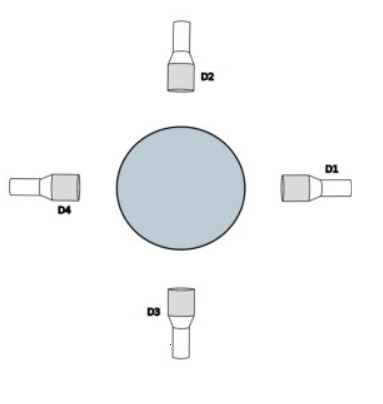
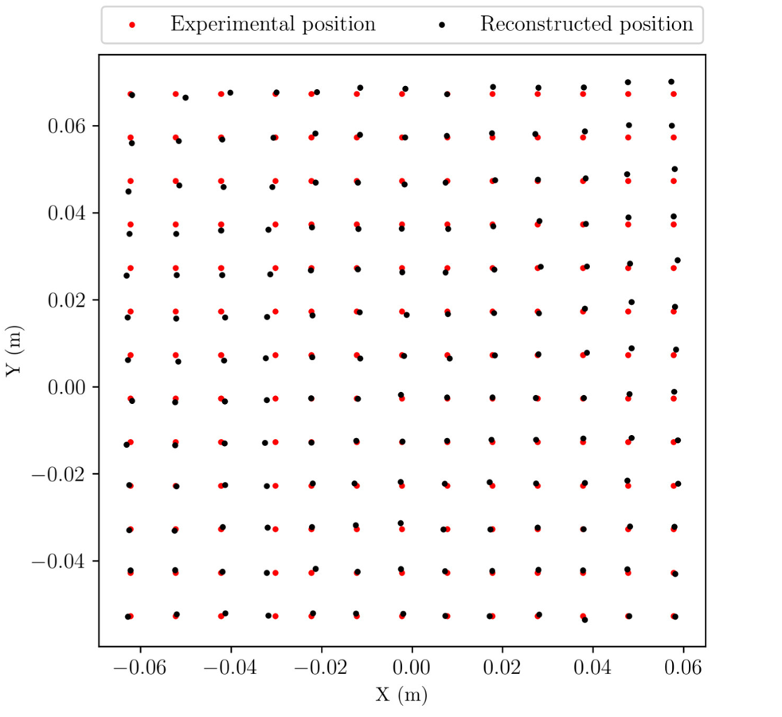

==================================================
Particle FEM reconstruction
==================================================
In this example, we use the inverse of Finite Element Method (FEM) to reconstruct positions from a radioactive particle tracking experiment.
The calculation is performed for a given set of positions inside a square.

Features
----------------------------------
- Solver: ``rpt_l2_projection_3d``
- Solver: ``rpt_fem_reconstruction_3d``
- Displays the use of the inverse FEM in reconstruction of the radioactive particle positions

Files used in this example
---------------------------
- Parameter file: ``examples/rpt/particle-fem-reconstruction/rpt-fem-reconstruction.prm``
- File containing detectors positions: ``examples/rpt/particle-fem-reconstruction/positions.detector``
- File containing the experimental counts: ``examples/rpt/particle-fem-reconstruction/experimental-counts.txt``
- File containing the real particle positions: ``examples/rpt/particle-fem-reconstruction/real-positions.txt``

Description of the case
-------------------------
The purpose of the Finite Element Method based Position Reconstruction (FEM-PR) is to filter the noise resulting from the Monte Carlo model by using an
orthogonal projection of the Monte Carlo model onto the domain. Then, the algorithm searches through the cells and it
minimizes the least-squares error between the photon count obtained from the FEM interpolation and the experimental count for all the detectors in each cell.
The 3D domain is discretized using linear tetrahedral elements and an approximation of the physical values inside an element can be written in terms of shape functions and natural
coordinates as:

.. math::
    \varphi_{x,y,z}=\Sigma^{n}_{i=1}N_{i\varphi_i}

where :math:`\varphi` is a continuous physical value, :math:`\varphi_{x,y,z}` is the value at the global coordinate point :math:`(x,y,z)`, :math:`\varphi_i` are the values at the nodes of the element and :math:`n` is the number of nodes of the element (:math:`n=4` for a linear tetrahedral element), and :math:`N_i` are the shape functions defined as follows :

.. math::
    N_1=1-\eta-\xi-\zeta,\,\,\, N_2=\eta, \,\,\, N_3=\xi, \,\,\, N_4= \zeta

Therefore, the isoparametric approximation combined with a search algorithm can calculate the tracer’s position using a set of photon
counts received at each detector. The search algorithm goes through each cell inside the domain and solves a
least-squares cost-function defined as:

.. math::
    F=\sum_{i=1}^{N_D} (C^{i}_{num}-C^{i}_{exp})^2

where :math:`C_{num}` and :math:`C_{exp}` are the numerical and experimental counts, respectively, :math:`N_{D}` is the number of detectors, and :math:`i` is the number associated with the detector. The main search hypothesis is that the tracer is located inside the search element.

This example shows how using the tuned parameters of each detector we generate the dictionary for the corresponding geometry
(shown in the illustration below) and then we reconstruct the positions of radioactive particle based on the received photon counts by the detectors.

Parameter file
----------------
RPT parameters
^^^^^^^^^^^^^^^^

As seen in the previous examples (:doc:`../photon-count-calculation-in-a-cylindrical-vessel/photon-count-calculation-in-a-cylindrical-vessel` and :doc:`../tuning-parameters-with-nomad/tuning-parameters-with-nomad`), in the subsection ``rpt parameters``, we define the values of the set of parameter necessary for calculating the counts using the Monte Carlo method. These common parameters used for the RPT simulation are described in the :doc:`../../../parameters/rpt/rpt_parameters` documentation page.

.. code-block:: text

    # --------------------------------------------------
    # RPT Monte Carlo technique
    #---------------------------------------------------

    subsection rpt parameters
        set verbosity                        = quiet
        set monte carlo iteration            = 10000
        set random number seed               = 0
        set reactor height                   = 0.1
        set reactor radius                   = 0.15
        set peak-to-total ratio              = 0.4
        set sampling time                    = 0.01
        set gamma-rays emitted               = 2
        set attenuation coefficient detector = 21.477
    end

Detector parameters
^^^^^^^^^^^^^^^^^^^^

In the subsection ``detector parameters``, we specify the file that contains the position of the detectors' face center and the position of a point inside the detectors on their axis. The detector parameters are described in the :doc:`../../../parameters/rpt/detector_parameters` documentation page.

.. code-block:: text

    #---------------------------------------------------
    # Detector parameters
    #---------------------------------------------------

    subsection detector parameters
      set detector positions file         = positions.detector
      set radius                          = 0.0381
      set length                          = 0.0762
      set dead time                       = 7.6215e-06,1.27187e-05,7.94972e-06,1.0988e-05
      set activity                        = 6.01924e+06,7.09549e+06,7.24499e+06,7.75147e+06
      set attenuation coefficient reactor = 0,0.50377,0,0.95902
    end

FEM reconstruction parameters
^^^^^^^^^^^^^^^^^^^^^^^^^^^^^^

In the subsection ``FEM reconstruction parameters``, we specify the file that contains the experimental counts and the export file for the reconstructed positions. Parameters used for the FEM reconstruction are described in the :doc:`../../../parameters/rpt/fem_reconstruction` documentation page.

.. code-block:: text

    #---------------------------------------------------
    # FEM reconstruction parameters
    #---------------------------------------------------

    subsection fem reconstruction
      set mesh type                = dealii
      set z subdivisions           = 2
      set mesh refinement          = 2
      set experimental counts file = experimental-counts.txt
      set export positions file    = found_positions
     set cost function type       = relative
      set dof handler file         = temp_dof_handler.dof
      set nodal counts file        = temp_nodal_counts_detector00.counts, temp_nodal_counts_detector01.counts, temp_nodal_counts_detector02.counts, temp_nodal_counts_detector03.counts
    end

Running the simulation
----------------------------------
Assuming that ``rpt_l2_projection_3d`` and ``rpt_fem_reconstruction_3d`` executables are within your path, you can start launching FEM-PR by typing :

.. code-block:: text

    rpt_l2_projection_3d rpt-fem-reconstruction.prm

This step uses the L2 projection technique to smooth the noise of the Monte Carlo method and calculates the photon counts at the nodes. After this part is done, the program generates the file of nodal counts from each detector as such : ``temp_nodal_counts_detector00.counts``. The next step is to launch the position reconstruction as follows:

.. code-block:: text

	rpt_fem_reconstruction_3d rpt-fem-reconstruction.prm

Results
--------
With the figure shown below we assess the validity of the reconstruction algorithm with a reconstruction of a set of experimental points. It shows the real positions of the particle and the reconstructed positions.

References
-----------

`[1] <https://doi.org/10.1016/j.nima.2023.168504>`_  Mirakhori, G., Collard-Daigneault, A., Alphonius, A., Doucet, J., Blais, B., & Chaouki, J. (2023a). An improved position reconstruction method for radioactive particle tracking. *Nuclear Instruments and Methods in Physics Research*. 168504. 
