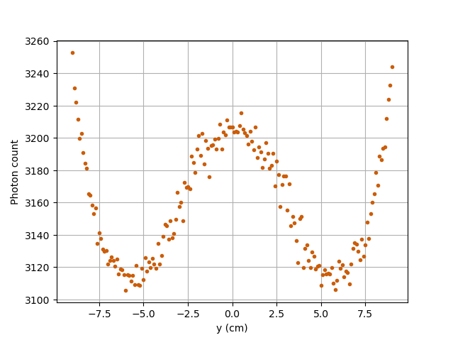

==================================================
Photon Count Calculation in a Cylindrical Vessel
==================================================

.. role:: raw-html(raw)
    :format: html

In this example, using a Monte-Carlo technique, we perform the calculation of photon counts of a single radioactive particle that emits :math:`\gamma`-ray. The calculation is performed for a given set of positions inside a cylindrical vessel. The Monte-Carlo method allows us to estimate the photon counts of a particle at a given position inside the vessel with respect to a given detector. 

:raw-html:` `

Features
----------------------------------
- Solver: ``rpt_3d``
- Display the use of the Monte Carlo method in the calculation of photon count

:raw-html:` `

Locations of files used in the example
---------------------------------------
- Parameter file: ``examples/rpt/count_calculation/rpt_count_calculation.prm``
- File containing detector positions: ``examples/rpt/count_calculation/positions.detector``
- File containing particle positions on the x-axis:  ``examples/rpt/count_calculation/positions_horizontalx.particle``
- File containing particle positions on the y-axis:  ``examples/rpt/count_calculation/positions_horizontaly.particle``
- File containing particle positions on a vertical line:  ``examples/rpt/count_calculation/positions_vertical.particle``
- File containing particle positions on a diagonal line cutting across the vessel:  ``examples/rpt/count_calculation/positions_diagonal.particle``

:raw-html:` `

Description of the case
-------------------------
In this example, four different sets of particle positions are studied for a given detector position. The four different scenarios studied in this example are :

1. Horizontal translation of a particle along the x-axis
2. Horizontal translation of a particle along the y-axis
3. Vertical translation of a particle 
4. Particle going across the vessel on a diagonal line

The illustration below depicts the geometry of the vessel, the detector and the particle positioning for each scenario:

.. image:: images/scenarios.png
    :alt: Scenarios
    :align: center
    :name: geometry_description

:raw-html:` `

As a particle travels in the cylindrical vessel, its photon count (:math:`C`) measured by the detector varies according to the following relation:

.. math::
    C = \frac{T \nu R \phi \xi_i (\vec{X})}{1 + \tau \nu R \phi \xi_i (\vec{X})}
		
where, 

- :math:`T` is the sampling time (:math:`s`);
- :math:`\nu` is the number of :math:`\gamma`-rays emmited by each disintegration;
- :math:`R` is the activity of the tracer (:math:`Beq`);
- :math:`\phi` is the peak-to-total ratio;
- :math:`\tau` is the dead time of the detector (:math:`s`);
- :math:`\vec{X}` is the tracer particle's position, and 
- :math:`\xi_i(\vec{X})` is the efficiency of the :math:`i_{th}` detector related to the position :math:`\vec{X}`.

:raw-html:` `

The efficiency of the detector may be expressed by means of the following equation:

.. math::
	
    \xi_i (\vec{X}) = \oiint_{\Omega } \frac{\vec{r}\cdot d\overrightarrow{A}}{\left \| \vec{r} \right \|^{3}}f_{a}(\alpha ,\theta )f_{d}(\alpha ,\theta )
	
where, 

- :math:`\vec{r}` is a vector going from the position of the tracer particle (:math:`\vec{X}`) to a variable point (:math:`\vec{P}`) on the exposed surface of the detector;
- :math:`d\vec{A}` is the external surface vector normal to the surface at the contact point on the detector's crystal;
- :math:`f_a(\alpha, \theta)` is the probability function of hte non-interaction between the :math:`\gamma`-rays emitted whithin :math:`\Omega` and the material inside the vessel, and
- :math:`f_d(\alpha, \theta)` is the probability function of the interaction of the :math:`\gamma`-rays with the detector. 

Using the Monte Carlo algorithm, we approximate the previous surface integral by randomly selecting several thousands of photon path directions.
Thus, the efficiency of the :math:`i_{th}` detector is calculated as follows :

.. math::

    \xi_i (\vec{X}) = \frac{1}{N} \sum_{j=1}^{N} \omega(\alpha) \omega(\theta) f_a(\alpha_j, \theta_j) f_d(\alpha_j, \theta_j)

where,

- :math:`N` is the number of randomly generated photons;
- :math:`\alpha_j` and :math:`\theta_j` are randomly generated angles that describe the direction of a ray emitted by a tracer particle;
- :math:`\omega(\alpha)` is the weighting factor associated with the angle :math:`\alpha`, and
- :math:`\omega(\theta)` is the weighting factor associated with the angle :math:`\theta`.

:raw-html:` `

Parameter file
----------------

RPT Parameters
~~~~~~~~~~~~~~~

In the subsection *rpt parameters*, we define the values of the set of parameters that is necessary for the calculation of the counts using the Monte Carlo method.  Among these parameters, we have, the name of the file in which is found a set of different positions of the particle inside the vessel (``particle position file``), the number of Monte Carlo iterations (``monte carlo iteration``), the seed that is used to generate a random number (``random number seed``) and other parameters that describe the studied :math:`gamma`-ray model. We also define the name of the file in which the counts for each position will be exported with the parameter ``counts file``. These common parameters used for the RPT simulation are described in the `RPT parameters <../../../parameters/rpt/rpt_parameters.html>`_ documentation page.

.. code-block:: text

    # --------------------------------------------------
    # RPT Monte Carlo technique
    #---------------------------------------------------
    subsection rpt parameters
        set particle positions file           = positions_horizontalx.particle
        set verbosity                         = verbose
        set export counts                     = true
        set counts file                       = counts_horizontalx.csv
        set monte carlo iteration             = 100000
        set random number seed                = 0
        set reactor height                    = 0.3
        set reactor radius                    = 0.1
        set peak-to-total ratio               = 0.4
        set sampling time                     = 1
        set gamma-rays emitted                = 2
        set attenuation coefficient detector  = 21.477
    end

Detector Parameters
~~~~~~~~~~~~~~~~~~~~

In the subsection *detector parameters*, we specify the file that contains two positions located on the axis of symmetry of the detector. The first point is on the surface facing the vessel (face of the detector), and the second point can be any point located inside the detector. In the current example, the center position of the face is :math:`(0.200, 0, 0.075)`, and the second point on the axis is :math:`(0.238, 0, 0.075)`. We also specify the radius (``radius``) and the length (``length``) of the detector. A detailed description of these parameters can be found in the `Detector Parameters <../../../parameters/rpt/detector_parameters.html>`_ documentation page.

.. code-block:: text

    #---------------------------------------------------
    # Detector parameters
    #---------------------------------------------------
    subsection detector parameters
        set detector positions file         = positions.detector
        set radius                          = 0.0381
        set length                          = 0.0762
        set dead time                       = 1e-5
        set activity                        = 2e6
        set attenuation coefficient reactor = 10
    end

.. note::
    The parameters ``dead time``, ``activity`` and ``attenuation coefficient reactor`` are obtained using the blackbox optimization software `NOMAD <https://www.gerad.ca/en/software/nomad/>`_ . The second example `Tuning Parameters with NOMAD <../tuning-parameters-with-nomad/tuning-parameters-with-nomad.html>`_ explains how we can obtain the values of these parameters using NOMAD.
	
	
:raw-html:` `

Running the simulation
----------------------------------
Launching the simulation is as simple as specifying the executable name and the parameter file. Assuming that the ``rpt_3d`` executable is within your path, the simulation can be launched by typing:

.. code-block:: text

    rpt_3d rpt_count_calculation.prm
  
Lethe will generate a ``.csv`` file with the name specified next to the ``counts file`` parameter in ``rpt_count_calculation.prm``. The generated ``.csv`` file will contain the :math:`(x,y,z)` coordinates of the particle with its respective photon count measured by a given detector. Each detector is identified by its id number (``detector_id``). In this example, as we have only one detector, all values in the ``detector_id`` column should be :math:`0`.

.. attention::
    When running the code with different particle position files, don't forget to change the name of the exporting ``counts file`` in ``rpt_count_calculation.prm`` so that the previous ``.csv`` isn't overwritten.

:raw-html:` `

Results
--------
To visualize the data and obtain the figures shown below, a python script (``rpt_count_calculation_plot.py``) is provided. When running the script, the name of the ``.csv`` file that you wish to open and read must be specified as an argument.

Scenario 1: Horizontal translation of a particle along the x-axis 
~~~~~~~~~~~~~~~~~~~~~~~~~~~~~~~~~~~~~~~~~~~~~~~~~~~~~~~~~~~~~~~~~~
.. image:: images/result_1.png
    :alt: Scenario 1 results
    :align: center
    :name: Results of the 1st scenario

In the figure shown above, as one would expect, as the particle approaches the detector, the photon count grows. Such evolution may be explained by the efficiency of the detector getting greater as the particle advances toward the detector's exposed surface. Since the photon's path length in the vessel decreases, :math:`f_a(\alpha, \theta)` increases and therefore the efficiency gets greater.

Scenario 2: Horizontal translation of a particle along the y-axis 
~~~~~~~~~~~~~~~~~~~~~~~~~~~~~~~~~~~~~~~~~~~~~~~~~~~~~~~~~~~~~~~~~~

	
The figure shown above illustrates the photon count of the particle as it travels from back to front of the vessel on the y-axis. First, a symmetry of photon counts from the center axis of the detector can be seen. Such symmetry should be expected since the detector is symmetrical from its center axis. Secondly, we can notice that the variation in photon count as the particle travel is quite small. The difference between its maximal and minimal values is approximately :math:`147`, which is one order of magnitude smaller than the other scenarios. This may mainly be explained by the small variations in the distance between the particle and the detector's exposed surface. Lastly, as the particle passes in front of the detector, we notice fluctuations in the photon count. Starting from the back of the vessel, the photon count decreases rapidly until a local minimal value at approximately :math:`y = -6` cm and then increases until a local maximum at :math:`y = 0` cm (center of the detector's face). Then, from the center to the front of the vessel, a mirrored image of the photon count's evolution can be seen. Let's focus on the first half of the studied set of positions. When :math:`y \in ]-10, -7.5[` cm, the particle can see both the lateral side of the detector and its face. Hence, the photon count is greater near :math:`y = -10` cm and decreases as it approaches :math:`y = -7.5` cm. Between :math:`y = -7.5` cm and :math:`y = 0` cm, the particle may only see the face of the detector. However, depending on the distance from the center of the face, the photon's path length in the vessel varies and so do the viewing angles' maximal and minimal values. Therefore, the photon's path length in the detector varies. When the path length in the detector decreases, :math:`f_d(\alpha, \theta)` decreases making the efficiency of the detector decrease. Decreasing the efficiency leads to a decrease in the photon count. To summarize, the combination of the variation of the path lengths of the photon in the vessel and in the detector explains the fluctuation of the photon count as the particle travel in the vessel.

Scenario 3: Vertical translation of a particle 
~~~~~~~~~~~~~~~~~~~~~~~~~~~~~~~~~~~~~~~~~~~~~~~~~
.. image:: images/result_3.png
    :alt: Scenario 3 results
    :align: center
    :name: Results of the 3rd scenario
	
Similar to the first scenario, as the particle approaches the detector, we notice an increase in photon count. The photon count reaches its maximal value at around :math:`z = 7` cm, which is close to the center of the detector's face.

Scenario 4: Particle going across the vessel on a diagonal line
~~~~~~~~~~~~~~~~~~~~~~~~~~~~~~~~~~~~~~~~~~~~~~~~~~~~~~~~~~~~~~~~~
.. image:: images/result_4.png
	:alt: Scenario 4 results
	:align: center
	:name: Results of the 4th scenario
	
After analyzing the past three scenarios, we get much-expected results for this scenario. As seen in the first scenario, the photon count varies greatly with the :math:`x` coordinate of the position vector of the particle. That is because the path of the photon inside the vessel gets longer when :math:`x` gets smaller. In other words, the ray is more attenuated by the material inside the vessel before getting to the detector, therefore the photon count gets smaller. Consequently, even though the particle is further away from the detector, if the :math:`x` coordinate of the tracer's position is closer to the detector's exposed surface, the photon count gets greater. 

:raw-html:` `

References
-----------
[1] Larachi F., Kennedy G., & Chaouki J., (1994). A γ-ray detection system for 3-D particle tracking in multiphase reactors. *Nuclear Instruments and Methods in Physics Research Section A: Accelerators, Spectrometers, Detectors and Associated Equipment*. *338* (2), 568-576. https://doi.org/10.1016/0168-9002(94)91343-9
