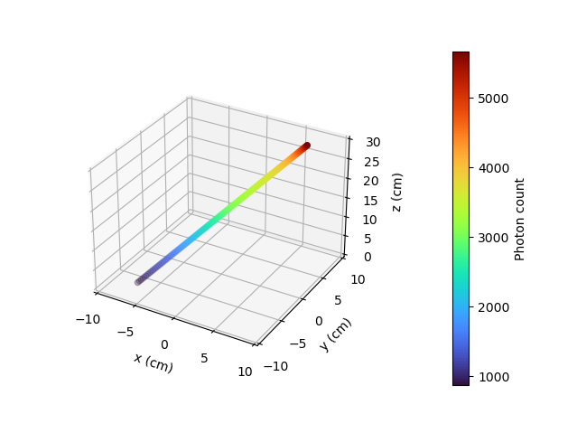

.. role:: raw-html(raw)
    :format: html

==================================================
Photon Count Calculation in a Cylindrical Vessel
==================================================

In this example, using a Monte Carlo technique, we perform the calculation of photon counts of a single radioactive particle that emits :math:`\gamma`-ray. The calculation is performed for a given set of positions inside a cylindrical vessel. The Monte Carlo method allows us to estimate the photon counts of a particle at a given position inside the vessel with respect to a given detector.

:raw-html:` `

Features
----------------------------------
- Solver: ``rpt_3d``
- Displays the use of the Monte Carlo method in the calculation of photon count

:raw-html:` `

Locations of files used in the example
---------------------------------------
- Parameter file: ``examples/rpt/count_calculation/rpt_count_calculation.prm``
- File containing detector positions: ``examples/rpt/count_calculation/positions.detector``
- File containing particle positions for the first scenario:  ``examples/rpt/count_calculation/positions_horizontalx.particle``
- File containing particle positions for the second scenario  ``examples/rpt/count_calculation/positions_horizontaly.particle``
- File containing particle positions for the third scenario:  ``examples/rpt/count_calculation/positions_vertical.particle``
- File containing particle positions for the fourth scenario:  ``examples/rpt/count_calculation/positions_diagonal.particle``

:raw-html:` `

Description of the case
-------------------------
In this example, four different sets of particle positions are studied for a given detector position. The four different scenarios studied in this example are :

1. Horizontal translation of a particle along the x-axis
2. Horizontal translation of a particle along the y-axis
3. Vertical translation of a particle 
4. Particle going across the vessel on a diagonal line

The illustration below depicts the geometry of the vessel, the detector, and the particle positioning for each scenario:

.. image:: images/scenarios.png
    :alt: Scenarios
    :align: center
    :name: geometry_description

:raw-html:` `

As a particle travels in the cylindrical vessel, its photon count (:math:`C`) measured by the detector varies according to the following relation:

.. math::
    C = \frac{T \nu R \phi \xi_i (\vec{X})}{1 + \tau \nu R \phi \xi_i (\vec{X})}
		
where

- :math:`T` is the sampling time (:math:`s`);
- :math:`\nu` is the number of :math:`\gamma`-rays emitted by each disintegration;
- :math:`R` is the activity of the tracer (:math:`Beq`);
- :math:`\phi` is the peak-to-total ratio;
- :math:`\tau` is the dead time of the detector (:math:`s`);
- :math:`\vec{X}` is the tracer particle's position, and

- :math:`\xi_i(\vec{X})` is the efficiency of the :math:`i_{th}` detector related to the position :math:`\vec{X}`.

:raw-html:` `

The efficiency of the detector may be expressed by means of the following equation:

.. math::
	
    \xi_i (\vec{X}) = \oiint_{\Omega } \frac{\vec{r}\cdot d\overrightarrow{A}}{\left \| \vec{r} \right \|^{3}}f_{a}(\alpha ,\theta )f_{d}(\alpha ,\theta )
	

where

- :math:`\vec{r}` is a vector going from the position of the tracer particle (:math:`\vec{X}`) to a variable point (:math:`\vec{P}`) on the exposed surface of the detector;
- :math:`d\vec{A}` is the external surface vector normal to the surface at the contact point on the detector's crystal;
- :math:`f_a(\alpha, \theta)` is the probability function of the non-interaction between the :math:`\gamma`-rays emitted within :math:`\Omega` and the material inside the vessel, and
- :math:`f_d(\alpha, \theta)` is the probability function of the interaction of the :math:`\gamma`-rays with the detector. 

The two last functions may be re-written the following way :

.. math::

    f_a(\alpha, \theta) = exp\{-\mu_r \ e(\alpha, \theta)\}

where :math:`\mu_r` is the reactor's attenuation coefficient and :math:`e(\alpha, \theta)` is the length of the path traveled by the photon inside the reactor.

And

.. math::

    f_d(\alpha, \theta) = 1 - exp\{ -\mu_d \ d(\alpha,\theta)\}

where :math:`\mu_d` is the detector's attenuation coefficient and :math:`d(\alpha,\theta)` is the length of the path traveled by the photon inside the detector.

:raw-html:` `

Using the Monte Carlo algorithm, we approximate the previous surface integral by randomly selecting several thousands of photon path directions.
Thus, the efficiency of the :math:`i_{th}` detector is calculated as follows :

.. math::

    \xi_i (\vec{X}) = \frac{1}{N} \sum_{j=1}^{N} \omega(\alpha) \omega(\theta) f_a(\alpha_j, \theta_j) f_d(\alpha_j, \theta_j)

where

- :math:`N` is the number of randomly generated photons;
- :math:`\alpha_j` and :math:`\theta_j` are randomly generated angles that describe the direction of a ray emitted by a tracer particle;
- :math:`\omega(\alpha)` is the weighting factor associated with the angle :math:`\alpha`, and
- :math:`\omega(\theta)` is the weighting factor associated with the angle :math:`\theta`.

:raw-html:` `

Parameter file
----------------

RPT Parameters
~~~~~~~~~~~~~~~

In the subsection *rpt parameters*, we define the values of the set of parameters that is necessary for the calculation of the counts using the Monte Carlo method.  Among these parameters, we have, the name of the file in which is found a set of different positions of the particle inside the vessel (``particle position file``), the number of Monte Carlo iterations (``monte carlo iteration``), the seed that is used to generate a random number (``random number seed``) and other parameters that describe the studied :math:`\gamma`-ray model. We also define the name of the file in which the counts for each position will be exported with the parameter ``counts file``. These common parameters used for the RPT simulation are described in the `RPT parameters <../../../parameters/rpt/rpt_parameters.html>`_ documentation page.

.. code-block:: text

    # --------------------------------------------------
    # RPT Monte Carlo technique
    #---------------------------------------------------
    subsection rpt parameters
        set particle positions file           = positions_horizontalx.particle
        set verbosity                         = verbose
        set export counts                     = true
        set counts file                       = counts_horizontalx.csv
        set monte carlo iteration             = 100000
        set random number seed                = 0
        set reactor height                    = 0.3
        set reactor radius                    = 0.1
        set peak-to-total ratio               = 0.4
        set sampling time                     = 1
        set gamma-rays emitted                = 2
        set attenuation coefficient detector  = 21.477
    end

Detector Parameters
~~~~~~~~~~~~~~~~~~~~

In the subsection *detector parameters*, we specify the file that contains two positions located on the axis of symmetry of the detector. The first point is on the surface facing the vessel (face of the detector), and the second point can be any point located inside the detector. In the current example, the center position of the face is :math:`(0.200, 0, 0.075)`, and the second point on the axis is :math:`(0.238, 0, 0.075)`. We also specify the radius (``radius``) and the length (``length``) of the detector. A detailed description of these parameters can be found in the `Detector Parameters <../../../parameters/rpt/detector_parameters.html>`_ documentation page.

.. code-block:: text

    #---------------------------------------------------
    # Detector parameters
    #---------------------------------------------------
    subsection detector parameters
        set detector positions file         = positions.detector
        set radius                          = 0.0381
        set length                          = 0.0762
        set dead time                       = 1e-5
        set activity                        = 2e6
        set attenuation coefficient reactor = 10
    end

.. note::
    The parameters ``dead time``, ``activity`` and ``attenuation coefficient reactor`` are obtained using the blackbox optimization software `NOMAD <https://www.gerad.ca/en/software/nomad/>`_ . The second example `Tuning Parameters with NOMAD <../tuning-parameters-with-nomad/tuning-parameters-with-nomad.html>`_ explains how we can obtain the values of these parameters using NOMAD.
	

:raw-html:` `

Running the simulation
----------------------------------
Launching the simulation is as simple as specifying the executable name and the parameter file. Assuming that the ``rpt_3d`` executable is within your path, the simulation can be launched by typing:

.. code-block:: text

    rpt_3d rpt_count_calculation.prm
  
Lethe will generate a ``.csv`` file with the name specified next to the ``counts file`` parameter in ``rpt_count_calculation.prm``. The generated ``.csv`` file will contain the :math:`(x,y,z)` coordinates of the particle with its respective photon count measured by a given detector. Each detector is identified by its id number (``detector_id``). In this example, as we have only one detector, all values in the ``detector_id`` column should be :math:`0`.

.. attention::
    When running the code with different particle position files, don't forget to change the name of the exporting ``counts file`` in ``rpt_count_calculation.prm`` so that the previous ``.csv`` isn't overwritten.

:raw-html:` `

Results
--------
To visualize the data and obtain the figures shown below, a python script (``rpt_count_calculation_plot.py``) is provided. When running the script, the name of the ``.csv`` file that you wish to open and read must be specified as an argument.

Scenario 1: Horizontal translation of a particle along the x-axis 
~~~~~~~~~~~~~~~~~~~~~~~~~~~~~~~~~~~~~~~~~~~~~~~~~~~~~~~~~~~~~~~~~~
.. image:: images/result_1.png
    :alt: Scenario 1 results
    :align: center
    :name: Results of the 1st scenario

In the figure shown above, as one would expect, as the particle approaches the detector, the photon count grows. Such evolution may be explained by the efficiency of the detector getting greater as the particle advances toward the detector's exposed surface. Since the photon's path length in the vessel decreases, :math:`f_a(\alpha, \theta)` increases, and therefore the efficiency gets greater.

Scenario 2: Horizontal translation of a particle along the y-axis 
~~~~~~~~~~~~~~~~~~~~~~~~~~~~~~~~~~~~~~~~~~~~~~~~~~~~~~~~~~~~~~~~~~

.. figure:: images/result_2a.png
    :alt: Scenario 2 results when reactor attenuation coefficient is set at 10
    :align: center
    :name: Results of the 2nd scenario, case I

    Case I: :math:`\mu_r = 10, \ \mu_d = 21.477`

:raw-html:` `

The figure shown above illustrates the photon count of the particle as it travels from the back to the front of the vessel along the y-axis. The Case I figure shows the evolution of the photon count for the system we are currently studying (:math:`\mu_r = 10, \ \mu_d = 21.477`). Let's analyze the resulting plot.

First, a symmetry of photon counts from the center axis of the detector can be seen. Such symmetry should be expected since the detector is symmetrical from its center axis.

Secondly, we can notice that the variation in photon count as the particle travel is quite small. The difference between its maximal and minimal values is approximately :math:`147`, which is one order of magnitude smaller than the other scenarios. This may mainly be explained by the small variations in the distance between the particle and the detector's exposed surface. In other words, the lengths of the paths traveled by the photon in the vessel and in the detector vary less than in the other scenarios.

Lastly, as the particle passes in front of the detector, we notice fluctuations in the photon count. Starting from the back of the vessel, the photon count decreases rapidly until a local minimal value at approximately :math:`y = -6` cm and then increases until a local maximum at :math:`y = 0` cm (center of the detector's face). Then, from the center to the front of the vessel, a mirrored image of the photon count's evolution can be seen. To understand those fluctuations, let's look at three other figures (Case II, Case III, and Case IV) while focusing on the first half of the studied domain (:math:`y \in ]-10, 0]` cm) since the evolution of the count is symmetrical from :math:`y = 0` cm.

+---------------------------------------------------------------------------------------------------------------------------------------------------------------+
|  .. figure:: images/result_2b.png                                                                                                                             |
|    :alt: Scenario 2 results when the efficiency of the detector is the product of the weighting factors                                                       |
|    :align: center                                                                                                                                             |
|    :name: Results of the 2nd scenario, case II                                                                                                                |
|    :scale: 55%                                                                                                                                                |
|                                                                                                                                                               |
|    Case II: :math:`\mu_r = 0, \ \mu_d = 1e9`                                                                                                                  |
|                                                                                                                                                               |
|    :raw-html:` `                                                                                                                                         |
+-----------------------------------------------------------------------------+---------------------------------------------------------------------------------+
|  .. figure:: images/result_2c.png                                           | .. figure:: images/result_2d.png                                                |
|    :alt: Scenario 2 results when reactor attenuation coefficient is set at 0|     :alt: Scenario 2 results when detector attenuation coefficient is set at 1e9|
|    :align: center                                                           |     :align: center                                                              |
|    :name: Results of the 2nd scenario, case III                             |     :name: Results of the 2nd scenario, case IV                                 |
|                                                                             |                                                                                 |
|    Case III: :math:`\mu_r = 0, \ \mu_d = 21.477`                            |     Case IV: :math:`\mu_r = 10, \ \mu_d = 1e9`                                  |
|                                                                             |                                                                                 |
|    :raw-html:` `                                                       |     :raw-html:` `                                                          |
+-----------------------------------------------------------------------------+---------------------------------------------------------------------------------+

The Case II figure shows the evolution of the photon count in absence of attenuation due to the medium found inside the vessel and the vessel's wall, and in absence of variation of the interaction between the emitted :math:`\gamma`-ray and the detector. By setting :math:`\mu_r = 0`, we set :math:`f_a(\alpha_j, \theta_j) = 1`. Therefore, the path length traveled by the photon inside the vessel doesn't influence the efficiency anymore. As a consequence, the count also becomes independent of the path of the photon inside the vessel. In a similar manner, by setting :math:`\mu_d = 1e9`, we make :math:`f_d(\alpha_j, \theta_j)` tend to :math:`1`. Consequently, the path traveled by the photon in the detector doesn't affect the efficiency anymore. Only the weighting factors :math:`\omega(\alpha)` and :math:`\omega(\theta)` have an influence on the calculated efficiency and photon count (:math:`\xi_i \approx \omega(\alpha) \omega(\theta)`). Therefore, the Case II figure gives us an idea of how the photon count evolves according to the particle's position respective to the detector's position disregarding the interactions between the emitted ray and the medium inside the vessel and its walls, and disregarding the interactions between the ray and the detector.

The Case III figure depicts the evolution of the photon count in absence of the attenuation due to the medium found inside the vessel and the vessel's wall. Since we use the same set of positions in all cases, :math:`\omega(\alpha)` and :math:`\omega(\theta)` remain the same for each given position of the tracer particle. The length of the path traveled by the photon inside the detector should also be the same given the large number of Monte Carlo iterations. As seen on the Case III figure, when the particle is aligned with the symmetry axis of the detector, the photon count reaches a maximum. At that position, the evolution of the product :math:`\omega(\alpha) \cdot \omega(\theta)` seen on the Case II figure also reaches a maximum. Even though, the distance :math:`d(\alpha,\theta)` reaches a local minimum at that position, the variation in :math:`f_d(\alpha_j, \theta_j)` isn't important enough to affect the evolution of the efficiency. On the case III figure, we notice that the inflection point at :math:`y \approx -4,6` cm, seen on the Case II figure, is not present anymore. This means that when :math:`y \in ]-7.5, -4.6[` cm, the distance :math:`d(\alpha,\theta)` increases and when :math:`y \in ]-4.6, -2.5[` cm the  the distance :math:`d(\alpha,\theta)` decreases in such way that it counters the rapid increase in weighting factors giving the evolution of the photon count a more parabolic shape. Finally, when :math:`y \in ]-10, -7,5[` cm, in other words, when the particle sees both the face and the lateral sides of the detector, as the particle approaches the detector's face, the distance :math:`d(\alpha,\theta)` increases making the count increase.

The last case studied (Case IV) shows the evolution of the photon count when :math:`\mu_d` is so great that :math:`f_d(\alpha_j, \theta_j)` tends to :math:`1 \ \forall y \in ]-10, 10[` cm. By doing so, we can see the evolution of the count when the efficiency is independent of the interaction between the emitted :math:`\gamma`-ray and the detector. With this case, we isolate the effect of the evolution of :math:`f_a(\alpha, \theta)` on the count. More specifically, we're looking at the evolution of :math:`e(\alpha,\theta)` as the particle travels in the vessel. We notice that we have a local minimum at :math:`y \approx -4.6` near where we saw the inflection point on the Case II figure. Considering the Case II results, we can interpret the Case IV figure as follows. Starting from the back of the vessel, where :math:`f_a(\alpha, \theta)` is at its maximal value, :math:`f_a(\alpha, \theta)` decreases at a decreasing rate until reaching :math:`y = 0` cm. The maximal value of :math:`f_a(\alpha, \theta)` being when the particle is the furthest away from the detector may be explained by the curvature of the vessel's wall. Since the wall of the vessel is curved to form a circle, the distance traveled by the photon inside the vessel on the most probable path isn't necessarily larger than the radius of the reactor. We know that at :math:`y = 0`, :math:`e(\alpha,\theta) = 10` cm (radius of the reactor). We also know that an increasing distance :math:`e(\alpha,\theta)` leads to a decreasing efficiency, which means a decreasing count. Therefore, we may assume that :math:`e(\alpha,\theta)` is minimal when :math:`y \approx -10` cm or when :math:`y \approx 10` cm. And, it slowly increases until reaching :math:`e(\alpha,\theta) = 10` cm. When the particle reaches the :math:`y = -4.6` cm position (local minimum), the variation of :math:`f_a(\alpha, \theta)` is so little that :math:`f_a(\alpha, \theta)` behaves as a constant. This explains why we see the same pattern of evolution of the photon count as in Case II when :math:`y \in ]-4.6, 0]` cm.

Coming back to the Case I figure, we can see that photon count follows a pattern similar to the one seen in Case IV. We may interpret from it that :math:`f_d(\alpha, \theta)` varies very little as opposed to :math:`f_a(\alpha, \theta)` that fluctuates greatly. The local minimal values, in this case, are at :math:`y \approx -6` cm and :math:`y \approx 6` cm, as opposed to :math:`y \approx -4.6` cm and :math:`y \approx -4.6` cm for the fourth case. This is due to the change in the value of :math:`\mu_d`. The variation of :math:`f_d(\alpha,\theta)` function of :math:`y` is less important, making the minimums further way from the center. To summarize, the fluctuation seen in the Case I figure is the result of the combined influence of the values of the attenuation coefficient the variation, and the path lengths of the photon in the vessel and the detector.

Scenario 3: Vertical translation of a particle 
~~~~~~~~~~~~~~~~~~~~~~~~~~~~~~~~~~~~~~~~~~~~~~~~~

	
Similar to the first scenario, as the particle approaches the detector, we notice an increase in photon count. The photon count reaches its maximal value at around :math:`z = 7` cm, which is close to the center of the detector's face.

Scenario 4: Particle going across the vessel on a diagonal line
~~~~~~~~~~~~~~~~~~~~~~~~~~~~~~~~~~~~~~~~~~~~~~~~~~~~~~~~~~~~~~~~~

	
After analyzing the past three scenarios, we get much-expected results for this scenario. As seen in the first scenario, the photon count varies greatly with the :math:`x` coordinate of the position vector of the particle. That is because the path of the photon inside the vessel gets longer when :math:`x` gets smaller. In other words, the ray is more attenuated by the material inside the vessel before getting to the detector, therefore the photon count gets smaller. Consequently, even though the particle is further away from the detector if the :math:`x` coordinate of the tracer's position is closer to the detector's exposed surface, the photon count could get greater and that's what we see when the values of :math:`z` get high.

:raw-html:` `

References
-----------

[1] Beam, G.B., Wielopolski, L., Gardner,  R.P., & Verghese, K. (1978). Monte Carlo calculation of efficiencies of right-circular cylindrical NaI detectors for arbitrarily located point sources. *Nuclear Instruments and Methods*. 154(3), 501-508. https://doi.org/10.1016/0029-554X(78)90081-2

[2] Larachi, F., Kennedy, G., & Chaouki, J. (1994). A γ-ray detection system for 3-D particle tracking in multiphase reactors. *Nuclear Instruments and Methods in Physics Research Section A: Accelerators, Spectrometers, Detectors and Associated Equipment*. 338(2), 568-576. https://doi.org/10.1016/0168-9002(94)91343-9

