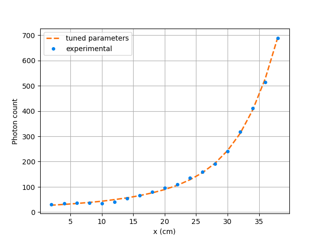

.. role:: raw-html(raw)
    :format: html

=======================================================
Tuning Count Calculation Model Parameters with NOMAD
=======================================================

In this example, `NOMAD <https://www.gerad.ca/en/software/nomad/>`_, the blackbox optimization software is used to estimate the unknown variables of the `Beam et al. (1978) <https://www.sciencedirect.com/science/article/abs/pii/0029554X78900812?via%3Dihub>`_ model. The three unknowns of our studied system are:

- the detector's ``dead time`` (:math:`\tau`)
- the source's ``activity`` (:math:`R`), and
- the reactor's attenuation coefficient (``attenuation coefficient reactor`` (:math:`\mu_r`)).

:raw-html:` `

Features
----------------------------------
- Solver: ``rpt_3d``
- Displays the use of NOMAD in parameter tuning

:raw-html:` `

Locations of files used in the example
---------------------------------------
- Parameter file: ``examples/rpt/parameters_tuning/rpt_parameters.prm``
- Python script for NOMAD: ``examples/rpt/parameters_tuning/rpt_lethe_nomad.py``
- Text file used when running NOMAD: ``examples/rpt/parameters_tuning/param_nomad.txt``
- File containing particle positions: ``examples/rpt/parameters_tuning/real_positions.particle``
- File containing experimental particle counts: ``examples/rpt/parameters_tuning/counts.experimental``
- File containing detector positions: ``examples/rpt/parameters_tuning/positions.detector``

:raw-html:` `

Description of the case
-------------------------
In this example, using the NOMAD optimization software and the experimental data, we are going to tune the three unknowns (:math:`R, \tau`, and :math:`\mu_r`) of our studied system.

The illustration below depicts the geometry of the vessel, the detector, and tthe path traveled by the particle in our system:

.. image:: images/system_from_above.png
    :alt: The geometry
    :align: center
    :name: geometry_description

As discussed in the previous example (`Photon Count Calculation in a Cylindrical Vessel <../photon-count-calculation-in-a-cylindrical-vessel/photon-count-calculation-in-a-cylindrical-vessel.html>`_), when a particle travels in the cylindrical reactor, its corresponding photon count (:math:`C`) measured by the detector varies according to the following relation:

.. math::
    C = \frac{T \nu R \phi \xi_i (\vec{X})}{1 + \tau \nu R \phi \xi_i (\vec{X})}

where,

- :math:`T` is the sampling time [:math:`s`];
- :math:`\nu` is the number of :math:`\gamma`-rays emitted by each disintegration;
- :math:`R` is the activity of the tracer [:math:`Beq`] *(the first unknown parameter)*;
- :math:`\phi` is the peak-to-total ratio;
- :math:`\tau` is the dead time of the detector [:math:`s`] *(the second unknown parameter)*;
- :math:`\vec{X}` is the tracer particle's position, and
- :math:`\xi_i(\vec{X})` is the efficiency of the :math:`i_{th}` detector related to the position :math:`\vec{X}`.

The efficiency of the detector is calculated using the Monte Carlo technic, with the following expression:

.. math::

    \xi_i (\vec{X}) = \frac{1}{N} \sum_{j=1}^{N} \omega(\alpha) \omega(\theta) f_a(\alpha_j, \theta_j) f_d(\alpha_j, \theta_j)

where

- :math:`N` is the number of randomly generated photons;
- :math:`\alpha_j` and :math:`\theta_j` are randomly generated angles that describe the direction of a ray emitted by a tracer particle;
- :math:`\omega(\alpha)` is the weighting factor associated with the angle :math:`\alpha`;
- :math:`\omega(\theta)` is the weighting factor associated with the angle :math:`\theta`;
- :math:`f_a(\alpha_j, \theta_j)` is the probability function of the non-interaction between the :math:`\gamma`-rays emitted within :math:`\Omega` and the material inside the vessel;
- :math:`\Omega` is the closed exposed area of the detector, and
- :math:`f_d(\alpha_j, \theta_j)` is the probability function of the interaction of the :math:`\gamma`-rays with the detector.

The two probability functions mentioned above may be re-written the following way:

.. math::

    f_a(\alpha_j, \theta_j) = exp\{-\mu_r \ e(\alpha_j, \theta_j)\}

where :math:`\mu_r` is the reactor's attenuation coefficient *(the third unknown parameter)* and :math:`e(\alpha_j, \theta_j)` is the length of the path traveled by the photon inside the reactor.

And

.. math::

    f_d(\alpha_j, \theta_j) = 1 - exp\{ -\mu_d \ d(\alpha_j,\theta_j)\}

where :math:`\mu_d` is the detector's attenuation coefficient and :math:`d(\alpha_j,\theta_j)` is the length of the path traveled by the photon inside the detector.

:raw-html:` `

Parameter files
----------------

*rpt_parameters.prm* file
~~~~~~~~~~~~~~~~~~~~~~~~~~~

RPT Parameters
^^^^^^^^^^^^^^^^

As seen in the previous example, in the subsection *"rpt parameters"*, we define the values of the set of parameter necessary for calculating the counts using the Monte Carlo method. These common parameters used for the RPT simulation are described in the `RPT parameters <../../../parameters/rpt/rpt_parameters.html>`_ documentation page.

.. code-block:: text

    # --------------------------------------------------
    # RPT Monte Carlo technique
    #---------------------------------------------------
    subsection rpt parameters
        set particle positions file          = positions.particle
        set verbosity                        = quiet
        set export counts                    = false
        set counts file                      = run.csv
        set monte carlo iteration            = 10000
        set random number seed               = 0
        set reactor height                   = 0.3
        set reactor radius                   = 0.4
        set peak-to-total ratio              = 0.4
        set sampling time                    = 0.01
        set gamma-rays emitted               = 2
        set attenuation coefficient detector = 21.477
    end

.. attention::
    ``verbosity`` **must** be set to **quiet** since NOMAD gets the cost function value from the terminal for its MADS algorithm.

Parameter tuning
^^^^^^^^^^^^^^^^^^

In the subsection *"parameter tuning"*, we enable parameters tuning, we specify a type of cost function and define a set of artificial counts to compare with calculated counts. Parameters used for the tuning of the model parameters are described in the `Parameter tuning <../../../parameters/rpt/parameter_tuning.html>`_ documentation page.

.. code-block:: text

    # --------------------------------------------------
    # Tuning with NOMAD
    #---------------------------------------------------
    subsection parameter tuning
        set tuning                           = true
        set cost function type               = larachi
        set experimental data file           = counts.experimental
    end

Detector Parameters
^^^^^^^^^^^^^^^^^^^^

In the subsection *"detector parameters"*, we specify the file that contains the position of the detector face center and the position of a point inside the detector on its axis. In this example, the detector face center position is :math:`(0.2,0,0.0750)` and :math:`(0.2381,0,0.075)` is another point on the detector’s axis. The detector parameters are described in the `Detector Parameters <../../../parameters/rpt/detector_parameters.html>`_ documentation page.

.. code-block:: text

    #---------------------------------------------------
    # Detector parameters
    #---------------------------------------------------
    subsection detector parameters
        set detector positions file          = positions.detector
        set radius                           = 0.0381
        set length                           = 0.0762
        set dead time                        = 1e-5
        set activity                         = 2e6
        set attenuation coefficient reactor  = 10
    end

:raw-html:` `

*param_nomad.txt* file
~~~~~~~~~~~~~~~~~~~~~~~~~~

The ``param_nomad.txt`` file is used when running NOMAD. This file provides the parameters necessary when defining the optimization problem. These parameters are defined using specific keywords as explained in the `NOMAD User Guide <https://nomad-4-user-guide.readthedocs.io/en/latest/GettingStarted.html#provide-parameters>`_.

.. code-block:: text

    DIMENSION      3                                      # number of variables

    BB_EXE         "$python3 rpt_lethe_nomad.py"          # blackbox (script)

    BB_OUTPUT_TYPE OBJ

    X0             ( 1e-4 1e6 15 )                        # starting point (dead time, activity,
                                                          # attenuation coefficient reactor)

    LOWER_BOUND    * 0                                    # all variables are >= 0

    MAX_BB_EVAL    500                                    # the algorithm terminates when
                                                          # X black-box evaluations have
                                                          # been done

    DISPLAY_STATS BBE ( SOL ) OBJ                         # Display the number of evaluation (BBE),
                                                          # the current solution ( SOL ) and the objective

.. note::
    In this example, we use version 4.2.0 of NOMAD. You can get it by clicking on the **Download** button on of `the software's web page <https://www.gerad.ca/en/software/nomad>`_ and filling out the required information. The steps to follow for the installation are specified in the `NOMAD 4 User Guide <https://nomad-4-user-guide.readthedocs.io/en/latest/Installation.html>`_.

:raw-html:` `

Running the simulation
----------------------------------

If it's the **first time** you're running this example, it is important to open the ``rpt_lethe_nomad.py`` script and complete the path to the ``rpt_3d`` executable on the :math:`14^{th}` line.

.. attention::
    If you don't complete the path to the ``rpt_3d`` executable on the :math:`14^{th}` line of the ``rpt_lethe_nomad.py`` script you won't be able to tune your parameters.

Once you've completed the line mentioned above in the ``rpt_lethe_nomad.py`` script, you may run NOMAD by typing :

.. code-block:: text

    /home/myUserName/PathToNomad param_nomad.txt

NOMAD will then execute the Python script (``rpt_lethe_nomad.py``) which is specified in the ``param_nomad.txt`` file. The Python script ``rpt_nomad_lethe.py`` proceeds the values of parameters to tune given by NOMAD, modifies the parameter file for Lethe, and runs the rpt_3d application. ``rpt_3d`` of Lethe executes the Monte Carlo ray model and calculates a cost function which is caught by NOMAD through the terminal. NOMAD executes its MADS algorithm and generates a new set of parameters until a terminating criterion is reached.

:raw-html:` `

Results
--------

After running the optimization software, the best feasible solution will be displayed on the terminal.

.. code-block:: text

    A termination criterion is reached: No termination (all). Mesh minimum precision reached (Algo)

    Best feasible solution:     #30212 ( 7.85479e-06 2.43045e+06 0.5002 )	Evaluation OK	 f =   0.03238789999999999725	 h =   0

    Best infeasible solution:   Undefined.

    Blackbox evaluations:        390
    Total model evaluations:     39890
    Cache hits:                  69
    Total number of evaluations: 459

.. tip::
    Changing the initial values of the optimization problem to ones that are closer to the solution seen above can reduce the computation time.

We may now verify if these values correspond to the studied system. To do so, as it was done in the previous example, we calculate the counts for the set of particle positions that we have.

Before executing the ``rpt_3d`` application we have to change a few parameters in the ``rpt_parameters.prm`` file.

First, in the *"rpt parameters"* subsection, we may set the ``verbosity`` parameter to ``verbose``, set the ``export counts`` parameter to ``true``, and change the name of the ``counts file`` that will be exported if we wish.

Second, in the *"parameter tuning"* subsection, we have to set the ``tuning`` parameter to ``false`` since we're trying to tune parameters anymore.

Lastly, in the *"detector parameters"* subsection, we have to change the values of the parameters that we tuned (``dead time``, ``activity``, and ``attenuation coefficient reactor``) with the ones NOMAD gave us.

By doing the modifications mentioned above, the content ``rpt_parameters.prm`` should look like this :

.. code-block:: text

    # Listing of Parameters
    # ---------------------
    # --------------------------------------------------
    # RPT Monte Carlo technique
    #---------------------------------------------------
    subsection rpt parameters
        set particle positions file          = positions.particle
        set verbosity                        = verbose
        set export counts                    = true
        set counts file                      = counts_calculated.csv
        set monte carlo iteration            = 100000
        set random number seed               = 0
        set reactor height                   = 0.3
        set reactor radius                   = 0.4
        set peak-to-total ratio              = 0.4
        set sampling time                    = 0.01
        set gamma-rays emitted               = 2
        set attenuation coefficient detector = 21.477
    end

    # --------------------------------------------------
    # Tuning with NOMAD
    #---------------------------------------------------
    subsection parameter tuning
        set tuning                           = false
        set cost function type               = larachi
        set experimental data file           = counts.experimental
    end

    #---------------------------------------------------
    # Detector parameters
    #---------------------------------------------------
    subsection detector parameters
        set detector positions file          = positions.detector
        set radius                           = 0.0381
        set length                           = 0.0762
        set dead time                        = 7.85479e-06
        set activity                         = 2.43045e+06
        set attenuation coefficient reactor  = 0.5002
    end

In the figure below, we can see that there is very little difference between the experimental counts and the calculated counts with the tuned parameters.

:raw-html:` `

References
-----------

[1] Beam, G.B., Wielopolski, L., Gardner,  R.P., & Verghese, K. (1978). Monte Carlo calculation of efficiencies of right-circular cylindrical NaI detectors for arbitrarily located point sources. *Nuclear Instruments and Methods*. 154(3), 501-508. https://doi.org/10.1016/0029-554X(78)90081-2

[2] Larachi, F., Kennedy, G., & Chaouki, J. (1994). A γ-ray detection system for 3-D particle tracking in multiphase reactors. *Nuclear Instruments and Methods in Physics Research Section A: Accelerators, Spectrometers, Detectors and Associated Equipment*. 338(2), 568-576. https://doi.org/10.1016/0168-9002(94)91343-9

