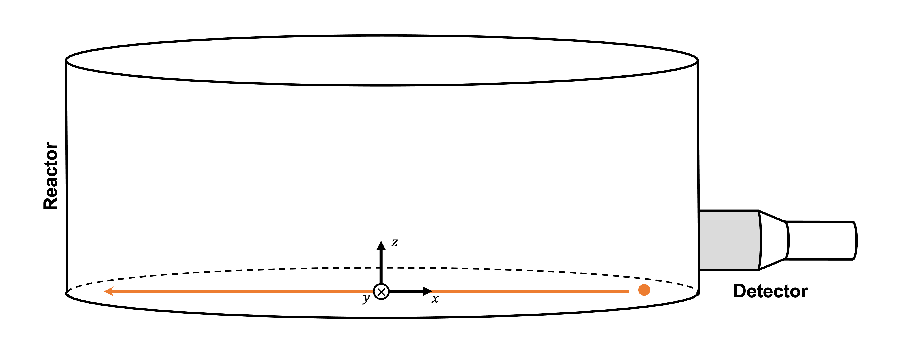

.. role:: raw-html(raw)
    :format: html

=======================================================
Tuning Count Calculation Model Parameters with NOMAD
=======================================================

In this example, `NOMAD <https://www.gerad.ca/en/software/nomad/>`_, the blackbox optimization software is used to estimate the unknown variables of the `Beam <https://www.sciencedirect.com/science/article/abs/pii/0029554X78900812?via%3Dihub>`_ model. The three unknowns of our studied system are :

- the detector's ``dead time`` (:math:`\tau`)
- the source's ``activity`` (:math:`R`), and
- the reactor's attenuation coefficient (``attenuation coefficient reactor`` (:math:`\mu_r`)).

Features
----------------------------------
- Solver: ``rpt_3d``
- Displays the use of NOMAD in parameter tuning

Locations of files used in the example
---------------------------------------
- Parameter file: ``examples/rpt/parameters_tuning/rpt_parameters.prm``
- Python script for NOMAD: ``examples/rpt/parameters_tuning/rpt_lethe_nomad.py``
- Text file used when running NOMAD: ``examples/rpt/parameters_tuning/param_nomad.txt``
- File containing particle positions: ``examples/rpt/parameters_tuning/real_positions.particle``
- File containing experimental particle counts: ``examples/rpt/parameters_tuning/counts.experimental``
- File containing the detector positions: ``examples/rpt/parameters_tuning/positions.detector``

Description of the case
-------------------------
In this example, using the NOMAD optimization software and the experimental data, we are going to tune the three unknowns (:math:`R, \tau`, and :math:`\mu_r`) of our studied system.

The illustration below depicts the geometry of the vessel, the detector, and the particle positioning of our system:

As discussed in the previous example (`Photon Count Calculation in a Cylindrical Vessel <../photon-count-calculation-in-a-cylindrical-vessel/photon-count-calculation-in-a-cylindrical-vessel.html>`_), when a particle travels in the cylindrical reactor, its corresponding photon count (:math:`C`) measured by the detector varies according to the following relation:

.. math::
    C = \frac{T \nu R \phi \xi_i (\vec{X})}{1 + \tau \nu R \phi \xi_i (\vec{X})}

		
In the previous expression, 

- :math:`T` is the sampling time [:math:`s`];
- :math:`\nu` is the number of :math:`\gamma`-rays emmited by each disintegration;
- :math:`R` is the activity of the tracer [:math:`Beq`] *(the first unknown parameter)*;
- :math:`\phi` is the peak-to-total ratio;
- :math:`\tau` is the dead time of the detector [:math:`s`] *(the second unknown parameter)*;
- :math:`\vec{X}` is the tracer particle's position, and
- :math:`\xi_i(\vec{X})` is the efficiency of the :math:`i_{th}` detector related to the position :math:`\vec{X}`.

The efficiency of the detector is calculated using the Monte Carlo technic, with the following expression:

.. math::

    \xi_i (\vec{X}) = \frac{1}{N} \sum_{j=1}^{N} \omega(\alpha) \omega(\theta) f_a(\alpha_j, \theta_j) f_d(\alpha_j, \theta_j)

where

- :math:`N` is the number of randomly generated photons;
- :math:`\alpha_j` and :math:`\theta_j` are randomly generated angles that describe the direction of a ray emitted by a tracer particle;
- :math:`\omega(\alpha)` is the weighting factor associated with the angle :math:`\alpha`, and
- :math:`\omega(\theta)` is the weighting factor associated with the angle :math:`\theta`.
- :math:`f_a(\alpha_j, \theta_j)` is the probability function of hte non-interaction between the :math:`\gamma`-rays emitted whithin :math:`\Omega` and the material inside the vessel, and
- :math:`f_d(\alpha_j, \theta_j)` is the probability function of the interaction of the :math:`\gamma`-rays with the detector.

The two last functions may be re-written the following way :

.. math::

    f_a(\alpha_j, \theta_j) = exp\{-\mu_r \ e(\alpha_j, \theta_j)\}

where :math:`\mu_r` is the reactor's attenuation coefficient *(the third unknown parameter)* and :math:`e(\alpha_j, \theta_j)` is the length of the path travelled by the photon inside the reactor.

And

.. math::

    f_d(\alpha_j, \theta_j) = 1 - exp\{ -\mu_d \ d(\alpha_j,\theta_j)\}

where :math:`\mu_d` is the detector's attenuation coefficient and :math:`d(\alpha_j,\theta_j)` is the length of the path travelled by the photon inside the detector.

Parameter files
----------------

``rpt_parameters.prm`` file
~~~~~~~~~~~~~~~~~~~~~~~~~~~~~

RPT Parameters
^^^^^^^^^^^^^^^^

.. code-block:: text

    # --------------------------------------------------
    # RPT Monte Carlo technique
    #---------------------------------------------------
    subsection rpt parameters
        set particle positions file          = positions.particle
        set verbosity                        = quiet
        set export counts                    = false
        set counts file                      = run.csv
        set monte carlo iteration            = 10000
        set random number seed               = 0
        set reactor height                   = 0.3
        set reactor radius                   = 0.4
        set peak-to-total ratio              = 0.4
        set sampling time                    = 0.01
        set gamma-rays emitted               = 2
        set attenuation coefficient detector = 21.477
    end

.. attention::
    ``verbosity`` **must** be set to **quiet** since NOMAD gets the cost function value from the terminal for its MADS algorithm.

``param_nomad.txt`` file
~~~~~~~~~~~~~~~~~~~~~~~~~~

Running the simulation
----------------------------------

Results
--------

References
-----------
