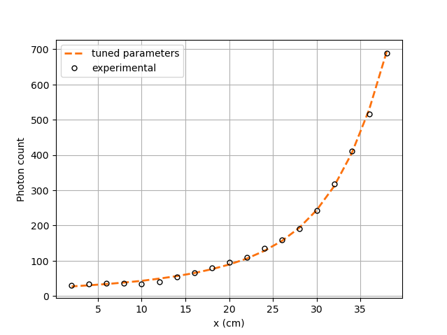

=======================================================
Tuning Count Calculation Model Parameters with NOMAD
=======================================================

In this example, `NOMAD <https://www.gerad.ca/en/software/nomad/>`_, the blackbox optimization software is used to estimate the unknown variables of the Beam *et al.* (1978) `[1] <https://doi.org/10.1016/0029-554X(78)90081-2>`_ model. The three unknowns of our studied system are:

- the detector's ``dead time`` (:math:`\tau`)
- the source's ``activity`` (:math:`R`), and
- the reactor's attenuation coefficient (``attenuation coefficient reactor`` (:math:`\mu_r`)).

----------------------------------
Features
----------------------------------

- Solver: ``lethe-rpt-3d``
- Displays the use of NOMAD to calibrate the parameters of the Beam model

---------------------------
Files Used in This Example
---------------------------

All files mentioned below are located in the example's folder (``examples/rpt/parameters-tuning``).

- File containing experimental particle counts: ``counts.experimental``
- File containing detector positions: ``positions.detector``
- File containing particle positions: ``positions.particle``
- Parameter file for calculating photon counts: ``rpt-count-calculation.prm``
- Parameter file for tuning parameters: ``rpt-parameters.prm``
- Python script for NOMAD: ``rpt_lethe_nomad.py``
- Postprocessing Python script: ``rpt_parameter_tuning_plot.py``
- Text file used when running NOMAD: ``param-nomad.txt``

-------------------------
Description of the Case
-------------------------
In this example, using the NOMAD optimization software and the experimental data, we are going to tune the three unknowns (:math:`R, \tau`, and :math:`\mu_r`) of our studied system.

The illustration below depicts the geometry of the vessel, the detector, and the path traveled by the particle in our system:

As discussed in the previous example (`Photon Count Calculation in a Cylindrical Vessel <../photon-count-calculation-in-a-cylindrical-vessel/photon-count-calculation-in-a-cylindrical-vessel.html>`_), when a particle travels in a cylindrical reactor, its corresponding photon count (:math:`C`) measured by the detector varies according to the following relation:

.. math::
    C = \frac{T \nu R \phi \xi_i (\mathbf{X})}{1 + \tau \nu R \phi \xi_i (\mathbf{X})}

where

- :math:`T` is the sampling time [:math:`s`];
- :math:`\nu` is the number of :math:`\gamma`-rays emitted by each disintegration;
- :math:`R` is the activity of the tracer [:math:`Beq`] *(the first unknown parameter)*;
- :math:`\phi` is the peak-to-total ratio;
- :math:`\tau` is the dead time of the detector [:math:`s`] *(the second unknown parameter)*;
- :math:`\mathbf{X}` is the tracer particle's position, and
- :math:`\xi_i(\mathbf{X})` is the efficiency of the :math:`i_{th}` detector related to the position :math:`\mathbf{X}`.

The efficiency of the detector is calculated using the Monte Carlo method, with the following expression:

.. math::

    \xi_i (\mathbf{X}) = \frac{1}{N} \sum_{j=1}^{N} \omega(\alpha) \omega(\theta) f_a(\alpha_j, \theta_j) f_d(\alpha_j, \theta_j)

where

- :math:`N` is the number of randomly sampled photon directions;
- :math:`\alpha_j` and :math:`\theta_j` are randomly generated angles that describe the direction of a ray emitted by a tracer particle;
- :math:`\omega(\alpha)` is the weighting factor associated with the angle :math:`\alpha`;
- :math:`\omega(\theta)` is the weighting factor associated with the angle :math:`\theta`;
- :math:`f_a(\alpha_j, \theta_j)` is the probability function of the non-interaction between the :math:`\gamma`-rays emitted within :math:`\Omega` and the material inside the vessel;
- :math:`\Omega` is the closed exposed area of the detector, and
- :math:`f_d(\alpha_j, \theta_j)` is the probability function of the interaction of the :math:`\gamma`-rays with the detector.

The two probability functions mentioned above may be re-written the following way:

.. math::

    f_a(\alpha_j, \theta_j) = exp\{-\mu_r \ e(\alpha_j, \theta_j)\}

where :math:`\mu_r` is the reactor's attenuation coefficient *(the third unknown parameter)* and :math:`e(\alpha_j, \theta_j)` is the length of the path traveled by the photon inside the reactor.

And

.. math::

    f_d(\alpha_j, \theta_j) = 1 - exp\{ -\mu_d \ d(\alpha_j,\theta_j)\}

where :math:`\mu_d` is the detector's attenuation coefficient and :math:`d(\alpha_j,\theta_j)` is the length of the path traveled by the photon inside the detector.

----------------
Parameter Files
----------------

*rpt-parameters.prm* File
~~~~~~~~~~~~~~~~~~~~~~~~~~~

RPT Parameters
^^^^^^^^^^^^^^^^

As seen in the previous example (:doc:`../photon-count-calculation-in-a-cylindrical-vessel/photon-count-calculation-in-a-cylindrical-vessel`), in the subsection ``rpt parameters``, we define the values of the set of parameter necessary for calculating the counts using the Monte Carlo method. These common parameters used for the RPT simulation are described in the :doc:`../../../parameters/rpt/rpt_parameters` documentation page.

.. code-block:: text

    subsection rpt parameters
      set particle positions file          = positions.particle
      set verbosity                        = quiet
      set export counts                    = false
      set counts file                      = run.csv
      set monte carlo iteration            = 10000
      set random number seed               = 0
      set reactor height                   = 0.3
      set reactor radius                   = 0.4
      set peak-to-total ratio              = 0.4
      set sampling time                    = 0.01
      set gamma-rays emitted               = 2
      set attenuation coefficient detector = 21.477
    end

.. attention::
    ``verbosity`` **must** be set to **quiet** since NOMAD gets the cost function value from the terminal for its MADS algorithm.

Parameter Tuning
^^^^^^^^^^^^^^^^^^

In the subsection ``parameter tuning``, we enable parameters tuning, we specify a type of cost function and define a set of experimental counts to compare with the calculated counts. Parameters used for the tuning of the model parameters are described in the :doc:`../../../parameters/rpt/parameter_tuning` documentation page.

.. code-block:: text

    subsection parameter tuning
      set tuning                 = true
      set cost function type     = larachi
      set experimental data file = counts.experimental
    end

Detector parameters
^^^^^^^^^^^^^^^^^^^^

In the subsection ``detector parameters``, we specify the file that contains the position of the detector face center and the position of a point inside the detector on its axis. In this example, the detector face center position is :math:`(0.2,0,0.0750)` and :math:`(0.2381,0,0.075)` is another point on the detector’s axis. The detector parameters are described in the :doc:`../../../parameters/rpt/detector_parameters` documentation page.

.. code-block:: text

    subsection detector parameters
      set detector positions file         = positions.detector
      set radius                          = 0.0381
      set length                          = 0.0762
      set dead time                       = 1e-5
      set activity                        = 2e6
      set attenuation coefficient reactor = 10
    end

*param-nomad.txt* File
~~~~~~~~~~~~~~~~~~~~~~~~~~

The ``param-nomad.txt`` file is used when running NOMAD. This file provides initial guess and constraints when defining the optimization problem. These parameters are defined using specific keywords as explained in the `NOMAD User Guide <https://nomad-4-user-guide.readthedocs.io/en/latest/GettingStarted.html#provide-parameters>`_.

.. code-block:: text

    DIMENSION      3                                      # number of variables

    BB_EXE         "$python3 rpt_lethe_nomad.py"          # blackbox (script)

    BB_OUTPUT_TYPE OBJ

    X0             ( 1e-4 1e6 15 )                        # starting point (dead time, activity,
                                                          # attenuation coefficient reactor)

    LOWER_BOUND    * 0                                    # all variables are >= 0

    MAX_BB_EVAL    500                                    # the algorithm terminates when
                                                          # X black-box evaluations have
                                                          # been done

    DISPLAY_STATS BBE ( SOL ) OBJ                         # Display the number of evaluation (BBE),
                                                          # the current solution ( SOL ) and the objective

.. note::
    In this example, we use version 4.2.0 of NOMAD. You can get it by clicking on the **Download** button of `the software's web page <https://www.gerad.ca/en/software/nomad>`_ and filling out the required information. The steps to follow for the installation are specified in the `NOMAD 4 User Guide <https://nomad-4-user-guide.readthedocs.io/en/latest/Installation.html>`_.

----------------------
Running the Simulation
----------------------

Assuming that ``lethe-rpt-3d`` and ``nomad`` executables are within your path, you may run NOMAD by typing :

.. code-block:: text
  :class: copy-button

  nomad param-nomad.txt

NOMAD will then execute the Python script (``rpt_lethe_nomad.py``) which is specified in the ``param-nomad.txt`` file. The Python script ``rpt_nomad_lethe.py`` proceeds the values of parameters to tune given by NOMAD, modifies the parameter file for Lethe, and runs the ``lethe-rpt-3d`` application. ``lethe-rpt-3d`` of Lethe executes the Monte Carlo ray model and calculates a cost function which is caught by NOMAD through the terminal. NOMAD executes its MADS algorithm and generates a new set of parameters until a terminating criterion is reached.

-----------------------
Results and Discussion
-----------------------

After running the optimization software, the best feasible solution will be displayed on the terminal.

.. code-block:: text

    A termination criterion is reached: No termination (all). Mesh minimum precision reached (Algo)

    Best feasible solution:     #30212 ( 7.85479e-06 2.43045e+06 0.5002 )	Evaluation OK	 f =   0.03238789999999999725	 h =   0

    Best infeasible solution:   Undefined.

    Blackbox evaluations:        390
    Total model evaluations:     39890
    Cache hits:                  69
    Total number of evaluations: 459

.. tip::
    Changing the initial values of the optimization problem to ones that are closer to the solution seen above can reduce the computation time.

We may now verify if these values correspond to the physical system. To do so, as it was done in the previous example (:doc:`../photon-count-calculation-in-a-cylindrical-vessel/photon-count-calculation-in-a-cylindrical-vessel`), we calculate the counts for the set of particle positions that the corresponding experimental counts are known. Assuming that the ``lethe-rpt-3d`` executable is within your path, the simulation can be launched by typing:

.. code-block:: text
  :class: copy-button

  lethe-rpt-3d rpt-count-calculation.prm

.. attention::
    It is important to launch the simulation with ``rpt-count-calculation.prm`` and not ``rpt-parameters.prm``. The parameters in both files are set for different purposes. ``rpt-count-calculation.prm`` is suited for count calculation with the Monte Carlo technique, and ``rpt-parameters.prm`` is suited for tuning parameters.

The differences between ``rpt-count-calculation.prm`` and ``rpt-parameters.prm`` are described below.

- First, in ``rpt-count-calculation.prm``, in the ``rpt parameters`` subsection, the ``verbosity`` parameter has been set to ``verbose`` since NOMAD is not used anymore, we can display counts on the terminal. To be able to export the counts in a file, the ``export counts`` parameter was set to ``true``. The name of the ``counts file`` that will be exported may be changed in this subsection.

- Second, in the ``parameter tuning`` subsection, the ``tuning`` parameter was set to ``false`` since we're not trying to tune parameters anymore.

- Lastly, in the ``detector parameters`` subsection, the values of the parameters that were tuned (``dead time``, ``activity``, and ``attenuation coefficient reactor``) were replaced with the ones NOMAD gave us.

To visualize the data and obtain the figures shown below, a Python script (``rpt_parameter_tuning_plot.py``) is provided. When running the script, the name of the ``.csv`` file containing the calculated counts must be specified as an argument. In the *Experimental and calculated counts comparison* figure, we can see very little difference between the experimental counts and the calculated counts with the tuned parameters. The linear regression between the experimental and calculated photon counts gives us an R² value of 0.9990 as seen in the *Linear fit* figure. This confirms the validity of the tuned parameters.

    Experimental and calculated counts comparison

    Linear fit

-----------
References
-----------

`[1] <https://doi.org/10.1016/0029-554X(78)90081-2>`_ G. B. Beam, L. Wielopolski, R. P. Gardner, and K. Verghese, “Monte Carlo calculation of efficiencies of right-circular cylindrical NaI detectors for arbitrarily located point sources,” *Nucl. Instrum. Methods*, vol. 154, no. 3, pp. 501–508, Sep. 1978, doi: 10.1016/0029-554X(78)90081-2.

`[2] <https://doi.org/10.1016/0168-9002(94)91343-9>`_ F. Larachi, G. Kennedy, and J. Chaouki, “A γ-ray detection system for 3-D particle tracking in multiphase reactors,” *Nucl. Instrum. Methods Phys. Res. Sect. Accel. Spectrometers Detect. Assoc. Equip.*, vol. 338, no. 2, pp. 568–576, Jan. 1994, doi: 10.1016/0168-9002(94)91343-9.

