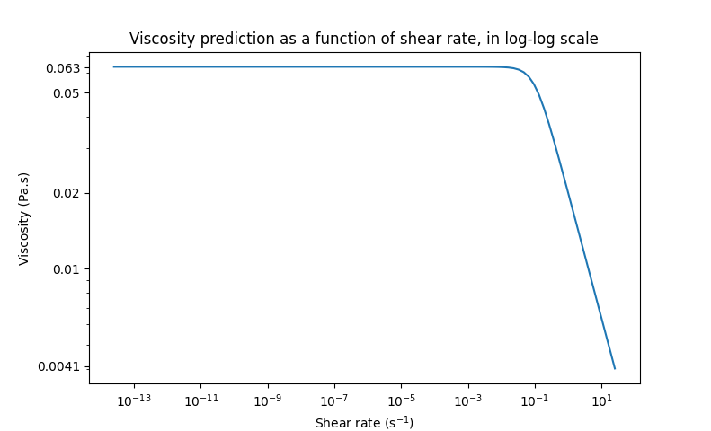

================================
Non-Newtonian flow past a sphere
================================

This example showcases a laminar non-Newtonian flow around a sphere, with an *a priori* Reynolds number :math:`Re = 50`, using the `Carreau rheological model <https://en.wikipedia.org/wiki/Carreau_fluid>`_.

Features
----------------------------------
- Solvers: ``gls_sharp_navier_stokes_3d`` (with Q1-Q1) 
- Steady-state problem
- Non-Newtonian behavior
- Ramping initial condition
- Non-uniform mesh adaptation 

Files used in this example
---------------------------

- Parameter file: ``/examples/sharp-immersed-boundary-solver/sphere-carreau-with-sharp-inferface/sphere-carreau-with-sharp-inferface.prm``

Description of the case
-----------------------

In this example, we study the flow around a static sphere using the sharp-interface method to represent the sphere. The geometry of the flow is the following, with a particle of diameter :math:`D = 1.0` located at :math:`(0,0,0)`
and the flow domain located between :math:`(-18,-15,-15)` and :math:`(42,15,15)`.

.. image:: images/sharp-carreau-case.png
    :alt: Simulation schematic
    :align: center

Parameter file
-----------------------

Mesh
~~~~~

The mesh is defined using the following subsection.

.. code-block:: text

    subsection mesh
      set type               = dealii
      set grid type          = subdivided_hyper_rectangle
      set grid arguments     = 2,1,1 : -18,-15,-15 : 42,15,15 : true
      set initial refinement = 4
    end

The dimensions of the used domain are :math:`(60 \times 30 \times 30)`, and the ``subdivided_hyper_rectangle`` is initially divided in :math:`(2 \times 1 \times 1)` cells, the cells are therefore cubic and of initial size :math:`(30 \times 30 \times 30)`. Using ``set initial refinement = 4``, the initial size of the cubic cells is :math:`30/2^4 = 1.875`. Since the particle size is small in regards to the mesh size, a refinement zone is generated around the particle to better capture it (see :doc:`../../../parameters/cfd/box_refinement` for more details).

.. code-block:: text

    subsection box refinement
      set initial refinement = 3
      subsection mesh
        set type               = dealii
        set grid type          = subdivided_hyper_rectangle
        set grid arguments     = 1,1,1: -2,-2,-2 : 6,2,2 : true
        set initial refinement = 0
      end
    end

Boundary conditions
~~~~~~~~~~~~~~~~~~~~
We define the boundary conditions in order to have an inlet velocity of :math:`1~m/s` on the left, ``slip`` boundary conditions parallel to the flow direction, and an outlet on the right of the domain (unspecified condition at ``id = 1``).

.. code-block:: text

    subsection boundary conditions
      set number = 5
      subsection bc 0
        set id   = 0
        set type = function
        subsection u
          set Function expression = 1
        end
        subsection v
          set Function expression = 0
        end
        subsection w
          set Function expression = 0
        end
      end
      subsection bc 1
        set id   = 2
        set type = slip
      end
      subsection bc 2
        set id   = 3
        set type = slip
      end
      subsection bc 3
        set id   = 4
        set type = slip
      end
      subsection bc 4
        set id   = 5
        set type = slip
      end
    end

.. note::
	Since using a `deal.ii mesh <https://www.dealii.org/current/doxygen/deal.II/namespaceGridGenerator.html>`_, the boundary ``id = 1`` is by default the second boundary in the *x* axis, hence the free boundary in this problem. This is why all boundary indices are shifted.

Physical properties
~~~~~~~~~~~~~~~~~~~~

This example showcases a shear-thinning flow, for which the viscosity decreases when the local shear rate increases. The Carreau model is being used. For more information on rheological models, see :doc:`../../../parameters/cfd/physical_properties`

.. code-block:: text

    subsection physical properties
      set number of fluids = 1
      subsection fluid 0
        set rheological model = carreau
    
        subsection non newtonian
          subsection carreau
            set viscosity_0   = 0.063403
            set viscosity_inf = 0
            set lambda        = 10
            set a             = 2.0
            set n             = 0.5
          end
        end
      end
    end

With ``viscosity_inf = 0`` (3-parameter Carreau model), the *a priori* Reynolds number can be estimated using :

.. math::

	 Re = \frac{u_{\infty}D(1+(\lambda(\frac{u_\infty}{D}))^2)^{\frac{1-n}{2}}}{\eta_0}

We use an *a priori* Reynolds number, since it is not possible, *a priori*, to know the effective viscosity of the flow. For the given parameters, the *a priori* Reynolds number is :math:`50`. 

Initial conditions
~~~~~~~~~~~~~~~~~~~~

This example uses a ramping initial condition that first ramps on the ``n`` parameter, and then on the ``viscosity_0`` parameter. This allows for a smooth transition of non-Newtonian behavior level and of regime.

.. code-block:: text

    subsection initial conditions
      set type = ramp
      subsection ramp
        subsection n
          set initial n  = 1.0
          set iterations = 2
          set alpha      = 0.5
        end
        subsection viscosity
          set initial viscosity = 1.0
          set iterations        = 2
          set alpha             = 0.5
        end
      end
    end
	
The first initial condition simulation solves for ``n=1.0``, ``viscosity_0 = 1.0``, ``viscosity_inf = 0``, ``lambda=10`` and ``a=2``. The subsequent initial simulations are:

* (Second ``n`` iteration) ``n=0.75``, ``viscosity_0 = 1.0``, ``viscosity_inf = 0``, ``lambda=10`` and ``a=2`` ;
* (First ``viscosity`` iteration) ``n=0.5``, ``viscosity_0 = 1.0``, ``viscosity_inf = 0``, ``lambda=10`` and ``a=2`` ;
* (Second ``viscosity`` iteration) ``n=0.5``, ``viscosity_0 = 0.531702``, ``viscosity_inf = 0``, ``lambda=10`` and ``a=2`` 

and the first simulation uses the parameters in the ``subsection physical properties``. For more information on ramping initial conditions, see :doc:`../../../parameters/cfd/initial_conditions`.

Particle
~~~~~~~~~~~~~~~~~~~~

In this case, we want to define a spherical boundary of radius :math:`0.5`, with its center at :math:`(0,0,0)` and that has no velocity. For more information on particle immersed boundary conditions using a sharp interface, see :doc:`../../../parameters/sharp-immersed-boundary-solver/sharp-immersed-boundary-solver`.

.. code-block:: text

    subsection particles
      set number of particles                     = 1
      set stencil order                           = 2
      set length ratio                            = 1
      set refine mesh inside radius factor        = 0.85
      set refine mesh outside radius factor       = 1.3
      set initial refinement                      = 2
      set integrate motion                        = false
      set assemble Navier-Stokes inside particles = false
      subsection particle info 0
        subsection position
          set Function expression = 0;0;0
        end
        set pressure location = 0.00001; 0.00001; 0.00001
        set type            = sphere
        set shape arguments = 0.5
      end
    end

The hypershell around the boundary between ``refine mesh inside radius factor`` (:math:`r = 0.425`) and ``refine mesh outside radius factor`` (:math:`r = 0.65`) will initially be refined twice (``initial refinement = 2``). 

Simulation control
~~~~~~~~~~~~~~~~~~~~~~~~~~

The simulation is solved at steady-state with 2 mesh adaptations.

.. code-block:: text

    subsection simulation control
      set method            = steady
      set number mesh adapt = 2
      set output name       = sharp-carreau-output
      set output frequency  = 1
      set subdivision       = 1
    end

Mesh adaptation control
~~~~~~~~~~~~~~~~~~~~~~~~~~

In order to generate an additional refinement zone around the immersed boundary, the ``mesh adaptation`` ``type`` must be set to ``kelly``. During both of the mesh refinement steps, :math:`40\%` of the cells with be split in :math:`8` (``fraction refinement = 0.4``) using a velocity-gradient Kelly operator.

.. code-block:: text

    subsection mesh adaptation
      set type                 = kelly
      set fraction coarsening  = 0.1
      set fraction refinement  = 0.4
      set fraction type        = number
      set frequency            = 1
      set max number elements  = 8000000
      set min refinement level = 0
      set max refinement level = 11
      set variable = velocity
    end

Results
---------------

Using Paraview, the steady-state velocity profile and the pressure profile can be visualized by operating a *slice* along the xy-plane (z-normal) that cuts in the middle of the sphere (See `documentation <https://forgeanalytics.io/blog/creating-slices-in-paraview/>`_). 

We can also see the viscosity profile throughout the domain, that is a function of the shear rate magnitude profile. Close to the particle, the shear rate is high which decreases the viscosity. 

.. image:: images/shear-rate.png
	:align: center

We can notice that the viscosity rapidly reaches a plateau at :math:`\eta=0.063`. Given the parameters in the ``subsection physical properties``, the viscosity behavior should be given  by:

We get the following torques and forces applied on the particle for each of the mesh refinements. The drag force applied on the particle in the effective force in the same direction fo the flow, which is in the math:`x` direction in this case. 

.. code-block:: text

 particle_ID    T_x       T_y       T_z      f_x       f_y       f_z      f_xv     f_yv     f_zv     f_xp     f_yp      f_zp    
 	0   -0.000008  0.000019 -0.000022 0.412183  0.000019  0.000038 0.143783 0.000019 0.000038 0.268400 -0.000000  0.000000 
 	0    0.000001  0.000000 -0.000003 0.415760  0.000001  0.000000 0.162431 0.000001 0.000001 0.253330  0.000000 -0.000000 
 	0   -0.000000 -0.000000 -0.000000 0.424786 -0.000000 -0.000003 0.176203 0.000001 0.000000 0.248584 -0.000001 -0.000003 

          
.. note:: 
	Because this analysis concerns non-Newtonian flow, there is no known solution for the drag coefficient. For a Newtonian flow at :math:`Re = 50`, the drag force would be :math:`0.6165`. Therefore, the drag force was decreased using a shear-thinning fluid.

Possibilities for extension
-----------------------------	
* **High-order methods** : Lethe supports higher order interpolation. This can yield much better results with an equal number of degrees of freedom than traditional second-order (Q1-Q1) methods, especially at higher Reynolds numbers.
* **Reynolds number** : By changing the inlet velocity, it can be interesting to see the impact of the shear-thinning behavior on the effective drag force.
* **Non-Newtonian parameters** : It can also be interesting to change the Carreau model parameters, i.e. changing the slope to appreciate the change in behavior.

.. note::
	It is not possible to use the Carreau model for a shear-thickening flow. You should change the model to power-law, and use the decribed parameters in :doc:`../../../parameters/cfd/physical_properties`
