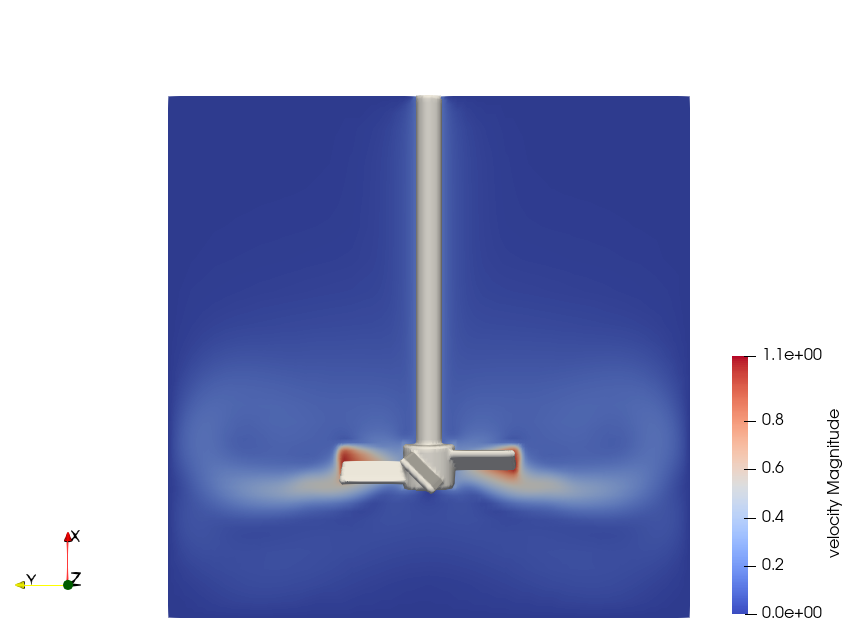
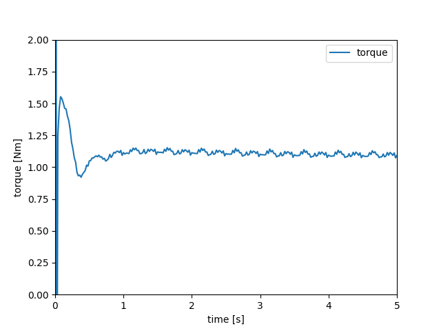

=====================================================================================
3D Mixer with Pitched-Blade Turbine Impeller Using Composite Sharp-Immersed Boundary
=====================================================================================

The mixing of stirred tanks is a common chemical engineering problem that can be tackled through immersed boundary simulation. This example, a variation of :doc:`../../incompressible-flow/3d-nitsche-mixer-with-pbt-impeller/nitsche-mixer-with-pbt-impeller`, illustrates how the transient flow in a stirred-tank can be simulated by Lethe using the Sharp-Immersed Boundary formulation with a composite shape.

----------------------------------
Features
----------------------------------

- Solvers: ``lethe-fluid-sharp``
- Transient problem
- Rotating complex solid modeled with the sharp immersed boundary method

----------------------------
Files Used in This Example
----------------------------

Both files mentioned below are located in the example's folder (``examples/sharp-immersed-boundary/3d-composite-mixer-with-pbt-impeller``).

- Composite geometry file: ``impeller.composite``
- Parameter file: ``mixer.prm``

-----------------------
Description of the Case
-----------------------

In this example, we simulate a mixer using a PBT impeller through the usage of Sharp-Immersed boundaries. The shape of the impeller is defined by a composition of basic shapes.

------------------------------------
Creation of the Composite Shape File
------------------------------------

The shape is created in two steps inspired by the GMSH syntax.

1. Basic shape definitions. Shapes are defined with different parameters: shape ID, shape type, arguments, position, and orientation.
2. Boolean operations definitions. Operations are defined by: operation ID, operation type, shape 1 ID, shape 2 ID. 

Shapes and boolean operations each have an ID, and boolean operations can reference previous operations to build upon them. 

The ``impeller.composite`` file contains these instructions.

.. warning:: 
    The .composite file cannot contain comments to this moment.

.. code-block:: text

    shapes
    0;       cylinder; 0.025:0.375; 0:0:0.125 ; 0:0:0
    1;       cylinder; 0.05:0.0416666;0:0:-0.208333 ; 0:0:0
    2; hyper rectangle; 0.083333333:0.00625:0.0416666;0.08333333:0:-0.208333 ; 0.7853981:0:0
    3; hyper rectangle; 0.00625:0.083333333:0.0416666;0:0.08333333:-0.208333; 0:0.7853981:0
    4; hyper rectangle; 0.083333333:0.00625:0.0416666;-0.08333333:0:-0.208333 ; -0.7853981:0:0
    5; hyper rectangle; 0.00625:0.083333333:0.0416666;0:-0.08333333:-0.208333 ; 0:-0.7853981:0
    operations
    6; union     ; 0:1
    7; union     ; 6:2
    8; union     ; 7:3
    9; union     ; 8:4
    10; union    ; 9:5
  
Line-by-line:

* ``shapes``: introduces the shapes section.
* ``0; cylinder; 0.025:0.375; 0:0:0.125 ; 0:0:0``: defines a cylinder, with ID equal to 0. Its radius is 0.025 and its half-length 0.375. Its z position is 0.125 and its orientation is default (aligned with Z axis).
* ``2; hyper rectangle; 0.083333333:0.00625:0.0416666;0.08333333:0:-0.208333 ; 0.7853981:0:0``: defines a hyper rectangle, with ID equal to 1. Its has half-lengths of 0.083, 0.00625, and 0.0417 in X, Y, and Z directions, respectively, in its own referential. Its center is at 0.083, 0, and -0.208 in the global referential and it is rotated by 0.787 radians around the X axis.
* The other shapes are defined in a similar fashion and are assigned IDs 1, 3, 4, and 5.
* ``operations``: introduces the operations section.
* ``6; union; 0:1``: defines an intermediate shape that is the union of shapes 0 and 1, and assigns it the ID 6.
* The next operations build iteratively on this intermediate shape.
* The result of the last defined operation is considered the final shape to be used for simulation, regardless of its ID number.

For more detail on the the definition of the shape see: :doc:`../../../parameters/sharp-immersed-boundary/sharp-immersed-boundary`.

---------------
Parameter File
---------------

Definition of the Shape and Its Motion
~~~~~~~~~~~~~~~~~~~~~~~~~~~~~~~~~~~~~~

The section defining each parameter for the particles has certain requirements:

1. ``length ratio`` defines the length used to apply the immersed boundaries through interpolation. It should stay as low as possible, but above ``1``.
2. ``type`` and ``shape arguments`` are used to declare that the shape is a ``composite`` and that its data is located in ``impeller.composite``.
3. ``integrate motion`` is set to ``false``. This way, the solid only moves according to the prescribed `orientation` and angular velocity `omega` (the alternative being the integration of particle movement from forces).

.. code-block:: text

    subsection particles
      set number of particles                     = 1
      set assemble Navier-Stokes inside particles = false
      subsection extrapolation function
        set stencil order = 2
        set length ratio  = 3
      end
      subsection local mesh refinement
        set initial refinement                = 3
        set refine mesh inside radius factor  = 0.0
        set refine mesh outside radius factor = 1.1
      end
      subsection output
        set enable extra sharp interface vtu output field = true
      end
      subsection particle info 0
        subsection position
          set Function expression = 0;0;0
        end
        subsection velocity
          set Function expression = 0;0;0
        end
        subsection orientation
          set Function expression = -1*2*pi*t;pi/2;0
        end
        subsection omega
          set Function expression = -1*2*pi;0;0
        end
        set type            = composite
        set shape arguments = impeller.composite
      end
    end

Boundary Conditions
~~~~~~~~~~~~~~~~~~~

Because the interpolation of the velocity field at the surface of a moving particle is not guaranteed to be divergence-free, it is necessary to have at least one boundary condition that is weakly imposed to ensure the system of equations is well-posed. For this purpose, a ``function weak`` type of boundary is used.
Two aspects need special consideration:

1. ``function weak`` is a variation of ``function``. It is used to weakly impose a Dirichlet boundary condition, and it is necessary when using ``lethe-fluid-sharp``.
2. ``beta`` has to be defined. It is a Nitsche penalization parameter that enforces more strongly the boundary condition when it increases (see :doc:`../../../parameters/cfd/nitsche`).

.. code-block:: text

  subsection boundary conditions
    set number = 3
    subsection bc 0
      set id   = 0
      set type = noslip
    end
    subsection bc 1
      set id   = 1
      set type = noslip
    end
    subsection bc 2
      set id   = 2
      set type = function weak
      set beta = 1
      subsection u
        set Function expression = 0
      end
      subsection v
        set Function expression = 0
      end
      subsection w
        set Function expression = 0
      end
    end
  end

--------
Results
--------

The velocity field obtained with this example is similar to the one obtained with the Nitsche immersed boundary. 

   
Using meter and second as the length and time units and assuming a fluid density of :math:`1000 \left(\frac{\text{kg}}{\text{m}^3}\right)` produce the following torque on impeller:

