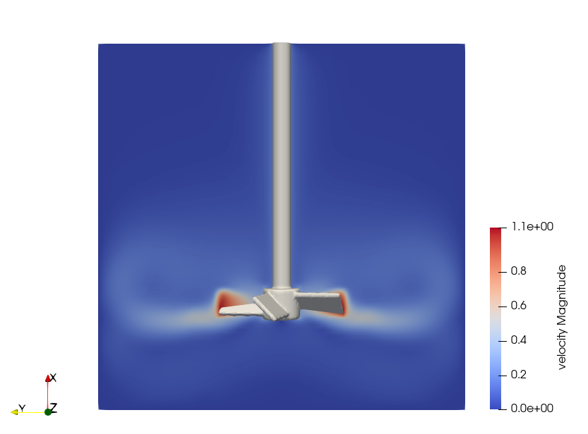
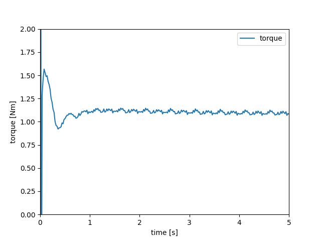

=======================================================================================
3D Mixer with Pitched-Blade Turbine Impeller Using OpenCascade Sharp-Immersed Boundary
=======================================================================================

The mixing of stirred tanks is a common chemical engineering problem that can be tackled through immersed boundary simulation. This example, a variation of :doc:`../3d-composite-mixer-with-pbt-impeller/3d-composite-mixer-with-pbt-impeller`, illustrates how the transient flow in a stirred-tank can be simulated by Lethe using the Sharp-Immersed Boundary formulation with an OpenCasacade shape from a ``.step`` file.

----------------------------------
Features
----------------------------------

- Solvers: ``lethe-fluid-sharp``
- Transient problem
- Rotating complex solid, defined by a ``.step`` file using the OpenCascade shape, modeled with sharp immersed boundary

----------------------------
Files Used in this Example
----------------------------

Both files mentioned below are located in the example's folder (``examples/sharp-immersed-boundary/3d-opencascade-mixer-with-pbt-impeller``).

- Parameter file: ``mixer.prm``
- ``.step`` file: ``impeller.step``

-----------------------
Description of the Case
-----------------------

In this example, we simulate a mixer using a PBT impeller through the usage of a ``.step`` file with the OpenCascade shape feature of the sharp immersed boundary solver.

------------------------------------
Creation of the STEP File
------------------------------------

The ``.step`` file can be defined using any CAD tool available to the user. The ``.step`` file must represent a solid. It is preferable to avoid ``.step`` files that represent shells, composite of solids or a compound of objects.

.. tip::
    Use the union tool at your disposal to avoid issues with ``.step`` files that are defined by a composite of solids. Most CAD software offers the possibility to define a solid from the union of multiple solids. Similarly, if the ``.step`` file is only defined by a shell, it is usually possible to define a solid from that shell. If your CAD tool does not allow these operations, the FreeCAD software allows you to do these operations using the part toolbox.

---------------
Parameter File
---------------

Definition of the Shape and Its Motion
~~~~~~~~~~~~~~~~~~~~~~~~~~~~~~~~~~~~~~

The section defining the solid is almost the same as in :doc:`../3d-composite-mixer-with-pbt-impeller/3d-composite-mixer-with-pbt-impeller`, with the difference being the shape ``type`` and ``shape arguments``.

.. code-block:: text

    subsection particles
      ...
      subsection particle info 0
        ...
        set type            = opencascade
        set shape arguments = impeller.step
      end
    end

Additional information on the ``particles`` parameters can be found on :doc:`../../../parameters/sharp-immersed-boundary/sharp-immersed-boundary`.

--------
Results
--------

The velocity field obtained with this example is similar to the one obtained with the Nitsche immersed boundary and with the shape defined as a composite.

   
Using meter and second as the length and time unit and assuming a fluid density of :math:`1000 \left(\frac{\text{kg}}{\text{m}^3}\right)` produce the following torque on impeller:

