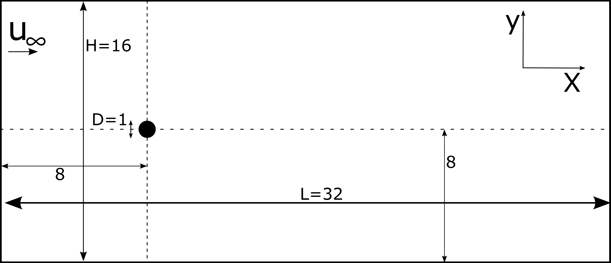
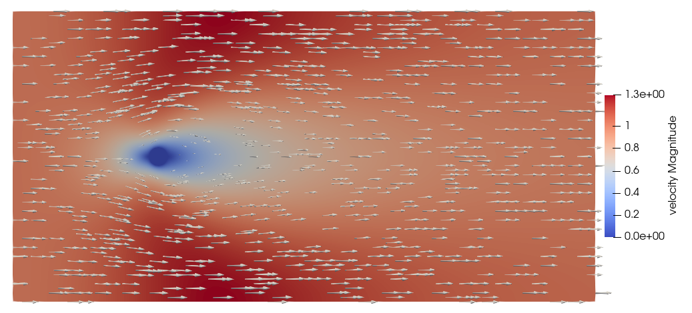

==============================================================================
Flow around a Cylinder Using the Sharp Interface Method
==============================================================================

----------------------------------
Features
----------------------------------

- Solvers: ``lethe-fluid-sharp`` (with Q1-Q1) 
- Steady-state problem
- Explains how to set sharp interface immersed boundary to represent a particle
- Displays the use of non-uniform mesh adaptation 

---------------------------
Files Used in This Example
---------------------------

- Parameter file: ``examples/sharp-immersed-boundary/cylinder-with-sharp-interface/cylinder-with-sharp-interface.prm``

-----------------------
Description of the Case
-----------------------

Mesh
~~~~

In this example, we study the flow around a static cylinder in 2D using the sharp-interface method to represent the cylinder. The geometry of the flow takes the same basic case defined in :doc:`../../incompressible-flow/2d-flow-around-cylinder/2d-flow-around-cylinder`. As such, we use the parameter file associated with :doc:`../../incompressible-flow/2d-flow-around-cylinder/2d-flow-around-cylinder` as the base for this example. The exact dimensions for this example can be found in the following figure.

This case uses a cartesian structured rectangular mesh, and we define the position and radius of the immersed boundary.
    
The mesh is defined using the following subsection.

.. code-block:: text

    subsection mesh
        set type               = dealii
        set grid type          = subdivided_hyper_rectangle
        set grid arguments     = 2,1: 0,0 : 32 , 16  : true
        set initial refinement = 7
    end

Boundary Conditions
~~~~~~~~~~~~~~~~~~~

As for the :doc:`../../incompressible-flow/2d-flow-around-cylinder/2d-flow-around-cylinder`, we define the boundary conditions to have an inlet on the left, two slip boundary conditions at the top and bottom, and an outlet on the right of the domain.

.. code-block:: text

    subsection boundary conditions
      set number = 3
    
      subsection bc 0
        set id   = 0
        set type = function
        subsection u
          set Function expression = 1
        end
        subsection v
          set Function expression = 0
        end
        subsection w
          set Function expression = 0
        end
      end
      subsection bc 1
        set id   = 2
        set type = slip
      end
      subsection bc 2
        set id   = 3
        set type = slip
      end
    end

Initial Conditions
~~~~~~~~~~~~~~~~~~

The initial condition has been modified compared to the initial solution proposed in :doc:`../../incompressible-flow/2d-flow-around-cylinder/2d-flow-around-cylinder`. We use the following initial condition to ensure that the particle's boundary condition is satisfied.

.. code-block:: text

    subsection initial conditions
      set type = nodal
      subsection uvwp
        set Function expression = 0; 0; 0
      end
    end

IB Particles
~~~~~~~~~~~~~

The only thing that is left to define is the immersed boundary.
In this case, we want to define a circular boundary of radius 0.5 center at (8,8) that has no velocity. We use the sphere to model the cylinder in 2D.

.. code-block:: text

    subsection particles
      set number of particles                     = 1
      set assemble Navier-Stokes inside particles = false
      subsection extrapolation function
        set stencil order = 2
      end
      subsection local mesh refinement
        set initial refinement                = 0
        set refine mesh inside radius factor  = 0.8
        set refine mesh outside radius factor = 1.2
      end
      subsection particle info 0    
        set type             = sphere
        set shape arguments  = 0.5
        set integrate motion = false
        subsection position
          set Function expression = 8;8
        end
        subsection velocity
          set Function expression = 0;0
        end
      end
    end
    
* ``number of particles`` is set to one as we only want one particle.

* ``stencil order`` is set to 2 as this is the highest order that is compatible with the FEM scheme and it does not lead to Runge instability. The highest order of stencil compatible with a FEM scheme is defined by the polynomial order of the scheme time the number of dimensions. In this case 2.

* ``refine mesh inside radius factor`` is set to 0.8. This will create a mesh refinement around the particle that avoids having hanging nodes in the calculation and helps ensure an adequately fine mesh around the particle.

* ``refine mesh outside radius factor`` is set to 1.2. This will create a mesh refinement around the particle that avoids having hanging nodes in the calculation and helps ensure an adequately fine mesh around the particle.

* ``initial refinement`` is set to 0. In this case, the initial mesh is small enough to ensure that the mesh around the particle is sufficiently smaller than the particle. In this case, it is not necessary to pre-refine the mesh around the particle.

* ``integrate motion`` is set to false because we are not interested in the dynamic of the particle as this is a steady case.

* ``assemble Navier-Stokes inside particles`` is set to false because we are not interested in the flow inside of the particle.

* ``position`` Function expression is set to 8;8 as the position of the particle is constant in time, and the center of the particle is at this position.

* ``velocity`` Function expression is set to 0;0 as the velocity of the particle is 0 and the case is steady.

All the other parameters have been set to their default values since they do not play a role in this case.

---------------
Results
---------------

The simulation of this case results in the following solution for the velocity and pressure field. 

Velocity:
 

Pressure: 

.. image:: images/example10-pressure.png
    :alt: Simulation schematic
    :align: center

We get the following force applied on the particle for each of the mesh refinements, which is similar to the one obtained with a conformal mesh in :doc:`../../incompressible-flow/2d-flow-around-cylinder/2d-flow-around-cylinder`. With the conformal mesh drag force applied to the particle is 7.123. The difference between the 2 can mostly be attributed to the discretization error.

.. code-block:: text

    particle_ID    T_z        f_x         f_y
            0   -0.006703   6.447400    0.004273
            0   -0.000389   6.775330    0.000379
            0   -0.000040   6.906123    0.000377
            0   -0.000053   6.962566    0.000310
            0   -0.000039   6.992112    0.000193
          
.. note:: 
    The drag coefficient obtained in this case is higher than the drag coefficient for a cylinder at a Reynolds number of 1 as the size of the domain is not large enough relative to the diameter of the cylinder. The flow around the cylinder is then constrained by the lateral boundaries, and this increases the drag coefficient.

