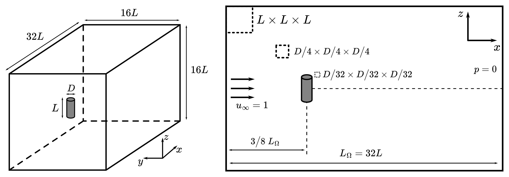
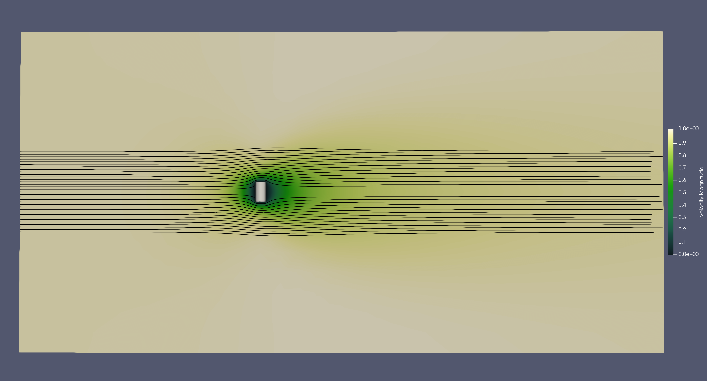
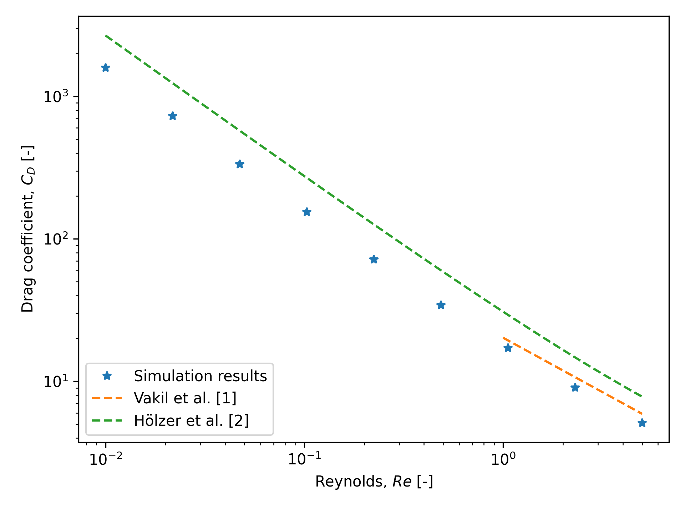

==============================================================================
Flow around a Finite Cylindrical Particle Using the Sharp Interface Method
==============================================================================

This example simulates the flow around a perpendicular (:math:`\theta = 90^\circ`) cylinder at low Reynolds number (:math:`Re \in [0.01, 5]`) and for an aspect ratio (defined as :math:`Ar = L/D`) of 2.

----------------------------------
Features
----------------------------------

- Solver: ``lethe-fluid-sharp`` (with Q1-Q1)
- Steady-state problem
- Static non-spherical particle
- Force calculation validation

---------------------------
Files Used in This Example
---------------------------

- Parameter file: ``examples/sharp-immersed-boundary/cylindrical-particle-drag-evaluation-with-sharp-interface/cylindrical-particle-drag-evaluation-with-sharp-interface.prm``

------------------------
Description of the Case
------------------------

This example showcases the use of sharp immersed boundary conditions to simulate flow around non-spherical objects, in this case a cylindrical particle perpendicular to the flow.

This example focuses on cylindrical particles of small aspect ratio :math:`Ar` (:math:`Ar = L/D = 2`) at low Reynolds numbers ranging from 0.01 to 5. To validate the simulation results, the drag coefficient is
compared to the expected results from the literature.

---------------
Parameter File
---------------

Mesh
~~~~

As shown in the previous figure, the flow around the particle is modelled using a prismatic channel the size of which depends on the size of the particle. In this case, we consider a particle with a diameter of :math:`D = 1`, therefore we have :math:`L = 2`.
The domain, of size :math:`32 L \times 16 L \times 16 L`, was found to produce results independant of domain sizes with a low computational cost.

The mesh is first defined coarsely away from the particle with elements of size :math:`L \times L \times L`. The particle is positionned at :math:`3/8` of the domain length to avoid boundary interactions and allow the flow to develop both behind and in front of the particle.
We then make use of a ``box refinement`` to refine the mesh around the particle and properly evaluate the velocity field with elements of size :math:`1/4 D \times 1/4 D \times 1/4 D`.

.. code-block:: text

  subsection mesh
    set type               = dealii
    set grid type          = subdivided_hyper_rectangle
    set grid arguments     = 2,1,1 : -24,-16,-16 : 40,16,16 : true
    set initial refinement = 4
  end

  subsection box refinement
    set initial refinement = 3
    subsection mesh
      set type               = dealii
      set grid type          = subdivided_hyper_rectangle
      set grid arguments     = 2,1,1 : -6,-4,-4 : 10,4,4 : true
      set initial refinement = 0
    end
  end

Immersed Boundary Particles
~~~~~~~~~~~~~~~~~~~~~~~~~~~

We define the particle in flow using the sharp immersed boundary method. The particle is defined as a cylinder with a radius of :math:`D/2 = 0.5` and a half-length of :math:`L/2 = 1.0`. The particle is centered at :math:`(0,0,0)`
and the cylider's axis is oriented perpendicularly to direction of the flow.

The ``local mesh refinement`` is set to 3 to ensure we resolve the boundary layer flow around the particle with elements of size :math:`1/32 D \times 1/32 D \times 1/32 D`.

.. code-block:: text

  subsection particles
    set number of particles                     = 1
    set assemble Navier-Stokes inside particles = false
    subsection extrapolation function
      set stencil order = 2
      set length ratio  = 1
    end
    subsection local mesh refinement
      set initial refinement                = 3
      set refine mesh inside radius factor  = 0.75
      set refine mesh outside radius factor = 2
    end
    subsection particle info 0
      set type             = cylinder
      set shape arguments  = 0.5;1.0
      set integrate motion = false
      subsection position
        set Function expression = 0;0;0
      end
      subsection orientation
        set Function expression = 1.5707963267948966;0;0
      end
    end
  end

Boundary Conditions
~~~~~~~~~~~~~~~~~~~

We define the boundary conditions similarly to the :doc:`../../incompressible-flow/3d-flow-around-sphere/flow-around-sphere` example although, in our case, we won't need a boundary condition defined on the particle as the sharp immersed boundary method will take care of it.

The domain makes use of an inlet velocity of :math:`1~m/s` on the left, slip boundary conditions parallel to the flow direction, and an `outlet` boundary condition, corresponding to :math:`p = 0`, at the right of the domain.

.. code-block:: text

  subsection boundary conditions
    set number = 6
    subsection bc 0
      set id   = 0
      set type = function
      subsection u
        set Function expression = 1
      end
      subsection v
        set Function expression = 0
      end
      subsection w
        set Function expression = 0
      end
    end
    subsection bc 1
      set id   = 1
      set type = outlet
    end
    subsection bc 2
      set id   = 2
      set type = slip
    end
    subsection bc 3
      set id   = 3
      set type = slip
    end
    subsection bc 4
      set id   = 4
      set type = slip
    end
    subsection bc 5
      set id   = 5
      set type = slip
    end
  end

Physical Properties
~~~~~~~~~~~~~~~~~~~

In order to produce a varying Reynolds number, we vary the kinematic viscosity of the fluid. We define the Reynolds number as :math:`Re = \frac{UD}{\nu}` where :math:`U` and :math:`D` are fixed at 1. Therefore,
the kinematic viscosity is defined as :math:`\nu = \frac{1}{Re}`.

Note that this definition of the Reynolds number depends only on the particle's diameter, not its length. We select this parameter because it primarily governs the flow regime around the particle.
The following block defines the viscosity for a Reynolds number of 1:

.. code-block:: text

  subsection physical properties
    subsection fluid 0
      set kinematic viscosity = 1
    end
  end

Simulation Control
~~~~~~~~~~~~~~~~~~~

With the Reynolds number ranging from 0.01 to 5, the simulation can easily be solved by using a steady-state solver. The mesh is sufficiently refined to capture the flow around the particle and therefore doesn't require any mesh adaptation.

.. code-block:: text

  subsection simulation control
    set method      = steady
    set output path = ./particle_drag_out/
  end

---------------
Results
---------------

We obtain the following solution for the velocity and pressure:

Velocity:

Pressure:

.. image:: images/cylindrical-particle-drag-evaluation-with-sharp-interface-pressure.png
  :alt: Pressure field around the particle
  :align: center

The drag coefficient :math:`C_d` is:

.. math::

  C_d = \frac{F_d}{0.5 \rho U^2 A} = \frac{2f_x}{U^2 L D}

Where :math:`F_d` is the drag force, :math:`\rho` is the fluid density, :math:`U` is the velocity, and :math:`A` is the projected area :math:`(A = LD)`. In Lethe, we solve for :math:`f = F/\rho`. Therefore, the drag force is calculated as the force applied on the particle in the flow direction using :math:`f_x` from the simulation output.

The following graph shows the drag coefficient as a function of the Reynolds number. The results are compared to the literature values for a perpendicular cylinder with an aspect ratio of 2.

Here we show the drag models of Vakil and Green [#vakil2009]_ and Hölzer and Sommerfeld [#holzer2008]_ for comparison. Vakil's drag model is specifically made for cylinders in flow of Reynolds from 1 to 40, whereas Hölzer's model is meant to be more general for non-spherical particles defined by their sphericity in all flow regimes.

From the graph, we show good agreements with Vakil's model for Reynolds numbers ranging from 1 to 5. For values not covered by Vakil's model, we can see that the drag follows a similar trend to Hölzer's model.
The difference with Hölzer's model can be explained by the fact that it is very hard to produce a precise drag model that encompasses all particle geometries in all flow regimes. As such, errors are expected, but it gives a very good ballpark approximation for non-spherical particles.

----------------------------
Possibilities for Extensions
----------------------------

- To further validate the simulation results, the drag coefficient could be compared to the literature for a broader range of Reynolds numbers.
- It would be interesting to investigate the switch from a particle perpendicular to the flow to a particle aligned with the flow and its effect on the drag coefficient. This could be done by varying the orientation of the particle in the flow.
- It would be interesting to investigate the effect of the aspect ratio of the particle on the drag coefficient.

---------------
Reference
---------------

.. [#vakil2009] \A. Vakil, S. I. Green, “Drag and lift coefficients of inclined finite circular cylinders at moderate Reynolds numbers,” *Computers & Fluids*, vol. 38, no. 9, pp. 1771-1781, Oct. 2009, doi: `10.1016/j.compfluid.2009.03.006 <https://doi.org/10.1016/j.compfluid.2009.03.006>`_\.
.. [#holzer2008] \A. Hölzer, M. Sommerfeld, “New simple correlation formula for the drag coefficient of non-spherical particles,” *Powder Technology*, vol. 184, no. 3, pp. 361-365, Jun. 2008, doi: `10.1016/j.powtec.2007.08.021 <https://doi.org/10.1016/j.powtec.2007.08.021>`_\.

