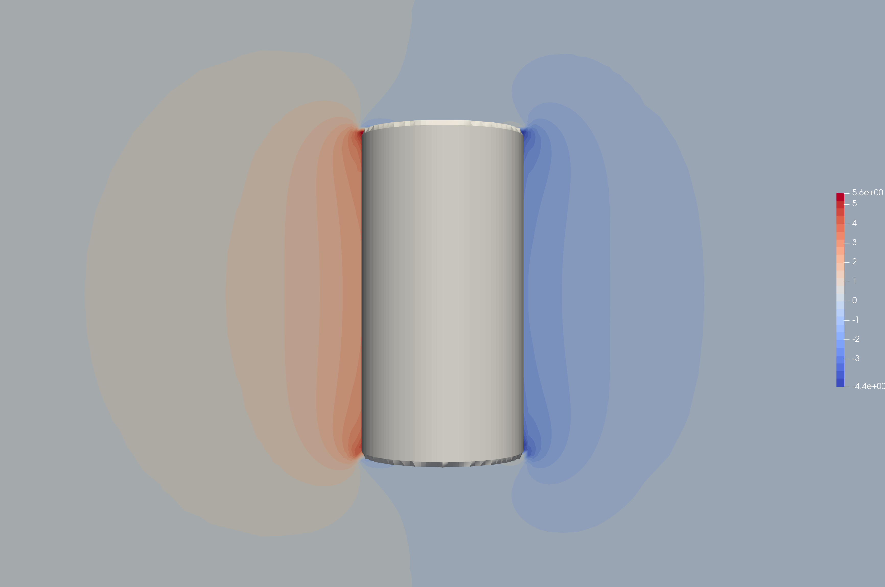

==============================================================================
Flow around a Finite Cylindrical Particle Using the Sharp Interface Method
==============================================================================

.. This example focuses on the drag coefficient validation for a perpendicular (theta = 90) cylindrical particle for low Reynolds [0.1, 1] and an aspect ratio of 2. 
.. A bigger parameter sweep could be documented in a future example.

----------------------------------
Features
----------------------------------

- Solvers: ``lethe-fluid-sharp`` (with Q1-Q1) 
- Steady-state problem
- Non-spherical particle in resolved flow
- Force calculation validation

---------------------------
Files Used in This Example
---------------------------

- Parameter file: ``examples/sharp-immersed-boundary/flow-around-particle-sharp/flow-around-particle-sharp.prm``

------------------------
Description of the Case
------------------------

This example showcases the use of sharp immersed boundary conditions to simulate flow around non-spherical objects, in this case a cylindrical particle perpendicular to the flow. 
This example focuses on small cylindrical particles (:math:`Ar = L/D = 2`) at low Reynolds numbers ranging from 0.1 to 1. To validate the simulation results, the derived drag coefficient is 
compared to the expected results from the literature. 

---------------
Parameter File
---------------

Mesh
~~~~

The geometry, as shown in the previous figure, is fully defined by the particle's geometry. The mesh is first defined coarsely away from the particle with elements of size :math:`L \times L \times L` with :math:`L = 2`. 
We then make use of a ``box refinement`` to refine the mesh around the particle and properly evaluate the flow field and the wake with elements of size :math:`0.25D \times 0.25D \times 0.25D` with :math:`D = 1`.

.. code-block:: text 

    subsection mesh
        set type                   = dealii
            set grid type          = subdivided_hyper_rectangle
            set grid arguments     = 2,1,1 : -24,-16,-16 : 40,16,16 : true
            set initial refinement = 4
        end

    subsection box refinement 
        set initial refinement = 3
        subsection mesh
            set type               = dealii
            set grid type          = subdivided_hyper_rectangle
            set grid arguments     = 2,1,1: -6,-4,-4 : 10,4,4 : true
            set initial refinement = 0
        end
    end

IB Particles
~~~~~~~~~~~~~

We define the particle in flow with the use of the sharp immersed boundary method. The particle is defined as a cylinder with a radius of 0.5 and a half-length of 1.0. The particle is centered at (0,0) 
and oriented perpendicularly to the flow. The ``local mesh refinement`` is set to 3 to ensure a fine mesh and properly resolve the boundary layer flow around the particle.

.. code-block:: text

    subsection particles
        set number of particles                     = 1
        set assemble Navier-Stokes inside particles = false
        subsection extrapolation function
            set stencil order = 2
            set length ratio  = 1
        end
        subsection local mesh refinement
            set initial refinement                = 3
            set refine mesh inside radius factor  = 0.75
            set refine mesh outside radius factor = 2
        end
        subsection particle info 0
            set type            = cylinder
            set shape arguments = 0.5;1.0
            set integrate motion = false
            subsection position
                set Function expression = 0;0;0
            end
            subsection orientation
                set Function expression = 1.5707963267948966;0;0
            end
        end
    end

Boundary Conditions
~~~~~~~~~~~~~~~~~~~

We define the boundary conditions similarly to :doc:`../../incompressible-flow/3d-flow-around-sphere/flow-around-sphere` although, in our case, we won't need a boundary condition defined on the particle as the sharp immersed boundary method will take care of it.à
The domain makes use of an inlet velocity of :math:`1~m/s` on the left, slip boundary conditions parallel to the flow direction, and an outlet on the right of the domain. 

.. code-block:: text

    subsection boundary conditions
        set number = 5
        subsection bc 0
            set id   = 0
                set type = function
            subsection u
                set Function expression = 1
            end
            subsection v
                set Function expression = 0
            end
            subsection w
                set Function expression = 0
            end
        end
        subsection bc 1
            set id   = 2
            set type = slip
        end
        subsection bc 2
            set id   = 3
            set type = slip
        end
        subsection bc 3
            set id   = 4
            set type = slip
        end
        subsection bc 4
            set id   = 5
            set type = slip
        end
    end

Physical Properties
~~~~~~~~~~~~~~~~~~~

In order to produce a varying Reynolds number, we vary the kinematic viscosity of the fluid. We define the Reynolds number as :math:`Re = \frac{UD}{\nu}` where :math:`U` and :math:`D` are fixed at 1. Therefore, 
the kinematic viscosity is defined as :math:`nu = \frac{1}{Re}`. The following block defines the viscosity for a Reynolds number of 1.

.. code-block:: text

    subsection physical properties
        subsection fluid 0
            set kinematic viscosity = 1
        end
    end

Simulation Control
~~~~~~~~~~~~~~~~~~~

With the Reynolds number ranging from 0.1 to 1, the simulation can easily be solved by using a steady-state solver. The mesh is sufficiently refined to capture the flow around the particle and therefore doesn't 
require any mesh adaptation.

.. code-block:: text

    subsection simulation control
        set method            = steady
        set number mesh adapt = 2
        set output path       = ./
        set output name       = out
        set output control    = iteration
        set output frequency  = 1
        set subdivision       = 1
    end

---------------
Results
---------------

The simulation of this case results in the following solution for the velocity and pressure field.

Velocity:
 

Pressure: 

The drag coefficient is calculated for each Reynolds number using the following formula:

.. math::

    C_d = \frac{F_d}{0.5 \rho U^2 D} = \frac{2f_x}{U^2 D}

Where :math:`F_d` is the drag force, :math:`\rho` is the fluid density, :math:`U` is the velocity, and :math:`D` is the diameter of the particle. The drag force is calculated as the force applied 
on the particle in the flow direction, in this case using :math:`f_x` from the output.

The following graph shows the drag coefficient as a function of the Reynolds number. The results are compared to the litterature values for a perpendicular cylinder with an aspect ratio of 2.

----------------------------
Possibilities for Extensions
----------------------------

- To further validate the simulation results, the drag coefficient could be compared to the litterature for a wider range of Reynolds numbers.
- It would be interesting to investigate the switch from inline to perpendicular flow for the particle and the effect on the drag coefficient. This could be done by varying the orientation of the particle in flow.
- It would be interesting to investigate the effect of the finite size of the particle on the drag coefficient. This could be done by varying the aspect ratio of the particle.