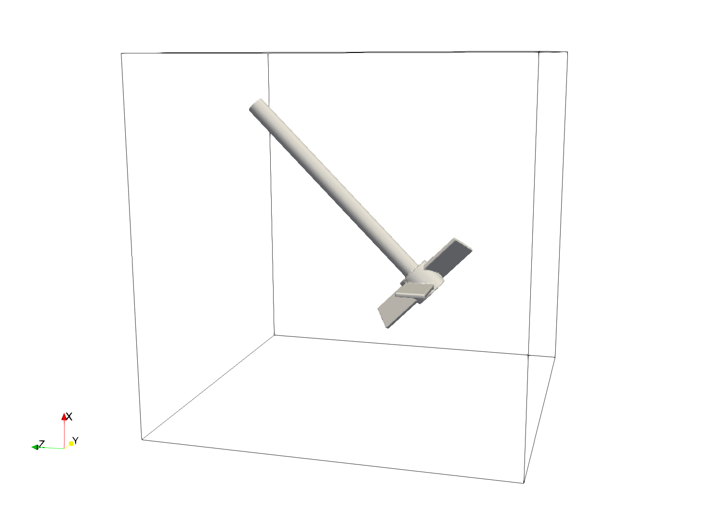
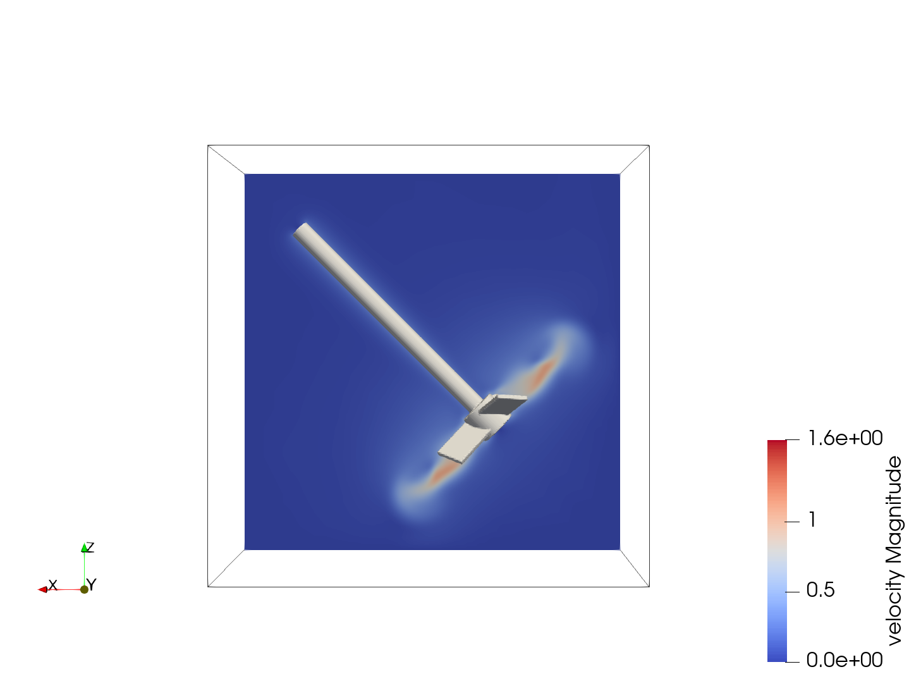

============================================================================================
Incline 3D Mixer with Pitched-Blade Turbine Impeller Using Composite Sharp-Immersed Boundary
============================================================================================

The mixing of stirred tanks is a common chemical engineering problem that can be tackled through immersed boundary simulation. This example presents an incline impeller as a variation of :doc:`../3d-composite-mixer-with-pbt-impeller/3d-composite-mixer-with-pbt-impeller` to illustrate how to define the impeller motion in an arbitrary incline angle properly.

----------------------------------
Features
----------------------------------
- Solvers: ``lethe-fluid-sharp``
- Transient problem
- Rotating complex solid modeled with an arbitrary inclination with the sharp immersed boundary method

----------------------------
Files Used in This Example
----------------------------

* Parameter file: ``/examples/sharp-immersed-boundary/incline-3d-composite-mixer-with-pbt-impeller/mixer.prm``
* Composite geometry file: ``/examples/sharp-immersed-boundary/incline-3d-composite-mixer-with-pbt-impeller/impeller.composite``

-----------------------
Description of the Case
-----------------------

In this example, we simulate a mixer using a PBT impeller through the usage of Sharp-Immersed boundaries. The shape of the impeller is defined by a composition of basic shapes in an identical maner as in exemple :doc:`../3d-composite-mixer-with-pbt-impeller/3d-composite-mixer-with-pbt-impeller`. The objective is to show how to define the rotating motion of the impeller properly when the object is rotating on an arbitrary axis. The tank use in this example is a sample cube. For this case we model an impeller that is rotating around the axis define by the vector :math:`[1,0,1]`. The visualisation of the geometries is presented in the following figure.

---------------
Parameter File
---------------

Mesh definition 
~~~~~~~~~~~~~~~

The mesh is define using a simple cube with an initial mesh refinement of 4. 

.. code-block:: text

    subsection mesh
      set type               = dealii
      set grid type          = subdivided_hyper_rectangle
      set grid arguments     = 1,1,1:-0.5,-0.5,-0.5 : 0.5, 0.5, 0.5: true
      set initial refinement = 4
    end

The mesh adaptation is identical to the mesh adaptation section used for the other stirred tanks cases, except that the maximum refinement level has been increased to 8.

.. code-block:: text

    subsection mesh adaptation
      set type                 = kelly
      set variable             = velocity
      set fraction type        = fraction
      set max number elements  = 1200000
      set max refinement level = 8
      set min refinement level = 3
      set frequency            = 1
      set fraction refinement  = 0.2
    end
    

Boundary Conditions 
~~~~~~~~~~~~~~~~~~~   
The boundary condition is similar to the other stirred tank cases except we let the top boundary of the problem with an open boundary.

.. code-block:: text

    subsection boundary conditions
      set number = 5
      subsection bc 0
        set id   = 0
        set type = noslip
      end
      subsection bc 1
        set id   = 1
        set type = noslip
      end
      subsection bc 2
        set id   = 2
        set type = noslip
      end
      subsection bc 3
        set id   = 3
        set type = noslip
      end
      subsection bc 4
        set id   = 4
        set type = noslip
      end
      subsection bc 5
        set id   = 5
        set type = noslip
      end
    end
    
 
    

Definition of the Impeller Motion
~~~~~~~~~~~~~~~~~~~~~~~~~~~~~~~~~~~~~~

The orientation of an object using the sharp interface immersed boundary method is defined using Euler angles and an XYZ rotation convention. As such, determining the orientation of an object as it rotates around an arbitrary cannot be directly defined by the direct integration of the angular velocity. To do so, we instead use Rodrigues' rotation matrix, and from this rotation matrix, we extract the XYZ rotation angle. This calculation can be symbolically performed by a simple Python code using the sympy library. The code is given in the example folder but is also presented here. One is to adjust the initial rotation of the object and the angular velocity of the object. Here, the initial rotation of the impeller is given by a :math:`\frac{\pi}{4}` rad rotation around the Y axis to align the impeller with the :math:`[1,0,1]` vector. Then the rotation speed is given by :math:`\mathbf{\omega}=2 \p 2 [-1,0,-1]`.

.. code-block:: text

    from sympy import *
    import numpy as np

    x, y, z,  ox, oy, oz, pi, t= symbols('x y z ox oy oz pi t ')

    def rot_axisx(theta):
        """Returns a rotation matrix for a rotation of theta (in radians) about
        the 1-axis.
        [...]
        """
        ct = cos(theta)
        st = sin(theta)
        lil = ((1, 0, 0),
               (0, ct, -st),
               (0, st, ct))
        return Matrix(lil)

    def rot_axisy(theta):
        """Returns a rotation matrix for a rotation of theta (in radians) about
        the 2-axis.
        [...]
        """
        ct = cos(theta)
        st = sin(theta)
        lil = ((ct,0,st),
               (0, 1, 0),
               (-st, 0, ct))
        return Matrix(lil)

    def rot_axisz(theta):
        """Returns a rotation matrix for a rotation of theta (in radians) about
        the 3-axis.
        [...]
        """
        ct = cos(theta)
        st = sin(theta)
        lil = ((ct, -st, 0),
               (st, ct, 0),
               (0, 0, 1))
        return Matrix(lil)

    def rotation_matrix_to_xyz_angles(R):
        """
        Extracts XYZ rotation angles from a given rotation matrix.

        Parameters:
        R (Matrix): A 3x3 rotation matrix.

        Returns:
        tuple: A tuple of rotation angles (theta_x, theta_y, theta_z) in radians.
        """
        if R.shape != (3, 3):
            raise ValueError("Input must be a 3x3 matrix.")

        # Calculating the angles
        theta_x = atan2(-R[1, 2], R[2, 2])
        theta_y = asin(R[0, 2])
        theta_z = atan2(-R[0, 1], R[0, 0])

        return theta_x, theta_y, theta_z

    # Rotation matrix for a small time step dt
    initial_rot_x=0
    initial_rot_y=pi/4
    initial_rot_z=0

    Initial_rotation=rot_axisx(initial_rot_x)*rot_axisy(initial_rot_y)*rot_axisz(initial_rot_z)

    # Angular velocity vector
    ox=-1*np.pi*2
    oy=0
    oz=-1*np.pi*2

    # Magnitude of the angular velocity vector
    omega_mag = sqrt(ox**2 + oy**2 + oz**2)

    # Unit vector along the direction of angular velocity
    u_x = ox / omega_mag
    u_y = oy / omega_mag
    u_z = oz / omega_mag

    # Rodrigues' rotation formula components
    K = Matrix([[0, -u_z, u_y],
                [u_z, 0, -u_x],
                [-u_y, u_x, 0]])

    I = Matrix([[1, 0, 0],
                [0, 1, 0],
                [0, 0, 1]])

    R = I + sin(omega_mag*t) * K + (1 - cos(omega_mag*t)) * K**2

    theta_x, theta_y, theta_z=rotation_matrix_to_xyz_angles(R*Initial_rotation)

    # Print orientation
    print(str(theta_x).replace("**","^")+';'+str(theta_y).replace("**","^")+';'+str(theta_z).replace("**","^"))

From this Python code, we obtained the following expression of the orientation using the XYZ rotation convention of the impeller as it rotates.

.. code-block:: text

    subsection orientation
          set Function expression =atan2(0.707106781186547*sin(pi/4)*sin(8.88576587631673*t) - 0.707106781186547*sin(8.88576587631673*t)*cos(pi/4), (0.5 - 0.5*cos(8.88576587631673*t))*sin(pi/4) + (0.5*cos(8.88576587631673*t) + 0.5)*cos(pi/4));asin((0.5 - 0.5*cos(8.88576587631673*t))*cos(pi/4) + (0.5*cos(8.88576587631673*t) + 0.5)*sin(pi/4));atan2(-0.707106781186547*sin(8.88576587631673*t), -(0.5 - 0.5*cos(8.88576587631673*t))*sin(pi/4) + (0.5*cos(8.88576587631673*t) + 0.5)*cos(pi/4))
    end

The parameters used to define the impeller  is based on the example: :doc:`../3d-composite-mixer-with-pbt-impeller/3d-composite-mixer-with-pbt-impeller`, giving the following:

.. code-block:: text

    subsection particles
       set number of particles                     = 1
      set assemble Navier-Stokes inside particles = false
      subsection extrapolation function
        set stencil order = 2
        set length ratio  = 3
      end
      subsection local mesh refinement
        set initial refinement                = 6
        set refine mesh inside radius factor  = 0
        set refine mesh outside radius factor = 1.25
      end
      subsection output
        set enable extra sharp interface vtu output field = true
      end
      subsection particle info 0
        subsection position
          set Function expression = 0;0;0
        end
        subsection velocity
          set Function expression = 0;0;0
        end
        subsection orientation
          set Function expression =atan2(0.707106781186547*sin(pi/4)*sin(8.88576587631673*t) - 0.707106781186547*sin(8.88576587631673*t)*cos(pi/4), (0.5 - 0.5*cos(8.88576587631673*t))*sin(pi/4) + (0.5*cos(8.88576587631673*t) + 0.5)*cos(pi/4));asin((0.5 - 0.5*cos(8.88576587631673*t))*cos(pi/4) + (0.5*cos(8.88576587631673*t) + 0.5)*sin(pi/4));atan2(-0.707106781186547*sin(8.88576587631673*t), -(0.5 - 0.5*cos(8.88576587631673*t))*sin(pi/4) + (0.5*cos(8.88576587631673*t) + 0.5)*cos(pi/4))
        end
        subsection omega
          set Function expression = -1*pi*2;0;-1*pi*2
        end
        set type            = composite
        set shape arguments = impeller.composite
      end
    end

There are only noticeable differences with the parameter section of example :doc:`../3d-composite-mixer-with-pbt-impeller/3d-composite-mixer-with-pbt-impeller`. The initial refinement and the refinement zone are adjusted respectively to  6 and 0 to 1.25 reference length. These value to guarantee that the refinement zone is big enough to englobe the motion of the impeller and avoid interaction of the hanging nodes and the sharp immersed boundary constraints.

--------
Results
--------

The velocity field obtained with this example after 1 second:

   

