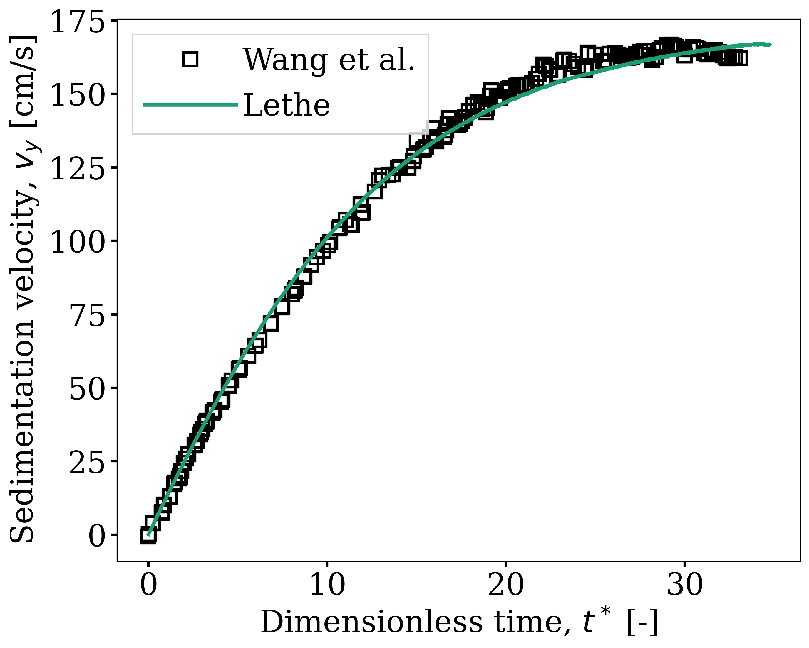

==============================================================================
Sedimentation of One Cuboid Particle
==============================================================================

This example aims to simulate the S18 experiment of Wang `et al.` [#Wang2024]_. This experience measures the velocity of the sedimentation of a :math:`2\,\text{cm}` cuboid particle in a container filled with a glycerin-water solution.

.. note::
    This example is similar to the sedimentation of one particle example (:doc:`../sedimentation-1-particle/sedimentation-1-particle`) but with a cuboid particle instead of a sphere. As such, the physical setup changes, but the parameters relating to the numerical resolution remain very similar.

----------------------------------
Features
----------------------------------

- Solvers: ``lethe-fluid-sharp`` (with Q1-Q1)
- Transient problem
- Displays the capability of the resolved CFD-DEM solver for the flow around one non-spherical particle

---------------------------
Files Used in This Example
---------------------------

- Parameter file: ``/examples/sharp-immersed-boundary/sedimentation-1-cuboid/sedimentation-1-cuboid.prm``

-----------------------
Description of the Case
-----------------------

The S18 experiment consists of the release of a cuboid particle made of stainless steel (:math:`\rho_p=0.00759 \frac{\text{kg}}{\text{cm}^{3}}`)  with sides of 2.0 cm dropped into a water column of dimensions :math:`40 \times 80 \times 40\,\text{cm}`. In their experiment, the authors use a glycerin-water solution with varying concentrations to get different settling regimes. The relevant properties to the S18 case, as reported by the authors, are the fluid kinematic viscosity :math:`\nu_f=1.07 \frac{\text{kg}}{\text{s cm}}` and the fluid density :math:`\rho_f=0.00124 \frac{\text{kg}}{\text{cm}^{3}}` leading to a particle Reynolds number of :math:`Re_p \approx 300`. The gravity constant is :math:`g= -981 \frac{\text{cm}}{\text{s}^{2}}`. The particle accelerates due to gravity until it hits the bottom of the container, at which point we stop the simulation.

.. note:: 
    You will note that we have transformed every length unit into centimeters. The reason is that the particle's size is very close to :math:`1\,\text{cm}`. Representing the problem in this way improves the condition number of the linear system. It avoids extremely small values in the matrix due to the volume of cells being expressed in :math:`\text{cm}^{3}` instead of :math:`\text{m}^{3}`.
    
All the container walls have no-slip boundary conditions except at the top of the container, where we define an open boundary.

---------------
Parameter File
---------------

In each section of the parameter file, we describe relevant parameters to the simulation. As stated before, most of the parameters are similar to the ones used in the sedimentation of one particle example. We will only describe the parameters that are different from the previous example.
 
Simulation Control
~~~~~~~~~~~~~~~~~~~~~~~~~~~~~~
.. code-block:: text

    subsection simulation control
      set method             = bdf2
      set time step          = 0.0005 
      set adapt              = true
      set output frequency   = 10
      set max cfl            = 0.5
      set time end           = 0.6    
      set output path        = out/
    end

* The ``time step`` is set to  ``0.0005``. This is very small for this case but it ensures that the particle is properly accelerated from rest at the beginning of the simulation. In order to reduce the computational time, we use use adaptive time stepping with a maximum CFL of ``0.5``. This will allow the time step to increase as the particle accelerates and the flow becomes more steady around the particle.

* The ``time end`` is set to  ``0.6``. This is approximately the sedimentation time of the particles as recorded in the article by Wang `et al.` [#Wang2024]_.

Physical Properties
~~~~~~~~~~~~~~~~~~~~~~~~~~~~~~
.. code-block:: text

    subsection physical properties
      subsection fluid 0
        set kinematic viscosity = 1.07
        set density             = 0.00124
      end
    end

These values are obtained from the article by Wang `et al.` [#Wang2024]_ and further communications with the authors.

Mesh
~~~~~~
.. code-block:: text

    subsection mesh
      set type               = dealii
      set grid type          = subdivided_hyper_rectangle
      set grid arguments     = 1,2,1: 0,0,0 : 40,80,40 : true
      set initial refinement = 5
    end

The domain is a rectangular box and as such we can directly use a subdivided hyper rectangle mesh from the deal.II library. In this case, we have orientated the y-direction with gravity. As such, we have the long side of the box along this axis.

* The ``grid arguments`` are set to  ``1,2,1: 0,0,0 : 40,80,40 : true``. This section has 3 subsections. Firstly, ``1,2,1`` describes the initial subdivision of the box. This subdivision has been chosen as it is the smallest mesh we can do of the box in order to have cubic elements. Secondly, ``0,0,0 : 40, 80, 40`` describes the 2 points from which we have derived the rectangular box (0,0,0) and  (40,80,40). Finally, we have ``true``, which is a boolean to activate the coloration of the boundary. This allows us to define separate boundary conditions at each side of the box.

* The ``initial refinement`` is set to 5. This will ensure to have a base mesh that is a bit finer than the particle.

Mesh Adaptation
~~~~~~~~~~~~~~~
.. code-block:: text

    subsection mesh adaptation
      set fraction coarsening = 0.3
      set fraction refinement = 0.05
      set max number elements = 750000

      set max refinement level = 8
      set min refinement level = 4

      set type = kelly
      set variable = velocity
    end

* The ``fraction coarsening`` is set to ``0.3``.The results are shown in the animation below.  This limits the accumulation of elements when the particle is moving. It allows for cells far from the particle to be coarsened when the particles get further away.

* The ``fraction refinement`` is set to ``0.05``. The objective here is to refine elements that become close to the particle when it's moving. This will mostly refine elements around the particle that are not already included in the refinement zone around the particle.

* The ``max refinement level`` is set to ``8``. This parameter limits how small the elements around the particle can get limiting the total number of elements in the problem. Here we limit the mesh size to ~ :math:`10` elements per sides of the cuboid. An initial mesh sensitivity study showed this resulted in close to mesh independent results sufficient for demonstration purposes, although a more refined mesh would be required for a rigorous study

* The ``type`` is set to ``kelly``. Since the particle is moving and we do not want a uniform refinement of all the cells, we use the kelly error estimator based on the ``velocity`` variable.

Boundary Conditions
~~~~~~~~~~~~~~~~~~~
.. code-block:: text

  subsection boundary conditions
    set number = 6
    subsection bc 0
      set type = noslip
    end
    subsection bc 1
      set type = noslip
    end
    subsection bc 2
      set type = noslip
    end
    subsection bc 3
      set type = outlet
    end
    subsection bc 4
      set type = noslip
    end
    subsection bc 5
      set type = noslip
    end
  end

Here we define the :math:`5` ``no slip`` boundary for all the box walls and specify the boundary with ``id=3`` to an outlet representing the top of the box. We refer the reader to the :doc:`../../../parameters/cfd/boundary_conditions_cfd` section on how those boundaries are defined. 

.. note:: 
    The boundary id of deal.II rectangular mesh are numbered as such:  :math:`x_{min}=0`, :math:`x_{max}=1`, :math:`y_{min}=2`, :math:`y_{max}=3`, :math:`z_{min}=4`, :math:`z_{max}=5`, as described by the `GridGenerator documentation <https://www.dealii.org/current/doxygen/deal.II/namespaceGridGenerator.html>`_.

IB Particles
~~~~~~~~~~~~~~
.. code-block:: text

    subsection particles
      subsection extrapolation function
        set length ratio  = 2
        set stencil order = 3
      end

      subsection local mesh refinement
        set initial refinement                = 4
        set refine mesh inside radius factor  = 0.8
        set refine mesh outside radius factor = 1.5
      end

      subsection DEM
        set particle nonlinear tolerance      = 1e-2
        set enable lubrication force          = false
        set explicit contact impulsion        = true
        set explicit position integration     = true
        set contact search radius factor      = 1.2
        subsection gravity
          set Function expression = 0;-981;0
        end
      end

      subsection particle info 0
        set type             = superquadric
        set shape arguments  = 1.;1.;1.;5;5;5
        set integrate motion = true

        subsection position
          set Function expression = 20;70;20
        end
        subsection velocity
          set Function expression = 0;0;0
        end

        subsection physical properties
          set density                 = 0.00759
          set volume                  = 8
          set inertia                 = 0.04048;0;0;0;0.04048;0;0;0;0.04048
          set restitution coefficient = 0.2
          set youngs modulus          = 1000000
        end
      end
    end

A few important new parameters have been added in this example to accelerate the simulation compared to the single-sphere sedimentation example. Notably, the following have been set differently ``explicit contact impulsion = true``, ``explicit position integration = true``, and ``enable lubrication force = false``.

The ``explicit contact impulsion`` accelerates the nonlinear resolution of the flow in iterations where the particle contacts the bottom of the container. This simply evaluates the contact impulsion at the first Newton iteration and assumes that it remains constant (a generally good approximation).

The ``explicit position integration`` is also used to accelerate the nonlinear resolution of the coupled CFD-DEM system, and to speed up each iteration. However, this one affects all iterations. It means that the particle position is defined based on the velocity of the previous time step and the fluid force of the previous time step (using the results of the first dem iteration). This significantly accelerates the iteration as it avoids having to do the full DEM calculation at each iteration and the associated cut cell mapping. However, this can affect the stability of the scheme as the velocity is still evaluated implicitly. 

.. warning::
    * ``explicit position integration`` should not be used for a case where that particle density is close to the fluid density, as is the case for the sphere sedimentation case. Here, its use is justified since the particle is significantly denser than the fluid, meaning the explicit evaluation of the particle dynamics is much more stable.

The ``enable lubrication force`` is set to false as the subgrid model use to calculate the lubrication force is only valid in the case of spheres. This means that the fluid force applied on the particle when it get very close to the bottom of the container is not well approximated, only refining the mesh can improve the modelisation of this phase of this sedimentation case.

Since our particle is a cuboid, we will have to define a few more parameters than for a sphere.

* ``type`` is set to ``superquadric``. In the experimental setup, the cuboid particle has a beveled edge, for which the dimentions are not properly reported in the paper of reference. In order to represent this cuboid shape, we make use of a superquadric. The rounded edges will therefore give a rough approximation of the beveled geometry and help reduce difficulties of modelling with sharp edges. The shape arguments are set to ``1.;1.;1.;5;5;5``. The first three parameters are the half-lengths of the cuboid in the x, y and z directions. The last three parameters are the exponents of the superquadric shape; the higher the exponent, the sharper the edge. 

* ``position`` Function expression is set to ``20;70;20``. This is the initial position corresponds to the center of the drop tower.

* ``velocity`` Function expression is set to ``0;0;0``. This is the initial velocity of the particle since it starts at rest.

* ``density`` is set to ``0.00759``. This is the density of the particle as reported in the article by Wang `et al.` [#Wang2024]_.

* ``volume`` is set to ``8``. This is the volume of the cuboid particle :math:`2\,\text{cm} \times 2\,\text{cm} \times 2\,\text{cm} = 8\,\text{cm}^3`.

* ``inertia`` is set to ``0.04048;0;0;0;0.04048;0;0;0;0.04048``. This is the inertia of the cuboid particle. The inertia of a cuboid particle is given by the following formula:

  .. math:: I_{ij} = \frac{1}{6} m a^2

  where :math:`m` is the mass of the particle, and :math:`a` is the side length of the cube.

-----------------------
Running the Simulation
-----------------------

Call ``lethe-fluid-sharp`` by invoking the following command:

.. code-block:: text
  :class: copy-button

  mpirun -np 16 lethe-fluid-sharp sedimentation-1-cuboid.prm

to run the simulation using sixteen CPU cores.

.. warning:: 
    Make sure to compile Lethe in `Release` mode and run in parallel using mpirun.
    This simulation takes :math:`\sim \, 4` hours on :math:`16` processes.

The post-processing script ``post-process-sedimentation-1-cuboid.py`` can be used to compare the results obtained with the ones proposed by Wang `et al.` [#Wang2024]_. The script can be run using the following command:

.. code-block:: text
  :class: copy-button
  
  python post-process-sedimentation-1-cuboid.py 

---------------
Results
---------------

In this section, we will briefly show some results of this simulation.

First, we can look at a slice of the velocity profile during the simulation. The results are shown on the left of the animation below. The animation shows two other initial orientations, corresponding to the S17 and S16 cases of Wang `et al.` [#Wang2024]_. We observe that the starting orientation has an impact on the particle's trajectory and velocity profile.

.. raw:: html

    <iframe width="560" height="315" src="https://www.youtube.com/embed/JkuSbaswFao" frameborder="0" allowfullscreen></iframe>

We can also compare the results obtained for the velocity in time with the results proposed by the article of Wang `et al.` [#Wang2024]_, which are stored in the ``S18.dat`` file. They chose to represent the velocity as a function of a dimentionless settling time :math:`t^*`, defined as:

.. math:: t^* = \frac{a}{U_c}, \quad U_c = \sqrt{\frac{4 g a |\rho_p - \rho_f|}{3 \rho_f}}

where :math:`a` is the length of the cuboid particle, :math:`g` is the gravity constant, :math:`\rho_p` is the density of the particle, and :math:`\rho_f` is the density of the fluid. Using this definition for time, we recover results which are in excellent agreement with the experiments of Wang `et al.` [#Wang2024]_. 

Note that, as reported in the article, the figure represents the absolute value of the sedimentation velocity.

.. warning::
    * The exact volume and bevel geometry of the cube used in the original work by Wang `et al.` are not described. For this reason, we simplified the shape to a regular cuboid and assumed the volume and moment of inertia of a cube in the above. This simplification may be a source of discrepancy between their measurements and our simulations.
    

---------------
Reference
---------------

.. [#Wang2024] \Z. Wang et al., “Investigation on settling behavior of single cuboid-like particle in a quiescent fluid,” Powder Technology, vol. 439, p. 119713, Apr. 2024, doi: `10.1016/j.powtec.2024.119713 <https://doi.org/10.1016/j.powtec.2024.119713>`_\.

