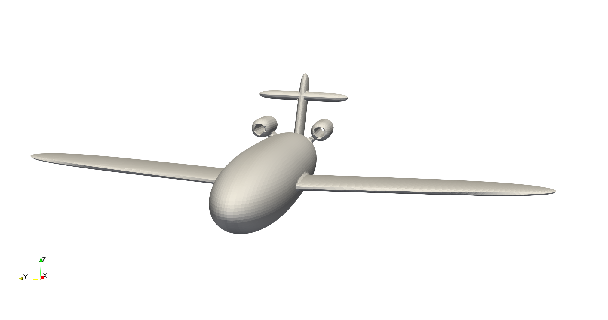
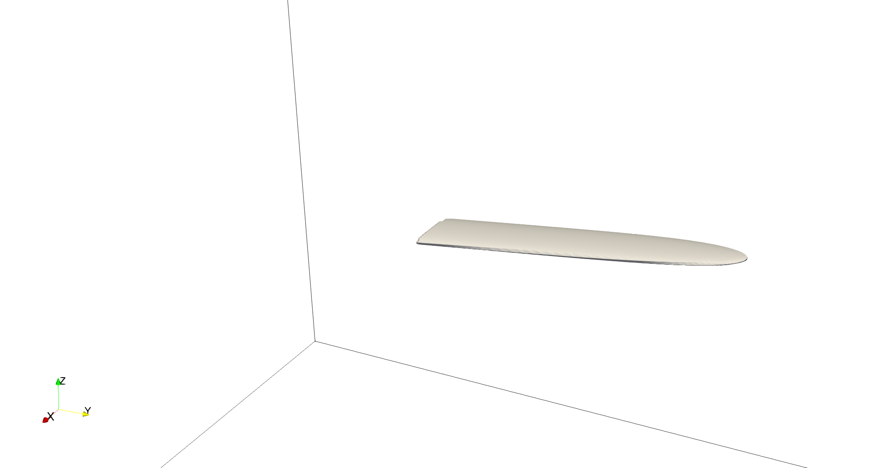
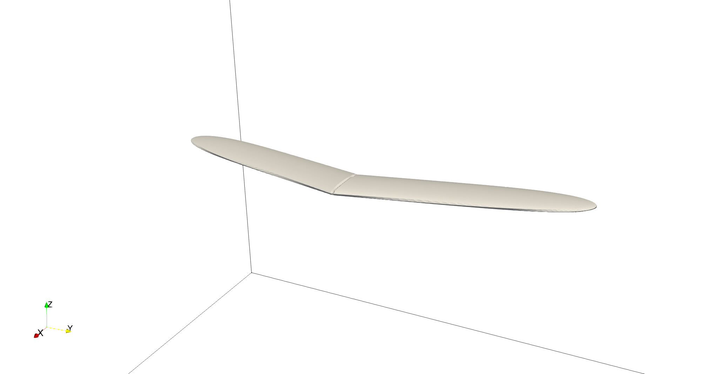
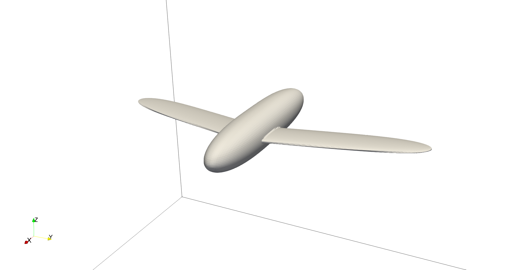
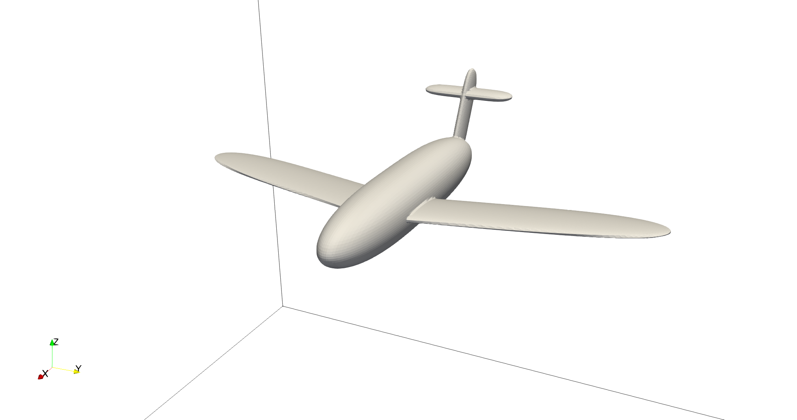
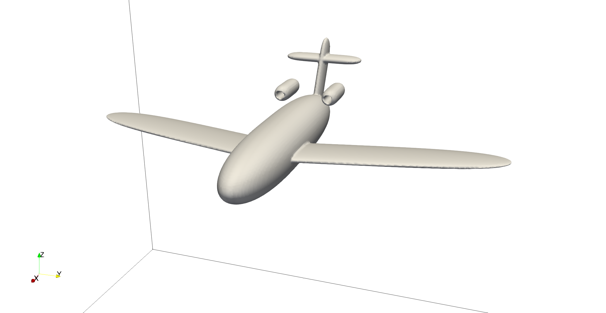

=====================================================================================
Simple Plane Model From Composite
=====================================================================================

This example aims to showcase the vast possibilities of objects that can be defined using the composite shape in the sharp immersed boundary solver. It also aims to give an example of the type of operations that can be made on these geometries.

----------------------------------
Features
----------------------------------
- Solvers: ``lethe-fluid-sharp``
- Geometry definition

----------------------------
Files Used in this Example
----------------------------

Both files mentioned below are located in the example's folder (``examples/sharp-immersed-boundary/simple-plane-model-from-composite``).

- Composite geometry file: ``plane.composite``
- Parameter file: ``plane.prm``

-----------------------
Description of the Case
-----------------------

This example presents the creation of a simple plane model using a composite shape. This example does a step-by-step creation of the shape. This plane is not a real model. The parameters used only aim at showcasing the different operations of the composite shape creation. The final product will look as follows:

------------------------------------
Creation of the Composite Shape File
------------------------------------

The shape is created in two steps inspired by the GMSH syntax.

1. Basic shape definitions. Shapes are defined with different parameters: shape ID, shape type, arguments, position, and orientation.
2. Boolean operations definitions. Operations are defined by: operation ID, operation type, shape 1 ID, shape 2 ID. 

Shapes and boolean operations each have an ID, and boolean operations can reference previous operations to build upon them. The final shape obtained is the product of the operation with the largest ID. To facilitate shape creation, we start indexing the operations from ID 30. This index is much larger than the number of primitives used.
 
All the shapes are placed in the reference frame of the composite shape which can then be moved depending on the position and orientation of the shape prescribed in the parameter file of the case. Here, we only focus on the step-by-step operation required to generate this complex shape.

.. Note:: 
    This model uses multiple shapes that are referred to as superquadric ellipsoids. This superquadric shape has at least two axes defined using a 2-order power. Any slice of this type of superquadric, parallel to the plane defined by these two axes, is an ellipse. If the remaining axis has a higher power, then the shape will tend toward an extrusion of an ellipse with a rounded tip. 

The ``plane.composite`` file contains these instructions. The plane along the X-axis and the positive Z-axis is in the above direction of the plane. The Y-axis points in the left direction of the plane.

.. warning:: 
    The human interpretation of the composite files is cumbersome. For this reason we add comments to each line.

.. code-block:: text

    shapes
    0;    superquadric;   0.3:2.5:0.05:2:6:2;           0.1:0:0 ;      0:-0.05:0.25 # Full left wing
    1; hyper rectangle;                5:5:5;            0:-5:0 ;             0:0:0 # Cube to trim off the right side of the left wing
    2;    superquadric;   0.3:2.5:0.05:2:6:2;           0.1:0:0 ;     0:-0.05:-0.25 # Full right wing
    3; hyper rectangle;                5:5:5;             0:5:0 ;             0:0:0 # Cube to trim off the left side of the right wing
    4;    superquadric;    1.5:0.3:0.3:3:2:2;         -0.25:0:0 ;             0:0:0 # Fuselage of the plane
    5;    superquadric;  0.15:0.05:0.5:2:2:6;       -1.75:0:0.4 ;          0:-0.5:0 # Tail wing vertical plan
    6;    superquadric;  0.15:0.5:0.05:2:6:2;       -1.85:0:0.6 ;             0:0:0 # Tail wing horizontal plan
    7;    superquadric;    0.3:0.1:0.1:5:2:2;     -1.25:0.3:0.3 ;             0:0:0 # Left engine shape
    8;        cylinder;               0.05:1;     -1.25:0.3:0.3 ; 0:1.57079632679:0 # Left engine hole
    9;    superquadric;    0.3:0.1:0.1:5:2:2;    -1.25:-0.3:0.3 ;             0:0:0 # Right engine shape
    10;       cylinder;               0.05:1;    -1.25:-0.3:0.3 ; 0:1.57079632679:0 # Right engine hole
    11;   superquadric;  0.1:0.03:0.25:6:2:2;   -1.25:0.15:0.15 ;   -0.78539816:0:0 # Left engine link
    12;   superquadric;  0.1:0.03:0.25:6:2:2;  -1.25:-0.15:0.15 ;    0.78539816:0:0 # Right engine link
    operations
    30; difference  ; 1:0   # Trim off the left wing
    31; difference  ; 3:2   # Trim off the right wing
    32; union       ; 30:31 # Combine the two wings
    33; union       ; 32:4  # Combine the wings with the plane fuselage
    34; union       ; 33:5  # Combine vertical part of the tail wing with the fuselage
    35; union       ; 34:6  # Combine horizontal part of the tail wing with the fuselage
    36; difference  ; 8:7   # Hole in the left engine
    37; union       ; 35:36 # Combine left engine with the fuselage
    38; difference  ; 10:9  # Hole in the right engine
    39; union       ; 37:38 # Combine right engine with the fuselage and the other engine
    40; difference  ; 7:11  # Trim off  the left engine link with the engine shape
    41; difference  ; 9:12  # Trim off the right engine link with the engine shape
    42; union       ; 39:40 # Combine the left engine link with the rest of the plane
    43; union       ; 42:41 # Combine the right engine link with the rest of the plane
  
Let us read this file step-by-step line-by-line:

1. First, we create the left wing. This wing is created using a superquadric ellipsoid shape. Along the cord, we use an elongated ellipsoid with length 0.6 and 0.1 thickness. In the wingspan direction, the wing is defined by a 6-order power superquadric with a half wingspan of 2.5. We then tilt the wing backward by 0.25 rad and give a small angle of attack of 0.05 rad. Since the wing is now tilted backward, the right side of the superquadric shape is undesirable, so we remove it using a hypercube to trim the right side of the wing.

.. code-block:: text

    shapes
    0;    superquadric;   0.3:2.5:0.05:2:6:2;           0.1:0:0 ;      0:-0.05:0.25 # Full left wing
    1; hyper rectangle;                5:5:5;            0:-5:0 ;             0:0:0 # Cube to trim off the right side of the left wing
    operations
    30; difference  ; 1:0   # Trim off the left wing

This step gives us the first wing of the plane.

   

2. We repeat the same operation for the right wing and add a union of the left and right wing.

.. code-block:: text

    shapes
    0;    superquadric;   0.3:2.5:0.05:2:6:2;           0.1:0:0 ;      0:-0.05:0.25 # Full left wing
    1; hyper rectangle;                5:5:5;            0:-5:0 ;             0:0:0 # Cube to trim off the right side of the left wing
    2;    superquadric;   0.3:2.5:0.05:2:6:2;           0.1:0:0 ;     0:-0.05:-0.25 # Full right wing
    3; hyper rectangle;                5:5:5;             0:5:0 ;             0:0:0 # Cube to trim off the left side of the right wing
    operations
    30; difference  ; 1:0   # Trim off the left wing
    31; difference  ; 3:2   # Trim off the right wing
    32; union       ; 30:31 # Combine the two wings

This step gives us the first wing of the plane.

3. Next, we add the fuselage of the plane. We approximate the fuselage with a circular superquadric shape with a length of 3 and a radius of 0.3. On the length of the plane, the superquadric is of power 3. We want the wings to be a bit more at the front of the fuselage, so we move the fuselage slightly backward by 0.25. We then add the combination of the wings and the fuselage.

.. code-block:: text

    shapes
    0;    superquadric;   0.3:2.5:0.05:2:6:2;           0.1:0:0 ;      0:-0.05:0.25 # Full left wing
    1; hyper rectangle;                5:5:5;            0:-5:0 ;             0:0:0 # Cube to trim off the right side of the left wing
    2;    superquadric;   0.3:2.5:0.05:2:6:2;           0.1:0:0 ;     0:-0.05:-0.25 # Full right wing
    3; hyper rectangle;                5:5:5;             0:5:0 ;             0:0:0 # Cube to trim off the left side of the right wing
    4;    superquadric;    1.5:0.3:0.3:3:2:2;         -0.25:0:0 ;             0:0:0 # Fuselage of the plane
    operations
    30; difference  ; 1:0   # Trim off the left wing
    31; difference  ; 3:2   # Trim off the right wing
    32; union       ; 30:31 # Combine the two wings
    33; union       ; 32:4  # Combine the wings with the plane fuselage

This step gives us the following wings and fuselage of the plane.

   

4. We continue with the addition of the tail wing. The tail wing is made from a combination of two superquadric ellipsoid shapes, one for the vertical plane of the tail wing and one for the horizontal plane of the tail wing. Along the cord of these sections, the shapes are made from elongated ellipsoids with a minor axis of 0.1 and a main axis of 0.3. The span of both shapes is defined using a 6-order power of length 1. The position is adjusted to fit with the tail of the fuselage.

.. code-block:: text

    shapes
    0;    superquadric;   0.3:2.5:0.05:2:6:2;           0.1:0:0 ;      0:-0.05:0.25 # Full left wing
    1; hyper rectangle;                5:5:5;            0:-5:0 ;             0:0:0 # Cube to trim off the right side of the left wing
    2;    superquadric;   0.3:2.5:0.05:2:6:2;           0.1:0:0 ;     0:-0.05:-0.25 # Full right wing
    3; hyper rectangle;                5:5:5;             0:5:0 ;             0:0:0 # Cube to trim off the left side of the right wing
    4;    superquadric;    1.5:0.3:0.3:3:2:2;         -0.25:0:0 ;             0:0:0 # Fuselage of the plane
    5;    superquadric;  0.15:0.05:0.5:2:2:6;       -1.75:0:0.4 ;          0:-0.5:0 # Tail wing vertical plan
    6;    superquadric;  0.15:0.5:0.05:2:6:2;       -1.85:0:0.6 ;             0:0:0 # Tail wing horizontal plan
    operations
    30; difference  ; 1:0   # Trim off the left wing
    31; difference  ; 3:2   # Trim off the right wing
    32; union       ; 30:31 # Combine the two wings
    33; union       ; 32:4  # Combine the wings with the plane fuselage
    34; union       ; 33:5  # Combine vertical part of the tail wing with the fuselage
    35; union       ; 34:6  # Combine horizontal part of the tail wing with the fuselage

This step gives us the following plane without engines.

   

5. The next step is the addition of the two engines. To keep the model relatively simple, the engines are defined by a simple circular superquadric shape with a hole at the center. The radius of the engine is 0.1, and the length is 0.6. The superquadric power used for the superquadric axis is 5. The engine's position is adjusted to fit the plane model, with a 45-degree angle with the center of the fuselage. The hole inside the superquadric shape is obtained using a long cylinder of radius 0.05 centered on the same axis. 

.. code-block:: text

    shapes
    0;    superquadric;   0.3:2.5:0.05:2:6:2;           0.1:0:0 ;      0:-0.05:0.25 # Full left wing
    1; hyper rectangle;                5:5:5;            0:-5:0 ;             0:0:0 # Cube to trim off the right side of the left wing
    2;    superquadric;   0.3:2.5:0.05:2:6:2;           0.1:0:0 ;     0:-0.05:-0.25 # Full right wing
    3; hyper rectangle;                5:5:5;             0:5:0 ;             0:0:0 # Cube to trim off the left side of the right wing
    4;    superquadric;    1.5:0.3:0.3:3:2:2;         -0.25:0:0 ;             0:0:0 # Fuselage of the plane
    5;    superquadric;  0.15:0.05:0.5:2:2:6;       -1.75:0:0.4 ;          0:-0.5:0 # Tail wing vertical plan
    6;    superquadric;  0.15:0.5:0.05:2:6:2;       -1.85:0:0.6 ;             0:0:0 # Tail wing horizontal plan
    7;    superquadric;    0.3:0.1:0.1:5:2:2;     -1.25:0.3:0.3 ;             0:0:0 # Left engine shape
    8;        cylinder;               0.05:1;     -1.25:0.3:0.3 ; 0:1.57079632679:0 # Left engine hole
    9;    superquadric;    0.3:0.1:0.1:5:2:2;    -1.25:-0.3:0.3 ;             0:0:0 # Right engine shape
    10;       cylinder;               0.05:1;    -1.25:-0.3:0.3 ; 0:1.57079632679:0 # Right engine hole
    operations
    30; difference  ; 1:0   # Trim off the left wing
    31; difference  ; 3:2   # Trim off the right wing
    32; union       ; 30:31 # Combine the two wings
    33; union       ; 32:4  # Combine the wings with the plane fuselage
    34; union       ; 33:5  # Combine vertical part of the tail wing with the fuselage
    35; union       ; 34:6  # Combine horizontal part of the tail wing with the fuselage
    36; difference  ; 8:7   # Hole in the left engine
    37; union       ; 35:36 # Combine left engine with the fuselage
    38; difference  ; 10:9  # Hole in the right engine
    39; union       ; 37:38 # Combine right engine with the fuselage and the other engine

6.  The final step is to add a link between the engine model and the fuselage of the plane. This is done using another superquadric ellipsoid shape. The ellipse main axis has a length of 0.06, and the minor axis has a length of 0.06. The superquadric axis is of length 0.5. To avoid blocking the hole of the engine with this link to the fuselage, we use the superquadric shape that defines the shape of the engine to trim this superquadric shape. The resulting shape is then combined with the rest of the fuselage. The position is adjusted to fit well with the engine's position.

.. code-block:: text

    shapes
    0;    superquadric;   0.3:2.5:0.05:2:6:2;           0.1:0:0 ;      0:-0.05:0.25 # Full left wing
    1; hyper rectangle;                5:5:5;            0:-5:0 ;             0:0:0 # Cube to trim off the right side of the left wing
    2;    superquadric;   0.3:2.5:0.05:2:6:2;           0.1:0:0 ;     0:-0.05:-0.25 # Full right wing
    3; hyper rectangle;                5:5:5;             0:5:0 ;             0:0:0 # Cube to trim off the left side of the right wing
    4;    superquadric;    1.5:0.3:0.3:3:2:2;         -0.25:0:0 ;             0:0:0 # Fuselage of the plane
    5;    superquadric;  0.15:0.05:0.5:2:2:6;       -1.75:0:0.4 ;          0:-0.5:0 # Tail wing vertical plan
    6;    superquadric;  0.15:0.5:0.05:2:6:2;       -1.85:0:0.6 ;             0:0:0 # Tail wing horizontal plan
    7;    superquadric;    0.3:0.1:0.1:5:2:2;     -1.25:0.3:0.3 ;             0:0:0 # Left engine shape
    8;        cylinder;               0.05:1;     -1.25:0.3:0.3 ; 0:1.57079632679:0 # Left engine hole
    9;    superquadric;    0.3:0.1:0.1:5:2:2;    -1.25:-0.3:0.3 ;             0:0:0 # Right engine shape
    10;       cylinder;               0.05:1;    -1.25:-0.3:0.3 ; 0:1.57079632679:0 # Right engine hole
    11;   superquadric;  0.1:0.03:0.25:6:2:2;   -1.25:0.15:0.15 ;   -0.78539816:0:0 # Left engine link
    12;   superquadric;  0.1:0.03:0.25:6:2:2;  -1.25:-0.15:0.15 ;    0.78539816:0:0 # Right engine link
    operations
    30; difference  ; 1:0   # Trim off the left wing
    31; difference  ; 3:2   # Trim off the right wing
    32; union       ; 30:31 # Combine the two wings
    33; union       ; 32:4  # Combine the wings with the plane fuselage
    34; union       ; 33:5  # Combine vertical part of the tail wing with the fuselage
    35; union       ; 34:6  # Combine horizontal part of the tail wing with the fuselage
    36; difference  ; 8:7   # Hole in the left engine
    37; union       ; 35:36 # Combine left engine with the fuselage
    38; difference  ; 10:9  # Hole in the right engine
    39; union       ; 37:38 # Combine right engine with the fuselage and the other engine
    40; difference  ; 7:11  # Trim off  the left engine link with the engine shape
    41; difference  ; 9:12  # Trim off the right engine link with the engine shape
    42; union       ; 39:40 # Combine the left engine link with the rest of the plane
    43; union       ; 42:41 # Combine the right engine link with the rest of the plane

This final step gives us the full plane model.

    
    
---------------
Parameter File
---------------

The parameter file for this case simply produces an output to visualize the shape created by this composite file. We recall that to visualize the shape you must use the contour function of your post-processing tool on the level field and plot the contour of ``levelset=0``

.. code-block:: text

    # Listing of Parameters
    #----------------------

    set dimension = 3

    #---------------------------------------------------
    # Simulation Control
    #---------------------------------------------------

    subsection simulation control
      set method            = steady
      set output name       = composite_shape_build
      set output frequency  = 1
    end

    #---------------------------------------------------
    # Mesh
    #---------------------------------------------------

    subsection mesh
      set type               = dealii
      set grid type          = subdivided_hyper_rectangle
      set grid arguments     = 1,1,1:-5,-5,-5 : 5 , 5 , 5 : true
      set initial refinement = 4
    end

    #---------------------------------------------------
    # Timer
    #---------------------------------------------------

    subsection timer
      set type = iteration
    end

    #---------------------------------------------------
    # Mesh Adaptation Control
    #---------------------------------------------------

    subsection mesh adaptation
      set type                 = kelly
      set fraction type        = number
    end

    #---------------------------------------------------
    # IB particles
    #---------------------------------------------------

    subsection particles
      set number of particles                     = 1
      set assemble Navier-Stokes inside particles = false
      
      subsection local mesh refinement
        set initial refinement                = 5
        set refine mesh inside radius factor  = 1
        set refine mesh outside radius factor = 1
      end
      
      subsection particle info 0
        subsection position
          set Function expression = 0;0;0
        end
        subsection orientation
          set Function expression = 0;0;0
        end
        set type            = composite
        set shape arguments = plane.composite
      end
    end

