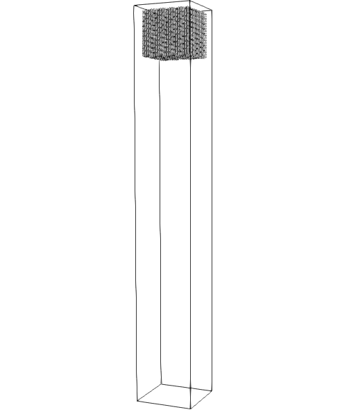

==================================
Boycott Effect
==================================

It is strongly recommended to visit `DEM parameters <../../../parameters/dem/dem.html>`_  and `CFD-DEM parameters <../../../parameters/unresolved-cfd-dem/unresolved-cfd-dem.html>`_ for more detailed information on the concepts and physical meaning of the parameters used in the DEM and CFD-DEM solvers.

----------------------------------
Features
----------------------------------

- Solvers: ``lethe-particles`` and ``lethe-fluid-particles``
- Three-dimensional problem
- Displays the selection of models and physical properties
- Simulates a solid-liquid sedimentation

---------------------------
Files Used in This Example
---------------------------

Both files mentioned below are located in the example's folder (``examples/unresolved-cfd-dem/boycott-effect``).

- Parameter file for CFD-DEM simulation of the Boycott effect: ``boycott-effect.prm``
- Parameter file for particle generation and packing: ``particle_generator.prm``

-----------------------
Description of the Case
-----------------------

This example simulates the sedimentation of a group of particles in a viscous fluid. Two cases were simulated. In the first case, the channel is placed vertically. In the second case, the channel is inclined at :math:`20^{\circ}` with respect to the gravity. First, we use ``lethe-particles`` to insert the particles. We enable check-pointing in order to write the DEM checkpoint files which will be used as the starting point of the CFD-DEM simulation. Then, we use the ``lethe-fluid-particles`` solver within Lethe to simulate the sedimentation of particles by initially reading the checkpoint files from the DEM simulation.

-------------------
DEM Parameter File
-------------------

The syntax of this parameter file is flexible. Parameters do not need to be specified in a specific order, but only within the subsection in which they belong. All parameter subsections are described in the `parameter section <../../../parameters/parameters.html>`_ of the documentation.

We introduce the different sections of the parameter file ``dem-packing-in-fluidized-bed.prm`` needed to run this simulation. Most subsections are explained in detail in other CFD-DEM examples such as:  `Gas-solid spouted bed <../../../examples/unresolved-cfd-dem/gas-solid-spouted-bed/gas-solid-spouted-bed.html>`_. Therefore, we will not go over them in detail.

Mesh
~~~~~

In this example, we are simulating a rectangular channel. We use the deal.II GridGenerator in order to generate a hyper rectangle that is subdivided along its height. The following portion of the DEM parameter file shows the function called:

.. code-block:: text

    subsection mesh
      set type                                = dealii
      set grid type                           = subdivided_hyper_rectangle
      set grid arguments                      = 15,70,15:-0.03,0,-0.03:0.03,0.4,0.03:true
      set initial refinement                  = 0
      set expand particle-wall contact search = false
    end

Simulation Control
~~~~~~~~~~~~~~~~~~~~~~~~~~~~

The time step in this case is the same as the time end. Since we only seek to insert the particles at the top of the channel, we only require 1 insertion time step. We do not need the particles to be packed, therefore by doing this, the particles will be inserted, but will not fall under the action of gravity.

.. code-block:: text

   subsection simulation control
      set time step        = 1e-6
      set time end         = 1e-6
      set log frequency    = 1000
      set output frequency = 1
      set output path      = ./output_dem/
    end

Restart
~~~~~~~~~~~~~~~~~~~

We save the files obtained from the single iteration by setting the frequency = 1. These files will be used to start the CFD-DEM simulation.

.. code-block:: text

    subsection restart
      set checkpoint = true
      set frequency  = 1
      set restart    = false
      set filename   = dem
    end

Model Parameters
~~~~~~~~~~~~~~~~~

The section on model parameters is explained in the DEM examples. We show the chosen parameters for this section:

.. code-block:: text

    subsection model parameters
      subsection contact detection
        set contact detection method = dynamic
        set neighborhood threshold   = 1.3
        set frequency                = 1
      end
      set rolling resistance torque method       = constant_resistance
      set particle particle contact force method = hertz_mindlin_limit_force
      set particle wall contact force method     = nonlinear
      set integration method                     = velocity_verlet
    end

Lagrangian Physical Properties
~~~~~~~~~~~~~~~~~~~~~~~~~~~~~~~

The gravity is set to 0 as we only need to insert the particles in the specified insertion box.

.. code-block:: text

    subsection lagrangian physical properties
      set gx                       = 0.0
      set gy                       = 0.0
      set gz                       = 0.0
      set number of particle types = 1
      subsection particle type 0
        set size distribution type            = uniform
        set diameter                          = 0.002
        set number                            = 8379
        set density particles                 = 1200
        set young modulus particles           = 1e6
        set poisson ratio particles           = 0.25
        set restitution coefficient particles = 0.97
        set friction coefficient particles    = 0.3
        set rolling friction particles        = 0.1
      end
      set young modulus wall           = 1e6
      set poisson ratio wall           = 0.25
      set restitution coefficient wall = 0.97
      set friction coefficient wall    = 0.3
      set rolling friction wall        = 0.1
    end

Insertion Info
~~~~~~~~~~~~~~~~~~~

We insert the particles uniformly in the specified insertion box at the top of the channel.

.. code-block:: text

    subsection insertion info
      set insertion method                               = volume
      set inserted number of particles at each time step = 8379
      set insertion frequency                            = 2000
      set insertion box minimum x                        = -0.025
      set insertion box minimum y                        = 0.3
      set insertion box minimum z                        = -0.025
      set insertion box maximum x                        = 0.026
      set insertion box maximum y                        = 0.396
      set insertion box maximum z                        = 0.026
      set insertion distance threshold                   = 1.2
      set insertion maximum offset                       = 0.
      set insertion prn seed                             = 19
    end

---------------------------
Running the DEM Simulation
---------------------------
Launching the simulation is as simple as specifying the executable name and the parameter file. Assuming that the ``lethe-particles`` executable is within your path, the simulation can be launched on a single processor by typing:

.. code-block:: text
  :class: copy-button

  lethe-particles particle-generator.prm

or in parallel (where 8 represents the number of processors)

.. code-block:: text
  :class: copy-button

  mpirun -np 8 lethe-particles particle-generator.prm

The figure below shoes the particles inserted at the top of the channel at the end of the DEM simulation.

After the particles have been inserted it is now possible to simulate the sedimentation of particles.

-----------------------
CFD-DEM Parameter File
-----------------------

The CFD simulation is to be carried out using the particles inserted within the previous step. We will discuss the different parameter file sections. Some sections are identical to that of the DEM so they will not be shown again.

Simulation Control
~~~~~~~~~~~~~~~~~~~~~~~~~~~~

The simulation is run for :math:`2` s with a time step of :math:`0.005` s. The time scheme chosen for the simulation is first order backward difference method (BDF1). The simulation control section is shown:

.. code-block:: text

    subsection simulation control
      set method               = bdf1
      set number mesh adapt    = 0
      set output name          = result_
      set output frequency     = 20
      set time end             = 2
      set time step            = 0.005
      set output path          = ./output/
    end

Physical Properties
~~~~~~~~~~~~~~~~~~~~~~~~~~~~

The physical properties subsection allows us to determine the density and viscosity of the fluid. We choose a density of :math:`1115.6` and a kinematic viscosity of :math:`0.00000177` as to simulate the flow of a sugar-water solution with :math:`20` % by weight sugar at :math:`20^{\circ}` C.
The dynamic viscosity of a 20 % sugar-water solution by weight at :math:`20^{\circ} C` is 1.97 cP.

.. code-block:: text

    subsection physical properties
      subsection fluid 0
        set kinematic viscosity = 0.00000177
        set density             = 1115.6
      end
    end

Initial Conditions
~~~~~~~~~~~~~~~~~~

For the initial conditions, we choose zero initial conditions for the velocity.

.. code-block:: text

    subsection initial conditions
      set type = nodal
      subsection uvwp
        set Function expression = 0; 0; 0; 0
      end
    end

Boundary Conditions
~~~~~~~~~~~~~~~~~~~~~~~~~~~~

For the boundary conditions, we choose a slip boundary condition on all the walls of the channel and the channel except the bottom and the top of the channel where a no-slip boundary condition is imposed. For more information about the boundary conditions, please refer to the `Boundary Conditions Section <../../../parameters/cfd/boundary_conditions_cfd.html>`_

.. code-block:: text

    subsection boundary conditions
      set number = 6
      subsection bc 0
        set id   = 0
        set type = slip
      end
      subsection bc 1
        set id   = 1
        set type = slip
      end
      subsection bc 2
        set id   = 2
        set type = noslip
      end
      subsection bc 3
        set id   = 3
        set type = noslip
      end
      subsection bc 4
        set id   = 4
        set type = slip
      end
      subsection bc 5
        set id   = 5
        set type = slip
      end
    end

Lagrangian Physical Properties
~~~~~~~~~~~~~~~~~~~~~~~~~~~~~~~

This section is identical to the one previously mentioned for the DEM simulation of particle insertion. The only difference is the definition of gravity. For the vertical case, we set :math:`g_y = -9.81` and :math:`g_x = g_z = 0`. For the inclined case, we determine the gravity by setting: :math:`g_x = \frac{-9.81}{cos \theta}, \; g_y = \frac{-9.81}{sin \theta}, \; g_z = 0` where :math:`\theta` is the angle of inclination with the vertical.

The additional sections for the CFD-DEM simulations are the void fraction subsection and the CFD-DEM subsection. These subsections are descrichannel in detail in the `CFD-DEM parameters <../../../parameters/unresolved-cfd-dem/unresolved-cfd-dem.html>`_ .

Void Fraction
~~~~~~~~~~~~~~~~~~~~~~~~~~~~
Since we are calculating the void fraction using the particle insertion of the DEM simulation, we set the ``mode`` to ``dem``. For this, we need to read the dem files which we already wrote using check-pointing. We, therefore, set the ``read dem`` to ``true`` and specify the prefix of the dem files to be dem.
We choose to use the quadrature centered method (`QCM <../../../theory/unresolved_cfd-dem/unresolved_cfd-dem.html>`_) to calculate the void fraction. For this, we specify the ``mode`` to be ``qcm``. We want the radius of our volume averaging sphere to be equal to the length of the element where the void fraction is being calculated. We don't want the volume of the sphere to be equal to the volume of the element.
For this, we set the ``qcm sphere equal cell volume`` equals to ``false``. Since we want to keep the mass conservative properties of the :math:`L^2` projection, we do not bound the void fraction and as such we set ``bound void fraction`` to ``false``. Unlike the other schemes, we do not smooth the void fraction as we usually do using the PCM and SPM void fraction schemes since QCM is continuous in time and space.

.. code-block:: text

    subsection void fraction
      set mode                         = qcm
      set qcm sphere equal cell volume = false
      set read dem                     = true
      set dem file name                = dem
      set bound void fraction          = false
    end

CFD-DEM
~~~~~~~~~~~~~~~~~~~~~~~~~~~~

We also enable grad-div stabilization in order to improve local mass conservation. If we were using PCM and SPM void fraction schemes, the void fraction time derivative should be disabled as the time variation of the void fraction will lead to unstable simulations. The source of such instability is the first term of the continuity equation :math:`\rho_f \frac{\partial \varepsilon_f}{\partial t}`, which is stiff and unstable for the slightest temporal discontinuity of the void fraction and as :math:`\Delta t \to 0`. However, as we are using the QCM void fraction scheme, this term can be enabled. Usually, this term is neglected, however; disabling this term affects the results as we are no longer solving for the actual `Volume Averaged Navier-Stokes equations <../../../theory/unresolved_cfd-dem/unresolved_cfd-dem.html>`_. Therefore, we should not neglect this term based on numerical reasoning without any physical explanation.

.. code-block:: text

    subsection cfd-dem
      set grad div                      = true
      set void fraction time derivative = true
      set drag force                    = true
      set buoyancy force                = true
      set shear force                   = true
      set pressure force                = true
      set drag model                    = difelice
      set coupling frequency            = 250
      set grad-div length scale         = 0.005
      set vans model                    = modelA
    end

We determine the drag model to be used for the calculation of particle-fluid forces. We enable buoyancy, drag, shear and pressure forces. For drag, we use the Di Felice model to determine the momentum transfer exchange coefficient. The VANS model we are solving is model A. Other possible option is model B.

Finally, the linear and non-linear solver controls are defined.

Non-linear Solver
~~~~~~~~~~~~~~~~~

.. code-block:: text

    subsection non-linear solver
      subsection fluid dynamics
        set solver           = inexact_newton
        set tolerance        = 1e-8
        set max iterations   = 10
        set verbosity        = verbose
        set matrix tolerance = 0.75
      end
    end

We use the ``inexact_newton`` solver as to avoid the reconstruction of the system matrix at each Newton iteration. For more information about the non-linear solver, please refer to the `Non Linear Solver Section <../../../parameters/cfd/non-linear_solver_control.html>`_

Linear Solver
~~~~~~~~~~~~~

.. code-block:: text

    subsection linear solver
      subsection fluid dynamics
        set method                                = gmres
        set max iters                             = 5000
        set relative residual                     = 1e-3
        set minimum residual                      = 1e-10
        set preconditioner                        = ilu
        set ilu preconditioner fill               = 0
        set ilu preconditioner absolute tolerance = 1e-12
        set ilu preconditioner relative tolerance = 1
        set verbosity                             = verbose
        set max krylov vectors                    = 200
      end
    end

For more information about the linear solver, please refer to the `Linear Solver Section <../../../parameters/cfd/linear_solver_control.html>`_

------------------------------
Running the CFD-DEM Simulation
------------------------------

The simulation is run using the ``lethe-fluid-particles`` application.  Assuming that the executable is within your path, the simulation can be launched as per the following command:

.. code-block:: text
  :class: copy-button

  lethe-fluid-particles boycott-effect.prm

--------
Results
--------

The results are shown in an animation below. The sedimentation of the particles in a vertical and inclined channel demonstrate different behaviors. This clearly shows the boycott effect as the fluid circulates in the inclined channel resulting in a larger velocity for both the fluid and particles. Thus, the particles fall further compared to the vertical channel where the fluid velocity is almost null, and the particles' acceleration is low.

.. raw:: html

    <iframe width="560" height="315" src="https://www.youtube.com/embed/ZyY5C6o6R8Q" frameborder="0" allowfullscreen></iframe>

