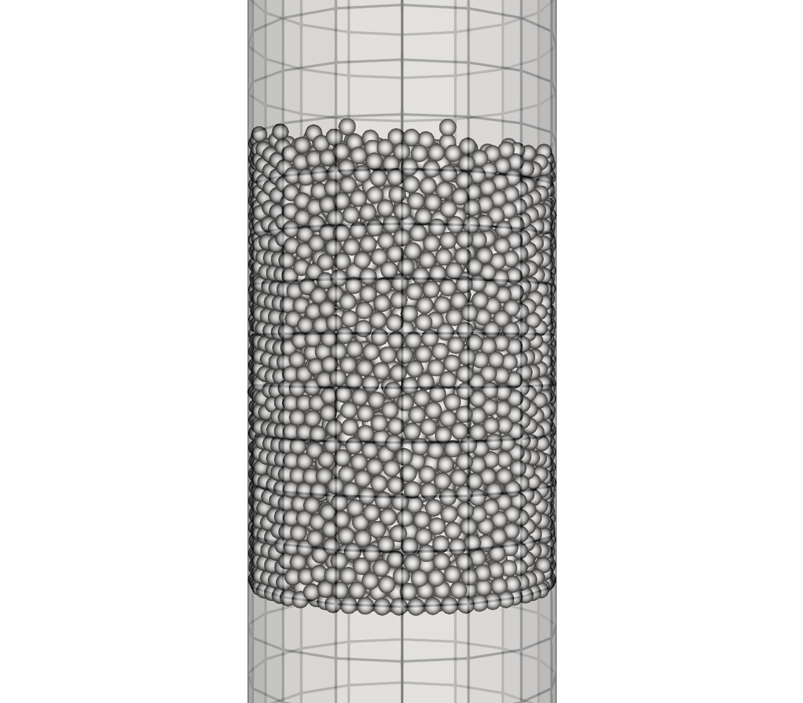
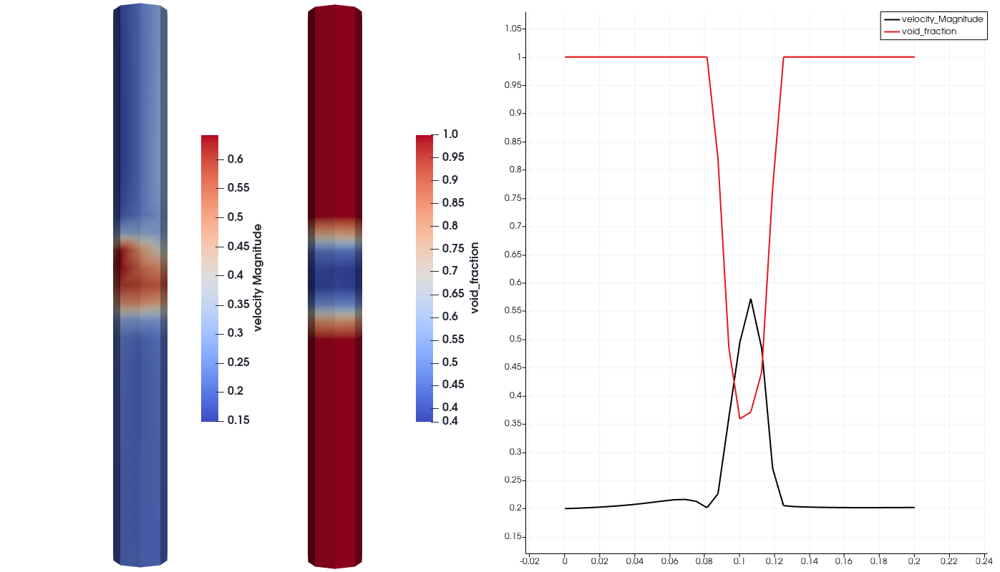
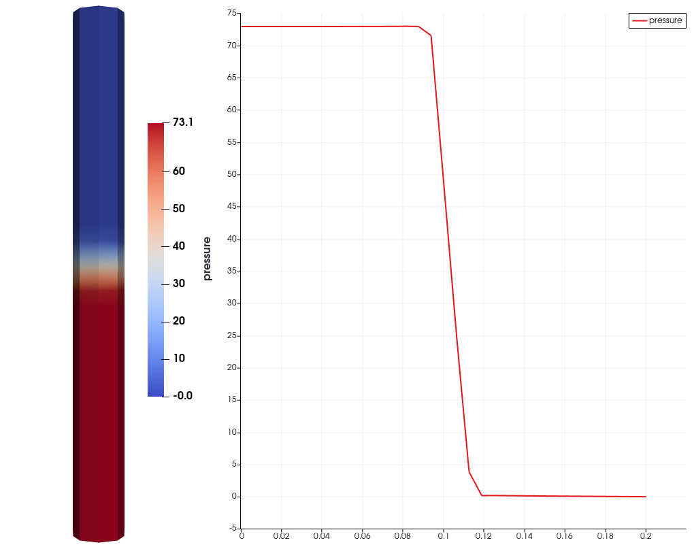

==================================
Cylindrical Packed Bed
==================================

It is strongly recommended to visit `DEM parameters <../../../parameters/dem/dem.html>`_  and `CFD-DEM parameters <../../../parameters/unresolved-cfd-dem/unresolved-cfd-dem.html>`_ for more detailed information on the concepts and physical meaning of the parameters ind DEM and CFD-DEM.

----------------------------------
Features
----------------------------------

- Solvers: ``lethe-particles`` and ``lethe-fluid-vans``
- Three-dimensional problem
- Displays the selection of models and physical properties

---------------------------
Files Used in This Example
---------------------------

Both files mentioned below are located in the example's folder (``examples/unresolved-cfd-dem/cylindrical-packed-bed``).

- Parameter file for CFD-DEM simulation of the packed bed: ``cylindrical-packed-bed/flow-in-bed.prm``
- Parameter file for particle generation and packing: ``packing-in-cylinder.prm``

-----------------------
Description of the Case
-----------------------

This example simulates air flow through a packing of particles. First, we use ``lethe-particles`` to fill the bed with particles. We enable check-pointing in order to write the DEM checkpoint files which will be used as the starting point of the CFD-DEM simulation. Then, we use the ``lethe-fluid-vans`` solver within Lethe to simulate air flow through the packed bed.

-------------------
DEM Parameter File
-------------------

All parameter subsections are described in the `parameter section <../../../parameters.html>`_ of the documentation. To set-up the cylindrical packed bed case, we first fill the bed with particles. We introduce the different sections of the parameter file (``packing-in-cylinder.prm)`` needed to run this simulation. 

Mesh
~~~~~

In this example, we are simulating a cylindrical packed bed that has a half length of 0.1 m, and a radius of 0.01 m. We use the GridGenerator::subdivided_cylinder function of Deal.II in order to generate the mesh. The cylinder is divided 16 times in the x direction. The following portion of the DEM parameter file shows the function called.
The ``mesh`` subsection specifies the computational grid:

.. code-block:: text

    subsection mesh
      set type               = dealii
      set grid type          = subdivided_cylinder
      set grid arguments     = 16:0.01:0.1
      set initial refinement = 1
    end

Simulation Control
~~~~~~~~~~~~~~~~~~~~~~~~~~~~

Another subsection, which is generally the one we put at the top of the parameter files, is the ``simulation control`` . ``time step``, end time, log and ``output frequency`` are defined here. Additionally, users can specify the output folder for the simulation results in this subsection. The ``log frequency`` parameter controls the frequency at which the iteration number is printed on the terminal. If ``log frequency = 1000`` the iteration number will be printed out every 1000 iterations. This is an easy way to monitor the progress of the simulation. A simulation time of 0.6 s was chosen with a time step of 1e-5 s. It it important to choose a long enough time as to allow all particles to come to rest. We store the output files generated in the folder ``output_dem``:

.. code-block:: text

    subsection simulation control
      set time step        = 0.00001
      set time end         = 0.6
      set log frequency    = 1000
      set output frequency = 1000
      set output path      = ./output_dem/
    end

.. warning:: 
    If an output path is chosen, you need to create the folder before launching the simulation. Otherwise, an error message will appear and the simulation will fail to launch.

Restart
~~~~~~~~~~~~~~~~~~~

The volume-averaged Navier-Stokes (VANS) solver requires reading several DEM files. For this, we have to write the DEM simulation information. This is done by enabling the check-pointing option in the restart subsection. We give the written files a prefix ``lethe-particles`` set in the ``set filename`` option.

.. code-block:: text

  subsection restart
    set checkpoint = true
    set frequency  = 10000
    set filename   = dem
  end

Model Parameters
~~~~~~~~~~~~~~~~~
    
The section on model parameters is explained in the DEM examples. We show the chosen parameters for this section:

.. code-block:: text

  subsection model parameters
    set contact detection method               = dynamic
    set contact detection frequency            = 10
    set neighborhood threshold                 = 1.3
    set particle particle contact force method = hertz_mindlin_limit_overlap
    set particle wall contact force method     = nonlinear
    set integration method                     = velocity_verlet
  end

Lagrangian Physical Properties
~~~~~~~~~~~~~~~~~~~~~~~~~~~~~~~

The physical properties section of the particles allows us to determine the different parameters related to the particle such as its density, diameter, and the different coefficients that dictate the collision behaviour of the particles. Also, in this section we define the total number of particles for the simulation.
The gravitational acceleration as well as the physical properties of particles and walls are specified in the ``lagrangian physical properties`` subsection. These properties include as well the Young's modulus, Poisson's ratio, restitution coefficient, friction and rolling friction coefficients.

.. code-block:: text

  subsection lagrangian physical properties
    set gx                       = -9.8
    set gy                       = 0.0
    set gz                       = 0
    set number of particle types = 1
    subsection particle type 0
      set size distribution type            = uniform
      set diameter                          = 0.001
      set number                            = 10000
      set density particles                 = 2500
      set young modulus particles           = 1e6
      set poisson ratio particles           = 0.3
      set restitution coefficient particles = 0.2
      set friction coefficient particles    = 0.1
      set rolling friction particles        = 0.2
    end
    set young modulus wall           = 1e6
    set poisson ratio wall           = 0.3
    set restitution coefficient wall = 0.2
    set friction coefficient wall    = 0.1
    set rolling friction wall        = 0.3
  end
    
Insertion Info
~~~~~~~~~~~~~~~~~~~

The ``insertion info`` subsection manages the insertion of particles. It allows us to control the insertion of particles at each time step. This section is already explained in the DEM examples. However, further information regarding the information box will be given. The volume of insertion box should be large enough to fit all particles. Also, its bounds should be located within the mesh generated in the Mesh subsection.  

.. code-block:: text

  subsection insertion info
    set insertion method                               = volume
    set inserted number of particles at each time step = 500
    set insertion frequency                            = 1000
    set insertion box minimum x                        = 0
    set insertion box minimum y                        = -0.01
    set insertion box minimum z                        = 0
    set insertion box maximum x                        = 0.1
    set insertion box maximum y                        = 0.01
    set insertion box maximum z                        = 0.01
    set insertion distance threshold                   = 2.2
    set insertion random number range                  = 0.5
    set insertion random number seed                   = 19
  end

Floating Walls
~~~~~~~~~~~~~~~~~~~

We need to pack the particles in the middle of the cylinder. Therefore, we create a stopper (floating wall) somewhere below the center of the cylinder. We chose the point with an x-coordinate of -0.01 to create the wall. We then define a normal to the wall at this point. We make sure that the end time of the floating wall is bigger than the simulation time to ensure that the particles remain suspended. This is shown in:

.. code-block:: text

    subsection floating walls
      set number of floating walls = 1
      subsection wall 0
        subsection point on wall
          set x = -0.01
          set y = 0
          set z = 0
        end
        subsection normal vector
          set nx = 1
          set ny = 0
          set nz = 0
        end
        set start time = 0
        set end time   = 2
      end
    end

---------------------------
Running the DEM Simulation
---------------------------
Launching the simulation is as simple as specifying the executable name and the parameter file. Assuming that the ``lethe-particles`` executable is within your path, the simulation can be launched on a single processor by typing:

.. code-block:: text
  :class: copy-button

  lethe-particles packing-in-circle.prm

or in parallel (where 8 represents the number of processors)

.. code-block:: text
  :class: copy-button

  mpirun -np 8 lethe-particles packing-in-circle.prm

Lethe will generate a number of files. The most important one bears the extension ``.pvd``. It can be read by popular visualization programs such as `Paraview <https://www.paraview.org/>`_. 

.. note:: 
    The ``.vtu`` files generated by Lethe are compressed archives. Consequently, they cannot be postprocessed directly. Although they can be easily post-processed using Paraview, it is sometimes necessary to be able to work with the raw data. The python library `PyVista <https://www.pyvista.org/>`_  allows us to do this.

------------
Results DEM
------------

Packed particles at the end of simulation:

    

After the particles have been packed inside the cylindrical bed, it is now possible to simulate fluid flow through the packing. 

------------------------
VANS Parameter File
------------------------

The CFD simulation is to be carried out using the packed bed simulated in the previous step. We will discuss the different parameter file sections. The mesh section is identical to that of the DEM so it will not be shown here. 

Simulation Control
~~~~~~~~~~~~~~~~~~~~~~~~~~~~

The simulation is run in steady state. The simulation control section is shown:

.. code-block:: text

    subsection simulation control
      set method            = bdf1
      set output name       = result
      set output path       = ./output/
    end
   
Physical Properties
~~~~~~~~~~~~~~~~~~~~~~~~~~~~

The physical properties subsection allows us to determine the density and viscosity of the fluid. We choose a density of 1 and viscosity of 0.00001 as to simulate the flow of air. 

.. code-block:: text

    subsection physical properties
      subsection fluid 0
        set kinematic viscosity = 0.00001
        set density             = 1
      end
    end

Initial Conditions
~~~~~~~~~~~~~~~~~~

For the initial conditions, we choose zero initial conditions for the velocity. 

.. code-block:: text

    subsection initial conditions
      set type = nodal
      subsection uvwp
        set Function expression = 0; 0; 0; 0
      end
    end

Boundary Conditions
~~~~~~~~~~~~~~~~~~~~~~~~~~~~

For the boundary conditions, we choose a slip boundary condition on the walls of the cylinder (ID = 0) and an inlet velocity of 0.2 m/s at the lower face of the cylinder (ID = 1). 

.. code-block:: text

    subsection boundary conditions
      set number = 2
      subsection bc 0
        set id   = 0
        set type = slip
      end
      subsection bc 1
        set id   = 1
        set type = function
        subsection u
          set Function expression = 0.2
        end
        subsection v
          set Function expression = 0
        end
        subsection w
          set Function expression = 0
        end
      end
    end

The additional sections that define the VANS solver are the void fraction subsection and the CFD-DEM subsection. These subsections are described in detail in the `CFD-DEM parameters <../../../parameters/unresolved-cfd-dem/unresolved-cfd-dem.html>`_ .

Void Fraction
~~~~~~~~~~~~~~~~~~~~~~~~~~~~

Since we are calculating the void fraction using the packed bed of the DEM simulation, we set the mode to ``dem``. For this, we need to read the dem files which we already wrote using check-pointing. We therefore set the read dem to ``true`` and specify the prefix of the ``dem`` files to be read. In order to ensure that our void fraction projection is bounded, we choose an upper bound limit of 1. We decide not to lower bound the void fraction and thus attributed a value of 0 to the L2 lower bound parameter. We now choose a smoothing factor for the void fraction as to reduce discontinuity which can lead to oscillations in the velocity. The factor we choose is around the square of twice the particle's diameter. 
 
.. code-block:: text

    subsection void fraction
      set mode                = pcm
      set read dem            = true
      set dem file name       = dem
      set l2 smoothing factor = 0.000005
    end

CFD-DEM
~~~~~~~~~~~~~~~~~~~~~~~~~~~~

We also enable ``grad_div`` stabilisation in order to improve local mass conservation. 

.. note:: 
    For certain simulations, this parameter should be disabled to improve stability of the solver.

.. code-block:: text

  subsection cfd-dem
    set grad div                      = true
    set drag force                    = true
    set buoyancy force                = true
    set shear force                   = false
    set pressure force                = false
    set drag model                    = rong
    set post processing               = true
    set vans model                    = modelB
  end
    
We determine the ``drag model`` to be used for the calculation of particle-fluid forces. Currently, Difelice, Rong and Dallavalle models are supported. Other optional forces that can be enabled are the ``buoyancy force``, the ``shear force`` and the ``pressure force``. As we are simulating a static bed, we choose to disable these forces. The VANS model we are solving is model B. Other possible option is model A.

Finally, the linear and non-linear solver controls are defined.

Non-linear Solver
~~~~~~~~~~~~~~~~~

.. code-block:: text

  subsection non-linear solver
    subsection fluid dynamics
      set tolerance      = 1e-9
      set max iterations = 10
      set verbosity      = verbose
    end
  end
    
Linear Solver
~~~~~~~~~~~~~

.. code-block:: text

  subsection linear solver
    subsection fluid dynamics
      set method                                = gmres
      set max iters                             = 5000
      set relative residual                     = 1e-3
      set minimum residual                      = 1e-11
      set preconditioner                        = ilu
      set ilu preconditioner fill               = 1
      set ilu preconditioner absolute tolerance = 1e-14
      set ilu preconditioner relative tolerance = 1.00
      set verbosity                             = verbose
    end
  end

------------------------------
Running the VANS Simulation
------------------------------
 
The simulation is run using the ``lethe-fluid-vans`` application. Assuming that the ``lethe-fluid-vans`` executable is within your path, the simulation can be launched as per the following command:

.. code-block:: text
  :class: copy-button

  lethe-fluid-vans parameter_file.prm

-------------
Results VANS
-------------
The results are shown in the plots below. We visualise the velocity of the fluid, the void fraction calculated using the particles' locations, and the pressure drop resulting from the particle-fluid interactions (drag). The plots to the right show the local distribution of the quantities at the center-line of the cylinder. 

    

