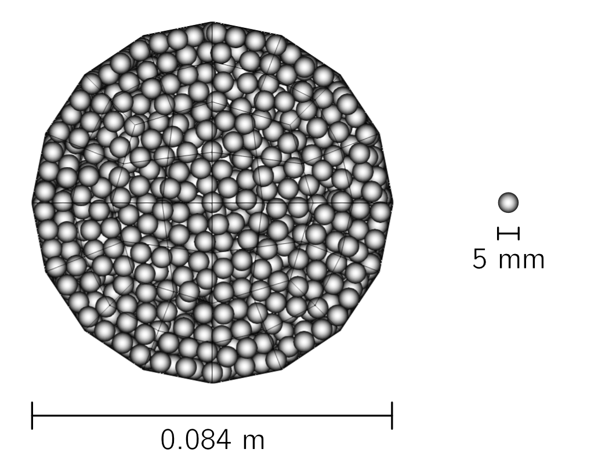

==================================
Dense Pneumatic Conveying
==================================

It is strongly recommended to visit `DEM parameters <../../../parameters/dem/dem.html>`_  and `CFD-DEM parameters <../../../parameters/unresolved-cfd-dem/unresolved-cfd-dem.html>`_ for more detailed information on the concepts and physical meaning of the parameters used in the DEM and CFD-DEM solvers.

----------------------------------
Features
----------------------------------

- Solvers: ``lethe-particles`` and ``lethe-fluid-particles``
- Three-dimensional problem
- Shows how to insert particles according to a shape with a solid objects
- Has periodic boundary conditions in DEM and CFD-DEM
- Uses a flow controller in CFD-DEM
- Simulates a dense pneumatic conveying system

---------------------------
Files Used in This Example
---------------------------

all the files mentioned below are located in the example folder (``examples/unresolved-cfd-dem/dense-pneumatic-conveying``).

- Parameter files for particle generation and settling: ``loading_particles.prm`` and ``settling_particles.prm``
- Parameter file for CFD-DEM simulation of the pneumatic conveying: ``pneumatic-conveying.prm``

-----------------------
Description of the Case
-----------------------

This example simulates the conveying of particles arranged in a plug/slug with a stationary layer.
Since the initial particle layout plays a important role in the regime of the pneumatic conveying, the particle are already forming a plug at the beginning of the CFD-DEM simulation.
Three simulation runs need to be performed.
First, we use ``lethe-particles`` to load the particles with the file ``loading_particles.prm``.
The setup of the simulation is a pipe with a solid objects (mesh) that represent the shape of a slug.
The insertion of particles are done with the plane insertion.
Second, we use ``lethe-particles`` to settle the particles with the file ``settling_particles.prm``. Only the direction of gravity is changed.
Finally, we use ``lethe-fluid-particles`` to simulate the dense pneumatic conveying with the file ``pneumatic-conveying.prm`` with periodic boundary conditions.
We enable check-pointing in order to write the DEM checkpoint files which will be used as the starting point of the CFD-DEM simulation.
The geometry of the pipe and the particle properties are based on the work of Lavrinec *et al*. `[1] <https://doi.org/10.1016/j.powtec.2020.07.070>`_.

-------------------
Particle Insertion
-------------------

In this section we introduce the different sections of the parameter file ``loading_particles.prm`` needed to load the particles of the simulation and the parameter file ``settling_particles.prm`` needed to settle the particles with the gravity in the vertical direction as the CFD-DEM simulation.

Mesh
~~~~~

In this example, we are simulating a horizontal cylindrical pipe. We use the `custom cylinder <https://chaos-polymtl.github.io/lethe/documentation/parameters/cfd/mesh.html>`_ of type balanced. We use this type of mesh in order to have a uniformized cells size in the radial direction. Each the length of a cell is about 2 times the diameter of the particles. The classical cylinder mesh of deal.II has smaller cells in the center which restrict the size of the particles. The length of the pipe is 1 m and the diameter is 0.084 m. The conveying is processed in the x-direction through periodic boundary conditions.

.. code-block:: text

   subsection mesh
     set type                                = cylinder
     set grid type                           = balanced
     set grid arguments                      = 45 : 0.042 : 0.5
     set initial refinement                  = 1
     set expand particle-wall contact search = true
   end

.. note::
    Note that, since the mesh is cylindrical, ``set expand particle-wall contact search = true``. Details on this in the `DEM mesh parameters guide <../../../parameters/dem/mesh.html>`_.

A cross-section of the resulting mesh is presented in the following figure.

    Cross-section of the mesh used in the pneumatic conveying simulation.

Lagrangian Physical Properties
~~~~~~~~~~~~~~~~~~~~~~~~~~~~~~~

The lagrangian properties were based from the work of Lavrinec *et al*. `[1] <https://doi.org/10.1016/j.powtec.2020.07.070>`_, except for the Young's modulus that was deliberately reduced to get a smaller Rayleigh critical time step.
The gravity is set in the x-direction to allow the packing of the particles from the right side of the pipe.
The number of particles in the simulation is 32279. When the example was setup, the number specified in the simulation was higher since the insertion is done with the `plane insertion method <../../../parameters/dem/insertion_info.html#plane>`_, which will insert the particles up to when they reach the plan.
In order to avoid confusion with the number of particles in the parameter file, we did give the real number of particles inserted after 30 seconds.

.. code-block:: text

   subsection lagrangian physical properties
     set g                        = -9.81, 0, 0
     set number of particle types = 1
     subsection particle type 0
       set size distribution type            = uniform
       set diameter                          = 0.005
       set number of particles               = 32279
       set density particles                 = 890
       set young modulus particles           = 1e6
       set poisson ratio particles           = 0.33
       set restitution coefficient particles = 0.3
       set friction coefficient particles    = 0.3
       set rolling friction particles        = 0.2
     end
     set young modulus wall           = 1e6
     set poisson ratio wall           = 0.33
     set restitution coefficient wall = 0.3
     set friction coefficient wall    = 0.4
     set rolling friction wall        = 0.2
   end

Insertion Info
~~~~~~~~~~~~~~
As said in the previous section, the particles are inserted with the plane insertion method. The insertion plane is located at the right side of the pipe. As we can see of the following figure, the plane is placed in a inclined manner. Since the plane insertion method will insert one particle in a cell that is intersected by the plane, we need to place the plane so it does not intersect the area above the solid object. Particles have a initial velocity in x-direction in order to speed up the packing process and in y-direction to have more collisions and randomness in the distribution.

.. figure:: images/insertion.png
    :alt: insertion.
    :align: center

    Side view of the pipe during the insertion of particles in the x-direction with the solid object (green) and the insertion plane (red).

.. code-block:: text

   subsection insertion info
     set insertion method              = plane
     set insertion frequency           = 400
     set insertion plane point         = 0.475, -0.0325, 0
     set insertion plane normal vector = -0.25, 4.75, 0
     set insertion maximum offset      = 0.001
     set insertion prn seed            = 19
     set initial velocity              = -0.35, 0.1, 0.0
   end

Boundary Conditions DEM
~~~~~~~~~~~~~~~~~~~~~~~
Periodic boundary conditions need to be setup in the DEM simulation since we used them in the CFD-DEM simulation. However, we do not want to use them during the loading of the particles.

.. code-block:: text

   subsection DEM boundary conditions
     set number of boundary conditions = 1

     subsection boundary condition 0
       set type               = periodic
       set periodic id 0      = 1
       set periodic id 1      = 2
       set periodic direction = 0
     end
   end

Floating Walls
~~~~~~~~~~~~~~

In order to avoid particles to pass through the periodic boundary conditions, we use floating walls. The floating walls are placed at the left and right side of the pipe. We need this pair of walls because periodic particles do not interact with the wall on the other side of the periodic boundary condition.

.. code-block:: text

   subsection floating walls
   set number of floating walls = 2
   subsection wall 0
     subsection point on wall
       set x = -0.5
       set y = 0
       set z = 0
     end
     subsection normal vector
       set nx = 1
       set ny = 0
       set nz = 0
     end
     set start time = 0
     set end time   = 30
   end
   subsection wall 1
     subsection point on wall
       set x = 0.5
       set y = 0
       set z = 0
     end
     subsection normal vector
       set nx = -1
       set ny = 0
       set nz = 0
     end
     set start time = 0
     set end time   = 30
   end
  end

Solid Objects
~~~~~~~~~~~~~~

The solid object is a simplex surface mesh that represents the shape of a slug. The mesh is generated with the `Gmsh <https://gmsh.info/>`_ software.
The length of the slug is 0.5 m for the area that fully obstruct the pipe, and there are 45° inclined planes for the read and the front of the slug. The stationary layer (the layer between periodic slugs) has a height of 0.021 m which represents a fraction of 20% of the cross-section area of the pipe.

.. code-block:: text

   subsection solid objects
     set number of solids = 1
     subsection solid object 0
       subsection mesh
         set type      = gmsh
         set file name = slug-shape.msh
         set simplex   = true
       end
     end
   end

Model Parameters
~~~~~~~~~~~~~~~~
The model parameters are quite standard for a DEM simulation with the nonlinear Hertz-Mindlin contact force method, a constant rolling resistance torque method, and the velocity Verlet integration method. Here, we use the `Adaptive Sparse Contacts <../../../parameters/dem/model_parameters.html#adaptive-sparse-contacts-asc>`_
method to speedup the simulation. The method will disabled the contact computation in quasi-static areas which represents a significant part of the domain during the loading of the particles. Weight factor parameters for the ASC status are use in the load balancing method. No further explanation a given about the method, a future example will be added in order to detail it and to compare the performance gain.

.. code-block:: text

   subsection model parameters
     subsection contact detection
       set contact detection method = dynamic
       set neighborhood threshold   = 1.3
     end
     subsection load balancing
       set load balance method     = dynamic_with_sparse_contacts
       set threshold               = 0.5
       set dynamic check frequency = 8000
       set active weight factor    = 0.8
       set inactive weight factor  = 0.6
     end
     set particle particle contact force method = hertz_mindlin_limit_overlap
     set particle wall contact force method     = nonlinear
     set integration method                     = velocity_verlet
     set rolling resistance torque method       = constant_resistance
     subsection adaptive sparse contacts
       set enable adaptive sparse contacts = true
       set enable particle advection       = false
       set granular temperature threshold  = 1e-4
       set solid fraction threshold        = 0.4
     end
   end

Simulation Control
~~~~~~~~~~~~~~~~~~~~~~~~~~~~

Here, we define the time-step and the simulation end time. 30 seconds of simulation are needed to load the particles. This is a long simulation time caused by the fact that the plane insertion method inserts a small number of particles at a time (about 1000 particles per second).

.. code-block:: text

    subsection simulation control
      set time step        = 5e-5
      set time end         = 30
      set log frequency    = 500
      set output frequency = 1200
      set output path      = ./output_dem/
    end

Restart
~~~~~~~~

Check pointing is enabled since we need the output to rerun the DEM solver with the particles settled in the pipe.

.. code-block:: text

    subsection restart
      set checkpoint = true
      set frequency  = 10000
      set restart    = false
      set filename   = dem
    end

Model Parameters
~~~~~~~~~~~~~~~~~

The subsection on model parameters is explained in the `DEM model parameters guide <../../../parameters/dem/model_parameters.html>`_ and `DEM examples <../../dem/dem.html>`_.

.. code-block:: text

    subsection model parameters
      subsection contact detection
        set contact detection method = dynamic
        set neighborhood threshold   = 1.5
      end
      subsection load balancing
        set load balance method     = dynamic
        set threshold               = 0.5
        set dynamic check frequency = 10000
      end
      set particle particle contact force method = hertz_mindlin_limit_overlap
      set particle wall contact force method     = nonlinear
      set integration method                     = velocity_verlet
    end

Lagrangian Physical Properties
~~~~~~~~~~~~~~~~~~~~~~~~~~~~~~~

The lagrangian properties were taken from Ferreira *et al*

.. code-block:: text

    subsection lagrangian physical properties
      set gx                       = -9.81
      set gy                       = 0
      set gz                       = 0
      set number of particle types = 1
      subsection particle type 0
        set size distribution type            = uniform
        set diameter                          = 0.003087
        set number                            = 72400
        set density particles                 = 3585.9
        set young modulus particles           = 1e7
        set poisson ratio particles           = 0.3
        set restitution coefficient particles = 0.9
        set friction coefficient particles    = 0.1
        set rolling friction particles        = 0.2
      end
      set young modulus wall           = 1e7
      set poisson ratio wall           = 0.3
      set restitution coefficient wall = 0.2
      set friction coefficient wall    = 0.1
      set rolling friction wall        = 0.3
    end

The number of particles used for alginate particles is :math:`107\;\! 960`.

Insertion Info
~~~~~~~~~~~~~~~~~~~

The volume of the insertion box should be large enough to fit all particles. Also, its bounds should be located within the mesh generated in the Mesh subsection.

.. code-block:: text

    subsection insertion info
      set insertion method                               = volume
      set inserted number of particles at each time step = 48841 # for alginate, we recommend 79600
      set insertion frequency                            = 200000
      set insertion box points coordinates               = -0.15, -0.035, -0.035 : 0.53, 0.035, 0.035
      set insertion distance threshold                   = 1.3
      set insertion maximum offset                       = 0.3
      set insertion prn seed                             = 19
    end

.. note::
    Particles need to be fully settled before the fluid injection. Hence, ``time end`` in ``subsection simulation control`` needs to be chosen accordingly.

---------------------------
Running the DEM Simulation
---------------------------
Launching the simulation is as simple as specifying the executable name and the parameter file. Assuming that the ``lethe-particles`` executable is within your path, the simulation can be launched on a single processor by typing:

.. code-block:: text
  :class: copy-button

  lethe-particles dem-packing-in-fluidized-bed.prm

or in parallel (where :math:`8` represents the number of processors)

.. code-block:: text
  :class: copy-button

  mpirun -np 8 lethe-particles dem-packing-in-fluidized-bed.prm

Lethe will generate a number of files. The most important one bears the extension ``.pvd``. It can be read by popular visualization programs such as `Paraview <https://www.paraview.org/>`_.

.. note::
    Running the packing of alumina particles should take approximately :math:`57 \: \text{minutes}` on :math:`16 \: \text{cores}`. For the alginate particles, it takes approximately :math:`1 \: \text{hour}` and :math:`53 \: \text{minutes}`.

Now that the particles have been packed inside the cylinder, it is possible to simulate the fluidization of particles.

-----------------------
CFD-DEM Parameter File
-----------------------

The CFD simulation is to be carried out using the packed bed simulated in the previous step. We will discuss the different parameter file sections. The mesh section is identical to that of the DEM so it will not be shown again.

Simulation Control
~~~~~~~~~~~~~~~~~~~~~~~~~~~~

The long simulation is due to the small difference between particles and liquid densities, meaning that it takes very long to reach the pseudo-steady state.

.. code-block:: text

    subsection simulation control
      set method            = bdf1
      set output name       = cfd_dem
      set output frequency  = 100
      set time end          = 20
      set time step         = 0.001
      set output path       = ./output/
    end

Since the alumina particles are more than :math:`3 \: \text{times}` denser than alginate particles, the pseudo-steady state is reached after very different times (according to Ferreira *et al*.:math:`4` and :math:`10 \: \text{seconds}` of real time, respectively). Because of this, we use ``set time end = 35`` for the alginate.

Physical Properties
~~~~~~~~~~~~~~~~~~~~~~~~~~~~

The physical properties subsection allows us to determine the density and viscosity of the fluid. The values are meant to reproduce the characteristics of water at :math:`30 \: \text{°C}`.

.. code-block:: text

    subsection physical properties
      subsection fluid 0
        set kinematic viscosity = 0.0000008379
        set density             = 997
      end
    end

Initial Conditions
~~~~~~~~~~~~~~~~~~

For the initial conditions, we choose zero initial conditions for the velocity.

.. code-block:: text

    subsection initial conditions
      set type = nodal
      subsection uvwp
          set Function expression = 0; 0; 0; 0
      end
    end

Boundary Conditions
~~~~~~~~~~~~~~~~~~~~~~~~~~~~

For the boundary conditions, we choose a slip boundary condition on the walls (``id = 0``) and an inlet velocity of :math:`0.157\;\! 033 \: \text{m/s}` at the lower face of the bed (``id = 1``).

.. code-block:: text

    subsection boundary conditions
      set number = 2
      subsection bc 0
        set id   = 0
        set type = slip
      end
      subsection bc 1
        set id   = 1
        set type = function
        subsection u
          set Function expression = 0.157033
        end
        subsection v
          set Function expression = 0
        end
        subsection w
          set Function expression = 0
        end
      end
    end

The following sections for the CFD-DEM simulations are the void fraction subsection and the CFD-DEM subsection. These subsections are described in detail in the `CFD-DEM parameters <../../../parameters/unresolved-cfd-dem/unresolved-cfd-dem.html>`_ .

Void Fraction
~~~~~~~~~~~~~~~

We choose the `particle centroid method (PCM) <../../../parameters/unresolved-cfd-dem/void-fraction.html>`_ to calculate void fraction. The ``l2 smoothing factor`` we choose is around the square of twice the particle’s diameter, as in the other examples.

.. code-block:: text

    subsection void fraction
      set mode                = pcm
      set read dem            = true
      set dem file name       = dem
      set l2 smoothing factor = 2.8387584e-5
    end

.. note::
    Note that void fraction is not bound in this case. The size of the particles used in this example forces us to use a very coarse mesh. Bounding void fraction would lead to instability in the present case.

CFD-DEM
~~~~~~~~~~

Different from gas-solid fluidized beds, buoyancy, pressure force, shear stress are not negligible. All these forces are considered in this example.

Saffman lift force is proven to be very important to properly reproduce particles' dynamics in the liquid-fluidized bed 

.. code-block:: text

    subsection cfd-dem
      set vans model         = modelA
      set grad div           = true
      set drag model         = rong
      set buoyancy force     = true
      set shear force        = true
      set pressure force     = true
      set saffman lift force = true
      set coupling frequency = 100
      set void fraction time derivative = false
    end

.. warning::
    Void-fraction time-derivative lead to significant instability in the case of liquid-fluidized beds, hence we do not use it.

Non-linear Solver
~~~~~~~~~~~~~~~~~

We use the inexact Newton non-linear solver to minimize the number of time the matrix of the system is assembled. This is used to increase the speed of the simulation, since the matrix assembly requires significant computations.

.. code-block:: text

    subsection non-linear solver
      subsection fluid dynamics
        set solver           = inexact_newton
        set tolerance        = 1e-10
        set max iterations   = 10
        set verbosity        = verbose
      end
    end

Linear Solver
~~~~~~~~~~~~~

.. code-block:: text

    subsection linear solver
      subsection fluid dynamics
        set method                                = gmres
        set max iters                             = 5000
        set relative residual                     = 1e-3
        set minimum residual                      = 1e-11
        set preconditioner                        = ilu
        set ilu preconditioner fill               = 1
        set ilu preconditioner absolute tolerance = 1e-14
        set ilu preconditioner relative tolerance = 1.00
        set verbosity                             = verbose
      end
    end

------------------------------
Running the CFD-DEM Simulation
------------------------------

The simulation is run (on :math:`8 \: \text{cores}`) using the ``lethe-fluid-particles`` application as follows:

.. code-block:: text
  :class: copy-button

  mpirun -np 8 lethe-fluid-particles liquid-solid-fluidized-bed.prm

The :math:`20`-second simulations with alumina took approximately :math:`24 \: \text{hours}` and :math:`30 \: \text{minutes}` on :math:`16 \: \text{cores}` and :math:`8 \: \text{hours}` and :math:`44 \: \text{minutes}` on :math:`32 \: \text{cores}`.

The :math:`35`-second simulations with alginate particles took about :math:`28 \: \text{hours}` on :math:`16 \: \text{cores}`.

--------
Results
--------

We briefly comment on some results that can be extracted from this example.

.. important::

    This example includes a postprocessing file written in Python that uses the `lethe_pyvista_tools <../../../tools/postprocessing/postprocessing.html>`_. module.

.. important::

    To use the code, run ``python3 lsfb_postprocessing.py $PATH_TO_YOUR_CASE_FOLDER``. The code will generate several graphics showing the pressure profile within the bed, which are going to be stored in ``$PATH_TO_YOUR_CASE_FOLDER/P_x``. It will also generate a ``deltaP_t.csv`` file with the total pressure difference for each time-step. Additionally, it generates a void fraction as a function of time graphic (``eps_t.png``).

.. important::

    You need to ensure that the ``lethe_pyvista_tools`` is working on your machine. Click `here <../../../tools/postprocessing/postprocessing.html>`_ for details.

Side View
~~~~~~~~~~~

Here we show comparison between the experimentally observed and simulated behavior of the liquid-solid fluidized bed with alumina.

The void fraction and velocity profile of the fluid are also shown.

.. raw:: html

    
<iframe width="560" height="315" src="https://www.youtube.com/embed/Ra7d-p7wD8Y" title="YouTube video player" frameborder="0" allow="accelerometer; autoplay; clipboard-write; encrypted-media; gyroscope; picture-in-picture; web-share" allowfullscreen></iframe>

Total Pressure Drop and Bed Expansion
~~~~~~~~~~~~~~~~~~~~~~~~~~~~~~~~~~~~~~

In fluidized beds, the total pressure drop (:math:`- \Delta p`) reflects the total weight of particles (:math:`M`). The following equation is derived from a force balance inside the fluidized bed

.. math::

    H(1 - \bar{\varepsilon}_f) = \frac{- \Delta p}{(\rho_p - \rho_f)g} = \frac{M}{\rho_p A} = \mathrm{constant}

where :math:`H` is the total bed height, :math:`\bar{\varepsilon}_f` is the average fluid fraction (void fraction) at the bed region, :math:`\rho_p` and :math:`\rho_f` are the densities of the particles and the fluid (respectively), and :math:`A` is the cross-section area of the equipment.

Liquid fluidized beds are very uniform in terms of particles distribution, resulting in an uniform distribution of  :math:`\varepsilon_f` along the be height. From this hypothesis, we can conclude that, for a constant and uniform fluid inlet flow rate, the pressure slope is:

.. math::

    \left.- \frac{\mathrm{d} p }{\mathrm{d} z}\right|_{z = 0}^{z = H}  \approx \mathrm{constant}

With the pressure slope, it is also possible to determine the bed void fraction manipulating the first equation, which gives:

.. math::

    \bar{\varepsilon}_f = 1 - \frac{\left.- \frac{\mathrm{d} p }{\mathrm{d} z}\right|_{z = 0}^{z = H} }{(\rho_p - \rho_f)g}

The resulting behavior of the pressure along the bed height and the void fraction with time is shown in the following animation.

.. image:: images/pressure_time.gif
    :alt: Pressure drop as a function of time
    :align: center
    :name: press_t

Particles Dynamics
~~~~~~~~~~~~~~~~~~~~

Since the fluidization occurs in a high density fluid, the density difference between alginate and alumina particles have a significant impact on the velocity of the particles inside the bed.

The following animation is in real time. It is possible to notice that, for a similar bed height, the bed of alumina particles expands way faster than the alginate.

.. raw:: html

    
<iframe width="560" height="315" src="https://www.youtube.com/embed/kMp86PdZ6tU" title="YouTube video player" frameborder="0" allow="accelerometer; autoplay; clipboard-write; encrypted-media; gyroscope; picture-in-picture; web-share" allowfullscreen></iframe>

-----------
References
-----------

`[1] <https://doi.org/10.1016/j.partic.2021.04.007>`_ A. Lavrinec, O. Orozovic, H. Rajabnia, K. Williams, M. Jones & G. Klinzing, “An assessment of steady-state conditions in single slug horizontal pneumatic conveying.” *Particuology*, vol. 58, p. 187-195, 2021 doi:10.1016/j.partic.2021.04.007
