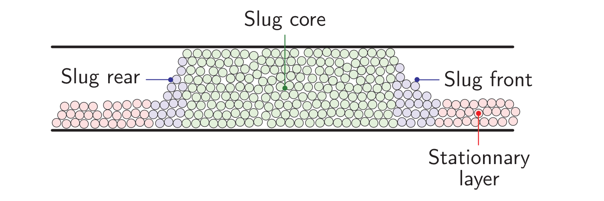

==================================
Dense Pneumatic Conveying
==================================

It is strongly recommended to visit `DEM parameters <../../../parameters/dem/dem.html>`_  and `CFD-DEM parameters <../../../parameters/unresolved-cfd-dem/unresolved-cfd-dem.html>`_ for more detailed information on the concepts and physical meaning of the parameters used in the DEM and CFD-DEM solvers.

----------------------------------
Features
----------------------------------

- Solvers: ``lethe-particles`` and ``lethe-fluid-particles``
- Three-dimensional problem
- Shows how to insert particles according to a shape with a solid objects
- Has periodic boundary conditions in DEM and CFD-DEM
- Uses a flow controller in CFD-DEM
- Simulates a dense pneumatic conveying system

---------------------------
Files Used in This Example
---------------------------

all the files mentioned below are located in the example folder (``examples/unresolved-cfd-dem/dense-pneumatic-conveying``).

- Parameter files for particle generation and settling: ``loading_particles.prm`` and ``settling_particles.prm``
- Parameter file for CFD-DEM simulation of the pneumatic conveying: ``pneumatic-conveying.prm``

-----------------------
Description of the Case
-----------------------

This example simulates the conveying of particles arranged in a plug/slug with a stationary layer.
Since the initial particle layout plays a important role in the regime of the pneumatic conveying, the particle are already forming a plug at the beginning of the CFD-DEM simulation.
Three simulation runs need to be performed.
First, we use ``lethe-particles`` to load the particles with the file ``loading_particles.prm``.
The setup of the simulation is a pipe with a solid objects (mesh) that represent the shape of a slug.
The insertion of particles are done with the plane insertion.
Second, we use ``lethe-particles`` to settle the particles with the file ``settling_particles.prm``. Only the direction of gravity is changed.
Finally, we use ``lethe-fluid-particles`` to simulate the dense pneumatic conveying with the file ``pneumatic-conveying.prm`` with periodic boundary conditions.
We enable check-pointing in order to write the DEM checkpoint files which will be used as the starting point of the CFD-DEM simulation.
The geometry of the pipe and the particle properties are based on the work of Lavrinec *et al*. `[1] <https://doi.org/10.1016/j.powtec.2020.07.070>`_.

---------------------------
Running the Simulations
---------------------------
Launching the simulations is as simple as specifying the executable name and the parameter file. Assuming that the ``lethe-particles`` and ``lethe-fluid-particles`` executables are within your path, the simulations can be launched in parallel as follows:

.. code-block:: text
  :class: copy-button

  mpirun -np 8 lethe-particles loading_particles.prm

.. code-block:: text
  :class: copy-button

  mpirun -np 8 lethe-particles settling_particles.prm

.. code-block:: text
  :class: copy-button

  mpirun -np 8 lethe-fluid-particles pneumatic-conveying.prm

Lethe will generate a number of files. The most important one bears the extension ``.pvd``. It can be read by popular visualization programs such as `Paraview <https://www.paraview.org/>`_.

-------------------
Particle Insertion
-------------------

In this section we introduce the different sections of the parameter file ``loading_particles.prm`` needed to load the particles of the simulation.

Mesh
~~~~~

In this example, we are simulating a horizontal cylindrical pipe. We use the `custom cylinder <https://chaos-polymtl.github.io/lethe/documentation/parameters/cfd/mesh.html>`_ of type balanced. We use this type of mesh in order to have a uniformized cells size in the radial direction. Each the length of a cell is about 2 times the diameter of the particles. The classical cylinder mesh of deal.II has smaller cells in the center which restrict the size of the particles. The length of the pipe is 1 m and the diameter is 0.084 m. The conveying is processed in the x-direction through periodic boundary conditions.

.. code-block:: text

   subsection mesh
     set type                                = cylinder
     set grid type                           = balanced
     set grid arguments                      = 45 : 0.042 : 0.5
     set initial refinement                  = 1
     set expand particle-wall contact search = true
   end

.. note::
    Note that, since the mesh is cylindrical, ``set expand particle-wall contact search = true``. Details on this in the `DEM mesh parameters guide <../../../parameters/dem/mesh.html>`_.

A cross-section of the resulting mesh is presented in the following figure.

.. figure:: images/mesh-particle.png
    :alt: Mesh cross-section.
    :align: center

    Cross-section of the mesh used in the pneumatic conveying simulation.

Lagrangian Physical Properties
~~~~~~~~~~~~~~~~~~~~~~~~~~~~~~~

The lagrangian properties were based from the work of Lavrinec *et al*. `[1] <https://doi.org/10.1016/j.powtec.2020.07.070>`_, except for the Young's modulus that was deliberately reduced to get a smaller Rayleigh critical time step.
The gravity is set in the x-direction to allow the packing of the particles from the right side of the pipe.
The number of particles in the simulation is 32194. When the example was setup, the number specified in the simulation was higher since the insertion is done with the `plane insertion method <../../../parameters/dem/insertion_info.html#plane>`_, which will insert the particles up to when they reach the plan.
In order to avoid confusion with the number of particles in the parameter file, we did give the real number of particles inserted after 30 seconds.

.. code-block:: text

   subsection lagrangian physical properties
     set g                        = -9.81, 0, 0
     set number of particle types = 1
     subsection particle type 0
       set size distribution type            = uniform
       set diameter                          = 0.005
       set number of particles               = 32194
       set density particles                 = 890
       set young modulus particles           = 1e6
       set poisson ratio particles           = 0.33
       set restitution coefficient particles = 0.3
       set friction coefficient particles    = 0.3
       set rolling friction particles        = 0.2
     end
     set young modulus wall           = 1e6
     set poisson ratio wall           = 0.33
     set restitution coefficient wall = 0.3
     set friction coefficient wall    = 0.4
     set rolling friction wall        = 0.2
   end

Insertion Info
~~~~~~~~~~~~~~
As said in the previous section, the particles are inserted with the plane insertion method. The insertion plane is located at the right side of the pipe. As we can see of the following figure, the plane is placed in a inclined manner. Since the plane insertion method will insert one particle in a cell that is intersected by the plane, we need to place the plane so it does not intersect the area above the solid object. Particles have a initial velocity in x-direction in order to speed up the packing process and in y-direction to have more collisions and randomness in the distribution.

.. figure:: images/insertion.png
    :alt: insertion.
    :align: center

    Side view of the pipe during the insertion of particles in the x-direction with the solid object (green) and the insertion plane (red).

.. code-block:: text

   subsection insertion info
     set insertion method              = plane
     set insertion frequency           = 400
     set insertion plane point         = 0.475, -0.0325, 0
     set insertion plane normal vector = -0.25, 4.75, 0
     set insertion maximum offset      = 0.001
     set insertion prn seed            = 19
     set initial velocity              = -0.35, 0.1, 0.0
   end

Boundary Conditions DEM
~~~~~~~~~~~~~~~~~~~~~~~
Periodic boundary conditions need to be setup in the DEM simulation since we used them in the CFD-DEM simulation. However, we do not want to use them during the loading of the particles.

.. code-block:: text

   subsection DEM boundary conditions
     set number of boundary conditions = 1

     subsection boundary condition 0
       set type               = periodic
       set periodic id 0      = 1
       set periodic id 1      = 2
       set periodic direction = 0
     end
   end

Floating Walls
~~~~~~~~~~~~~~

In order to avoid particles to pass through the periodic boundary conditions, we use floating walls. The floating walls are placed at the left and right side of the pipe. We need this pair of walls because periodic particles do not interact with the wall on the other side of the periodic boundary condition.

.. code-block:: text

   subsection floating walls
   set number of floating walls = 2
   subsection wall 0
     subsection point on wall
       set x = -0.5
       set y = 0
       set z = 0
     end
     subsection normal vector
       set nx = 1
       set ny = 0
       set nz = 0
     end
     set start time = 0
     set end time   = 30
   end
   subsection wall 1
     subsection point on wall
       set x = 0.5
       set y = 0
       set z = 0
     end
     subsection normal vector
       set nx = -1
       set ny = 0
       set nz = 0
     end
     set start time = 0
     set end time   = 30
   end
  end

Solid Objects
~~~~~~~~~~~~~~

The solid object is a simplex surface mesh that represents the shape of a slug. The mesh is generated with the `Gmsh <https://gmsh.info/>`_ software.
The length of the slug is 0.5 m for the area that fully obstruct the pipe, and there are 45° inclined planes for the rear and the front of the slug. The stationary layer (the layer between periodic slugs) has a height of 0.021 m which represents a fraction of 20% of the cross-section area of the pipe. The followinf fiTure shows the different parts of the slug.

    Different parts of the slug in a dense pneumatic conveying.

.. code-block:: text

   subsection solid objects
     set number of solids = 1
     subsection solid object 0
       subsection mesh
         set type      = gmsh
         set file name = slug-shape.msh
         set simplex   = true
       end
     end
   end

Model Parameters
~~~~~~~~~~~~~~~~
The model parameters are quite standard for a DEM simulation with the nonlinear Hertz-Mindlin contact force method, a constant rolling resistance torque method, and the velocity Verlet integration method. Here, we use the `Adaptive Sparse Contacts <../../../parameters/dem/model_parameters.html#adaptive-sparse-contacts-asc>`_
method to speedup the simulation. The method will disabled the contact computation in quasi-static areas which represents a significant part of the domain during the loading of the particles. Weight factor parameters for the ASC status are use in the load balancing method. No further explanation a given about the method, a future example will be added in order to detail it and to compare the performance gain.

.. code-block:: text

   subsection model parameters
     subsection contact detection
       set contact detection method = dynamic
       set neighborhood threshold   = 1.3
     end
     subsection load balancing
       set load balance method     = dynamic_with_sparse_contacts
       set threshold               = 0.5
       set dynamic check frequency = 8000
       set active weight factor    = 0.8
       set inactive weight factor  = 0.6
     end
     set particle particle contact force method = hertz_mindlin_limit_overlap
     set particle wall contact force method     = nonlinear
     set integration method                     = velocity_verlet
     set rolling resistance torque method       = constant_resistance
     subsection adaptive sparse contacts
       set enable adaptive sparse contacts = true
       set enable particle advection       = false
       set granular temperature threshold  = 1e-4
       set solid fraction threshold        = 0.4
     end
   end

Simulation Control
~~~~~~~~~~~~~~~~~~~~~~~~~~~~

Here, we define the time-step and the simulation end time. 30 seconds of simulation are needed to load the particles. This long simulation time is caused by the plane insertion method that inserts only a small number of particles at a time (about 1000 particles per second of simulation).

.. code-block:: text

    subsection simulation control
      set time step        = 5e-5
      set time end         = 30
      set log frequency    = 500
      set output frequency = 1200
      set output path      = ./output_dem/
    end

Restart
~~~~~~~~

Check pointing is enabled since we need the output to rerun the DEM solver with the particles settled in the pipe. The check pointing occurs each 1.5 seconds, in case we need to stop and restart the loading simulation.

.. code-block:: text

    subsection restart
      set checkpoint = true
      set frequency  = 30000
      set restart    = false
      set filename   = dem
    end

-------------------
Settling particles
-------------------

In this section we show the difference of the parameter file ``settling_particles.prm`` needed to settle the particles with the same gravity direction as the pneumatic conveying simulation. Also, many sections related to the loading are not needed such as the the insertion info, the floating walls, and the solid objects.

Simulation Control
~~~~~~~~~~~~~~~~~~~~
Here we allow a 2.5 seconds for the settling of the particles. Since this simulation is a restart of the loading particle simulation, the end time is 32.5 seconds.

.. code-block:: text

    subsection simulation control
      set time step        = 5e-5
      set time end         = 30
      set log frequency    = 500
      set output frequency = 1200
      set output path      = ./output_dem/
    end

Restart
~~~~~~~~

This simulation reads the restart, meaning this option is set to true. Also, the check pointing is reduce to 0.5 seconds.

.. code-block:: text

    subsection restart
      set checkpoint = true
      set frequency  = 30000
      set restart    = true
      set filename   = dem
    end

Lagrangian Physical Properties
~~~~~~~~~~~~~~~~~~~~~~~~~~~~~~~
The main difference in this simulation is that the gravity is changed to the y-direction, according to the next simulation using the CFD-DEM solver.

.. code-block:: text

   subsection lagrangian physical properties
     set g                        = 0, -9.81, 0
     set number of particle types = 1
     subsection particle type 0
       set size distribution type            = uniform
       set diameter                          = 0.005
       set number of particles               = 32194
       set density particles                 = 890
       set young modulus particles           = 1e6
       set poisson ratio particles           = 0.33
       set restitution coefficient particles = 0.3
       set friction coefficient particles    = 0.3
       set rolling friction particles        = 0.2
     end
     set young modulus wall           = 1e6
     set poisson ratio wall           = 0.33
     set restitution coefficient wall = 0.3
     set friction coefficient wall    = 0.4
     set rolling friction wall        = 0.2
   end

---------------------------------
Pneumatic Conveying Simulation
---------------------------------

The CFD simulation is to be carried out using the slug in the previous step. We will discuss the different parameter file sections.
The mesh and the DEM boundary condition sections are identical to the ones in the DEM simulations and will not be shown again.

Lagrangian Physical Properties
~~~~~~~~~~~~~~~~~~~~~~~~~~~~~~~
The physical properties of the particles are the same as in the DEM simulations, except for the Young's modulus that was increased.

.. code-block:: text

   subsection lagrangian physical properties
     set g                        = 0, -9.81, 0
     set number of particle types = 1
     subsection particle type 0
       set size distribution type            = uniform
       set diameter                          = 0.005
       set number of particles               = 32194
       set density particles                 = 890
       set young modulus particles           = 1e7
       set poisson ratio particles           = 0.33
       set restitution coefficient particles = 0.3
       set friction coefficient particles    = 0.3
       set rolling friction particles        = 0.2
     end
     set young modulus wall           = 1e7
     set poisson ratio wall           = 0.33
     set restitution coefficient wall = 0.3
     set friction coefficient wall    = 0.4
     set rolling friction wall        = 0.2
   end

Model Parameters
~~~~~~~~~~~~~~~~
Model parameters are the same as in the DEM simulation, but we do not use any strategies for enhanced performance such as load balancing or adaptive sparse contacts.

.. code-block:: text

   subsection model parameters
     subsection contact detection
       set contact detection method = dynamic
       set neighborhood threshold   = 1.3
     end
     set particle particle contact force method = hertz_mindlin_limit_overlap
     set particle wall contact force method     = nonlinear
     set integration method                     = velocity_verlet
     set rolling resistance torque method       = constant_resistance
   end

Simulation Control
~~~~~~~~~~~~~~~~~~~~~~~~~~~~

The simulation lasts 10 seconds and the CFD time step is 5e-4 seconds.

.. code-block:: text

    subsection simulation control
      set method               = bdf1
      set output name          = cfd_dem
      set output frequency     = 10
      set startup time scaling = 0.6
      set time end             = 10
      set time step            = 5e-4
      set output path          = ./output/
    end

Physical Properties
~~~~~~~~~~~~~~~~~~~~~~~~~~~~

The physical properties of air are the same as Lavrinec *et al*. `[1] <https://doi.org/10.1016/j.powtec.2020.07.070>`_

.. code-block:: text

    subsection physical properties
      subsection fluid 0
        set kinematic viscosity = 1.5e-5
        set density             = 1.205
      end
    end

Boundary Conditions
~~~~~~~~~~~~~~~~~~~~~~~~~~~~

The boundary condition at the wall of the pipe is a weak function where the Dirichlet condition is weakly imposed as a no-slip condition. The inlet and the outlet have periodic boundaries `See here <../../../parameters/cfd/boundary_conditions_cfd.html>`_ for more information about those boundary conditions.

.. code-block:: text

    subsection boundary conditions
      set number = 2
      subsection bc 0
        set id   = 1
        set type = function weak
        set beta = 100
        subsection u
          set Function expression = 0
        end
        subsection v
          set Function expression = 0
        end
        subsection w
          set Function expression = 0
        end
      end
      subsection bc 1
        set id                 = 1
        set type               = periodic
        set periodic_id        = 2
        set periodic_direction = 0
      end
    end

Flow control
~~~~~~~~~~~~~~~~~~

Since the simulation has periodic boundary conditions, a correction force is needed to drive the flow to compensate the pressure loss in the pipe. In other to achieve this, we use the `dynamic flow controller <../../../parameters/cfd/dynamic_flow_control.html>`_. Here, we also apply a proportional beta force on particles. The average velocity is set to 3 m/s, this correspond to the average on the whole domain in regards of the void fraction. The flow controller performs well for CFD simulation, but has some limitation for CFD-DEM simulation. By default, the controller has a high stiffness and aims to correct the flow for the next time step. However, the carrying of particles by the flow leads to a delay in the force correction and results in a oscillation of the velocity of the flow. To avoid this, we use the beta threshold and the alpha relaxation parameter. Here, the beta value will not be updated if the new value is within the 5% of the previous value. Also, the correction to apply to the previous beta value is reduce by a factor of 0.25. This way, the velocity of the flow and the particles are more stable.

.. code-block:: text

   subsection flow control
     set enable               = true
     set enable beta particle = true
     set average velocity     = 3
     set flow direction       = 0
     set beta threshold       = 0.05
     set alpha                = 0.25
     set verbosity            = verbose
   end

Void Fraction
~~~~~~~~~~~~~~~

We choose the `quadrature centred method (QCM) <../../../theory/multiphase/cfd_dem/unresolved_cfd-dem.html#the-quadrature-centered-method>`_  to calculate void fraction. The ``l2 smoothing factor`` we choose is the square of twice the diameter of the particles.

.. code-block:: text

    subsection void fraction
      set mode                = qcm
      set read dem            = true
      set dem file name       = dem
      set l2 smoothing factor = 0.0001
    end

CFD-DEM
~~~~~~~~~~

The chosen drag model is Kock and Hill, and we use the Saffman lift force, the buoyancy force, and the pressure force. The coupling frequency is set to 100, which means that the DEM time step is 1e-3 s, for a Rayleigh critical time step of about 7%. The grad-div stabilization is used with a length scale of 0.084, the diameter of the pipe.

.. code-block:: text

   subsection cfd-dem
     set vans model             = modelA
     set grad div               = true
     set drag model             = kochhill
     set saffman lift force     = true
     set buoyancy force         = true
     set pressure force         = true
     set coupling frequency     = 100
     set implicit stabilization = false
     set grad-div length scale  = 0.082
     set particle statistics    = true
   end

Non-linear Solver
~~~~~~~~~~~~~~~~~

We use the inexact Newton non-linear solver to minimize the number of time the matrix of the system is assembled. This is used to increase the speed of the simulation, since the matrix assembly requires significant computations.

.. code-block:: text

   subsection non-linear solver
     subsection fluid dynamics
       set solver           = inexact_newton
       set matrix tolerance = 0.1
       set reuse matrix     = true
       set tolerance        = 1e-4
       set max iterations   = 10
       set verbosity        = quiet
     end
   end

Linear Solver
~~~~~~~~~~~~~

.. code-block:: text

   subsection linear solver
     subsection fluid dynamics
       set method                                = gmres
       set max iters                             = 200
       set relative residual                     = 1e-4
       set minimum residual                      = 1e-6
       set ilu preconditioner fill               = 0
       set ilu preconditioner absolute tolerance = 1e-8
       set ilu preconditioner relative tolerance = 1.00
       set verbosity                             = quiet
       set max krylov vectors                    = 200
     end
   end

--------
Results
--------

We briefly comment on some results that can be extracted from this example.

.. important::

    This example includes a postprocessing file written in Python that uses the `lethe_pyvista_tools <../../../tools/postprocessing/postprocessing.html>`_. module.

.. important::

    To use the code, run ``python3 lsfb_postprocessing.py $PATH_TO_YOUR_CASE_FOLDER``. The code will generate several graphics showing the pressure profile within the bed, which are going to be stored in ``$PATH_TO_YOUR_CASE_FOLDER/P_x``. It will also generate a ``deltaP_t.csv`` file with the total pressure difference for each time-step. Additionally, it generates a void fraction as a function of time graphic (``eps_t.png``).

.. important::

    You need to ensure that the ``lethe_pyvista_tools`` is working on your machine. Click `here <../../../tools/postprocessing/postprocessing.html>`_ for details.

Side View
~~~~~~~~~~~

Here we show comparison between the experimentally observed and simulated behavior of the liquid-solid fluidized bed with alumina.

The void fraction and velocity profile of the fluid are also shown.

.. raw:: html

    
<iframe width="560" height="315" src="https://www.youtube.com/embed/Ra7d-p7wD8Y" title="YouTube video player" frameborder="0" allow="accelerometer; autoplay; clipboard-write; encrypted-media; gyroscope; picture-in-picture; web-share" allowfullscreen></iframe>

Total Pressure Drop and Bed Expansion
~~~~~~~~~~~~~~~~~~~~~~~~~~~~~~~~~~~~~~

In fluidized beds, the total pressure drop (:math:`- \Delta p`) reflects the total weight of particles (:math:`M`). The following equation is derived from a force balance inside the fluidized bed

.. math::

    H(1 - \bar{\varepsilon}_f) = \frac{- \Delta p}{(\rho_p - \rho_f)g} = \frac{M}{\rho_p A} = \mathrm{constant}

where :math:`H` is the total bed height, :math:`\bar{\varepsilon}_f` is the average fluid fraction (void fraction) at the bed region, :math:`\rho_p` and :math:`\rho_f` are the densities of the particles and the fluid (respectively), and :math:`A` is the cross-section area of the equipment.

Liquid fluidized beds are very uniform in terms of particles distribution, resulting in an uniform distribution of  :math:`\varepsilon_f` along the be height. From this hypothesis, we can conclude that, for a constant and uniform fluid inlet flow rate, the pressure slope is:

.. math::

    \left.- \frac{\mathrm{d} p }{\mathrm{d} z}\right|_{z = 0}^{z = H}  \approx \mathrm{constant}

With the pressure slope, it is also possible to determine the bed void fraction manipulating the first equation, which gives:

.. math::

    \bar{\varepsilon}_f = 1 - \frac{\left.- \frac{\mathrm{d} p }{\mathrm{d} z}\right|_{z = 0}^{z = H} }{(\rho_p - \rho_f)g}

The resulting behavior of the pressure along the bed height and the void fraction with time is shown in the following animation.

.. image:: images/pressure_time.gif
    :alt: Pressure drop as a function of time
    :align: center
    :name: press_t

Particles Dynamics
~~~~~~~~~~~~~~~~~~~~

Since the fluidization occurs in a high density fluid, the density difference between alginate and alumina particles have a significant impact on the velocity of the particles inside the bed.

The following animation is in real time. It is possible to notice that, for a similar bed height, the bed of alumina particles expands way faster than the alginate.

.. raw:: html

    
<iframe width="560" height="315" src="https://www.youtube.com/embed/kMp86PdZ6tU" title="YouTube video player" frameborder="0" allow="accelerometer; autoplay; clipboard-write; encrypted-media; gyroscope; picture-in-picture; web-share" allowfullscreen></iframe>

-----------
References
-----------

`[1] <https://doi.org/10.1016/j.partic.2021.04.007>`_ A. Lavrinec, O. Orozovic, H. Rajabnia, K. Williams, M. Jones & G. Klinzing, “An assessment of steady-state conditions in single slug horizontal pneumatic conveying.” *Particuology*, vol. 58, p. 187-195, 2021 doi:10.1016/j.partic.2021.04.007
