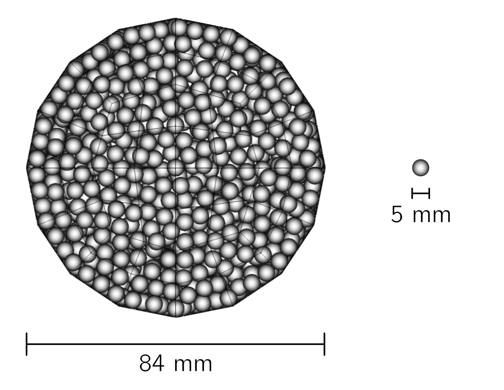
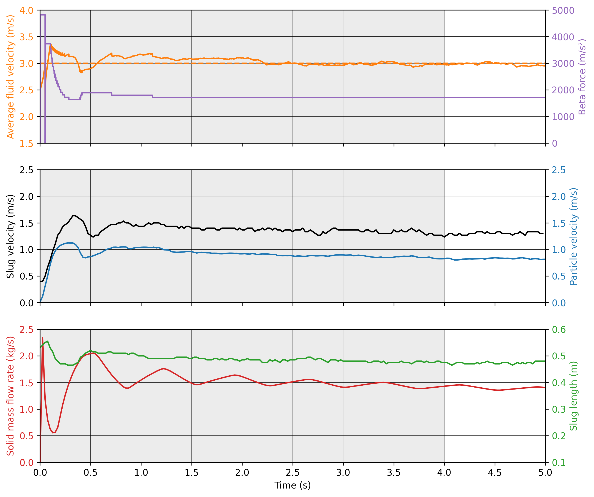

==================================
Dense Pneumatic Conveying
==================================

This example simulates the dense pneumatic conveying of particles in a horizontal periodic pipe.

----------------------------------
Features
----------------------------------

- Solvers: ``lethe-particles`` and ``lethe-fluid-particles``
- Three-dimensional problem
- Particle insertion according to a shape with a `solid object <../../../parameters/dem/solid_objects.html>`_ using the `plane insertion method <../../../parameters/dem/insertion_info.html#plane>`_
- Has `periodic boundary conditions <../../../parameters/dem/boundary_conditions.html>`_  in DEM and CFD-DEM
- Uses a `dynamic flow controller <../../../parameters/cfd/dynamic_flow_control.html>`_ in CFD-DEM
- Uses the `adaptive sparse contacts <../../../parameters/dem/model_parameters.html#adaptive-sparse-contacts-asc>`_ for particle loading in DEM
- Simulates a dense pneumatic conveying system

---------------------------
Files Used in this Example
---------------------------

All example's files are located in the example's folder (``examples/unresolved-cfd-dem/dense-pneumatic-conveying``), and they include:

- Parameter files for particle loading and settling: ``loading-particles.prm`` and ``settling-particles.prm``
- Parameter file for CFD-DEM simulation of the pneumatic conveying: ``pneumatic-conveying.prm``

-----------------------
Description of the Case
-----------------------

This example simulates the conveying of particles arranged in a plug/slug with a stationary layer.
The geometry of the pipe and the particle properties are based on the work of Lavrinec *et al*. [#lavrinec2021]_

As the other Unresolved CFD-DEM simulations, this example starts from inserting the particles.

However, since the initial position of the particles play an important role in the dynamics, a more involved insertion procedure is used to generate an initial plug of particles as illustrated in the following figure.

.. figure:: images/insertion.png
    :alt: insertion
    :align: center

    View of the pipe after the loading of particles with the insertion plane.

In summary, the simulation has three steps:

- First, we run ``lethe-particles loading-particles.prm`` to load the particles. The insertion of particles is done using the plane insertion method.
- Then, we run ``lethe-particles settling-particles.prm`` to reorganize the particles in the system. The gravity is changed to the y-direction and we wait for particles to settle.
- Finally, we call ``lethe-fluid-particles pneumatic-conveying.prm`` to simulate the dense pneumatic conveying.

We enable checkpointing in order to write the DEM checkpoint files in between the steps, which will be used as the starting point of the next.

.. figure:: images/pneumatic.png
    :alt: pneumatic-conveying
    :align: center

    View of the pipe during the pneumatic conveying.

-------------------
DEM Parameter files
-------------------

Loading Particles
~~~~~~~~~~~~~~~~~

In this section we introduce the different sections of the parameter file ``loading-particles.prm``.

Mesh
----

In this example, we simulate the transport of particles in a 1 m wide long 0.084 m diameter pipe. The conveying is processed in the x-direction through periodic boundary conditions. We use the `custom cylinder <../../../parameters/cfd/mesh.html>`_ of type balanced, which is prefered over the regular deal.II option for having an uniform cell size distribution in the radial direction. Cells' size are approximately 2 times the diameter of the particles in both longitudinal and radial directions.

.. code-block:: text

   subsection mesh
     set type                                = cylinder
     set grid type                           = balanced
     set grid arguments                      = 45 : 0.042 : 0.5
     set initial refinement                  = 1
     set expand particle-wall contact search = true
   end

.. note::
    Note that, since the mesh is cylindrical, ``set expand particle-wall contact search = true``. For further details, refer to `DEM mesh parameters guide <../../../parameters/dem/mesh.html>`_.

A cross-section of the resulting mesh is presented in the following figure.

    Cross-section of the mesh used in the pneumatic conveying simulation.

Lagrangian Physical Properties
------------------------------

The lagrangian properties were based on the work of Lavrinec *et al*. [#lavrinec2021]_, except for the Young's modulus that was deliberately reduced to get a higher Rayleigh critical time step.

For the particle insertion, we set gravity in x-direction to allow the packing of the particles from the right side of the pipe.
The number of particles in the simulation is 32194. 

.. note::
  In order to avoid confusion with the number of particles in the parameter file, we did give the real number of particles inserted after 30 seconds. However, this is not necessary for the plane insertion method. We refer the reader to the `DEM insertion info guide <../../../parameters/dem/insertion_info.html#plane>`_ for further information.

.. code-block:: text

   subsection lagrangian physical properties
     set g                        = -9.81, 0, 0
     set number of particle types = 1
     subsection particle type 0
       set size distribution type            = uniform
       set diameter                          = 0.005
       set number of particles               = 32194
       set density particles                 = 890
       set young modulus particles           = 1e6
       set poisson ratio particles           = 0.33
       set restitution coefficient particles = 0.3
       set friction coefficient particles    = 0.3
       set rolling friction particles        = 0.2
     end
     set young modulus wall           = 1e6
     set poisson ratio wall           = 0.33
     set restitution coefficient wall = 0.3
     set friction coefficient wall    = 0.4
     set rolling friction wall        = 0.2
   end

Insertion Info
--------------

As said in the previous section, the particles are inserted with the `plane insertion method <../../../parameters/dem/insertion_info.html#plane>`_. The plane, in red, is located at the right-hand side of the pipe. As we can see from the following figure, the plane is positioned at an angle. Since the plane insertion method will insert one particle in a cell that is intersected by the plane, we need to place the plane so it does not intersect the area above the solid object. Particles have an initial velocity in x-direction in order to speed up the packing process and in y-direction to have more collisions and randomness in the distribution.

.. figure:: images/insertion-plane.png
    :alt: insertion.
    :align: center

    Side view of the pipe during the insertion of particles in the x-direction with the solid object (green) and the insertion plane (red).

.. code-block:: text

   subsection insertion info
     set insertion method              = plane
     set insertion frequency           = 400
     set insertion plane point         = 0.475, -0.0325, 0
     set insertion plane normal vector = -0.25, 4.75, 0
     set insertion maximum offset      = 0.001
     set insertion prn seed            = 19
     set initial velocity              = -0.35, 0.1, 0.0
   end

Boundary Conditions DEM
-----------------------

Periodic boundary conditions need to be setup in the DEM simulation since we use them in the CFD-DEM simulation.

.. code-block:: text

   subsection DEM boundary conditions
     set number of boundary conditions = 1

     subsection boundary condition 0
       set type               = periodic
       set periodic id 0      = 1
       set periodic id 1      = 2
       set periodic direction = 0
     end
   end

We need to set the periodic boundary conditions now for compatibility, but particles do not interact with these boundaries at the current stage. The next subsection explains how particles are prevented from interacting with the periodic boundaries.

Floating Walls
--------------

We use floating walls to avoid particles passing through the periodic boundary conditions. The floating walls are placed at the left and right side of the pipe. We need this pair of walls because periodic particles do not interact with the periodic boundaries.

.. code-block:: text

   subsection floating walls
   set number of floating walls = 2
   subsection wall 0
     subsection point on wall
       set x = -0.5
       set y = 0
       set z = 0
     end
     subsection normal vector
       set nx = 1
       set ny = 0
       set nz = 0
     end
     set start time = 0
     set end time   = 30
   end
   subsection wall 1
     subsection point on wall
       set x = 0.5
       set y = 0
       set z = 0
     end
     subsection normal vector
       set nx = -1
       set ny = 0
       set nz = 0
     end
     set start time = 0
     set end time   = 30
   end
  end

Solid Objects
-------------

The solid object is a simplex surface mesh that represents the shape of a slug. The mesh is generated with `Gmsh <https://gmsh.info/>`_.
The following figure shows the different parts of the slug. The length of the slug core (where particles fully obstruct the pipe; in green) is 0.5 m, and 45° planes inclined are placed the rear and the front of the slug (in blue). The stationary layer (the layer between periodic slugs; in red) has a height of 0.021 m which represents 20 % of the cross-section area of the pipe. 

.. figure:: images/slug.png
    :alt: Slug
    :align: center

    Different parts of the slug in a dense pneumatic conveying.

.. code-block:: text

   subsection solid objects
     set number of solids = 1
     subsection solid object 0
       subsection mesh
         set type      = gmsh
         set file name = slug-shape.msh
         set simplex   = true
       end
     end
   end

Model Parameters
----------------

The model parameters are quite standard for a DEM simulation with the non-linear Hertz-Mindlin contact force model, a constant rolling resistance torque, and the velocity Verlet integration method.

.. note::

    Here, we use the `Adaptive Sparse Contacts (ASC) <../../../parameters/dem/model_parameters.html#adaptive-sparse-contacts-asc>`_ method to speedup the simulation,. The method will disable the contact computation in quasi-static areas which represents a significant part of the domain during the loading of the particles. Weight factor parameters for the ASC status are used in the load balancing method. The `discharge plate example <../../dem/plate-discharge/plate-discharge.html>`_ is a good example of the use of the ASC method with DEM.

.. code-block:: text

   subsection model parameters
     subsection contact detection
       set contact detection method = dynamic
       set neighborhood threshold   = 1.3
     end
     subsection load balancing
       set load balance method     = dynamic_with_sparse_contacts
       set threshold               = 0.5
       set dynamic check frequency = 8000
       set active weight factor    = 0.8
       set inactive weight factor  = 0.6
     end
     set particle particle contact force method = hertz_mindlin_limit_overlap
     set particle wall contact force method     = nonlinear
     set integration method                     = velocity_verlet
     set rolling resistance torque method       = constant_resistance
     subsection adaptive sparse contacts
       set enable adaptive sparse contacts = true
       set enable particle advection       = false
       set granular temperature threshold  = 1e-4
       set solid fraction threshold        = 0.4
     end
   end

Simulation Control
------------------

Here, we define the time step and the simulation end time. 30 seconds of simulation are needed to load the particles. The long simulation time is due to the plane insertion method, which only allows for about 1000 particles per second of simulation.

.. code-block:: text

    subsection simulation control
      set time step        = 5e-5
      set time end         = 30
      set log frequency    = 500
      set output frequency = 1200
      set output path      = ./output_dem/
    end

Restart
-------

Checkpointing is enabled since we need the output to rerun the DEM solver to settle the particles in the pipe. The checkpointing occurs each 1.5 seconds, in case we need to stop and restart the loading simulation.

.. code-block:: text

    subsection restart
      set checkpoint = true
      set frequency  = 30000
      set restart    = false
      set filename   = dem
    end

Settling Particles
~~~~~~~~~~~~~~~~~~

In this section we show the difference in the parameter file ``settling-particles.prm`` needed to settle the particles with the same gravity vector as the pneumatic conveying simulation. Consequently, many sections related to the loading are not needed such as the the insertion info, the floating walls, and the solid objects.

Simulation Control
------------------

Here we allow a 2.5 seconds for the settling of the particles. Since this simulation is a restart of the loading particle simulation, the end time is 32.5 seconds.

.. code-block:: text

    subsection simulation control
      set time step        = 5e-5
      set time end         = 32.5
      set log frequency    = 500
      set output frequency = 1200
      set output path      = ./output_dem/
    end

Restart
-------

This simulation restarts from the previous step. Also, the checkpointing is reduced to 0.5 seconds.

.. code-block:: text

    subsection restart
      set checkpoint = true
      set frequency  = 10000
      set restart    = true
      set filename   = dem
    end

Lagrangian Physical Properties
------------------------------

The main difference between the insertion and settling simulations is the direction of the gravity, which is changed to y-direction to be coherent with the next simulation using the CFD-DEM solver.

.. code-block:: text

   subsection lagrangian physical properties
     set g                        = 0, -9.81, 0
     set number of particle types = 1
     subsection particle type 0
       set size distribution type            = uniform
       set diameter                          = 0.005
       set number of particles               = 32194
       set density particles                 = 890
       set young modulus particles           = 1e6
       set poisson ratio particles           = 0.33
       set restitution coefficient particles = 0.3
       set friction coefficient particles    = 0.3
       set rolling friction particles        = 0.2
     end
     set young modulus wall           = 1e6
     set poisson ratio wall           = 0.33
     set restitution coefficient wall = 0.3
     set friction coefficient wall    = 0.4
     set rolling friction wall        = 0.2
   end

----------------------
CFD-DEM Parameter file
----------------------

Pneumatic Conveying Simulation
~~~~~~~~~~~~~~~~~~~~~~~~~~~~~~

The CFD simulation is carried out using the slug generated in the previous step. We will discuss the different sections of the parameter file used for the CFD-DEM simulation.
The mesh and the DEM boundary condition sections are identical to the ones in the DEM simulations and will not be shown again.

Lagrangian Physical Properties
------------------------------

The physical properties of the particles are the same as in the DEM simulations, except for the Young's modulus that was increased to use the same value as the article [#lavrinec2021]_.

.. code-block:: text

   subsection lagrangian physical properties
     set g                        = 0, -9.81, 0
     set number of particle types = 1
     subsection particle type 0
       set size distribution type            = uniform
       set diameter                          = 0.005
       set number of particles               = 32194
       set density particles                 = 890
       set young modulus particles           = 1e7
       set poisson ratio particles           = 0.33
       set restitution coefficient particles = 0.3
       set friction coefficient particles    = 0.3
       set rolling friction particles        = 0.2
     end
     set young modulus wall           = 1e7
     set poisson ratio wall           = 0.33
     set restitution coefficient wall = 0.3
     set friction coefficient wall    = 0.4
     set rolling friction wall        = 0.2
   end

Model Parameters
----------------

Model parameters are the same as in the DEM simulation, but without load balancing or adaptive sparse contacts.

.. code-block:: text

   subsection model parameters
     subsection contact detection
       set contact detection method = dynamic
       set neighborhood threshold   = 1.3
     end
     set particle particle contact force method = hertz_mindlin_limit_overlap
     set particle wall contact force method     = nonlinear
     set integration method                     = velocity_verlet
     set rolling resistance torque method       = constant_resistance
   end

Simulation Control
------------------

The simulation lasts 5 seconds and the CFD time step is 5e-4 seconds.

.. code-block:: text

    subsection simulation control
      set method               = bdf1
      set output name          = cfd_dem
      set output frequency     = 10
      set time end             = 5
      set time step            = 5e-4
      set output path          = ./output/
    end

Physical Properties
-------------------

The physical properties of air are the same as Lavrinec *et al*. [#lavrinec2021]_.

.. code-block:: text

    subsection physical properties
      subsection fluid 0
        set kinematic viscosity = 1.5e-5
        set density             = 1.205
      end
    end

Boundary Conditions
-------------------

The boundary condition at the wall of the pipe is a weak function where the Dirichlet condition is weakly imposed as a no-slip condition. The inlet and the outlet have periodic boundaries. `See here <../../../parameters/cfd/boundary_conditions_cfd.html>`_ for more information on boundary conditions.

.. code-block:: text

    subsection boundary conditions
      set number = 2
      subsection bc 0
        set id   = 0
        set type = function weak
        set beta = 100
        subsection u
          set Function expression = 0
        end
        subsection v
          set Function expression = 0
        end
        subsection w
          set Function expression = 0
        end
      end
      subsection bc 1
        set id                 = 1
        set type               = periodic
        set periodic_id        = 2
        set periodic_direction = 0
      end
    end

Flow control
------------

Since the simulation has periodic boundary conditions, a correction volumetric force is needed to drive the flow to compensate the pressure drop in the pipe. For this, we use the `dynamic flow controller <../../../parameters/cfd/dynamic_flow_control.html>`_. Here, we also apply a proportional force on particles. The average velocity is set to 3 m/s, this correspond to the average over the entire domain considering the void fraction. The flow controller performs well for CFD simulation, but needs some tuned for CFD-DEM simulation. 

By default, the controller has a high stiffness and aims to correct the flow in the next time step. However, the carrying of particles by the flow leads to a response time that is not taken into account and results in a oscillation of the velocity of the flow. To avoid this, we use the volumetric force threshold ``beta threshold`` and the ``alpha`` relaxation parameter. Here, the volumetric force value will not be updated if the new value is within the 5% of the previous value. Also, the correction to apply to the previous volumetric force value is reduced by a factor of 0.25. This way, the velocity of the flow and the particles are more stable.

.. code-block:: text

   subsection flow control
     set enable               = true
     set enable beta particle = true
     set average velocity     = 3
     set flow direction       = 0
     set beta threshold       = 0.05
     set alpha                = 0.25
     set verbosity            = verbose
   end

Void Fraction
-------------

We choose the `quadrature centred method (QCM) <../../../theory/multiphase/cfd_dem/unresolved_cfd-dem.html#the-quadrature-centered-method>`_  to calculate the void fraction. The ``l2 smoothing factor`` we choose is the square of twice the diameter of the particles.

.. code-block:: text

    subsection void fraction
      set mode                = qcm
      set read dem            = true
      set dem file name       = dem
      set l2 smoothing factor = 0.0001
    end

CFD-DEM
-------

We use the Di Felice drag model, the Saffman lift force, the buoyancy force, and the pressure force. The coupling frequency is set to 100, which means that the DEM time step is 5e-6 s. The DEM time step is 3.5% of the Rayleigh critical time step. The grad-div stabilization is used with a length scale of 0.084, the diameter of the pipe.

.. code-block:: text

   subsection cfd-dem
     set grad div               = true
     set drag model             = difelice
     set saffman lift force     = true
     set buoyancy force         = true
     set pressure force         = true
     set coupling frequency     = 100
     set implicit stabilization = false
     set grad-div length scale  = 0.084
     set particle statistics    = true
   end

Non-linear Solver
-----------------

We use the inexact Newton non-linear solver to minimize the number of time the matrix of the system is assembled. This is used to increase the speed of the simulation, since the matrix assembly requires significant computations.

.. code-block:: text

   subsection non-linear solver
     subsection fluid dynamics
       set solver           = inexact_newton
       set matrix tolerance = 0.1
       set reuse matrix     = true
       set tolerance        = 1e-4
       set max iterations   = 10
       set verbosity        = quiet
     end
   end

-----------------------
Running the Simulations
-----------------------

Launching the simulations is as simple as specifying the executable name and the parameter file. Assuming that the ``lethe-particles`` and ``lethe-fluid-particles`` executables are within your path, the simulations can be launched in parallel as follows:

.. code-block:: text
  :class: copy-button

  mpirun -np 8 lethe-particles loading-particles.prm

.. code-block:: text
  :class: copy-button

  mpirun -np 8 lethe-particles settling-particles.prm

.. note::
   Running the particle loading simulation using 8 cores takes approximately 30 minutes and the particle settling simulation takes approximately 1 minute.

Once the previous programs have finished running, you can finally launch the pneumatic conveying simulation and get the simulation log for post-processing with the following command:

.. code-block:: text
  :class: copy-button

  mpirun -np 8 lethe-fluid-particles pneumatic-conveying.prm | tee pneumatic-log.out

.. note::
   Running the pneumatics conveying simulation using 8 cores takes approximately 2.25 hours. Running all the executables in sequence will take less than 3 hours.

Lethe will generate a number of files. The most important one bears the extension ``.pvd``. It can be read by popular visualization programs such as `Paraview <https://www.paraview.org/>`_.

-------
Results
-------

The particle loading and settling simulation should look like this:

.. raw:: html

    
<iframe width="800" height="450" src="https://www.youtube.com/embed/4uM51PCypZc?si=Xrisa4h87QLjvTWO" title="YouTube video player" frameborder="0" allow="accelerometer; autoplay; clipboard-write; encrypted-media; gyroscope; picture-in-picture; web-share" referrerpolicy="strict-origin-when-cross-origin" allowfullscreen></iframe>

The pneumatic conveying simulation should look like this:

.. raw:: html

    
<iframe width="800" height="450" src="https://www.youtube.com/embed/ESfSrmmlzYE?si=1RTsvFzcwvyelGme" title="YouTube video player" frameborder="0" allow="accelerometer; autoplay; clipboard-write; encrypted-media; gyroscope; picture-in-picture; web-share" referrerpolicy="strict-origin-when-cross-origin" allowfullscreen></iframe>

.. note::
   The pneumatic conveying simulation lasts 5 seconds in this example, but last 10 seconds in the video. You can change the end time in the parameter file.

Post-processing
~~~~~~~~~~~~~~~
The data is extracted with the Lethe PyVista tool and post-processed with custom functions in the files ``pyvista_utilities.py`` and ``log_utilities.py``.
Extraction, post-processing and plotting are automated in the script ``pneumatic-conveying_post-processing.py``:

.. code-block:: text
  :class: copy-button

  python3 pneumatic-conveying_post-processing.py

The script will generate the figure and print the results in the console. If you want to modify the path or the filenames, you have to modify the script.

Mass Flow Rate and Velocities
~~~~~~~~~~~~~~~~~~~~~~~~~~~~~

Here we show the average velocities for the fluid, the slug and the particles in slug. The beta force, the averaged solid mass flow rate and the slug length over time are also shown. The shaded area represents the transient state. The quasi-steady state is approximated when velocities fluctuate around the same values.

   Results of the pneumatic conveying simulation.

The time-averaged values of velocities at quasi-steady state are shown in the following table.

.. list-table:: Time-averaged velocities at quasi-steady state.
   :width: 70.25%
   :widths: 35 20 20 20
   :header-rows: 1
   :align: center

   * -
     - Fluid
     - Slug
     - Particles
   * - Velocity (m/s)
     - 2.98
     - 1.30
     - 0.83
   * - Standard deviation (m/s)
     - 0.02
     - 0.02
     - 0.01

According to Lavrinec *et al.* [#lavrinec2020]_, the average slug velocity has a linear relationship with the particle in slug velocity and the diameter of the pipe such as:

.. math::

   \bar{u}_{\mathrm{slug}} = 0.967 \bar{u}_{\mathrm{particles}} + 0.5\sqrt{gD}

From this formula, the calculated slug velocity is 1.25 m/s. Considering that this case was simplified for the sake of the example, that the data in quasi-steady state is not computed for a long simulation time (1 s), and especially considering the standard deviation of the results, this value is considered satisfactory.

The time-averaged solid mass flow rate is 1.40 kg/s (no standard deviation are given since the instant mass flow rate always fluctuates) and the length of the slug is 0.47 ± 0.01 m.

----------
References
----------

.. [#lavrinec2021] \A. Lavrinec, O. Orozovic, H. Rajabnia, K. Williams, M. Jones & G. Klinzing, “An assessment of steady-state conditions in single slug horizontal pneumatic conveying.” *Particuology*, vol. 58, pp. 187-195, 2021. doi: `10.1016/j.partic.2021.04.007 <https://doi.org/10.1016/j.partic.2021.04.007>`_\.

.. [#lavrinec2020] \A. Lavrinec, O. Orozovic, H. Rajabnia, K. Williams, M. Jones et G. Klinzing, “Velocity and porosity relationships within dense phase pneumatic conveying as studied using coupled CFD-DEM.” *Powder Technology*, vol. 375, pp. 89–100, 2020. doi: `10.1016/j.powtec.2020.07.070 <https://doi.org/10.1016/j.powtec.2020.07.070>`_\.