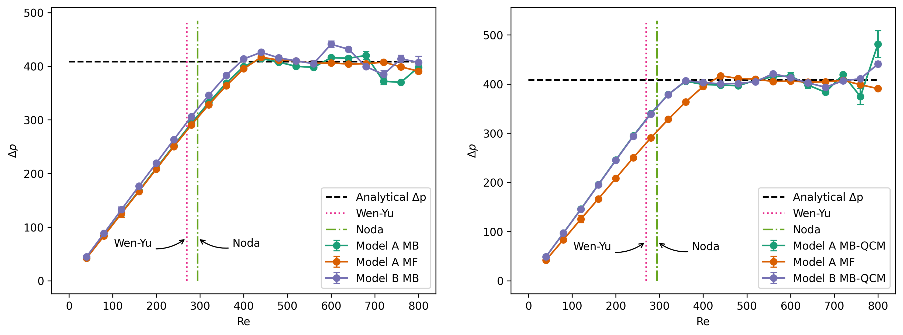

====================================
Gas-Solid Fluidized Cylinder Bed
====================================

This example simulates the fluidization of particles in air within a cylindrical bed. It is based on the fluidized bed test case presented in the work of El Geitani *et al* [#ElGeitani2023]_ and was used to validate one of the earliest CFD-DEM implementations in Lethe. Most importantly, this example compares the pressure drop across the bed as a function of the superficial gas velocity with correlations available in the literature.

----------------------------------
Features
----------------------------------

- Solvers: ``lethe-particles``, ``lethe-fluid-particles`` and ``lethe-fluid-particles-matrix-free``, with Q1-Q1
- Three-dimensional problem
- Displays the selection of models and physical properties
- Shows the three coupling strategies for the drag force (implicit, semi-implicit and explicit)
- Simulates a cylindrical solid-gas fluidized bed

---------------------------
Files Used in This Example
---------------------------

All files mentioned below are located in the example's folder (``examples/unresolved-cfd-dem/gas-solid-fluidized-cylinder-bed``).

- Parameter file for particle generation and packing: ``packing-particles.prm``
- Parameter files for CFD-DEM simulation of the gas-solid fluidized bed: ``mb-fluidized-bed-modelA-pcm-explicit.prm``, ``mb-fluidized-bed-modelA-pcm-implicit.prm``, ``mb-fluidized-bed-modelA-pcm-semi-implicit.prm``, ``mb-fluidized-bed-modelA-qcm-explicit.prm``, ``mb-fluidized-bed-modelA-qcm-implicit.prm``, ``mb-fluidized-bed-modelA-qcm-semi-implicit.prm``, ``mf-fluidized-bed-modelA-qcm-explicit.prm``, ``mf-fluidized-bed-modelA-qcm-implicit.prm``, ``mf-fluidized-bed-modelA-qcm-semi-implicit.prm``
- Post-processing Python script: ``plot-pressure.py``

-----------------------
Description of the Case
-----------------------

This example simulates a gas–solid fluidized bed inside a cylindrical column (diameter :math:`0.02` m, height :math:`0.4` m). First, ``lethe-particles`` is used with ``packing-particles.prm`` to generate and pack spherical particles (diameter :math:`0.0005` m, density :math:`1000\;\text{kg}/\text{m}^3`) inside the column. After packing, the solid–fluid mixture is simulated using the model A of the VANS equations with two solvers:

 1. The matrix-based CFD–DEM solver ``lethe-fluid-particles``

    The VANS model A using the matrix-based solver is tested with two different projection filters:

       * a cell-based filter (corresponding to the Particle Centroid Method, PCM)
       * the Quadrature-Centered Method (QCM) filter. 
  
 2. The matrix-free solver ``lethe-fluid-particle-matrix-free`` 
   
    This solver only works with the QCM filter

For more details on the different filtering approaches used in Lethe, the reader is invited to consult the `Unresolved CFD-DEM section <../../../theory/multiphase/cfd_dem/unresolved_cfd-dem.html>`_ of Lethe's theory guide. It is worth noting that in this example, the same filter is applied to both the void fraction and the particle–fluid forces, which is mathematically consistent. However, different filters can be applied to the void fraction and to the particle–fluid forces independently, if desired. Each case is run with three different coupling approaches for the drag force: explicit, implicit, and semi-implicit.

The superficial gas velocity at the inlet is varied from :math:`0.02` to :math:`0.3\;\text{m}/\text{s}` and the pressure drop across the bed is recorded. Results are compared with correlations from the literature for validation.

-------------------
DEM Parameter File
-------------------

A DEM simulation is first run to insert the particles. The subsections in the DEM parameter file ``packing-particles.prm`` that are pertinent to this example are described below. 

Mesh
~~~~~

The particles are packed inside a cylindrical column. For this reason, the mesh type is set to ``cylinder`` with a ``balanced`` grid. This mesh uses the same input arguments as the ``GridGenerator::subdivided_cylinder`` function of Deal.II, yet leads to more uniform cells across the domain. An initial refinement level of :math:`2` provides enough cells for the CFD solver while keeping the smallest cell size larger than the particle diameter. Finally, the particle–wall contact search expansion is enabled to ensure proper detection of particle–wall interactions in the curved convex geometry.

.. code-block:: text

    subsection mesh
        set type                                = cylinder
        set grid type                           = balanced
        set grid arguments                      = 44:0.01:0.22
        set initial refinement                  = 2
        set expand particle-wall contact search = true
    end

Simulation Control
~~~~~~~~~~~~~~~~~~~~~~~~~~~~

The ``simulation control`` subsection specifies the ``time step``, ``time end``, ``log frequency``, ``output frequency`` and ``output path`` of the DEM simulation. ``output boundaries`` is set to ``true`` so that the cylindrical column walls are also written to file for visualization. The ``time step`` corresponds to approximately :math:`11\%` of the `Rayleigh timestep <../../../parameters/dem/simulation_control.html>`_, ensuring numerical stability. The simulation end time is set to :math:`0.7` s, a duration sufficient for all inserted particles to settle within the column.

.. code-block:: text

    subsection simulation control
        set time step         = 0.000005
        set time end          = 0.7
        set log frequency     = 1000
        set output frequency  = 2000
        set output path       = ./output_dem/
        set output boundaries = true
    end

Restart
~~~~~~~~~~~~~~~~~~~

The initial state of the particles in the CFD-DEM solver corresponds to the final state of the DEM packing simulation. Therefore, the ``restart`` subsection is used to enable writing the checkpoint files that need to be read by the CFD-DEM solver. The prefix of these files in set as ``dem`` in the ``filename`` option.

.. code-block:: text

    subsection restart
        set checkpoint = true
        set frequency  = 10000
        set restart    = false
        set filename   = dem
    end

Model Parameters
~~~~~~~~~~~~~~~~~

Details on the model parameters subsection are provided in the `DEM Model Parameters guide <../../../parameters/dem/model_parameters.html>`_ and other `DEM examples <../../dem/dem.html>`_. The ``neighborhood threshold`` is set to :math:`1.1` as an adequate compromise between the number of contact detection steps and the number of neighbours of each particle. This is mostly for computational efficiency and a value of :math:`1.2` or :math:`1.3` could also be used here.

.. code-block:: text

    subsection model parameters
        subsection contact detection
            set contact detection method = dynamic
            set neighborhood threshold   = 1.1
        end
        subsection load balancing
            set load balance method = frequent
            set frequency           = 10000
        end
        set particle particle contact force method = hertz_mindlin_limit_overlap
        set particle wall contact force method     = nonlinear
        set integration method                     = velocity_verlet
    end

Lagrangian Physical Properties
~~~~~~~~~~~~~~~~~~~~~~~~~~~~~~~

The ``lagrangian physical properties`` subsection defines the physical properties of the particles and walls in the simulation. All properties are chosen to match those used in the work of El Geitani *et al* [#ElGeitani2023]_. Accordingly, the cylindrical bed is filled with :math:`200\;000` particles, each with a diameter of :math:`500\;\mu\text{m}` and a density of :math:`1000\;\text{kg}/\text{m}^3`.

.. code-block:: text

    subsection lagrangian physical properties
        set g                        = -9.81, 0, 0
        set number of particle types = 1
        subsection particle type 0
            set size distribution type            = uniform
            set diameter                          = 0.0005
            set number of particles               = 200000
            set density particles                 = 1000
            set young modulus particles           = 1e6
            set poisson ratio particles           = 0.3
            set restitution coefficient particles = 0.9
            set friction coefficient particles    = 0.1
            set rolling friction particles        = 0.1
        end
        set young modulus wall           = 1e6
        set poisson ratio wall           = 0.3
        set restitution coefficient wall = 0.9
        set friction coefficient wall    = 0.1
        set rolling friction wall        = 0.1
    end

Insertion Info
~~~~~~~~~~~~~~~~~~~

The particles are inserted into the cylindrical column using the ``insertion info`` subsection. All the particles are inserted at the first iteration and the insertion box dimensions are chosen so that it contains all particles.

.. code-block:: text

    subsection insertion info
        set insertion method                               = volume
        set inserted number of particles at each time step = 200000
        set insertion frequency                            = 200000
        set insertion box points coordinates               = -0.179, -0.0065, -0.0065 : 0.2, 0.0065, 0.0065
        set insertion distance threshold                   = 1.1
        set insertion maximum offset                       = 0.02
        set insertion prn seed                             = 19
        set insertion direction sequence                   = 1, 2, 0
    end

Floating Walls
~~~~~~~~~~~~~~~~~~~

To allow the gas flow to develop before reaching the particles, the latter are packed above a floating wall located 0.04 m above the fluid inlet. This wall is defined in the ``floating walls`` subsection with a normal vector pointing in the positive x-direction.

.. code-block:: text

    subsection floating walls
        set number of floating walls = 1
        subsection wall 0
            set point on wall = -0.18, 0., 0.
            set normal vector = 1., 0., 0.
            set start time    = 0
            set end time      = 100
        end
    end

---------------------------
Running the DEM Simulation
---------------------------

The packing simulation can be launched on 16 processors using the following command:

.. code-block:: text
  :class: copy-button

  mpirun -np 16 lethe-particles packing-particles.prm

.. note:: 
    Running this simulation should take approximately 1 hour and 10 minutes on 16 cores.

Now that the particles are packed inside the cylindrical column, the CFD-DEM simulation can be set up.

-----------------------
CFD-DEM Parameter File
-----------------------

The CFD-DEM simulation is run using the matrix-based solver ``lethe-fluid-particles`` or the matrix-free solver ``lethe-fluid-particles-matrix-free``. For the matrix-based solver, six parameter files are provided to test VANS model A with two projection filters (cell-based and QCM) and three different drag coupling approaches (explicit, implicit, and semi-implicit). The matrix-free solver is also tested with the QCM filter and the three drag coupling schemes. The main description in this section follows the matrix-based parameter file ``mb-fluidized-bed-modelA-qcm-semi-implicit.prm``. Differences associated with the remaining parameter files will be highlighted where relevant.

The objective of the simulations is to predict the pressure drop across the bed as a function of the Reynolds number based on the superficial gas velocity and the column diameter:

.. math::
  \mathrm{Re} = \frac{U_{\mathrm{g}} D}{\nu_{\mathrm{f}}}

where :math:`U_{\mathrm{g}}` is the superficial gas velocity, :math:`D` is the column diameter and :math:`\nu_{\mathrm{f}}` is the kinematic viscosity of the fluid. For a Reynolds number interval ranging from :math:`200` to :math:`600`, the gas inlet velocity is varied from :math:`0.02\;\text{m/s}` to :math:`0.3\;\text{m/s}` in increments of :math:`0.02\;\text{m/s}`, each value applied for :math:`0.05` s.

Simulation Control
~~~~~~~~~~~~~~~~~~~~~~~~~~~~

To reach an inlet velocity of :math:`0.3\;\text{m/s}`, the CFD-DEM simulation is run for a total time of :math:`0.75` s with a time step of :math:`0.0002` s. For cases with an explicit drag coupling, the time step is reduced to :math:`0.0001` s to ensure numerical stability.

.. code-block:: text

    subsection simulation control
        set method           = bdf1
        set output frequency = 50
        set time end         = 0.75
        set time step        = 0.0002
    end

Physical Properties
~~~~~~~~~~~~~~~~~~~~~~~~~~~~

The gas is taken to have a density of :math:`1\;\text{kg/m}^3` and a kinematic viscosity of :math:`10^{-5}\;\text{m}^2/\text{s}`.

.. code-block:: text

    subsection physical properties
        subsection fluid 0
            set kinematic viscosity = 0.00001
            set density             = 1
        end
    end

Boundary Conditions
~~~~~~~~~~~~~~~~~~~~~~~~~~~~

The boundary conditions are chosen as follows: a no-slip condition on the lateral wall of the column (``id = 0``), a time-dependent inlet velocity defined as a piecewise constant function of time with :math:`0.02\;\text{m/s}` increments every :math:`0.05` s (``id = 1``), and an outlet condition on the top wall of the column (``id = 2``).

.. code-block:: text

    subsection boundary conditions
        set number = 3
        set time dependent = true
        subsection bc 0
            set id   = 0
            set type = slip
        end
        subsection bc 1
            set id   = 1
            set type = function
            subsection u
            set Function expression = min(0.02 * floor(t / 0.05 + 1), 0.3)
            end
            subsection v
            set Function expression = 0
            end
            subsection w
            set Function expression = 0
            end
        end
        subsection bc 2
            set id   = 2
            set type = outlet
        end
    end

Void Fraction
~~~~~~~~~~~~~~~~~~~~~~~~~~~~

The ``dem file name`` corresponds to the files written during the previous DEM simulation using checkpointing. The calculation method is set to ``qcm``, with the sphere’s radius chosen such that its volume equals the cell’s volume by setting ``qcm sphere equal cell volume`` to ``true``. For cases using the PCM filter, the void fraction ``mode`` is set to ``pcm`` instead. A smoothing length equal to twice the particle diameter is used.

.. code-block:: text

    subsection void fraction
        set mode                         = qcm
        set qcm sphere equal cell volume = true
        set read dem                     = true
        set dem file name                = dem
        set l2 smoothing length          = 0.001
    end

CFD-DEM
~~~~~~~~~~~~~~~~~~~~~~~~~~~~

All hydrodynamic forces are enabled in the ``cfd-dem`` subsection. This allows testing the different models. Grad-div stabilization is also enabled to improve mass conservation, using a length-scale equal to the column's radius, which is of the same order of the characteristic length of the flow, as recommended in the `CFD-DEM parameters section <../../../parameters/unresolved-cfd-dem/cfd-dem.html>`_. In simulations of this example using the QCM filter, the parameter ``project particle forces`` is set to ``true``, to use the QCM filter to calculate the particle-fluid forces (by default, this parameter is ``false``, and the cell-based filter is used to calculate the particle-fluid forces term in the VANS equations). The ``drag coupling`` parameter is set to the desired coupling approach and defaults to ``semi-implicit``.

.. code-block:: text

    subsection cfd-dem
        set grad div                      = true
        set grad-div length scale         = 0.01
        set void fraction time derivative = true
        set drag force                    = true
        set buoyancy force                = true
        set shear force                   = true
        set pressure force                = true
        set drag model                    = difelice
        set coupling frequency            = 100
        set vans model                    = modelA
        set drag coupling                 = semi-implicit
        set project particle forces       = true
    end

Post-processing
~~~~~~~~~~~~~~~~~~~~~~~~~~~~

The pressure drop is calculated across the bed. The parameters ``inlet boundary id`` and ``outlet boundary id`` are specified as the inlet and outlet of the column, respectively.

.. code-block:: text

    subsection post-processing
        set calculate pressure drop = true
        set inlet boundary id       = 1
        set outlet boundary id      = 2
        set output frequency        = 1
        set verbosity               = verbose
    end

Non-linear Solver
~~~~~~~~~~~~~~~~~

The ``newton`` nonlinear solver is used. The tolerance is selected to balance simulation time and accuracy.

.. code-block:: text

    subsection non-linear solver
        subsection fluid dynamics
            set solver           = newton
            set tolerance        = 1e-8
            set max iterations   = 10
            set verbosity        = verbose
        end
    end

    
------------------------------
Running the CFD-DEM Simulation
------------------------------

The simulations are launched with the matrix-based solver (and corresponding parameter file) using the following command:

.. code-block:: text
  :class: copy-button

  mpirun -np $numproc lethe-fluid-particles mb-fluidized-bed-modelA-qcm-semi-implicit.prm

where ``$numproc`` represents the number of processors to be used.

The matrix-free solver is run following:

.. code-block:: text
  :class: copy-button

  mpirun -np $numproc lethe-fluid-particles-matrix-free mf-fluidized-bed-modelA-qcm-semi-implicit.prm

.. note::   
    The simulation runtimes on 128 cores, which are approximate, are as follows:

    +---------------+-------------+-------------------+--------------------+-----------------+
    | Solver        | VANS Model  | Force projection  | Drag coupling  | Simulation runtime  |
    +===============+=============+===================+================+=====================+
    | Matrix-based  | A           | PCM (Cell-based)  | Explicit       | 2 h 50 min          |  
    +---------------+-------------+-------------------+----------------+---------------------+
    | Matrix-based  | A           | PCM (Cell-based)  | Semi-implicit  | 1 h 9 min           |
    +---------------+-------------+-------------------+----------------+---------------------+
    | Matrix-based  | A           | PCM (Cell-based)  | Implicit       | 1 h 25 min          |
    +---------------+-------------+-------------------+----------------+---------------------+
    | Matrix-based  | A           | QCM               | Explicit       | 2 h 11 min          |
    +---------------+-------------+-------------------+----------------+---------------------+
    | Matrix-based  | A           | QCM               | Semi-implicit  | 1 h 5 min           |
    +---------------+-------------+-------------------+----------------+---------------------+
    | Matrix-based  | A           | QCM               | Implicit       | 1 h 39 min          |
    +---------------+-------------+-------------------+----------------+---------------------+
    | Matrix-free   | A           | QCM               | Explicit       | 1 h 56 min          |
    +---------------+-------------+-------------------+----------------+---------------------+
    | Matrix-free   | A           | QCM               | Semi-implicit  | 54 min              |
    +---------------+-------------+-------------------+----------------+---------------------+
    | Matrix-free   | A           | QCM               | Implicit       | 1 h 16 min          |
    +---------------+-------------+-------------------+----------------+---------------------+

--------
Results
--------

The pressure drop is calculated during the simulation. In the post-processing Python script, for each velocity value (which lasts for :math:`0.05` s), we average the pressure drop over the last :math:`0.025` s and calculate the corresponding standard deviation. The resulting mean pressure drop is then plotted as a function of the Reynolds number, with the standard deviation shown as error bars. The vertical lines correspond to the fluidization limit predicted by the Wen-Yu [#WenYu1966]_ correlation:

.. math::
  \mathrm{Re}_{\text{mf}} = \left(33.7^2 + 0.0408 \, Ar \right)^{0.5} - 33.7

and that predicted by Noda *et al* [#Noda1986]_:

.. math::
  \mathrm{Re}_{\text{mf}} = \left(19.29^2 + 0.0276 \, Ar \right)^{0.5} - 19.29
    
Here, the subscript :math:`\mathrm{mf}` refers to minimum fluidization, and :math:`\mathrm{Ar}` is the Archimedes number, which depends on the acceleration due to gravity, :math:`g`, the fluid density, :math:`\rho_{\mathrm{f}}`, and dynamic viscosity, :math:`\mu_{\mathrm{f}}`, as well as the particle diameter, :math:`d_{\mathrm{p}}`, and particle density, :math:`\rho_{\mathrm{p}}`:

.. math::
  \mathrm{Ar} = \frac{g \rho_{\mathrm{f}} (\rho_{\mathrm{p}} - \rho_{\mathrm{f}}) d_{\mathrm{p}}^3}{\mu_{\mathrm{f}}^2}.

The figure on the left compares the matrix-based (MB) solver results with a cell-based PCM filter and to those with the same solver but a QCM filter. The figure on the right compares the MB solver with the matrix-free (MF) solver results, both obtained with a QCM filter. The different colors correspond to the different drag coupling approaches (explicit in green, semi-implicit in orange, and implicit in purple).

It can be seen that all simulations recover the expected constant pressure-drop plateau after fluidization (shown with the horizontal dashed line), equal to the net weight of the particle bed (weight minus buoyancy) per unit area:

.. math::
  \Delta p = \frac{N_\mathrm{p} V_\mathrm{p} (\rho_\mathrm{p}-\rho_\mathrm{f}) g}{A_\mathrm{b}}

with :math:`N_\mathrm{p}` the number of particles, :math:`V_\mathrm{p}` the volume of a particle, and :math:`A_\mathrm{b}` the cross-sectional area of the bed.

It can be seen that the increasing portion of the pressure-drop curve is almost identical across the different cases, with the most pronounced deviation observed for the explicit drag coupling using the PCM filter. All curves appear to plateau at a similar :math:`\mathrm{Re}`, between :math:`300` and :math:`400`, which is close to the minimum fluidization Reynolds number predicted by the Wen–Yu (:math:`\mathrm{Re}_{\text{mf}}=270`) and Noda et al. (:math:`\mathrm{Re}_{\text{mf}}=294`) correlations. Fluctuations in the pressure-drop values appear after fluidization, generally increasing with increasing :math:`\mathrm{Re}`. These fluctuations are expected, as the particles become more dynamic, requiring longer sampling times (longer than :math:`0.05` s). Differences between the different cases in this region arise from the sensitivity of the particle dynamics to small changes in the different variables, a consequence of the chaotic behavior. Overall, the results demonstrate good agreement between the different solver configurations and with the expected physical behavior of a gas–solid fluidized bed.

-----------
References
-----------

.. [#ElGeitani2023] \T. El Geitani, S. Golshan, and B. Blais, “Toward High-Order CFD-DEM: Development and Validation,” *Industrial & Engineering Chemistry Research*, vol. 62, no. 2, pp. 1141–1159, January 2023. Available: `<https://doi.org/10.1021/acs.iecr.2c03546>`_\.

.. [#WenYu1966] \C. Wen and Y. Yu, “A generalized method for predicting the minimum fluidization velocity,” *AIChE journal*, vol. 12, pp. 610–612, May 1966. Available: `<https://doi.org/10.1002/aic.690120343>`_\.

.. [#Noda1986] \K. Noda, S. Uchida, T. Makino and H. Kamo, “Minimum fluidization velocity of binary mixture of particles with large size ratio,” *Powder Technology*, vol. 46, no.2-3, pp. 149–154, April-May 1986. Available: `<https://doi.org/10.1016/0032-5910(86)80021-3>`_\.
