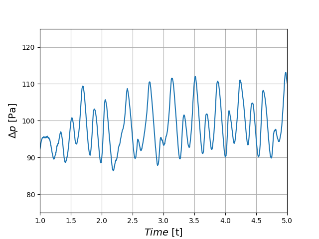

==================================
Gas-Solid Spouted Cylinder Bed
==================================

It is strongly recommended to visit `DEM parameters <../../../parameters/dem/dem.html>`_  and `CFD-DEM parameters <../../../parameters/unresolved-cfd-dem/unresolved-cfd-dem.html>`_ for a detailed description on the concepts and physical meanings of the DEM and CFD-DEM parameters.
This example is an extension of the `Gas-Solid Spouted Bed <../gas-solid-spouted-bed/gas-solid-spouted-bed.html>`_ for a cylindrical geometry. 

----------------------------------
Features
----------------------------------

- Solvers: ``lethe-particles`` and ``lethe-fluid-particles``
- Three-dimensional problem
- Simulates a solid-gas cylinder-shaped spouted bed

---------------------------
Files Used in This Example
---------------------------

Both files mentioned below are located in the example's folder (``examples/unresolved-cfd-dem/gas-solid-spouted-cylinder-bed``).

- Parameter file for CFD-DEM simulation of the spouted bed: ``gas-solid-spouted-bed.prm``
- Parameter file for particle generation and packing: ``dem-packing-in-spouted-bed.prm``

-----------------------
Description of the Case
-----------------------

This example simulates the spouting of spherical particles in air in a cylinder. As noted in the example of `Gas-Solid Spouted Bed <../gas-solid-spouted-bed/gas-solid-spouted-beml>`_, we use ``lethe-particles`` to fill the bed with particles, and ``lethe-fluid-particles`` as a solver of CFD-DEM.

-------------------
DEM Parameter File
-------------------

Here, we will focus only on the parts that have been modified.

Mesh
~~~~~

In this example, we are simulating a cylinder shaped spouted bed. We introduce the flow through a cylinder of smaller radius channel that  constitutes the inlet of the bed. A schematic image is shown below;

.. image:: images/geometry.png
    :alt: The geometry and boundary conditions
    :align: center
    :name: geometry
    :height: 10cm 

The geometry of the bed was created using `Pointiwise <../../../tools/pointwise/pointowise.html>`_, and the overview of created mesh is also shown below;

.. image:: images/mesh.png
    :alt: The geometry and boundary conditions
    :align: center
    :name: mesh_ver
    :height: 10cm

In Unresolved-CFD-DEM, Cells need to have a enough volume to contain particles in it. Basically the size of cells should be least three time larger than the diameter of the particles in order to get stable calculation. So this can be expressed as follows.

.. math:: 
  \dfrac{d_p}{\Delta x} \leq 3

where :math:`d_p` is the particle diameter, and :math:`\Delta x` is the characteristic size of the cell. In this example, we use particles with diameters of 5 mm which means that we need at least 15 mm for cell size. Also, we need to apply a relatively small mesh to the short channel below. Thus, we set the size of the central cylinder to 15mm, and made other grid coarser.

Lagrangian Physical Properties
~~~~~~~~~~~~~~~~~~~~~~~~~~~~~~~

The physical properties section is almost the same as the previous spouted bed example. Here, parameters for the direction of gravity, the diameter, density, and the number of particles are modified. In this simulation, we use 100,000 particles with a 5 mm diameter. 

.. code-block:: text

    subsection lagrangian physical properties
      set gz                       = -9.81
      set number of particle types = 1
      subsection particle type 0
        set size distribution type            = uniform
        set diameter                          = 0.0025
        set number                            = 100000
        set density particles                 = 500
        set young modulus particles           = 10000000
        set poisson ratio particles           = 0.25
        set restitution coefficient particles = 0.97
        set friction coefficient particles    = 0.4
        set rolling friction particles        = 0.3
      end
      set young modulus wall           = 10000000
      set poisson ratio wall           = 0.25
      set restitution coefficient wall = 0.33
      set friction coefficient wall    = 0.2
      set rolling friction wall        = 0.3
    end

Insertion Info
~~~~~~~~~~~~~~~~~~~

The ``insertion info`` subsection manages the insertion of particles. The insertion box parameter is set so that it can fit in the cylinder.

.. code-block:: text

    subsection insertion info
      set insertion method                               = volume
      set inserted number of particles at each time step = 100000
      set insertion frequency                            = 2000
      set insertion box minimum x                        = -0.075
      set insertion box minimum y                        = -0.075
      set insertion box minimum z                        = 0
      set insertion box maximum x                        = 0.075
      set insertion box maximum y                        = 0.075
      set insertion box maximum z                        = 0.07
      set insertion distance threshold                   = 1.05
      set insertion maximum offset                       = 0.3
      set insertion prn seed                             = 19
    end

Floating Walls
~~~~~~~~~~~~~~~~~~~

When we pack the cylinder with particles, we need to keep them inside and prevent them from falling through the small inlet channel. To do so, we place a floating wall at the bottom of the cylinder, which is :math:`z = 0` plain, as in:

.. code-block:: text

    subsection floating walls
      set number of floating walls = 1
      subsection wall 0
        subsection point on wall
          set x = 0
          set y = 0
          set z = 0
        end
        subsection normal vector
          set nx = 0
          set ny = 0
          set nz = 1
        end
        set start time = 0
        set end time   = 50
      end
    end

---------------------------
Running the DEM Simulation
---------------------------
Launching the simulation is as simple as specifying the executable name and the parameter file. Assuming that the ``lethe-particles`` executable is within your path, the simulation can be launched on a single processor by typing:

.. code-block:: text
  :class: copy-button

  lethe-particles dem-packing-in-spouted-bed.prm

or in parallel (where 8 represents the number of processors)

.. code-block:: text
  :class: copy-button

  mpirun -np 8 lethe-particles dem-packing-in-spouted-bed.prm

After the particles have been packed inside the square bed, we can move on to the fluid-particles simulation.

-----------------------
CFD-DEM Parameter File
-----------------------

The CFD-DEM simulation is carried out using the packed bed previously generated. Here we will focus on the modified section as well.

Simulation Control
~~~~~~~~~~~~~~~~~~~~~~~~~~~~

The simulation is run for 5 s with a time step of 0.001 s. The time scheme and setting for output is shown as follows.

.. code-block:: text

    subsection simulation control
      set method               = bdf1
      set number mesh adapt    = 0
      set output name          = result_
      set output frequency     = 50
      set startup time scaling = 0.6
      set time end             = 5
      set time step            = 0.001
      set subdivision          = 1
      set log precision        = 10
      set output path          = ./output/
    end

Boundary Conditions
~~~~~~~~~~~~~~~~~~~~~~~~~~~~

Regarding the boundary conditions, we apply slip boundary condition to the wall, a uniform Dirichlet boundary condition at the bottom of the small channel, and outlet to the top of the cylinder. The following schematic figure describes the ID of each boundary and the positon of the floating wall.

.. image:: images/ID.png
    :alt: The geometry and boundary conditions
    :align: center
    :name: ID
    :height: 10cm

we set the inlet velocity to 2.5 m/s, and we do not impose the background velocity on the bottom of the cylinder as in the previous spouted bed example. The value of beta on the outlet boundary was set to 100, which is relatively high, to stabilize the simulation and prevent backflow.

.. code-block:: text

  subsection boundary conditions
    set time dependent = false
    set number         = 5

    subsection bc 0 #outlet
      set id   = 3
      set type = outlet
      set beta = 100
    end

    subsection bc 1 #inlet
      set id   = 2
      set type = function
      subsection u
        set Function expression = 0
      end
      subsection v
        set Function expression = 0
      end
      subsection w
        set Function expression = 2.5
      end
    end

    subsection bc 2 #bed_wall
      set id = 6
      set type = slip
    end

    subsection bc 3 #channel_wall
      set id = 5
      set type = slip
    end
    
    subsection bc 4   #bed_wall_bottom
      set id   = 4
      set type = function
      subsection u
        set Function expression = 0
      end
      subsection v
        set Function expression = 0
      end
      subsection w
        set Function expression = 0.5
      end
    end
  end

The additional sections for the CFD-DEM simulations are the void fraction subsection and the CFD-DEM subsection. These subsections are described in detail in the `CFD-DEM parameters <../../../parameters/unresolved-cfd-dem/unresolved-cfd-dem.html>`_.

------------------------------
Running the CFD-DEM Simulation
------------------------------

The simulation is run using the ``lethe-fluid-particles`` application. Assuming that the ``lethe-fluid-particles`` executable is within your path, the simulation can be launched as per the following command:

.. code-block:: text
  :class: copy-button

  lethe-fluid-particles gas-solid-spouted-bed.prm

---------
Results
---------

We briefly discuss the results that can be obtained from this example here.

Total Pressure Drop
~~~~~~~~~~~~~~~~~~~

We show the data about pressure drop, which is a very important value for the fluidization phenomena.

This graph illustrates the variation of pressure drop from 1s to 5s. We can see the pressure oscillation which is caused by the bubbly state.

The graph below shows pressure drop as a function of height, depending on time. Here we see the oscillation of the pressure drop as well.

.. image:: images/pressure_height.gif
    :alt: Pressure drop as a function of height
    :align: center
    :name: press_h

Visualization
~~~~~~~~~~~~~
The results are shown in an animation below. As seen, the bubbly flow can be observed on the right side. the color of the particles represents the ID, to make it easier to see mixing. On the left side, you see the velocity profile as well.

.. raw:: html

    <iframe width="560" height="315" src="https://www.youtube.com/embed/KMVL2hPUbx8" frameborder="0" allowfullscreen></iframe>

