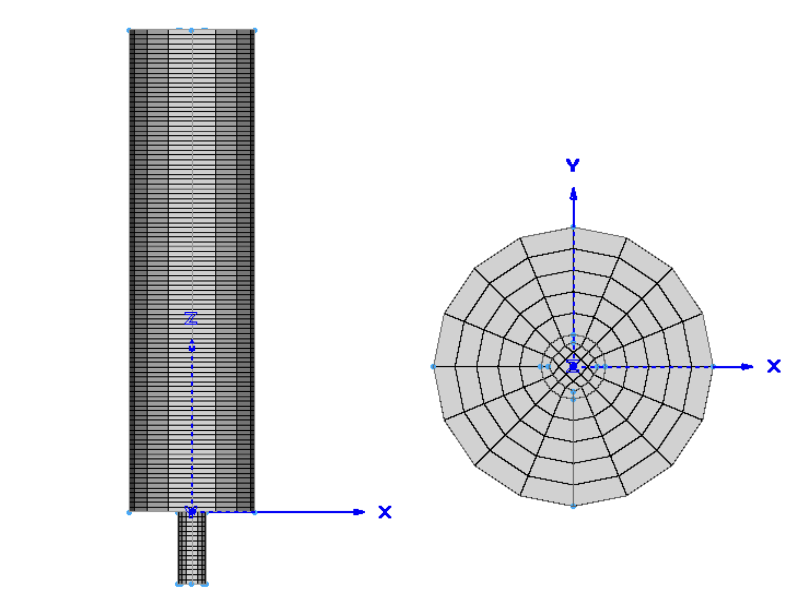

==================================
Gas-Solid Spouted Cylinder Bed
==================================

It is strongly recommended to visit `DEM parameters <../../../parameters/dem/dem.html>`_  and `CFD-DEM parameters <../../../parameters/unresolved-cfd-dem/unresolved-cfd-dem.html>`_ for more detailed information on the concepts and physical meaning of the parameters ind DEM and CFD-DEM.
This is a modification of the example of `Gas-Solid Spouted Bed <../gas-solid-spouted-bed/gas-solid-spouted-bed.html>`_ . In this example, we deal with the geometry of a Cylinder. The boundary condition and some parameter have been changed accordingly.

----------------------------------
Features
----------------------------------

- Solvers: ``lethe-particles`` and ``lethe-fluid-particles``
- Three-dimensional problem
- Displays the selection of models and physical properties
- Simulates a solid-gas cylinder shaped spouted bed

---------------------------
Files Used in This Example
---------------------------

Both files mentioned below are located in the example's folder (``examples/unresolved-cfd-dem/gas-solid-spouted-cylinder-bed``).

- Parameter file for CFD-DEM simulation of the spouted bed: ``gas-solid-spouted-bed.prm``
- Parameter file for particle generation and packing: ``dem-packing-in-spouted-bed.prm``

-----------------------
Description of the Case
-----------------------

This example simulates the spouting of spherical particles in air. As noted in the example of `Gas-Solid Spouted Bed <../gas-solid-spouted-bed/gas-solid-spouted-beml>`_, we use ``lethe-particles``to fill the bed with particles, and ``lethe-fluid-particles`` as a solver of CFD-DEM.

-------------------
DEM Parameter File
-------------------

Here, we will focus only on the parts that have been modified.   

Mesh
~~~~~

In this example, we are simulating a cylinder shaped spouted bed. As noted in another example, we introduce the flow through a short channel that is connected to the inlet of the bed. A schematic image is shown below;

The geometry of the bed was created using `Pointiwise <../../../tools/pointwise/pointowise.html>`_, and the overview of created mesh is also shown below;

In Unresolved-CFD-DEM, Cells need to have a enough volume to contain particles in it. Basically the size of cells should be least three time larger than the diameter of the particles in order to get stable calculation. So this can be expressed as follows.

.. math:: 
  \dfrac{d_p}{\Delta x} \leq 3

where :math:`d_p` is the diameter of the particles, and :math:`\Delta x` is the characteristic size of the cell. In this example, we are dealing with the particles 5mm in diameter, which means we need at least 15mm for the size of cells. Also, we need to apply relatively small meshes to the short channel below. So We set the size of the central cylinder to 15mm, and made other grid coarser.

Lagrangian Physical Properties
~~~~~~~~~~~~~~~~~~~~~~~~~~~~~~~

The physical properties section is almost the same as the another example. Here, parameter for the direction of gravity, the diameter and density of particles, and the number of particles are modified. We insert 100,000 particles with a 5mm diameter in this simulation. 

.. code-block:: text

    subsection lagrangian physical properties
      set gx                       = 0
      set gy                       = 0
      set gz                       = -9.81
      set number of particle types = 1
      subsection particle type 0
        set size distribution type            = uniform
        set diameter                          = 0.0025
        set number                            = 100000
        set density particles                 = 500
        set young modulus particles           = 10000000
        set poisson ratio particles           = 0.25
        set restitution coefficient particles = 0.97
        set friction coefficient particles    = 0.4
        set rolling friction particles        = 0.3
      end
      set young modulus wall           = 10000000
      set poisson ratio wall           = 0.25
      set restitution coefficient wall = 0.33
      set friction coefficient wall    = 0.2
      set rolling friction wall        = 0.3
    end

Insertion Info
~~~~~~~~~~~~~~~~~~~

The ``insertion info`` subsection manages the insertion of particles. It should be modified because we changed the number of particles, and use different geometry. The parameter of insertion box was set as follows so that it could fit in the cylinder.

.. code-block:: text

    subsection insertion info
      set insertion method                               = volume
      set inserted number of particles at each time step = 100000
      set insertion frequency                            = 2000
      set insertion box minimum x                        = -0.075
      set insertion box minimum y                        = -0.075
      set insertion box minimum z                        = 0
      set insertion box maximum x                        = 0.075
      set insertion box maximum y                        = 0.075
      set insertion box maximum z                        = 0.07
      set insertion distance threshold                   = 1.05
      set insertion maximum offset                       = 0.3
      set insertion prn seed                             = 19
    end

Floating Walls
~~~~~~~~~~~~~~~~~~~

When we pack the cylinder with particles, we need to keep them inside, and prevent them from falling through the small channel for inlet flow. We place the stopper at the bottom of the cylinder, which is z=0 plain. This is shown in:

.. code-block:: text

    subsection floating walls
      set number of floating walls = 1
      subsection wall 0
        subsection point on wall
          set x = 0
          set y = 0
          set z = 0
        end
        subsection normal vector
          set nx = 0
          set ny = 0
          set nz = 1
        end
        set start time = 0
        set end time   = 50
      end
    end

---------------------------
Running the DEM Simulation
---------------------------
Launching the simulation is as simple as specifying the executable name and the parameter file. Assuming that the ``lethe-particles`` executable is within your path, the simulation can be launched on a single processor by typing:

.. code-block:: text
  :class: copy-button

  lethe-particles dem-packing-in-spouted-bed.prm

or in parallel (where 8 represents the number of processors)

.. code-block:: text
  :class: copy-button

  mpirun -np 8 lethe-particles dem-packing-in-spouted-bed.prm

After the particles have been packed inside the square bed, we can move on to the fluid-particles simulation.

-----------------------
CFD-DEM Parameter File
-----------------------

The CFD simulation is to be carried out using the packed bed simulated in the previous step. Here We will focus on the modified section as well.

Simulation Control
~~~~~~~~~~~~~~~~~~~~~~~~~~~~

The simulation is run for 5 s with a time step of 0.001 s. The time scheme and setting for output is shown as follows.

.. code-block:: text

    subsection simulation control
      set method               = bdf1
      set number mesh adapt    = 0
      set output name          = result_
      set output frequency     = 50
      set startup time scaling = 0.6
      set time end             = 5
      set time step            = 0.001
      set subdivision          = 1
      set log precision        = 10
      set output path          = ./output/
    end

Boundary Conditions
~~~~~~~~~~~~~~~~~~~~~~~~~~~~

Regarding the boundary conditions we apply slip boundary condition to the wall, inlet boundary to the bottom of the channel, and outlet boundary conditon to the top of the cylinder. The following shematic describes the ID of each boundary, and positon of floating wall.

we set the inlet velosity to 2.5 m/s, and don't impose the background velocity on the bottom of the cylinder like the another example. The value of beta on the outlet boundary was set to 100, which is relatively high, in order to get stable simulation.

.. code-block:: text

  subsection boundary conditions
    set time dependent = false
    set number         = 5

    subsection bc 0 #outlet
      set id   = 3
      set type = outlet
      set beta = 100
    end

    subsection bc 1 #inlet
      set id   = 2
      set type = function
      subsection u
        set Function expression = 0
      end
      subsection v
        set Function expression = 0
      end
      subsection w
        set Function expression = 2.5
      end
    end

    subsection bc 2 #bed_wall
      set id = 6
      set type = slip
    end

    subsection bc 3 #channel_wall
      set id = 5
      set type = slip
    end
    
    subsection bc 4   #bed_wall_bottom
      set id   = 4
      set type = function
      subsection u
        set Function expression = 0
      end
      subsection v
        set Function expression = 0
      end
      subsection w
        set Function expression = 0.5
      end
    end
  end

The additional sections for the CFD-DEM simulations are the void fraction subsection and the CFD-DEM subsection. These subsections are described in detail in the `CFD-DEM parameters <../../../parameters/unresolved-cfd-dem/unresolved-cfd-dem.html>`_ .

------------------------------
Running the CFD-DEM Simulation
------------------------------

The simulation is run using the ``lethe-fluid-particles`` application. Assuming that the ``lethe-fluid-particles`` executable is within your path, the simulation can be launched as per the following command:

.. code-block:: text
  :class: copy-button

  lethe-fluid-particles gas-solid-spouted-bed.prm

---------
Results
---------

We briefly discuss the results that can be obtained from this example here.

Tolal Pressure Drop
~~~~~~~~~~~~~~~~~~~

Here, We show the data about pressure drop, which is very impotant value for fluidization phenomena.

This graph illustrates the variation of pressure drop from 1s to 5s. We can see the pressure ossillation which is caused by bubbly state.

.. image:: images/pressure_drop.png
    :alt: Pressure drop as a function of time
    :align: center
    :name: press_t

The graph below shows pressure drop as a function of height, depending on time. Here you can see the ossillation of the pressure drop as well.

.. image:: images/pressure_height.gif
    :alt: Pressure drop as a function of height
    :align: center
    :name: press_h

visualization
~~~~~~~~~~~~~
The results are shown in an animation below. You see the bubbly state flow is mixing the particles on the right side. the color of the particles represents its ID, to make it easier to see mixing. On the left side, you see the velocity profile as well.

.. raw:: html

    <iframe width="560" height="315" src="https://www.youtube.com/embed/KMVL2hPUbx8" frameborder="0" allowfullscreen></iframe>

