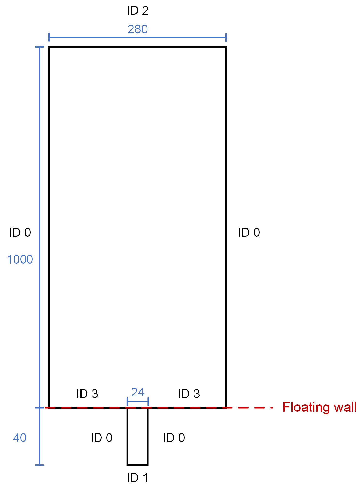

==================================
Gas-Solid Spouted Rectangular Bed
==================================

----------------------------------
Features
----------------------------------

- Solvers: ``lethe-particles`` and ``lethe-fluid-particles``
- Three-dimensional problem
- Simulates a gas-solid spouted bed
- Compares the simulation results to experimental results

---------------------------
Files Used in This Example
---------------------------

The files mentioned below are located in the example's folder (``examples/unresolved-cfd-dem/gas-solid-spouted-rectangular-bed``).

- Python functions script using Lagrangian post-processing: ``functions_lagrangian.py``
- Python functions script using particles: ``functions_particles.py``
- Parameter file for CFD-DEM simulation of the spouted bed: ``gas-solid-spouted-rectangular-bed.prm``
- Parameter file for particle generation and packing: ``packing-particles.prm``
- Python post-processing script using Lagrangian post-processing: ``postprocessing_lagrangian.py``
- Python post-processing script using particles: ``postprocessing_particles.py``

-----------------------
Description of the Case
-----------------------

This example simulates the spouting of spherical particles in air. The ``lethe-particles`` solver is used to fill the bed with particles, then the ``lethe-fluid-particles`` solver is used to simulate the spouting of the particles. Check-pointing is enabled in order to write the DEM checkpoint files to be used as the starting point of the CFD-DEM simulation. Using the parameters suggested by Geitani et al. [#geitani2023]_, the simulation is run and the results are then compared to the experimental results from Yue et al. [#yue2020]_

-------------------
DEM Parameter File
-------------------

All parameter subsections are described in the `parameter section <../../../parameters/parameters.html>`_ of the documentation.

To set-up the rectangular spouted bed case, the bed is filled with particles to obtain a static bed height of 200 mm.

The different subsections of the parameter file ``packing-particles.prm`` needed to run this simulation are introduced below.

Mesh
~~~~~

The following figure shows the geometry of the mesh:

The dimensions shown in the figure are in millimeters, and the bed and the channel both have a depth of 40 mm. The flow is introduced through a channel that is connected to the bed. The geometry of the bed was created using `GMSH <https://gmsh.info/>`_. The mesh is created using the same dimensions as used by Geitani et al. [#geitani2023]_ in order to compare the simulation results to the experimental results obtained by Yue et al. [#yue2020]_. The mesh file is in the GMSH format and is located in the ``mesh`` folder. 

.. code-block:: text

    subsection mesh
      set type                                = gmsh
      set file name                           = ./mesh/spouted_structured.msh
      set expand particle-wall contact search = false
    end

Simulation Control
~~~~~~~~~~~~~~~~~~~~~~~~~~~~

In the ``simulation control`` subsection, the ``time end`` is set to 1.5 s with a ``time step`` of 0.00001 s, which is long enough to allow the particles to come to rest. Additionally, users can specify the output folder for the simulation results in this subsection.

.. code-block:: text

    subsection simulation control
      set time step        = 0.00001
      set time end         = 1.5
      set log frequency    = 1000
      set output frequency = 10000
      set output path      = ./output_dem/
    end

Restart
~~~~~~~~~~~~~~~~~~~

The ``lethe-fluid-particles`` solver requires reading several DEM files to start the simulation. The check-pointing option is enabled in the ``restart`` subsection.

.. code-block:: text

    subsection restart
      set checkpoint = true
      set frequency  = 10000
      set restart    = false
      set filename   = dem
    end

Model Parameters
~~~~~~~~~~~~~~~~~

The following parameters are chosen for the ``model parameters`` subsection. Dynamic load balancing is enabled to achieve better computational performance.

.. code-block:: text

    subsection model parameters
      subsection contact detection
        set contact detection method                = dynamic
        set dynamic contact search size coefficient = 0.9
        set neighborhood threshold                  = 1.3
      end
      subsection load balancing
        set load balance method     = dynamic
        set threshold               = 0.5
        set dynamic check frequency = 10000
      end
      set particle particle contact force method = hertz_mindlin_limit_overlap
      set particle wall contact force method     = nonlinear
      set integration method                     = velocity_verlet
    end

Lagrangian Physical Properties
~~~~~~~~~~~~~~~~~~~~~~~~~~~~~~~

The gravitational acceleration as well as the physical properties of the particles and the walls are specified in the ``lagrangian physical properties`` subsection. In order to obtain a static bed height of 200 mm, 175800 spherical particles with a diameter of 2.5 mm are inserted into the rectangular bed. All of the particle properties defined in this subsection are the same as those used by Geitani et al. [#geitani2023]_

.. code-block:: text

    subsection lagrangian physical properties
      set g                        = 0.0, -9.81, 0.0
      set number of particle types = 1
      subsection particle type 0
        set size distribution type            = uniform
        set diameter                          = 0.0025
        set number                            = 175800
        set density particles                 = 2500
        set young modulus particles           = 1e7
        set poisson ratio particles           = 0.25
        set restitution coefficient particles = 0.9
        set friction coefficient particles    = 0.3
        set rolling friction particles        = 0
      end
      set young modulus wall           = 1e7
      set poisson ratio wall           = 0.25
      set restitution coefficient wall = 0.9
      set friction coefficient wall    = 0.3
      set rolling friction wall        = 0
    end

Insertion Info
~~~~~~~~~~~~~~~~~~~

The ``insertion info`` subsection manages the insertion of particles. The volume of the insertion box is large enough to fit all the particles. The insertion info parameters are set in order to avoid particle collisions during the packing process.

.. code-block:: text

    subsection insertion info
      set insertion method                               = volume
      set inserted number of particles at each time step = 43950
      set insertion frequency                            = 30000
      set insertion box points coordinates               = -0.139, 0.3, 0.001 : 0.139, 0.525, 0.039
      set insertion distance threshold                   = 1.5
      set insertion maximum offset                       = 0.3
      set insertion prn seed                             = 19
    end

Floating Walls
~~~~~~~~~~~~~~~~~~~

A floating wall is used to prevent the particles from falling into the inlet channel. Its position is shown in the figure in the `mesh <gas-solid-spouted-rectangular-bed.html#mesh>`_ subsection. The floating wall is defined at the top of the channel, which is at a y-coordinate of 0, and is set to remain active for the entire simulation time.

.. code-block:: text

    subsection floating walls
      set number of floating walls = 1
      subsection wall 0
        subsection point on wall
          set x = 0
          set y = 0
          set z = 0
        end
        subsection normal vector
          set nx = 0
          set ny = 1
          set nz = 0
        end
        set start time = 0
        set end time   = 50
      end
    end

---------------------------
Running the DEM Simulation
---------------------------

Assuming that the ``lethe-particles`` executable is within your path, the simulation can be launched in parallel using the following command:

.. code-block:: text
  :class: copy-button

  mpirun -np 10 lethe-particles packing-particles.prm

.. note::
    Running the packing should take approximately 45 minutes on 10 cores.

After the particles have been packed inside the rectangular bed, it is now possible to simulate the spouting of the particles.

-----------------------
CFD-DEM Parameter File
-----------------------

The CFD-DEM simulation is to be carried out using the packed bed simulated in the previous step.

Simulation Control
~~~~~~~~~~~~~~~~~~~~~~~~~~~~

The simulation is run for 10 s with a ``time step`` of 0.0005 s. The time scheme chosen for the simulation is second order backward differentiation method (BDF2).

.. code-block:: text

    subsection simulation control
      set method               = bdf2
      set output frequency     = 50
      set time end             = 10
      set time step            = 0.0005
      set subdivision          = 1
      set log precision        = 10
      set output path          = ./output/
    end

Physical Properties
~~~~~~~~~~~~~~~~~~~~~~~~~~~~

A ``density`` of 1 and a ``kinematic viscosity`` of 0.0000181 are defined in the ``physical properties`` subsection to simulate the flow of air.

.. code-block:: text

    subsection physical properties
      subsection fluid 0
        set kinematic viscosity = 0.0000181
        set density             = 1
      end
    end

Initial Conditions
~~~~~~~~~~~~~~~~~~

A zero velocity field is used as the initial condition.

.. code-block:: text

    subsection initial conditions
      subsection uvwp
          set Function expression = 0; 0; 0; 0
      end
    end

Boundary Conditions
~~~~~~~~~~~~~~~~~~~~~~~~~~~~

The figure presented in the `mesh <gas-solid-spouted-rectangular-bed.html#mesh>`_ subsection of this example shows the corresponding boundary IDs for each outer surface. A slip boundary condition is applied on all the walls of the bed and the channel (ID 0 and ID 3), except the inlet at the bottom of the channel (ID 1) and the outlet on the top of the bed (ID 2). 

At the base of the channel, a time dependent Dirichlet boundary condition is imposed. To avoid an initial shock from the introduction of high velocity gas in the bed, the inlet is linearly velocity is increased from 0 m/s at t = 0 s until it reaches 20.8 m/s at t = 0.05 s.

.. code-block:: text

    subsection boundary conditions
      set time dependent = true
      set number         = 4
      subsection bc 0
        set id   = 0
        set type = slip
      end
      subsection bc 1
        set id   = 1
        set type = function
        subsection u
          set Function expression = 0
        end
        subsection v
          set Function expression = if(t<0.05,416*t,20.8)
        end
        subsection w
          set Function expression = 0
        end
      end
      subsection bc 2
        set id   = 2
        set type = outlet
      end
      subsection bc 3
        set id   = 3
        set type = slip
      end
    end

The additional sections for the CFD-DEM simulations are the void fraction subsection and the CFD-DEM subsection. These subsections are described in detail in the `CFD-DEM parameters <../../../parameters/unresolved-cfd-dem/unresolved-cfd-dem.html>`_ .

Void Fraction
~~~~~~~~~~~~~~~~~~~~~~~~~~~~

Since the void fraction is calculated using the packed bed of the DEM simulation,  the ``mode`` is set to ``dem``. To read the dem files, ``read dem`` is set to ``true`` and the prefix of the dem files is specified. The quadrature centered method (QCM) is chosen to calculate the void fraction.

.. code-block:: text

    subsection void fraction
      set mode                         = qcm
      set read dem                     = true
      set dem file name                = dem
      set l2 smoothing length          = 0.0075
      set particle refinement factor   = 0
    end

CFD-DEM
~~~~~~~~~~~~~~~~~~~~~~~~~~~~

In the ``cfd-dem`` subsection, grad-div stabilization is enabled to improve local mass conservation, and the ``void fraction time derivative`` is enabled to account for the time variation of the void fraction.

.. code-block:: text

    subsection cfd-dem
      set grad div                      = true
      set void fraction time derivative = true
      set drag force                    = true
      set buoyancy force                = true
      set shear force                   = true
      set pressure force                = true
      set saffman lift force            = false
      set drag model                    = difelice
      set coupling frequency            = 100
      set implicit stabilization        = false
      set grad-div length scale         = 0.1
      set vans model                    = modelA
    end

Non-linear Solver
~~~~~~~~~~~~~~~~~

The ``inexact_newton`` solver is used to avoid the reconstruction of the system matrix at each Newton iteration. For more information about the non-linear solver, please refer to the `Non-Linear Solver Section <../../../parameters/cfd/non-linear_solver_control.html>`_

.. code-block:: text

    subsection non-linear solver
      subsection fluid dynamics
      	set solver           = inexact_newton
      	set tolerance        = 1e-6
      	set max iterations   = 25
      	set verbosity        = verbose
      	set matrix tolerance = 0.8
      end
    end

Linear Solver
~~~~~~~~~~~~~

The linear solver is defined according to the parameters suggested by Geitani et al. [#geitani2023]_ The absolute tolerance for the linear solver is set to a value 100 times smaller than the tolerance of the non-linear solver to ensure the non-linear solver converges.

.. code-block:: text

    subsection linear solver
      subsection fluid dynamics
        set method                                = gmres
        set max iters                             = 200
        set relative residual                     = 1e-4
        set minimum residual                      = 1e-8
        set preconditioner                        = ilu
        set ilu preconditioner fill               = 1
        set ilu preconditioner absolute tolerance = 1e-10
        set ilu preconditioner relative tolerance = 1
        set verbosity                             = verbose
        set max krylov vectors                    = 200
      end
    end

------------------------------
Running the CFD-DEM Simulation
------------------------------

Assuming that the ``lethe-fluid-particles`` executable is within your path, the simulation can be launched using the following command:

.. code-block:: text
  :class: copy-button

  mpirun -np 10 lethe-fluid-particles gas-solid-spouted-rectangular-bed.prm

.. note::
    Running the CFD-DEM simulation should take approximately 1.5 days on 10 cores.

----------------
Post-processing
----------------

It is possible to run the post-processing code to post-process the particle velocities with the following line, with the simulation path as the argument: 

.. code-block:: text
  :class: copy-button

    python3 postprocessing_particles.py  --folder ./

The functions used in the post-processing script are defined in the ``functions-particles.py`` file. This post-processing script reads the particle velocity data and plots the particle velocities as a function of the x-position in the bed for different y-heights.

It is also possible to run the post-processing code using the lagrangian post-processing output with the following line, with the simulation path as the argument: 

.. code-block:: text
  :class: copy-button

    python3 postprocessing_lagrangian.py  --folder ./

The functions used in the post-processing script are defined in the ``functions-lagrangian.py`` file. This post-processing script uses the average particle velocities at each mesh point to plot the particle velocities as a function of the x-position in the bed for different y-heights.

For more information about the Lagrangian post-processing, please refer to the `Post-processing Section <../../../parameters/dem/post-processing.html>`_.

.. important::

    You need to ensure that ``lethe_pyvista_tools`` is working on your machine. Click `here <../../../tools/postprocessing/postprocessing.html>`_ for details.

-----------------------
Results and Discussion
-----------------------

Using the ``postprocessing_particles.py`` post-processing script, the particle velocity magnitudes are plotted, in the following figure, as a function of the x-position in the bed, for different y-heights. The simulation is run with the Rong drag model to compare the results with the results obtained with the Di Felice drag model.

+--------------------------------------------+---------------------------------------+
| .. image:: images/drag-model-di-felice.png | .. image:: images/drag-model-rong.png |
|    :height: 600px                          |    :height: 600px                     |
|    :alt: Velocity magnitude - Di Felice    |    :alt: Velocity magnitude - Rong    |
+--------------------------------------------+---------------------------------------+

The experimental results from Yue et al. [#yue2020]_ are shown in the same figure for comparison. The standard deviation of the particle velocity magnitudes is shown as a shaded area around the average velocity magnitude. The two drag models lead to different results mainly at the center of the bed, where the spouting occurs, with the Rong drag model leading to higher particle velocity magnitudes than the Di Felice drag model. The particle velocity magnitudes are in good agreement with the experimental results, especially at the center of the bed, where the spouting occurs.

The following animation shows the spouting of the particles as the gas is introduced from the channel at the base of the bed. The void fraction profile is shown as well.

.. raw:: html

    <iframe width="672" height="378" src="https://www.youtube.com/embed/pvvRWGyw_48?si=XRIKwCA6BhTj2PJ6" frameborder="0" allowfullscreen></iframe>

-----------
References
-----------

.. [#geitani2023] \T. E. Geitani, S. Golshan, and B. Blais, “Toward High-Order CFD-DEM: Development and Validation,” *Industrial & Engineering Chemistry Research*, vol. 62, no. 2, pp. 1141-1159, Jan. 2023, doi: `10.1021/acs.iecr.2c03546 <https://doi.org/10.1021/acs.iecr.2c03546>`_\.

.. [#yue2020] \Y. Yue, S. Wang, P. Bahl, C. de Silva, and Y. Shen, “Experimental Investigation of Spout Deflection in a Rectangular Spouted Bed by the PIV Method,” *Industrial & Engineering Chemistry Research*, vol. 59, no. 30, pp. 13810-13819, Jun. 2020, doi: `10.1021/acs.iecr.0c02060 <https://doi.org/10.1021/acs.iecr.0c02060>`_\.
