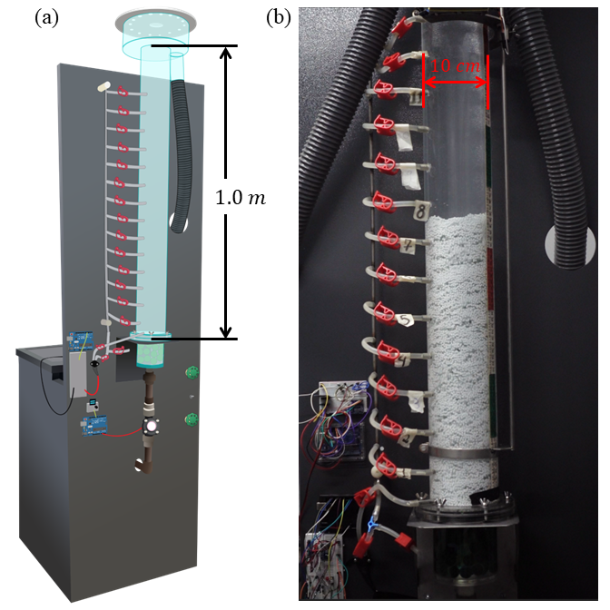
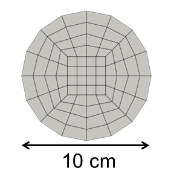

==================================
Liquid-Solid Fluidized Bed
==================================

It is strongly recommended to visit `DEM parameters <../../../parameters/dem/dem.html>`_  and `CFD-DEM parameters <../../../parameters/unresolved-cfd-dem/unresolved-cfd-dem.html>`_ for more detailed information on the concepts and physical meaning of the parameters ind DEM and CFD-DEM.

----------------------------------
Features
----------------------------------

- Solvers: ``lethe-particles`` and ``lethe-fluid-particles``
- Three-dimensional problem
- Displays the selection of models and physical properties
- Simulates a solid-liquid fluidized bed
- Postprocessing code available

---------------------------
Files Used in This Example
---------------------------

All files mentioned below are located in the example's folder (``examples/unresolved-cfd-dem/liquid-solid-fluidized-bed``).

- Parameter file of particles generation and packing: ``packing-particles.prm``
- Parameter file for CFD-DEM simulation of the liquid-solid fluidized bed: ``liquid-solid-fluidized-bed.prm``
- Postprocessing Python script: ``lsfb_postprocessing.py``

-----------------------
Description of the Case
-----------------------

This example simulates the fluidization of spherical particles in water. It is meant to reproduce the behavior observed experimentally in a pilot-scale equipment with the same characteristics as the simulations.

We use two different types of particles [#ferreira2023]_: alginate :math:`(d_p = 2.66 \: \text{mm}`, :math:`\rho_p = 1029 \: \text{kg} \cdot \text{m}^{-3})` and alumina :math:`(d_p = 3.09 \: \text{mm}`, :math:`\rho_p = 3586 \: \text{kg} \cdot \text{m}^{-3})`.

A representation of this equipment is shown. The fluidization region comprises a :math:`1.0 \: \text{m}` height, :math:`10 \: \text{cm}` diameter cylinder made of acrylic. More details about the experimental setup can be found in Ferreira *et al*. [#ferreira2023]_ and Ferreira *et al* [#ferreira2023b]_.

    Pilot-scale fluidized bed used as reference for simulations in this example. Image includes (a) schematic representation of the bed and (b) picture of the equipment in operation. Adapted from Ferreira *et al* [#ferreira2023]_.

-------------------
DEM Parameter File
-------------------

As in the other examples of this documentation, we use Lethe-DEM to fill the bed with particles. We enable check-pointing in order to write the DEM checkpoint files which will be used as the starting point of the CFD-DEM simulation. Then, we use the ``lethe-fluid-particles`` solver within Lethe to simulate the fluidization of the particles by initially reading the checkpoint files from the DEM simulation.

All parameter subsections are described in the `Parameters section <../../../parameters/parameters.html>`_ of the documentation.

To set-up the cylinder fluidized bed case, we first fill the bed with particles.

We first introduce the different sections of the parameter file ``packing-particles.prm`` needed to run this simulation.

Mesh
~~~~~

In this example, we are simulating a cylindrical fluidized bed that has a half length of :math:`0.55 \: \text{m}` (:math:`10 \: \text{cm}` higher than the fluidization region in the experimental setup), and a diameter of :math:`10 \: \text{cm}`. We use the `subdivided_cylinder GridGenerator <https://www.dealii.org/current/doxygen/deal.II/namespaceGridGenerator.html#a95f6e6a7ae2fe3a862df035dd2cb4467:~:text=%E2%97%86-,subdivided_cylinder,-()>`_  in order to generate the mesh. The cylindrical bed is divided  :math:`132 \: \text{times}` in the :math:`x` direction (height) and :math:`12 \: \text{times}` in :math:`y` and :math:`z` directions (:math:`6 \: \text{times}` along the radius). The following portion of the DEM parameter file shows the function called:

.. code-block:: text

    subsection mesh
      set type               = dealii
      set grid type          = subdivided_cylinder
      set grid arguments     = 33:0.05:0.55
      set initial refinement = 2
      set expand particle-wall contact search = true
    end

.. note::
    Note that, since the mesh is cylindrical, ``set expand particle-wall contact search = true``. Details on this in the `DEM mesh parameters guide <../../../parameters/dem/mesh.html>`_.

A cross-section of the resulting mesh is presented in the following figure.

    Cross-section of the mesh used in liquid-solid fluidized bed simulations.

Floating Walls
~~~~~~~~~~~~~~~~~~~

A floating wall is added :math:`10 \: \text{cm}` above the bottom of the mesh, so that void fraction discontinuities can be avoided. The remaining region above the floating wall is :math:`1 \: \text{m}` high, as in the experimental setup.

.. code-block:: text

    subsection floating walls
      set number of floating walls = 1
      subsection wall 0
        subsection point on wall
          set x = -0.45
          set y = 0
          set z = 0
        end
        subsection normal vector
          set nx = 1
          set ny = 0
          set nz = 0
        end
        set start time = 0
        set end time   = 50
      end
    end

.. note::
    Note that ``end time`` is higher than ``time end`` in ``simulation control``, so that the floating wall remains for the whole simulation.

Simulation Control
~~~~~~~~~~~~~~~~~~~~~~~~~~~~

Here, we define the time-step and the simulation end time.

.. code-block:: text

    subsection simulation control
      set time step        = 0.000005
      set time end         = 2.5
      set log frequency    = 20000
      set output frequency = 20000
      set output path      = ./output_dem/
    end

.. important::
    It is important to define the ``time end`` to include the time required to insert the particles and the time the it takes for particles to settle.

Restart
~~~~~~~~

The ``lethe-fluid-particles`` solver requires reading several DEM files to start the simulation. For this, we have to write the DEM simulation information. This is done by enabling the check-pointing option in the restart subsection. We give the written files a prefix "dem" set in the ``set filename`` option. The DEM parameter file is initialized exactly as the cylindrical packed bed example. The difference is in the number of particles, their physical properties, and the insertion box defined based on the new geometry. For more explanation about the individual subsections, refer to the `DEM parameters <../../../parameters/dem/dem.html>`_ and the `CFD-DEM parameters <../../../parameters/unresolved-cfd-dem/unresolved-cfd-dem.html>`_.

.. code-block:: text

    subsection restart
      set checkpoint = true
      set frequency  = 20000
      set restart    = false
      set filename   = dem
    end

Model Parameters
~~~~~~~~~~~~~~~~~

The subsection on model parameters is explained in the `DEM model parameters guide <../../../parameters/dem/model_parameters.html>`_ and `DEM examples <../../dem/dem.html>`_.

.. code-block:: text

    subsection model parameters
      subsection contact detection
        set contact detection method = dynamic
        set neighborhood threshold   = 1.5
      end
      subsection load balancing
        set load balance method     = dynamic
        set threshold               = 0.5
        set dynamic check frequency = 10000
      end
      set particle particle contact force method = hertz_mindlin_limit_overlap
      set particle wall contact force method     = nonlinear
      set integration method                     = velocity_verlet
    end

Lagrangian Physical Properties
~~~~~~~~~~~~~~~~~~~~~~~~~~~~~~~

The lagrangian properties were taken from Ferreira *et al* [#ferreira2023]_.

.. code-block:: text

    subsection lagrangian physical properties
      set g                        = -9.81, 0, 0
      set number of particle types = 1
      subsection particle type 0
        set size distribution type            = uniform
        set diameter                          = 0.003087
        set number                            = 72400
        set density particles                 = 3585.9
        set young modulus particles           = 1e7
        set poisson ratio particles           = 0.3
        set restitution coefficient particles = 0.9
        set friction coefficient particles    = 0.1
        set rolling friction particles        = 0.2
      end
      set young modulus wall           = 1e7
      set poisson ratio wall           = 0.3
      set restitution coefficient wall = 0.2
      set friction coefficient wall    = 0.1
      set rolling friction wall        = 0.3
    end

The number of particles used for alginate particles is :math:`107\;\! 960`.
    
Insertion Info
~~~~~~~~~~~~~~~~~~~

The volume of the insertion box should be large enough to fit all particles. Also, its bounds should be located within the mesh generated in the Mesh subsection.

.. code-block:: text

    subsection insertion info
      set insertion method                               = volume
      set inserted number of particles at each time step = 48841 # for alginate, we recommend 79600
      set insertion frequency                            = 200000
      set insertion box points coordinates               = -0.15, -0.035, -0.035 : 0.53, 0.035, 0.035
      set insertion distance threshold                   = 1.3
      set insertion maximum offset                       = 0.3
      set insertion prn seed                             = 19
    end

.. note::
    Particles need to be fully settled before the fluid injection. Hence, ``time end`` in ``subsection simulation control`` needs to be chosen accordingly.

---------------------------
Running the DEM Simulation
---------------------------
Launching the simulation is as simple as specifying the executable name and the parameter file. Assuming that the ``lethe-particles`` executable is within your path, the simulation can be launched in parallel as follows:

.. code-block:: text
  :class: copy-button

  mpirun -np 8 lethe-particles packing-particles.prm

Lethe will generate a number of files. The most important one bears the extension ``.pvd``. It can be read by popular visualization programs such as `Paraview <https://www.paraview.org/>`_. 

.. note:: 
    Running the packing of alumina particles should take approximately :math:`57 \: \text{minutes}` on :math:`16 \: \text{cores}`. For the alginate particles, it takes approximately :math:`1 \: \text{hour}` and :math:`53 \: \text{minutes}`.

Now that the particles have been packed inside the cylinder, it is possible to simulate the fluidization of particles.

-----------------------
CFD-DEM Parameter File
-----------------------

The CFD simulation is to be carried out using the packed bed simulated in the previous step. We will discuss the different parameter file sections. The mesh section is identical to that of the DEM so it will not be shown again.

Simulation Control
~~~~~~~~~~~~~~~~~~~~~~~~~~~~

The long simulation is due to the small difference between particles and liquid densities, meaning that it takes very long to reach the pseudo-steady state.

.. code-block:: text

    subsection simulation control
      set method            = bdf1
      set output name       = cfd_dem
      set output frequency  = 100
      set time end          = 20
      set time step         = 0.001
      set output path       = ./output/
    end

Since the alumina particles are more than :math:`3 \: \text{times}` denser than alginate particles, the pseudo-steady state is reached after very different times (according to Ferreira *et al* [#ferreira2023]_. :math:`4` and :math:`10 \: \text{seconds}` of real time, respectively). Because of this, we use ``set time end = 35`` for the alginate.

Physical Properties
~~~~~~~~~~~~~~~~~~~~~~~~~~~~

The physical properties subsection allows us to determine the density and viscosity of the fluid. The values are meant to reproduce the characteristics of water at :math:`30 \: \text{°C}`.

.. code-block:: text

    subsection physical properties
      subsection fluid 0
        set kinematic viscosity = 0.0000008379
        set density             = 997
      end
    end

Initial Conditions
~~~~~~~~~~~~~~~~~~

For the initial conditions, we choose zero initial conditions for the velocity. 

.. code-block:: text

    subsection initial conditions
      set type = nodal
      subsection uvwp
          set Function expression = 0; 0; 0; 0
      end
    end
 

Boundary Conditions
~~~~~~~~~~~~~~~~~~~~~~~~~~~~

For the boundary conditions, we choose a slip boundary condition on the walls (``id = 0``) and an inlet velocity of :math:`0.157\;\! 033 \: \text{m/s}` at the lower face of the bed (``id = 1``).

.. code-block:: text

    subsection boundary conditions
      set number = 2
      subsection bc 0
        set id   = 0
        set type = slip
      end
      subsection bc 1
        set id   = 1
        set type = function
        subsection u
          set Function expression = 0.157033
        end
        subsection v
          set Function expression = 0
        end
        subsection w
          set Function expression = 0
        end
      end
    end

The following sections for the CFD-DEM simulations are the void fraction subsection and the CFD-DEM subsection. These subsections are described in detail in the `CFD-DEM parameters <../../../parameters/unresolved-cfd-dem/unresolved-cfd-dem.html>`_ .

Void Fraction
~~~~~~~~~~~~~~~

We choose the `particle centroid method (PCM) <../../../parameters/unresolved-cfd-dem/void-fraction.html>`_ to calculate void fraction. The ``l2 smoothing length`` we choose is around twice the particle’s diameter, as in the other examples.
 
.. code-block:: text

    subsection void fraction
      set mode                = pcm
      set read dem            = true
      set dem file name       = dem
      set l2 smoothing length = 0.005328
    end

CFD-DEM
~~~~~~~~~~

Different from gas-solid fluidized beds, buoyancy, pressure force, shear stress are not negligible. All these forces are considered in this example.

Saffman lift force is proven to be very important to properly reproduce particles' dynamics in the liquid-fluidized bed [#ferreira2023]_.

.. code-block:: text

    subsection cfd-dem
      set vans model         = modelA
      set grad div           = true
      set drag model         = rong
      set buoyancy force     = true
      set shear force        = true
      set pressure force     = true
      set saffman lift force = true
      set coupling frequency = 100
      set void fraction time derivative = false
    end

.. warning::
    Void-fraction time-derivative lead to significant instability in the case of liquid-fluidized beds, hence we do not use it.

Non-linear Solver
~~~~~~~~~~~~~~~~~

We use the inexact Newton non-linear solver to minimize the number of time the matrix of the system is assembled. This is used to increase the speed of the simulation, since the matrix assembly requires significant computations.

.. code-block:: text

    subsection non-linear solver
      subsection fluid dynamics
        set solver           = inexact_newton
        set tolerance        = 1e-10
        set max iterations   = 10
        set verbosity        = verbose
      end
    end

Linear Solver
~~~~~~~~~~~~~

.. code-block:: text

    subsection linear solver
      subsection fluid dynamics
        set method                                = gmres
        set max iters                             = 5000
        set relative residual                     = 1e-3
        set minimum residual                      = 1e-11
        set preconditioner                        = ilu
        set ilu preconditioner fill               = 1
        set ilu preconditioner absolute tolerance = 1e-14
        set ilu preconditioner relative tolerance = 1.00
        set verbosity                             = verbose
      end
    end

------------------------------
Running the CFD-DEM Simulation
------------------------------

The simulation is run (on :math:`8 \: \text{cores}`) using the ``lethe-fluid-particles`` application as follows:

.. code-block:: text
  :class: copy-button

  mpirun -np 8 lethe-fluid-particles liquid-solid-fluidized-bed.prm

The :math:`20`-second simulations with alumina took approximately :math:`24 \: \text{hours}` and :math:`30 \: \text{minutes}` on :math:`16 \: \text{cores}` and :math:`8 \: \text{hours}` and :math:`44 \: \text{minutes}` on :math:`32 \: \text{cores}`.

The :math:`35`-second simulations with alginate particles took about :math:`28 \: \text{hours}` on :math:`16 \: \text{cores}`.

--------
Results
--------

We briefly comment on some results that can be extracted from this example.

.. important::

    This example includes a postprocessing file written in Python that uses the `lethe_pyvista_tools <../../../tools/postprocessing/postprocessing.html>`_. module.

.. important::

    To use the code, run ``python3 lsfb_postprocessing.py $PATH_TO_YOUR_CASE_FOLDER``. The code will generate several graphics showing the pressure profile within the bed, which are going to be stored in ``$PATH_TO_YOUR_CASE_FOLDER/P_x``. It will also generate a ``deltaP_t.csv`` file with the total pressure difference for each time-step. Additionally, it generates a void fraction as a function of time graphic (``eps_t.png``).

.. important::

    You need to ensure that the ``lethe_pyvista_tools`` is working on your machine. Click `here <../../../tools/postprocessing/postprocessing.html>`_ for details.

Side View
~~~~~~~~~~~

Here we show comparison between the experimentally observed and simulated behavior of the liquid-solid fluidized bed with alumina.

The void fraction and velocity profile of the fluid are also shown.

.. raw:: html

    
<iframe width="720" height="405" src="https://www.youtube.com/embed/Ra7d-p7wD8Y" title="YouTube video player" frameborder="0" allow="accelerometer; autoplay; clipboard-write; encrypted-media; gyroscope; picture-in-picture; web-share" allowfullscreen></iframe>

Total Pressure Drop and Bed Expansion
~~~~~~~~~~~~~~~~~~~~~~~~~~~~~~~~~~~~~~

In fluidized beds, the total pressure drop (:math:`- \Delta p`) reflects the total weight of particles (:math:`M`). The following equation is derived from a force balance inside the fluidized bed [#yang2003]_.

.. math::

    H(1 - \bar{\varepsilon}_f) = \frac{- \Delta p}{(\rho_p - \rho_f)g} = \frac{M}{\rho_p A} = \mathrm{constant}

where :math:`H` is the total bed height, :math:`\bar{\varepsilon}_f` is the average fluid fraction (void fraction) at the bed region, :math:`\rho_p` and :math:`\rho_f` are the densities of the particles and the fluid (respectively), and :math:`A` is the cross-section area of the equipment.

Liquid fluidized beds are very uniform in terms of particles distribution, resulting in an uniform distribution of  :math:`\varepsilon_f` along the be height. From this hypothesis, we can conclude that, for a constant and uniform fluid inlet flow rate, the pressure slope is:

.. math::

    \left.- \frac{\mathrm{d} p }{\mathrm{d} z}\right|_{z = 0}^{z = H}  \approx \mathrm{constant}

With the pressure slope, it is also possible to determine the bed void fraction manipulating the first equation, which gives:

.. math::

    \bar{\varepsilon}_f = 1 - \frac{\left.- \frac{\mathrm{d} p }{\mathrm{d} z}\right|_{z = 0}^{z = H} }{(\rho_p - \rho_f)g}

The resulting behavior of the pressure along the bed height and the void fraction with time is shown in the following animation.

.. raw:: html

    
<iframe width="720" height="405" src="https://www.youtube.com/embed/x1Ul2ZBq5cE" title="Pressure drop along the bed height and void fraction evolution in a liquid-solid fluidized bed" frameborder="0" allow="accelerometer; autoplay; clipboard-write; encrypted-media; gyroscope; picture-in-picture; web-share" referrerpolicy="strict-origin-when-cross-origin" allowfullscreen></iframe>

Particles Dynamics
~~~~~~~~~~~~~~~~~~~~

Since the fluidization occurs in a high density fluid, the density difference between alginate and alumina particles have a significant impact on the velocity of the particles inside the bed.

The following animation is in real time. It is possible to notice that, for a similar bed height, the bed of alumina particles expands way faster than the alginate.

.. raw:: html

    
<iframe width="720" height="405" src="https://www.youtube.com/embed/kMp86PdZ6tU" title="YouTube video player" frameborder="0" allow="accelerometer; autoplay; clipboard-write; encrypted-media; gyroscope; picture-in-picture; web-share" allowfullscreen></iframe>

-----------
References
-----------

.. [#ferreira2023] \V. O. Ferreira, T. E. Geitani, D. Silva, B. Blais, and G. C. Lopes, “In-depth validation of unresolved CFD-DEM simulations of liquid fluidized beds,” *Powder Technol.*, vol. 426, pp. 118652, Aug. 2023, doi: `10.1016/j.powtec.2023.118652 <https://doi.org/10.1016/j.powtec.2023.118652>`_\.

.. [#ferreira2023b] \V. O. Ferreira, D. Silva Junior, K. R. B. de Melo, B. Blais, and G. C. Lopes, “Prediction of the bed expansion of a liquid fluidized bed bioreactor applied to wastewater treatment and biogas production,” *Energy Convers. Manag.*, vol. 290, pp. 117224, Aug. 2023, doi: `10.1016/j.enconman.2023.117224 <https://doi.org/10.1016/j.enconman.2023.117224>`_\.

.. [#yang2003] \W.-C. Yang, Ed., *Handbook of Fluidization and Fluid-Particle Systems*, 1st ed. Boca Raton: CRC Press, 2003. doi: `10.1201/9780203912744 <https://doi.org/10.1201/9780203912744>`_\.
