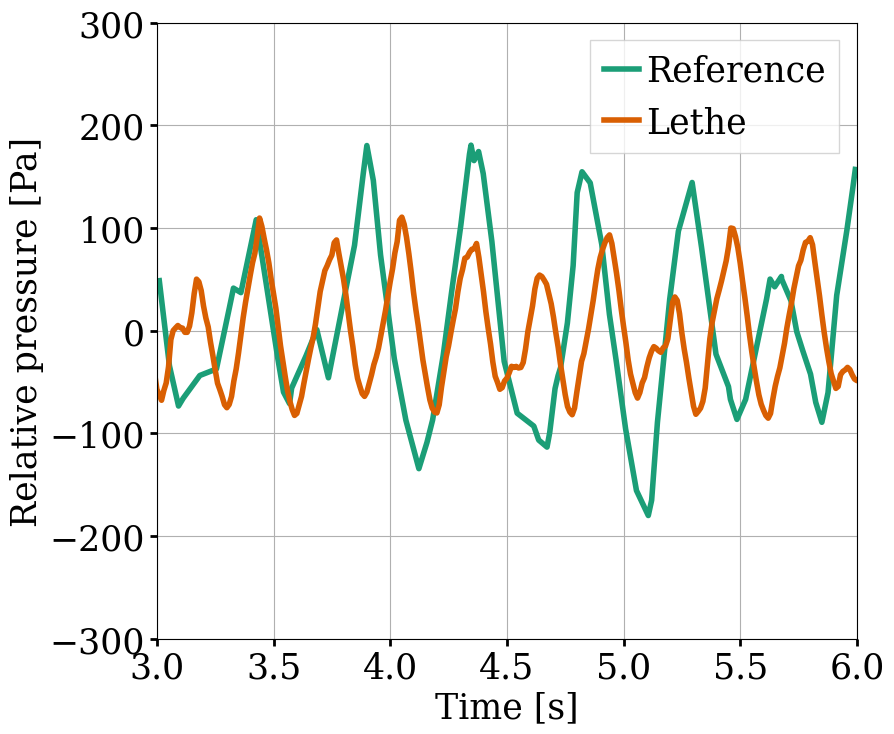
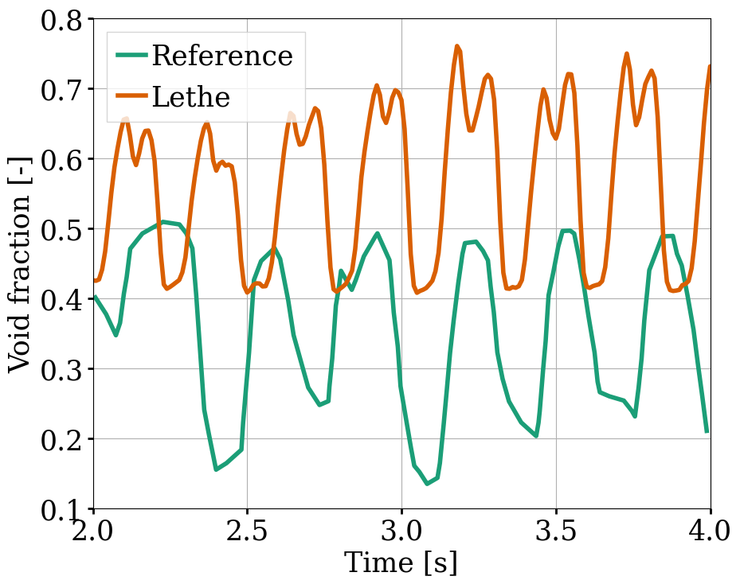
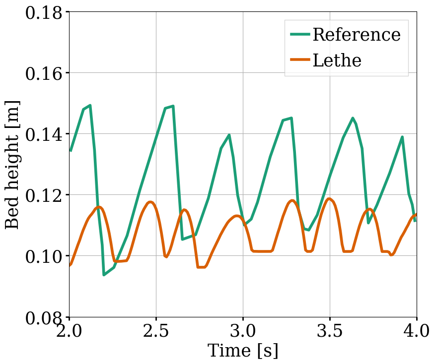
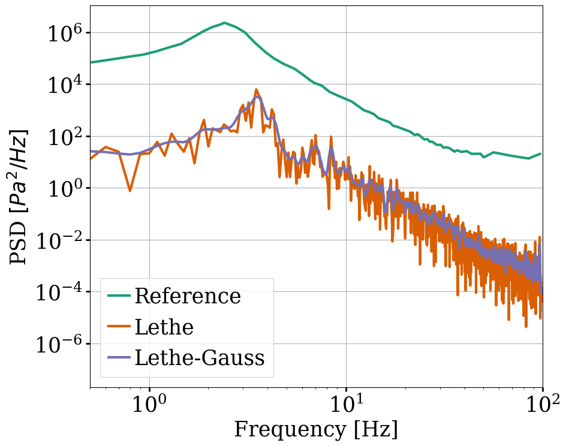

==================================
Pseudo-2D Gas-Solid Fluidized Bed
==================================

This example simulates the fluidization of a particle bed in gas. It is based on the pseudo-2D experimental setup used by B.G.M. van Wachem *et al* [#Wachem2001]_ to validate their two-dimensional fluidized bed simulations.

----------------------------------
Features
----------------------------------

- Solvers: ``lethe-particles`` and ``lethe-fluid-particles``
- Three-dimensional problem
- Gas-solid fluidized bed
- Post-processing using `Python <https://www.python.org/>`_, `PyVista <https://docs.pyvista.org/>`_, `lethe_pyvista_tools <https://github.com/chaos-polymtl/lethe/tree/master/contrib/postprocessing>`_, and `ParaView <https://www.paraview.org/>`_

---------------------------
Files Used in This Example
---------------------------

All files mentioned below are located in the example's folder (``examples/unresolved-cfd-dem/pseudo-2d-gas-solid-fluidized-bed``).

- Parameter file for particle insertion and packing: ``packing-particles.prm``
- Parameter file for CFD-DEM simulation: ``gas-solid-fluidized-bed.prm``
- Geometry file: ``structure.geo``
- Post-processing Python script: ``fluidized-bed-postprocessing.py``

-----------------------
Description of the Case
-----------------------

First, ``lethe-particles`` is used to fill the rectangular column with :math:`17562` particles, corresponding to the :math:`39` g sample of particles used in the experiment. Then, the ``lethe-fluid-particles`` solver allows to simulate the fluidization of the particles, with a gas velocity of :math:`U = 0.9` m/s at the inlet at the bottom of the column.

-------------------
DEM Parameter File
-------------------

All parameter subsections are described in the `parameters guide <../../../parameters/parameters.html>`_ of the documentation.

We first introduce the different subsections of the parameter file ``packing-particles.prm``.

Mesh
~~~~~

The domain is generated with GMSH to reproduce the experimental setup. It is a rectangular column with dimensions :math:`0.09\times0.008\times0.54` m.

.. code-block:: text

    subsection mesh
      set type                = gmsh
      set file name           = ./structure.msh
      set initial refinement  = 1
    end
    

Simulation Control
~~~~~~~~~~~~~~~~~~~

A simulation time of :math:`2.5` s was chosen, with a time step of :math:`5\times10^{-6}`. It is important to choose a sufficiently long simulation time so that all particles can become static. The output files generated are stored in the folder ``output_dem``.

.. code-block:: text

    subsection simulation control
      set time step        = 0.000005
      set time end         = 2.5
      set log frequency    = 1000
      set output frequency = 1000
      set output path      = ./output_dem/
    end

Restart
~~~~~~~~~

The ``lethe-fluid-particles`` solver requires reading DEM checkpoint files to start the CFD-DEM simulation. These files are written by enabling the ``checkpoint`` option in the ``restart`` subsection. 

.. code-block:: text

    subsection restart
      set checkpoint = true
      set frequency  = 10000
      set restart    = false
      set filename   = dem
    end

Model Parameters
~~~~~~~~~~~~~~~~~

.. code-block:: text

    subsection model parameters
      subsection contact detection
        set contact detection method = dynamic
        set neighborhood threshold   = 1.3
      end
      subsection load balancing
        set load balance method     = dynamic
        set threshold               = 0.5
        set dynamic check frequency = 10000
      end
      set particle particle contact force method = hertz_mindlin_limit_overlap
      set particle wall contact force method     = nonlinear
      set integration method                     = velocity_verlet
    end

Lagrangian Physical Properties
~~~~~~~~~~~~~~~~~~~~~~~~~~~~~~~

In this simulation, :math:`17562` particles are inserted, with a diameter of :math:`1.545` mm and a density of :math:`1150\;\text{kg}/\text{m}^3`. The Young's moduli and poisson ratios are kept to reasonable values. For the friction, restitution and rolling friction coefficients, commonly used values are employed, as suggested in the article. We have observed that the results can be quite dependent on the values of the rolling friction coefficient, which was not specified in the reference article.

.. code-block:: text

    subsection lagrangian physical properties
      set g                        = 0, 0, -9.81
      set number of particle types = 1
      subsection particle type 0
        set size distribution type            = uniform
        set diameter                          = 0.001545
        set number of particles               = 17562
        set density particles                 = 1150
        set young modulus particles           = 1e7
        set poisson ratio particles           = 0.3
        set restitution coefficient particles = 0.9
        set friction coefficient particles    = 0.3
        set rolling friction particles        = 0.025
      end
      set young modulus wall           = 1e7
      set poisson ratio wall           = 0.3
      set restitution coefficient wall = 0.9
      set friction coefficient wall    = 0.3
      set rolling friction wall        = 0.025
    end

Insertion Info
~~~~~~~~~~~~~~~~~~~

Particles are inserted within a box in the upper part of the column with the ``volume`` insertion method. :math:`4` steps are required to insert all the particles.

.. code-block:: text

    subsection insertion info
      set insertion method                               = volume
      set inserted number of particles at each time step = 5000
      set insertion frequency                            = 100000
      set insertion box points coordinates               = 0.002, 0.002, 0.15 : 0.089, 0.006, 0.48
      set insertion distance threshold                   = 1.5
      set insertion maximum offset                       = 0.5
      set insertion prn seed                             = 19
    end

Floating Walls
~~~~~~~~~~~~~~~~~~~

To ensure the gas flow is fully developed before reaching the particles, the particle bed needs to be elevated compared to the fluid inlet at the bottom of the column. This is done using a ``floating wall``, with an ``end time`` large enough to cover the whole simulation.

.. code-block:: text

    subsection floating walls
      set number of floating walls = 1
      subsection wall 0
        subsection point on wall
          set x = 0
          set y = 0
          set z = 0
        end
        subsection normal vector
          set nx = 0
          set ny = 0
          set nz = 1
        end
        set start time = 0
        set end time   = 20
      end
    end

---------------------------
Running the DEM Simulation
---------------------------

The packing simulation can be launched on 8 processors with:

.. code-block:: text
  :class: copy-button

  mpirun -np 8 lethe-particles packing-particles.prm

.. note:: 
    Running the packing should take approximately 9 minutes on 8 cores.

After the particles have been packed inside the column, it is now possible to simulate the fluidization of the bed.

-----------------------
CFD-DEM Parameter File
-----------------------

The CFD-DEM simulation is carried out using the ``lethe-fluid-particles`` solver and the packed bed generated in the previous stage. The ``mesh``, ``lagrangian physical properties``, DEM ``model parameters`` and ``floating walls`` subsections are identical to that of the packing parameter file, so they will not be shown here.

Simulation Control
~~~~~~~~~~~~~~~~~~~~

The simulation is run for :math:`12` s with a time step of :math:`0.0002` s. The time scheme chosen for the simulation is a second-order backward difference method (BDF2).

.. code-block:: text

    subsection simulation control
      set method           = bdf2
      set output frequency = 100
      set time end         = 12
      set time step        = 0.0002
      set output path      = ./output/
    end

Physical Properties
~~~~~~~~~~~~~~~~~~~~~

The kinematic viscosity and density of the gas are set to respectively :math:`1.33\times10^{-5}\;\text{m}^2/\text{s}` and :math:`1.28\;\text{kg}/\text{m}^3` to match those used in the article.

.. code-block:: text

    subsection physical properties
      subsection fluid 0
        set kinematic viscosity = 1.33e-5
        set density             = 1.28
      end
    end

Initial Conditions
~~~~~~~~~~~~~~~~~~

For the initial conditions, we choose zero initial conditions for the velocity. 

.. code-block:: text

    subsection initial conditions
      subsection uvwp
          set Function expression = 0; 0; 0; 0
      end
    end
 

Boundary Conditions
~~~~~~~~~~~~~~~~~~~~~~~~~~~~

For the fluid boundary conditions, the left and right walls (ID = 3) are treated as no-slip boundary conditions, the front and back walls (ID = 2) are defined as slip boundary conditions, the bottom of the column (ID = 0) is an inlet velocity of :math:`0.9` m/s and the top of the column (ID = 1) is an outlet for the gas phase. We set the left and the right walls as no-slip boundary conditions to ensure that the gas bubbles is generated in the center of the fluidized bed, as in the experiment. 

.. code-block:: text

  subsection boundary conditions
    set number = 4
    subsection bc 0
      set id   = 0
      set type = function
      subsection u
        set Function expression = 0
      end
      subsection v
        set Function expression = 0
      end
      subsection w
        set Function expression = 0.9
      end
    end
    subsection bc 1
      set id   = 1
      set type = outlet
    end
    subsection bc 2
      set id   = 2
      set type = slip
    end
    subsection bc 3
      set id   = 3
      set type = noslip
    end
  end

Void Fraction
~~~~~~~~~~~~~~~

The void fraction calculation uses the checkpoint files from the previous DEM simulation, with the ``dem`` prefix. Then, the Quadrature Centered Method (``qcm``) is employed to carry out the calculation. We set a very small smoothing coefficient of approximatively :math:`d_p` to ensure that the void fraction remains bounded. More information about the different methods used to calculate the void fraction is given in the Lethe documentation (`Void fraction section <../../../theory/multiphase/cfd_dem/unresolved_cfd-dem.html#void-fraction>`_).

.. code-block:: text

    subsection void fraction
      set mode                         = qcm
      set qcm sphere equal cell volume = true
      set read dem                     = true
      set dem file name                = dem
      set l2 smoothing length          = 0.0015
    end

CFD-DEM
~~~~~~~~~

We enable all hydrodynamic forces in the CFD-DEM simulation, such as the drag, buoyancy, shear and pressure forces. The drag model used is the Di Felice model, which is a commonly used model for gas-solid flows. We use the default value of the grad-div length scale (``grad-div length scale = 1``) to ensure that mass conservation is well enforced.

.. code-block:: text

    subsection cfd-dem
      set grad div                      = true
      set void fraction time derivative = true
      set drag force                    = true
      set buoyancy force                = true
      set shear force                   = true
      set pressure force                = true
      set drag model                    = difelice
      set coupling frequency            = 100
      set vans model                    = modelA
    end
    

Non-linear Solver
~~~~~~~~~~~~~~~~~

We use the inexact Newton non-linear solver to minimize the number of time the matrix of the system is assembled. This is used to increase the speed of the simulation, since the matrix assembly is computationally expensive.

.. code-block:: text

  subsection non-linear solver
    subsection fluid dynamics
      set solver           = inexact_newton
      set tolerance        = 1e-6
      set max iterations   = 20
      set matrix tolerance = 0.2
      set verbosity        = verbose
    end
  end

Linear Solver
~~~~~~~~~~~~~

We use an ILU preconditioner with a fill level of one to ensure that the preconditioner is not too expensive to compute, but that the GMRES method converges adequately.

.. code-block:: text

    subsection linear solver
      subsection fluid dynamics
        set method                                = gmres
        set max iters                             = 200
        set relative residual                     = 1e-3
        set minimum residual                      = 1e-11
        set preconditioner                        = ilu
        set ilu preconditioner fill               = 1
        set ilu preconditioner absolute tolerance = 1e-14
        set ilu preconditioner relative tolerance = 1.00
        set verbosity                             = verbose
        set max krylov vectors                    = 200
      end
    end

------------------------------
Running the CFD-DEM Simulation
------------------------------

The CFD-DEM simulation is run with the following command:

.. code-block:: text
  :class: copy-button

  mpirun -np 10 lethe-fluid-particles gas-solid-fluidized-bed.prm

.. note:: 
    Running this simulation should take approximately 12 hours on 16 cores.

----------------
Post-processing
----------------

A Python post-processing code ``fluidized-bed-postprocessing.py`` is provided with this example. It is used to compare, at a height of :math:`45` mm in the bed, our simulation results with the experimental results obtained by B.G.M. van Wachem *et al* [#Wachem2001]_. 

The simulation is compared to the experiment using the pressure, void fraction and bed height fluctuations and the power spectral density of the pressure fluctuations. The power spectral density is calculated using the Fast Fourier Transform (FFT) of the pressure fluctuations with a sampling frequency of :math:`1000` Hz, and it is then filtered with a Gaussian filter. The Gaussian filter is used to reduce the noise in the pressure signal, by averaging the values with a Gaussian distribution.

The post-processing code can be run with the following command. The argument is the folder which contains the ``.prm`` file.

.. code-block:: text
  :class: copy-button

    python3 fluidized-bed-postprocessing.py  --folder ./

.. important::

    You need to ensure that ``lethe_pyvista_tools`` is working on your machine. Click `here <../../../tools/postprocessing/postprocessing_pyvista.html>`_ for details.

--------
Results
--------

The following figures compare the pressure, void fraction and bed height fluctuations of the fluidized bed, at :math:`45` mm above the floating wall, with the results obtained experimentally by B.G.M. van Wachem *et al*.

These three figures show that the frequency of the peaks seems to be well replicated for each quantity. However, in the case of the relative pressure and the height of the bed, the amplitude of the signals from the simulation is lower than what was obtained experimentally. Regarding the void fraction, the values are rather far from the experimental ones. This is mainly because the experimental voidage is calculated using light intensity measurements, which can lead to low void fraction values (:math:`0.2`). In a packed bed, void fraction is usually higher than :math:`0.36`.

The following figure compares the simulated pressure power spectral density (PSD) with the one which uses the experimental data.

Although the simulation PSD is several orders of magnitude lower, the shape of the curve and the peak frequency show good agreement with the experimental data.

The simulated fluidized bed is shown in the animation below.

.. raw:: html

    <iframe width="640" height="360" src="https://youtu.be/o0Ks0Nvlo-o" frameborder="0" allowfullscreen></iframe>

----------
Reference
----------

.. [#Wachem2001] B.G.M. van Wachem, J. van der Schaaf, J.C. Schouten, R. Krishna, and C.M. van den Bleek, “Experimental validation of Lagrangian–Eulerian simulations of fluidized beds,” *Powder Technology*, vol. 116, pp. 155–165, 2001. Available: `<https://www.sciencedirect.com/science/article/pii/S0032591000003892>`_.
