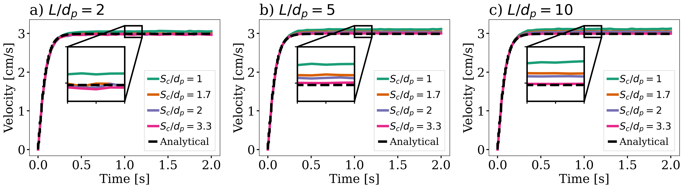
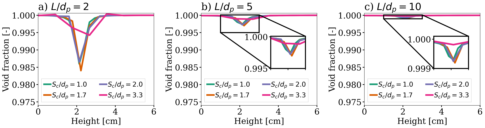

==================================
Single Particle Sedimentation
==================================

It is strongly recommended to visit `DEM parameters <../../../parameters/dem/dem.html>`_  and `CFD-DEM parameters <../../../parameters/unresolved-cfd-dem/unresolved-cfd-dem.html>`_ for more detailed information on the concepts and physical meaning of the parameters used in the DEM and CFD-DEM solvers.

----------------------------------
Features
----------------------------------

- Solvers: ``lethe-particles`` and ``lethe-fluid-particles``
- Three-dimensional problem
- Displays the selection of models and physical properties
- Simulates a single particle sedimentation in water
- Uses the ``qcm`` void fraction scheme with ``gauss-lobatto`` quadrature
- Python post-processing script using `PyVista <https://docs.pyvista.org/>`_

---------------------------
Files Used in This Example
---------------------------

Both files mentioned below are located in the example's folder (``examples/unresolved-cfd-dem/single-particle-sedimentation``).

- Parameter file for initial particles generation: ``initial-particle.prm``
- Parameter file for CFD-DEM simulation of the Boycott effect: ``single-particle-sedimentation.prm``

-----------------------
Description of the Case
-----------------------

This example simulates the sedimentation of a single particle in a water tank due to gravity. As all unresolved CFD-DEM applications and examples, we start it by introducing the particle in our domain by running a DEM simulation (using ``lethe-particles``). The DEM simulation generates checkpoint files that will be used by our unresolved CFD-DEM application (``lethe-fluid-particles``) to determine the initial state (position, velocity, etc.) of the particles.

This is most probably the simplest application case of CFD-DEM we can think of and hence, it is very useful to learn the fundamentals of the method. In Lethe, we use examples such as this not to only guide the user on how to launch a simple example but also to track the performance of our code.

We use this case to assess the grid convergence of the `quadrature centered method (QCM) <../../../parameters/unresolved-cfd-dem/void-fraction.html>`_, by Geitani and Blais [#geitani2023]_. We check if the adequate void fraction is recovered and we monitor the terminal velocity of the sedimenting particle. We use the properties given by Ferreira et al. [#ferreira2023]_ for the particle and fluid.

-------------------
DEM Parameter File
-------------------

Mesh
~~~~~

In this example, we are simulating a rectangular-based tank. We use the deal.II GridGenerator in order to generate a hyper rectangle that is subdivided along its height:

.. code-block:: text

    subsection mesh
      set type                                = dealii
      set grid type                           = subdivided_hyper_rectangle
      set grid arguments                      = 20,40,20:-0.02663,0,-0.02663:0.02663,0.10652,0.02663:true
      set initial refinement                  = 0
      set expand particle-wall contact search = false
    end

.. note::
    Note that the grid size uses the particle size as reference. This is important because we intended to assess the grid convergence of the case.

.. important::
    The grid of the particle insertion needs to be the same used in the unresolved CFD-DEM simulation. If you wish to use another mesh refinement, the particle insertion mesh needs to be adapted accordingly.

Simulation Control
~~~~~~~~~~~~~~~~~~~~~~~~~~~~

The time step in this case is the same as the time end. Since we only seek to insert the particle at the top of the channel, we only require 1 insertion time step. 

.. code-block:: text

   subsection simulation control
      set time step        = 1e-6
      set time end         = 1e-6
      set output frequency = 1
      set output path      = ./output_dem/
    end

Restart
~~~~~~~~~~~~~~~~~~~

We save the files obtained from the single iteration by setting the frequency = 1. These files will be used to start the CFD-DEM simulation.

.. code-block:: text

    subsection restart
      set checkpoint = true
      set frequency  = 1
      set restart    = false
      set filename   = dem
    end

Model Parameters
~~~~~~~~~~~~~~~~~

The DEM model parameters are:

.. code-block:: text

    subsection model parameters
      subsection contact detection
        set contact detection method = dynamic
        set neighborhood threshold   = 1.3
      end
      set rolling resistance torque method       = constant_resistance
      set particle particle contact force method = hertz_mindlin_limit_force
      set particle wall contact force method     = nonlinear
      set integration method                     = velocity_verlet
    end

Lagrangian Physical Properties
~~~~~~~~~~~~~~~~~~~~~~~~~~~~~~~

The gravity is set to 0 since the DEM simulation only loads the particles.

.. code-block:: text

    subsection lagrangian physical properties
      set g                        = 0.0, 0.0, 0.0
      set number of particle types = 1
      subsection particle type 0
        set size distribution type            = uniform
        set diameter                          = 0.002663
        set number                            = 1
        set density particles                 = 1029
      end
    end

Insertion Info
~~~~~~~~~~~~~~~~~~~

We use the list insertion method to insert a single particle in our domain at a specific location:

.. code-block:: text

    subsection insertion info
      set insertion method = list
      set list x           = 0
      set list y           = 0.08
      set list z           = 0
    end

---------------------------
Running the DEM Simulation
---------------------------
Assuming that the ``lethe-particles`` executable is within your path, the simulation can be launched on a single processor by typing:

.. code-block:: text
  :class: copy-button

  lethe-particles initial-particle.prm

.. image:: images/particle_insertion.png
    :alt: inserted particle at the top of the channel
    :align: center

The particle has been inserted it is now possible to simulate its sedimentation.

-----------------------
CFD-DEM Parameter File
-----------------------

The CFD simulation is to be carried out using the particle inserted within the previous step. We introduce the different sections of the parameter file ``single-particle-sedimentation.prm`` needed to run this simulation. 

Simulation Control
~~~~~~~~~~~~~~~~~~~~~~~~~~~~

The simulation is run for :math:`2` s with a time step of :math:`0.005` s. The time scheme chosen for the simulation is first order backward difference method (BDF1). The simulation control section is shown:

.. code-block:: text

    subsection simulation control
      set method               = bdf1
      set number mesh adapt    = 0
      set output name          = result_
      set output frequency     = 20
      set time end             = 2
      set time step            = 0.005
      set output path          = ./output/
    end

Physical Properties
~~~~~~~~~~~~~~~~~~~~~~~~~~~~

We set a density of :math:`996.8` kg/m\ :sup:`3` and a kinematic viscosity of :math:`0.0000008379` m\ :sup:`2`/s as to simulate the particle sedimentation in water.

.. code-block:: text

    subsection physical properties
      subsection fluid 0
        set kinematic viscosity = 0.0000008379
        set density             = 996.8
      end
    end

Initial Conditions
~~~~~~~~~~~~~~~~~~

We choose zero initial conditions for the velocity, which is the default initial condition.

.. code-block:: text

Boundary Conditions
~~~~~~~~~~~~~~~~~~~~~~~~~~~~

For the boundary conditions, we choose a slip boundary condition on all the walls of the channel and the channel except the bottom and the top of the channel where a no-slip boundary condition is imposed. For more information about the boundary conditions, please refer to the `Boundary Conditions Section <../../../parameters/cfd/boundary_conditions_cfd.html>`_

.. code-block:: text

    subsection boundary conditions
      set number = 6
      subsection bc 0
        set id   = 0
        set type = slip
      end
      subsection bc 1
        set id   = 1
        set type = slip
      end
      subsection bc 2
        set id   = 2
        set type = noslip
      end
      subsection bc 3
        set id   = 3
        set type = noslip
      end
      subsection bc 4
        set id   = 4
        set type = slip
      end
      subsection bc 5
        set id   = 5
        set type = slip
      end
    end

Lagrangian Physical Properties
~~~~~~~~~~~~~~~~~~~~~~~~~~~~~~~

This section is identical to the one previously mentioned for the DEM simulation of particle insertion. The only difference is the definition of gravity. For the vertical case, we set :math:`g_y = -9.81` and :math:`g_x = g_z = 0`

Void Fraction
~~~~~~~~~~~~~~~~~~~~~~~~~~~~
Since we are calculating the void fraction using the particle insertion of the DEM simulation, we set the ``mode`` to ``dem``. For this, we need to read the dem files which we already wrote using check-pointing. We, therefore, set the ``read dem`` to ``true`` and specify the prefix of the dem files to be dem.
We choose to use the quadrature centered method (`QCM <../../../theory/unresolved_cfd-dem/void-fraction.html>`_) to calculate the void fraction. For this, we specify the ``mode`` to be ``qcm``.

We want the radius of our volume averaging sphere to be equal to the length of the element where the void fraction is being calculated. We do not want the volume of the sphere to be equal to the volume of the element. For this, we set the ``qcm sphere equal cell volume`` equals to ``false``. Then, we set the diameter of the QCM sphere to be twice the size of our particle's diameter. We also set the smoothing length equal to 10 times the particle diameter. Lastly, we choose the ``gauss-lobatto`` quadrature rule with 5 quadrature points. More details on these parameters are available on the `documentation on void fraction parameters <../../../theory/unresolved_cfd-dem/void-fraction.html>`_.

.. code-block:: text

    subsection void fraction
      set mode                         = qcm
      set qcm sphere equal cell volume = false
      set qcm sphere diameter          = 0.005326
      set read dem                     = true
      set dem file name                = dem
      set l2 smoothing length          = 0.02663
      set quadrature rule              = gauss-lobatto
      set n quadrature points          = 5
    end

CFD-DEM
~~~~~~~~~~~~~~~~~~~~~~~~~~~~

We enable grad-div stabilization in order to improve local mass conservation. If we were using PCM and SPM void fraction schemes, the void fraction time derivative should be disabled as the time variation of the void fraction will lead to unstable simulations. The source of such instability is the first term of the continuity equation :math:`\rho_f \frac{\partial \varepsilon_f}{\partial t}`, which is stiff and unstable for the slightest temporal discontinuity of the void fraction and as :math:`\Delta t \to 0`. However, as we are using the QCM void fraction scheme, this term can be enabled. Usually, this term is neglected, however; disabling this term affects the results as we are no longer solving for the actual `Volume Averaged Navier-Stokes equations <../../../theory/multiphase/cfd_dem/unresolved_cfd-dem.html>`_. Therefore, we should not neglect this term based on numerical reasoning without any physical explanation.

.. code-block:: text

    subsection cfd-dem
      set grad div                      = true
      set void fraction time derivative = true
      set drag force                    = true
      set buoyancy force                = true
      set shear force                   = false
      set pressure force              = false
      set drag model                    = rong
      set coupling frequency            = 100
      set grad-div length scale         = 0.005
      set vans model                    = modelA
    end

For drag, we use the Rong model to determine the momentum transfer exchange coefficient. The VANS model we are solving is model A. 

Non-linear Solver
~~~~~~~~~~~~~~~~~

.. code-block:: text

    subsection non-linear solver
      subsection fluid dynamics
        set solver           = inexact_newton
        set tolerance        = 1e-8
        set max iterations   = 10
        set verbosity        = verbose
        set matrix tolerance = 0.75
      end
    end

We use the ``inexact_newton`` solver as to avoid the reconstruction of the system matrix at each Newton iteration. For more information about the non-linear solver, please refer to the `Non Linear Solver Section <../../../parameters/cfd/non-linear_solver_control.html>`_

Linear Solver
~~~~~~~~~~~~~

.. code-block:: text

    subsection linear solver
      subsection fluid dynamics
        set method                                = gmres
        set max iters                             = 500
        set relative residual                     = 1e-3
        set minimum residual                      = 1e-10
        set preconditioner                        = ilu
        set ilu preconditioner fill               = 0
        set ilu preconditioner absolute tolerance = 1e-12
        set ilu preconditioner relative tolerance = 1
        set verbosity                             = verbose
        set max krylov vectors                    = 500
      end
    end

For more information about the linear solver, please refer to the `Linear Solver Section <../../../parameters/cfd/linear_solver_control.html>`_

------------------------------
Running the CFD-DEM Simulation
------------------------------

The simulation is run using the ``lethe-fluid-particles`` application.  Assuming that the executable is within your path, the simulation can be launched as per the following command:

.. code-block:: text
  :class: copy-button

  lethe-fluid-particles single-particle-sedimentation.prm

---------------
Post-processing
---------------
A Python post-processing code called ``single_particle_sedimentation.py`` is provided with this example. It is used to plot the same quantities we show in the results of this example for a single simulation. The script uses the `PyVista <https://docs.pyvista.org/>`_ library to plot the results.

Running the script is as simple as launching the following command:

.. code-block:: text
  :class: copy-button

   python3 single_particle_sedimentation.py --particle_pvd $PATH_TO_YOUR_PARTICLE_PVD --fluid_pvd $PATH_TO_YOUR_FLUID_PVD

--------
Results
--------

As explained, this example is meant to assess QCM's mesh independency. For this, we need to put some limts to our unresolved CFD-DEM approach, namely:

* Currently, when looping through the cells, we can only have access to informations about particles inside the current cell or its immediate neighbors. This is a common limitation as accessing higher neighborhood layers can be computationnaly expensive. Hence, the finest element we use is of the same size of the particle (:math:`S_c/d_p \geq 1.0`, where :math:`S_c` is the characteristic size of our element and :math:`d_p` is the particle's diameter).
* We do not want our quadrature sphere size to change with the element size. So, we set the ``qcm sphere equal cell volume`` to ``false`` and set the sphere diameter to be twice the particle's diameter for all mesh refinements (:math:`D_{qcm}/d_p = 2.0` corresponding to an approximated maximum quadrature sphere size :math:`D_{qcm}` we can have for the finest mesh :math:`S_c/d_p = 1.0`).
* Regardless of the QCM sphere size, we need to guarantee the spheres together cover our entire domain so that we conserve mass (i.e., have all particles accounted for while calculating the void fraction). However, if we use the same number and size of QCM spheres for all meshes, eventually we will have uncovered areas of our domain. To avoid this, we increase the number of quadrature points used in the void fraction calculation by applying ``set n quadrature points = 5`` (this number can be increased for coarser meshes). We use the same number of quadrature points for all mesh refinements to avoid any bias in the results.
* To improve domain coverage, we use Gauss-Lobatto quadrature rule as the quadrature points are more evenly distributed than the default Gauss quadrature.
* Lastly, we need to consistently refine our meshes so that the particle falls in the same relative position to our degrees of freedom. This is important because if we analyze how our void fraction value evolves in a line conciding with the particle's falling trajectory, the magnitudes of the projected void fraction will vary with how far the particle is from the degrees of freedom.

The above factors considered, we can now analyse the results. First, we show a video of the particle falling in the fluid for the finest mesh. The arrows stand for the velocity of the surrounding fluid. 

.. raw:: html
    
    <iframe width="560" height="315" src="https://www.youtube.com/embed/LgpIKRKKEmQ" title="Particle sedimentation in water with Unresolved CFD-DEM" frameborder="0" allow="accelerometer; autoplay; clipboard-write; encrypted-media; gyroscope; picture-in-picture; web-share" referrerpolicy="strict-origin-when-cross-origin" allowfullscreen></iframe>

The same simulation is run for 4 different mesh refinements, :math:`S_c/d_p` of 1.0, 1.7, 2.0, 3.3; and 3 different void fraction smoothing lengths, :math:`L/d_p` of 2, 5, and 10. First, we compare the results of the particle velocity with the analytical solution using Dallavalle's drag correlation. As shown in the following figure, all results are close to the expected analytical results. Specifically, the coarser the mesh and the smaller the smoothing length, the results approximate more to the analytical results. However, the difference is incipient, which indicates any solution would be valid.

We also compare the void fraction convergence in a line conciding with the particle's falling trajectory. As shown in the following figure, regardless of the void fraction smoothing length, the void fraction converges with the mesh refinement, which is a good indicator of the QCM's mesh independence.

---------
Reference
---------
.. [#geitani2023] \T. E. Geitani and B. Blais, “Quadrature-Centered Averaging Scheme for Accurate and Continuous Void Fraction Calculation in Computational Fluid Dynamics–Discrete Element Method Simulations”, *Industrial & Engineering Chemistry Research*, vol. 62, Mar. 2023. doi: `10.1021/acs.iecr.3c00172 <https://doi.org/10.1021/acs.iecr.3c00172>`_\.

.. [#ferreira2023] \V. O. Ferreira, T. E. Geitani, D. Silva, B. Blais, and G. C. Lopes, “In-depth validation of unresolved CFD-DEM simulations of liquid fluidized beds,” *Powder Technol.*, vol. 426, pp. 118652, Aug. 2023, doi: `10.1016/j.powtec.2023.118652 <https://doi.org/10.1016/j.powtec.2023.118652>`_\.