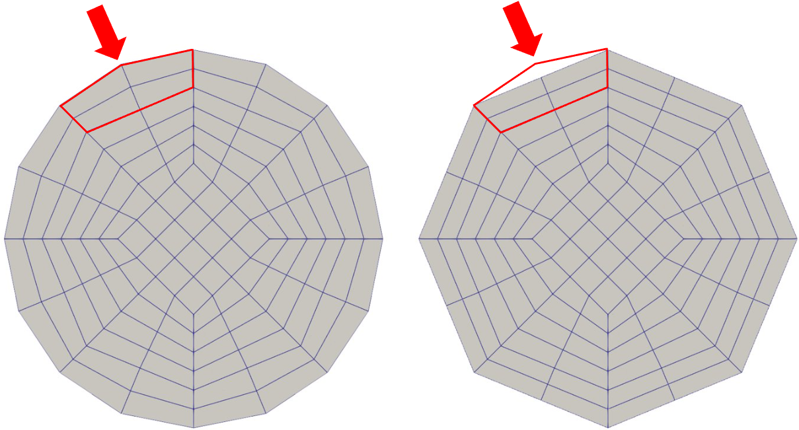

==========
Manifolds
==========
Linking parts of the mesh to manifolds is an interesting way to factor the real geometry of the mesh during refinements. This mesh treatment can lead to reduced geometric approximation error.

.. code-block:: text

  subsection manifolds

    # Sets the total number of specified manifolds
    set number = 0

    subsection manifold 0

        # Boundary mesh id specified in the .gmsh file
        set id                 = 0

        # Type of manifold. Choices are <spherical|cylindrical|iges|none>
        set type               = none

        # Center of the sphere or a point along the cylinder's axis (x, y, z)
        set point coordinates  = 0, 0, 0  #for 2D, set point coordinates = 0, 0

        # Direction vector used only for the cylinder (x, y, z)
        set direction vector   = 0, 1, 0

    end

  end

First the number of manifolds is specified by the ``set number`` command. Then a subsection for each of the manifolds is created starting with the ``manifold 0``. The boundary ``id`` is in this case set to ``0`` corresponding to the mesh boundary to which the manifold will be applied. Then the ``type`` of the manifold is specified.

* Lethe supports three types of manifolds:

  * ``spherical`` manifold: The former can be used to describe any sphere, circle, hypesphere or hyperdisc in two or three dimensions and requires the center of the geometry to set the manifold.
  * ``cylindrical`` manifold: Used to describe cylinders in three dimensions. It uses the coordinates of a point and a direction vector located on the axis of the cylinder.

    .. caution::
        Cylindrical manifolds are not supported in 2D.

  * ``iges``: manifold corresponding to a CAD geometry: the last two lines of the ``manifold 0`` subsection are replaced by the following command ``set cad file = file_name.iges`` where the path to the cad file is specified.

.. note::
    For more information about manifolds and the reasons behind them, we invite you to read the documentation page of deal.II: `Manifold description for triangulations <https://www.dealii.org/developer/doxygen/deal.II/group__manifold.html>`_.

------------------------
Understanding Manifolds
------------------------

We can clearly see that the geometry is more similar to an octagon than to a circle. This is a problem because the cells composing the mesh are not aware that they should morph to shape a cylinder. After every refinement, an extra node is added between the existing nodes in order to generate new cells. The octagonal shape is therefore conserved as it is illustrated below:

A really coarse mesh of a cylinder viewed from the top looks like this:

.. image:: images/coarse_cylinder.png
    :align: center
    :width: 400

Manifolds are added to the geometry in order to solve this issue. Using a point and a direction vector along the axis of the cylinder, the cells of a part of the mesh are restricted to respect a certain geometry while refining the mesh. On the image below, the geometry on the left is obtained by adding a cylindrical manifold to the mesh. The geometry on the right is obtained if no manifold are specified.

