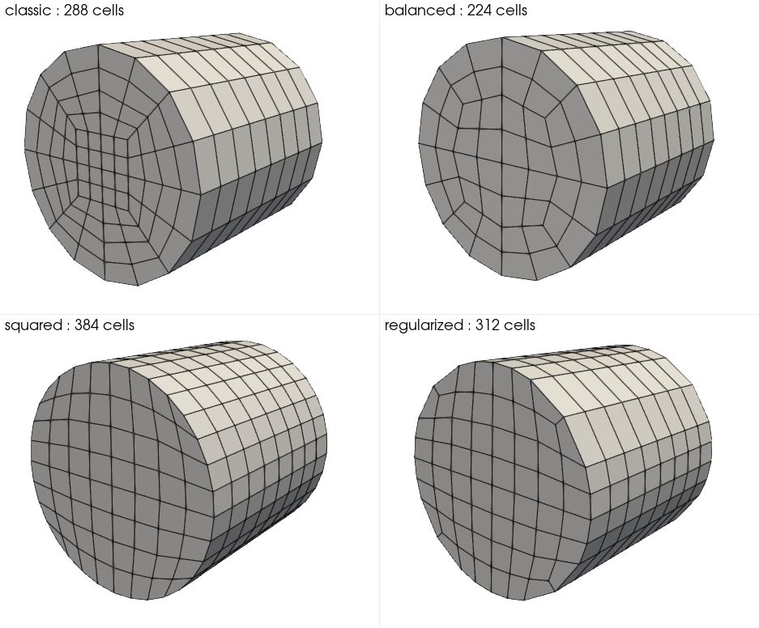

====
Mesh
====
This subsection provides information of the simulation geometry and its mesh. The simulation geometry shape and size, number of refinements and other required information can be provided here. It should be mentioned that meshes from gmsh can also be defined in this section by setting ``type = gmsh``.

.. code-block:: text

  subsection mesh
    # Type of mesh. Choices are <gmsh|dealii|cylinder|periodic_hills>
    set type               = dealii

    # GMSH file name
    set file name          = none

    # Grid arguments for dealii, cylinder and periodic_hills
    set grid type          = hyper_cube
    set grid arguments     = -1 : 1 : false

    # Initial refinement of the mesh
    set initial refinement = 0

    # Indicates that the mesh is a simplex mesh
    set simplex            = false
  end

* The following choices for the mesh type are available:
    * ``gmsh``: if this type is chosen, a ``.msh`` file generated from GMSH can be used. In this case, the grid file name must be specified in the ``file name`` variable.
    * ``dealii``: if this type is chosen, the deal.II grid generator class can be used. For additional documentation on these grids, you can consult the deal.II documentation for the `GridGenerator <https://www.dealii.org/current/doxygen/deal.II/namespaceGridGenerator.html>`_ . The type of grid is specified by the ``grid type`` parameter and the arguments used for grid generation by the ``grid arguments`` parameter. 
    * ``periodic_hills``: if this type is chosen a mesh for the periodic hills CFD benchmark is created. For more details on this type of mesh and its grid arguments refer to :doc:`../../examples/incompressible-flow/3d-flow-over-periodic-hills/3d-flow-over-periodic-hills`.
    * ``cylinder``: if this type is chosen, the ``grid type`` must be chosen according to the following figure. The ``classic`` type is equivalent to a subdivided cylinder from Deal.II and ``grid arguments`` must follow their `related documentation <https://www.dealii.org/current/doxygen/deal.II/namespaceGridGenerator.html#a95f6e6a7ae2fe3a862df035dd2cb4467>`_ and this applies to all cylinder grid types.

    .. warning::
        The squared cylinder may eventually leads to ill-posed jacobian transformation. As said in the `deal.II documentation <https://www.dealii.org/current/doxygen/deal.II/namespaceGridTools.html#a3f129213c63c92a6ed84c6f2a906048b>`_ : "The four cells that were originally the corners of a square will give you some troubles during computations, as the jacobian of the transformation from the reference cell to those cells will go to zero, affecting the error constants of the finite element estimates".
        This type of mesh is available, but its usage is not recommended.

* The initial refinement number determines the number of refinements the grid will undergo in the simulation before the simulation is run. This allows one to refine a coarse grid automatically. By default, most deal.II grids will be as coarse as possible and need to be refined. This is a desirable behavior for parallel simulations, since for quad/hex meshes, the coarsest level of the grid is shared amongst all cores. Consequently, using a coarse grid with too many cells will lead to a prohibitive memory consumption.

* `simplex`. If simplex is set to true, it indicates that the mesh being read is made of only simplex elements. If the mesh is of ``type = dealii`` it will be converted from a quad/hex mesh to a simplex mesh. If the mesh is of ``type = gsmh``, it will be read from a file as long as it is only made of simplices.