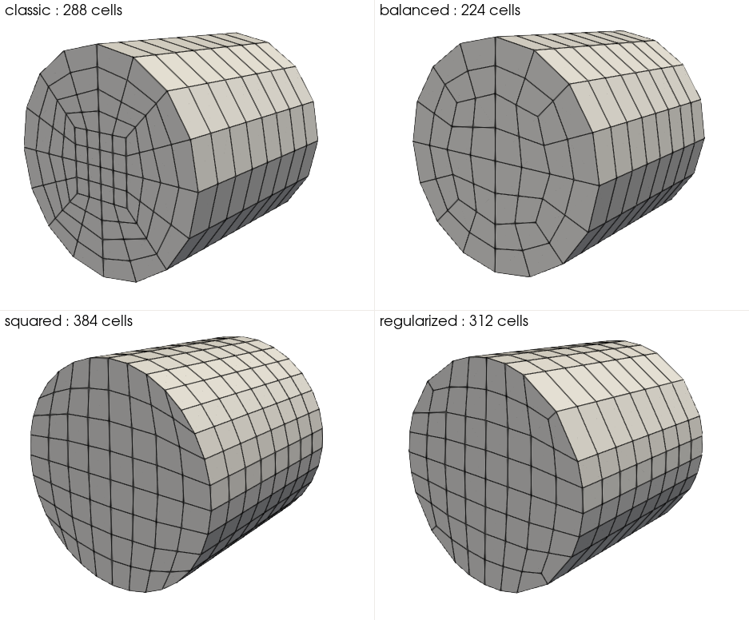

..
  SPDX-FileCopyrightText: Copyright (c) 2022-2024, 2026 The Lethe Authors
  SPDX-License-Identifier: Apache-2.0 WITH LLVM-exception OR LGPL-2.1-or-later

====
Mesh
====
This subsection provides information of the simulation geometry and its mesh. The simulation geometry shape and size, number of refinements and other required information can be provided here. It should be mentioned that meshes from gmsh can also be defined in this section by setting ``type = gmsh``.

.. code-block:: text

  subsection mesh
    # Type of mesh. Choices are <gmsh|dealii|lethe>
    set type = dealii

    # GMSH file name
    set file name = none

    # Grid arguments for dealii and lethe grids. 
    set grid type      = hyper_cube
    set grid arguments = -1 : 1 : false

    # Initial refinement of the mesh
    set initial refinement = 0

    # Initial refinement of the mesh near user-specified boundaries
    set initial boundary refinement = 0

    # List of boundaries next to which the mesh should be refined. The list must contain integers separated by commas.
    set boundaries refined = 0, 1

    # Enable initial refinement until target size is reached
    set enable target size = false
    set target size        = 1

    # Indicates that the mesh is a simplex mesh
    set simplex = false

    # DEM-specific mesh parameters

    # Enables checking the input grid for diamond-shaped cells
    set check diamond cells = false

    # Enables adding the boundary neighbor cells of boundary cells to the particle-wall contact search list
    set expand particle-wall contact search = false

    # Mesh modification parameters

    # Translation to apply to the mesh
    set initial translation = 0, 0, 0

    # Rotation to apply to the mesh
    set initial rotation axis  = 1, 0, 0
    set initial rotation angle = 0

    # Mesh scaling factor
    set scale = 1
  end

* The following choices for the mesh ``type`` are available:
    * ``gmsh``: if this type is chosen, a ``.msh`` file generated from GMSH can be used. In this case, the grid file name must be specified in the ``file name`` variable.
    * ``dealii``: if this type is chosen, the deal.II grid generator class can be used. For additional documentation on these grids, you can consult the deal.II documentation for the `GridGenerator <https://www.dealii.org/current/doxygen/deal.II/namespaceGridGenerator.html>`_ . The type of grid is specified by the ``grid type`` parameter and the arguments used for grid generation by the ``grid arguments`` parameter. 
    * ``lethe``: if this type is chosen, the grid will be generated by Lethe built-in mesh. These custom meshes are generally used for benchmark problems and are constructed using deal.II meshing tools. The type of grid is specified by the ``grid type`` parameter and the arguments used for grid generation by the ``grid arguments`` parameter. 

* The following ``lethe`` built-in mesh types, defined by the ``grid type`` parameter, can be generated:
    * ``periodic_hills``: if this grid type is chosen a mesh for the periodic hills CFD benchmark is created. For more details on this type of mesh and its grid arguments refer to :doc:`../../examples/incompressible-flow/3d-flow-over-periodic-hills/3d-flow-over-periodic-hills`.
    * ``fichera_oven``: if this grid type is chosen a mesh for the Fichera oven time-harmonic Maxwell benchmark is created. More details on this type of mesh and its grid arguments will be provided in the future example.
    * ``uniform_channel_with_meshed_cylinder``: if this grid type is chosen a mesh for a channel (similar to the deal.II ``uniform_channel_with_cylinder``) is created. The difference is the cylinder in the channel is meshed enabling the calculation of fields inside the cylinder which is useful for multiphysics simulations. More details on this type of mesh and its grid arguments will be provided in a future example.
    * ``birmingham_fluidized_bed``: if this grid type is chosen a 3D mesh for the Birmingham fluidized bed geometry is created. The geometry is taken from `Fede et al. (2016) <https://doi.org/10.1016/j.ces.2015.11.016>`_. The mesh is composed of a bottom cylinder (radius 0.077 m), a truncated cone, and a top cylinder (radius 0.127 m) joined along the x-axis. An optional rectangular chimney pipe can be attached to an off-center cell on the top end cap to serve as the outlet. The ``grid arguments`` accepts two colon-separated values: ``enable_chimney : inlet_offset``. ``enable_chimney`` is ``true`` or ``false`` to enable or disable the chimney (defaults to ``true``). ``inlet_offset`` is a positive real number (in meters) that extends the bottom cylinder into negative x, so that the original geometry starts at x = 0 regardless of the offset (defaults to ``0``). Boundary IDs are: 0 for walls, 1 for the inlet (x = -inlet_offset), and 2 for the outlet.
    * ``cylinder_*``: if this grid type is chosen, the ``*`` must be replaced according to the following figure. The ``cylinder_classic`` type is equivalent to a subdivided cylinder from deal.II and ``grid arguments`` must follow their `related deal.II documentation for a cylinder <https://www.dealii.org/current/doxygen/deal.II/namespaceGridGenerator.html#a95f6e6a7ae2fe3a862df035dd2cb4467>`_ . The other cylinders grid types follow the same ``grid_arguments`` as the ``cylinder_classic``.

    .. warning::
        The squared cylinder may eventually leads to ill-posed jacobian transformation. As said in the `deal.II documentation <https://www.dealii.org/current/doxygen/deal.II/namespaceGridTools.html#a3f129213c63c92a6ed84c6f2a906048b>`_ : "The four cells that were originally the corners of a square will give you some troubles during computations, as the jacobian of the transformation from the reference cell to those cells will go to zero, affecting the error constants of the finite element estimates".
        This type of mesh is available, but its usage is not recommended.

* The ``initial refinement`` number determines the number of refinements the grid will undergo in the simulation before the simulation is run. This allows one to refine a coarse grid automatically. By default, most deal.II grids will be as coarse as possible and need to be refined. This is a desirable behavior for parallel simulations, since for quad/hex meshes, the coarsest level of the grid is shared amongst all cores. Consequently, using a coarse grid with too many cells will lead to a prohibitive memory consumption.

* The ``initial boundary refinement`` determines the number of refinements the grid will undergo in the simulation in the vicinities of the boundary specified by the ``boundaries refined`` parameter.

* The ``enable target size`` and ``target size`` respectively enable and provide a maximal target size that initial refinement cycles must lead towards, in contrast to the more common way of specifying the number of refinement cycles to apply.

* The ``check diamond cells`` and ``expand particle-wall contact search`` are parameters used in particles simulations. The former is used to verify the quality of the background mesh; detecting diamond cells is important as they should be avoided. The latter serves a purpose in contact detection when the background mesh is concave.

* ``simplex``. If simplex is set to true, it indicates that the mesh being read is made of only simplex elements. If the mesh is of ``type = dealii`` it will be converted from a quad/hex mesh to a simplex mesh. If the mesh is of ``type = gsmh``, it will be read from a file as long as it is only made of simplices.

* The ``initial translation`` parameter provides a way to move the mesh in space prior to simulating the problem. It can be useful when space-dependent functions are used, but that generating a translated mesh is inconvenient or impossible.

  .. attention::
    If the mesh is defined in a 2D space, the third component of ``initial translation`` (:math:`z`-component) is ignored and the mesh translates in :math:`x` and :math:`y` only.

* The ``initial rotation axis`` and ``initial rotation angle`` parameters provide another way to move the mesh prior to simulating the problem.

  .. attention::
    If the mesh is defined in a 2D space, ``initial rotation axis`` is ignored and the mesh rotates counter-clockwise around the origin of the coordinate system.

* The ``scale`` parameter is used to scale the mesh. This is useful when the mesh is made in a different set of unit than what is desired by the simulation.

.. warning::
    When scale, translation and rotation are used together, the scaling is applied first, then the rotation, then the translation.
