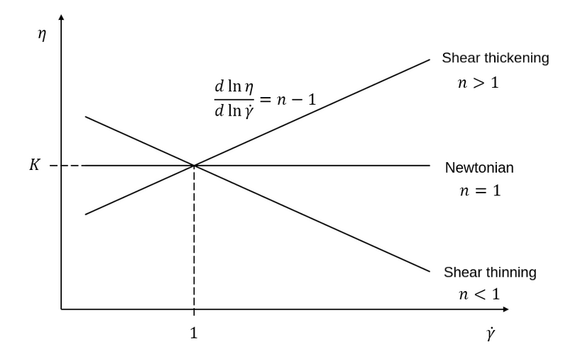
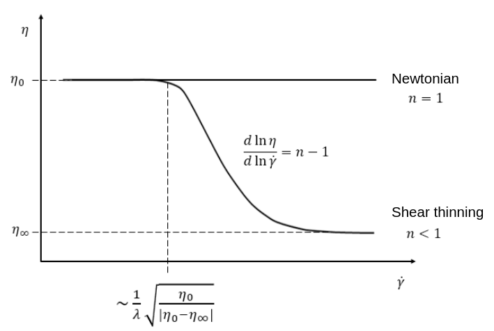

===================
Physical Properties
===================

.. note:: 
    Lethe supports single phase, two phase (using VOF) and conjugate simulations. This is managed using the fluid and solid subsections.

.. code-block:: text

  subsection physical properties
    set number of fluids      = 1
    set reference temperature = 0
    subsection fluid 0
      # Rheology
      set rheological model          = newtonian
      set kinematic viscosity        = 1
      
      # Density
      set density model              = constant
      set density                    = 1
      
      # Specific heat
      set specific heat model        = constant
      set specific heat              = 1
      
      # Thermal conductivity
      set thermal conductivity model = constant
      set thermal conductivity       = 1
      
      # Thermal expansion
      set thermal expansion model    = constant
      set thermal expansion          = 0
      
      # Tracer diffusivity
      set tracer diffusivity model   = constant
      set tracer diffusivity         = 0
    end

    set number of solids = 0

    set number of material interactions = 1 #by default it is set to 0
    subsection material interaction 0
      set type = fluid-fluid
      subsection fluid-fluid interaction
        set first fluid id              = 0
        set second fluid id             = 1

        # Surface tension
        set surface tension model                       = constant
        set surface tension coefficient                 = 0
        set reference state temperature                 = 0
        set temperature-driven surface tension gradient = 0
        set liquidus temperature                        = 0
        set solidus temperature                         = 0
        
        # Mobility Cahn-Hilliard
        set cahn hilliard mobility model    = constant
        set cahn hilliard mobility constant = 1
      end

      # if fluid-solid interaction
      subsection fluid-solid interaction
        set fluid id                    = 0
        set solid id                    = 0

        # Surface tension
        set surface tension model                       = constant
        set surface tension coefficient                 = 0
        set reference state temperature                 = 0
        set temperature-driven surface tension gradient = 0
        set liquidus temperature                        = 0
        set solidus temperature                         = 0
      end
    end
  end
 
* The ``number of fluids`` parameter controls the number of fluids in the simulation. This parameter is set to ``1`` except in `Two Phase Simulations`_ .

* The ``reference temperature`` parameter specifies the reference temperature used in the calculation of some physical properties or the thermal expansion force.

  * The ``rheological model`` parameter sets the choice of rheological model. The choices are between ``newtonian``, ``power-law``, ``carreau`` and ``phase_change``. For more details on the rheological models, see  `Rheological Models`_ .

  * The ``kinematic viscosity`` parameter is the kinematic viscosity of the newtonian fluid in units of :math:`\text{Length}^{2} \cdot \text{Time}^{-1}`. In SI, this is :math:`\text{m}^{2} \cdot \text{s}^{-1}`. This viscosity is only used when ``rheological model = newtonian``.

  * The ``density model`` specifies the model used to calculate the density. At the moment, a ``constant`` density and an ``isothermal_ideal_gas`` model are supported. For more details on the density models, see `Density Models`_.

  * The ``density`` parameter is the constant density of the fluid in units of :math:`\text{Mass} \cdot \text{Length}^{-3}`

  * The ``specific heat model`` specifies the model used to calculate the specific heat. At the moment, only a constant specific heat is supported.

  * The ``specific heat`` parameter is the constant specific heat of the fluid in units of :math:`\text{Energy} \cdot \text{Temperature}^{-1} \cdot \text{Mass}^{-1}` .

  * The ``thermal conductivity model`` specifies the model used to calculate the thermal conductivity. At the moment, ``constant`` and ``linear`` thermal conductivity are available. For more details on the thermal conductivity models, see `Thermal Conductivity Models`_.

  * The ``thermal conductivity`` parameter is the thermal conductivity coefficient of the fluid with units of :math:`\text{Power} \cdot \text{Temperature}^{-1} \cdot \text{Length}^{-1}`.

  * The ``thermal expansion model`` specifies the model used to calculate the thermal expansion coefficient. At the moment, ``constant`` and ``phase change`` thermal expansion are supported. For more details on the thermal expansion models, see `Thermal Expansion Models`_.

  * The ``thermal expansion`` parameter is the thermal expansion coefficient of the fluid with dimension of :math:`\text{Temperature}^{-1}`. It is used to define the buoyancy-driven flow (natural convection) using the Boussinesq approximation, which leads to the definition of the following source term that is added to the Navier-Stokes equation:

    .. math::

      {\bf{F_{B}}} = -\beta {\bf{g}} (T-T_\text{ref})

    where :math:`F_B` denotes the buoyant force source term, :math:`\beta` is the thermal expansion coefficient, :math:`T` is temperature, and :math:`T_\text{ref}` is the reference temperature. This is only used when a constant thermal expansion model is used.

  * The ``tracer diffusivity model`` specifies the model used to calculate the tracer diffusivity. At the moment, only a constant tracer diffusivity is supported.

  * The ``tracer diffusivity`` parameter is the diffusivity coefficient of the tracer in units of :math:`\text{Length}^{2} \cdot \text{Time}^{-1}` . In SI, this is :math:`\text{m}^{2} \cdot \text{s}^{-1}`.

* The ``number of solids`` parameter controls the number of solid regions. Solid regions are currently only implemented for `Conjugate Heat Transfer`_.

* The ``number of material interactions`` parameter controls the number of physical properties that are due to the interaction between two materials. At the moment, only the surface tension between two fluids is implemented in `Two Phase Simulations`_.

  * The material interaction ``type`` can either be ``fluid-fluid`` (default) or ``fluid-solid``.

  * In the ``fluid-fluid`` subsection we define the pair of fluids and their physical properties.

    * The ``first fluid id`` is the id of the first fluid.

    * The ``second fluid id`` is the id of the second fluid.

      .. attention::
          The ``second fluid id`` should be greater than the ``first fluid id``.

    * The ``surface tension model`` specifies the model used to calculate the surface tension coefficient of the fluid-fluid pair. At the moment, ``constant``, ``linear``, and ``phase change`` models are supported. For more details on the surface tension models, see `Surface Tension Models`_.

    * The ``surface tension coefficient`` parameter is a constant surface tension coefficient of the two interacting fluids in units of :math:`\text{Mass} \cdot \text{Time}^{-2}`. In SI, this is :math:`\text{N} \cdot \text{m}^{-1}`. The surface tension coefficient is used as defined in the Weber number (:math:`We`):

      .. math::
          We = Re \cdot \frac{\mu_\text{ref} \; u_\text{ref}}{\sigma}

      where :math:`Re` is the Reynolds number, :math:`\mu_\text{ref}` and :math:`u_\text{ref}` are some reference viscosity and velocity characterizing the flow problem, and :math:`\sigma` is the surface tension coefficient.

    * The ``reference state temperature`` parameter is the temperature of the reference state at which the ``surface tension coefficient`` is evaluated. This parameter is used in the calculation of the surface tension using the ``linear`` surface tension model (see `Surface Tension Models`_).

    * The ``temperature-driven surface tension gradient`` parameter is the surface tension gradient with respect to the temperature of the two interacting fluids in units of :math:`\text{Mass} \cdot \text{Time}^{-2} \cdot \text{Temperature}^{-1}`. In SI, this is :math:`\text{N} \cdot \text{m}^{-1} \cdot \text{K}^{-1}`. This parameter is used in the calculation of the surface tension using the ``linear`` surface tension model (see `Surface Tension Models`_).
    
    * The ``solidus temperature`` and ``liquidus temperature`` parameters are used in the calculation of the surface tension using the ``phase change`` surface tension model (see `Surface Tension Models`_).
      
    * The ``cahn hilliard mobility model`` specifies the model used to calculate the mobility used in the Cahn-Hilliard equations for the pair of fluid. Two models are available: a ``constant`` mobility and a ``quartic`` mobility. The reader is refered to :doc:`cahn_hilliard` for more details.
      
    * The ``cahn hilliard mobility coefficient`` parameter is the constant mobility coefficient of the two interacting fluids used in the Cahn-Hilliard equations. Its units are :math:`\text{Length}^{2} \cdot \text{Time}^{-1}`.

  * In the ``fluid-solid`` subsection we define the fluid-solid pair and their physical properties.

    * The ``fluid id`` is the id of the fluid.

    * The ``solid id`` is the id of the solid.

    * The ``surface tension model``  and ``surface tension coefficient`` are the same as described in the ``fluid-fluid`` subsection above.

.. note:: 
  The default values for all physical properties models in Lethe is ``constant``. Consequently, it is not necessary (and not recommended) to specify the physical property model unless this model is not constant. This generates parameter files that are easier to read.

Material Physical Property Models
**********************************

.. _two phase simulations:

Two Phase Simulations
~~~~~~~~~~~~~~~~~~~~~~
.. note:: 
  Two phase simulations require that either ``set VOF = true`` or ``set cahn hilliard = true`` in the :doc:`multiphysics` subsection. By convention, air is usually the ``fluid 0`` and the other fluid of interest is the ``fluid 1``.

For two phases, the properties are defined for each fluid. Default values are:

.. code-block:: text

  subsection physical properties
  set number of fluids = 2
      subsection fluid 0
         set density              = 1
         set kinematic viscosity  = 1
         set specific heat        = 1
         set thermal conductivity = 1
         set tracer diffusivity   = 0
      end
      subsection fluid 1
         set density              = 1
         set kinematic viscosity  = 1
         set specific heat        = 1
         set thermal conductivity = 1
         set tracer diffusivity   = 0
      end
  end

* ``number of fluids = 2`` is required for a free surface simulation, otherwise an error will be thrown in the terminal.
* ``subsection fluid 0`` indicates the properties of fluid where the phase indicator = 0 (Volume of Fluid method), as defined when initializing the free surface (see the :doc:`initial_conditions` subsection), and correspondingly ``fluid 1`` is located where the phase indicator = 1.

.. warning:: 
  Lethe now supports the use of physical properties models that are different for both phases. For example, the liquid could have a carreau rheological model and the air could have a newtonian rheological model. However, this feature has not been fully tested and could lead to unpredictable results. Use with caution.

.. _conjugate heat transfer:

Conjugate Heat Transfer
~~~~~~~~~~~~~~~~~~~~~~~~

Conjugate heat transfer enables the addition of solid regions in which the fluid dynamics is not solved for. To enable the presence of a solid region, ``number of solids`` must be set to 1. By default, the region with the ``material_id=0`` will be the fluid region whereas the region with ``material_id=1`` will be the solid region. The physical properties of the solid region are set in an identical fashion as those of the fluid.

.. warning::
  This is an experimental feature. It has not been tested on a large range of application cases. 

.. code-block:: text

  subsection physical properties
    set number of fluids = 1
    subsection fluid 0
      ...
    end
    set number of solids = 1
    subsection solid 0
      # Density
      set density model              = constant
      set density                    = 1
      
      # Specific heat
      set specific heat model        = constant
      set specific heat              = 1
      
      # Thermal conductivity
      set thermal conductivity model = constant
      set thermal conductivity       = 1
    end
  end

.. _rheological_models:

Rheological Models
~~~~~~~~~~~~~~~~~~~

Two families of rheological models are supported in Lethe. The first one are generalized non Newtonian rheologies (for shear thinning and shear thickening flows). In these models, the viscosity depends on the shear rate. The second family of rheological models possess a viscosity that is independent of the shear rate, but that may depend on other fields such as the temperature.

The ``rheological model`` parameter sets which rheological model you are using. The default ``rheological model`` is ``newtonian``, which uses a constant ``kinematic viscosity``.

.. code-block:: text

    subsection physical properties
      set number of fluids = 1
      subsection fluid 0
        set rheological model   = newtonian
        set kinematic viscosity = 1.0
      end
    end

The rheological model available options are:
    * ``newtonian``
    * ``power-law`` 
    * ``carreau``
    * ``phase_change``

Power-Law Model
^^^^^^^^^^^^^^^

The power-law model is the simplest rheological model, using only 2 parameters 

.. math::

  \eta(\dot{\gamma}) = K \dot{\gamma}^{n-1}

where :math:`\eta` is the **kinematic viscosity** and :math:`\dot{\gamma}` is the local shear rate magnitude.

When using the power-law model, the default values are:

.. code-block:: text

  subsection physical properties
    set number of fluids = 1
    subsection fluid 0
      set rheological model   = power-law
      subsection non newtonian
        subsection power-law
          set K               = 1.0
          set n               = 0.5
          set shear rate min  = 1e-3
        end
      end
    end
  end

* The ``K`` parameter is a fluid consistency index. It represents the fluid viscosity for a local shear rate of :math:`1.0`.

* The ``n`` parameter is the flow behavior index. It sets the slope in the log-log :math:`\eta = f(\dot{\gamma})` graph.

* The ``shear rate min`` parameter yields the magnitude of the shear rate tensor for which the viscosity is calculated. Since the model uses a power operation, a null shear rate magnitude leads to an invalid viscosity. To ensure numerical stability, the shear rate cannot go below this threshold when the viscosity  calculated.

Carreau Model
^^^^^^^^^^^^^^^

The Carreau model is in reality the five parameter Carreau model:

.. math::

  \eta(\dot{\gamma}) =\eta_{\infty} + (\eta_0 - \eta_{\infty}) \left[ 1 + (\dot{\gamma}\lambda)^a\right]^{\frac{n-1}{a}}
 
where :math:`\eta` is the **kinematic viscosity** and :math:`\dot{\gamma}` is the shear rate.

The parameters for the Carreau model are defined by the ``carreau`` subsection. The default values are:

.. code-block:: text

  subsection physical properties
    set number of fluids = 1
    subsection fluid 0
      set rheological model   = carreau
      subsection non newtonian
        subsection carreau
          set viscosity_0     = 1.0
          set viscosity_inf   = 1.0
          set a               = 2.0
          set lambda          = 1.0
          set n               = 0.5
        end
      end
    end
  end

* The ``viscosity_0`` parameter represents the viscosity when the shear rate on the fluid tends to 0.

* The ``viscosity_inf`` parameter represents the viscosity when the shear rate on the fluid becomes large.

* The ``a`` is the Carreau parameter, generally set to 2.

* The ``lambda`` is the relaxation time associated to the fluid.

* The ``n`` is a power parameter. It sets the slope in the log-log :math:`\eta = f(\dot{\gamma})` graph just like in the power-law model.

.. note::
    The Carreau model is only suitable for Newtonian and shear-thinning flows.

.. _rheological phase change model:

Phase-Change Model
^^^^^^^^^^^^^^^^^^^ 

The phase change model is a simple rheological model in which the viscosity depends on the temperature. This model is used to model melting and freezing of components. The kinematic viscosity :math:`\nu` is given by :

.. math::

  \nu =   c^{*}_\text{p}  = \begin{cases} \nu_\text{s} & \text{if} \; T<T_\text{s} \\
              \frac{T-T_\text{s}}{T_\text{l}-T_\text{s}} \nu_\text{l} + \left(1-\frac{T-T_\text{s}}{T_\text{l}-T_\text{s}}\right) \nu_\text{s} & \text{if} \; T_\text{l}>T>T_\text{s}\\
              \nu_\text{l} & \text{if} \; T>T_\text{l}
              \end{cases}

where :math:`T_\text{l}` and :math:`T_\text{s}` are the liquidus and solidus temperature. The underlying hypothesis of this model is that the melting and the solidification occur over a phase change interval. Melting will occur between :math:`T_\text{s}` and :math:`T_\text{l}` and solidification will occur between :math:`T_\text{l}` and :math:`T_\text{s}`.

This model is parameterized using the ``phase change`` subsection

.. code-block:: text

  subsection phase change
    # Temperature of the liquidus
    set liquidus temperature = 1
  
    # Temperature of the solidus
    set solidus temperature  = 0

    # Viscosity of the liquid phase
    set viscosity liquid     = 1
  
    # Viscosity of the solid phase
    set viscosity solid      = 1
  end

* The ``liquidus temperature`` is :math:`T_\text{l}`

* The ``solidus temperature`` is :math:`T_\text{s}`

* The ``viscosity liquid`` is :math:`\nu_\text{l}`

* The ``viscosity solid`` is :math:`\nu_\text{s}`

.. note::
  The phase change subsection is used to parametrize *both* ``rheological model = phase_change`` *and* ``specific heat model = phase_change``. This prevents parameter duplication.

.. _density_models:

Density Models
~~~~~~~~~~~~~~~

Lethe supports both ``constant`` and ``isothermal_ideal_gas`` density models. Constant density assumes a constant density value. Isothermal ideal gas density assumes that the fluid's density varies according the following state equation:

.. math::
  \rho = \rho_\text{ref} + \psi p = \rho_\text{ref} + \frac{1}{R T} \ p

where :math:`\rho_\text{ref}` is the density of the fluid at the reference state, :math:`\psi = \frac{1}{R T}` is the compressibility factor derived from the ideal gas law with :math:`R= \frac{R_u}{M}` the specific gas constant (universal gas constant (:math:`R_u`) divided by the molar mass of the gas (:math:`M`)) and :math:`T` the temperature of the gas, finally, :math:`p` is the differential pressure between the reference state and the current state. This model is used for weakly compressible flows when temperature fluctuations' influence on density can be neglected.

This model is parametrized using the ``isothermal_ideal_gas`` subsection:

.. code-block:: text

  subsection physical properties
    set number of fluids = 1
    subsection fluid 0
      set density model = isothermal_ideal_gas
      subsection isothermal_ideal_gas
        set density_ref = 1.2
        set R           = 287.05
        set T           = 293.15
      end
    end
  end

where:

* ``density_ref`` corresponds to :math:`\rho_\text{ref}`

* ``R`` corresponds to :math:`R`

* ``T`` corresponds to :math:`T`

By default, parameters are set to the values of dry air evaluated under normal temperature and pressure conditions :math:`(20 \ \text{°C}`, :math:`1 \ \text{atm})`.

.. caution::
  When defining the initial pressure condition in the ``initial conditions`` subsection (see :doc:`initial_conditions`), make sure to set it to :math:`0`, as it represents the reference state for the calculated pressure. In solving the Navier-Stokes equations, the pressure is defined to within a constant. Therefore, it is more appropriate to interpret it as a differential pressure.

.. _thermal_conductivity_models:

Thermal Conductivity Models
~~~~~~~~~~~~~~~~~~~~~~~~~~~~

Constant, linear and phase_change thermal conductivities are supported in Lethe. Constant thermal conductivity assumes a constant value of the thermal conductivity. Linear thermal conductivity assumes that that the thermal conductivity :math:`k` varies linearly with the temperature, taking the following form:

.. math::
  k = k_{A,0}+ k_{A,1} T 

where :math:`k_{A,0}` and :math:`k_{A,1}` are constants and :math:`T` is the temperature. This enables a linear variation of the thermal conductivity as a function of the temperature.

.. _thermal conductivity phase change model:

In the ``phase_change`` thermal conductivity model, two different values (``thermal conductivity liquid``, and ``thermal conductivity solid``) are required for calculating the thermal conductivities of the liquid and solid phases, respectively. For the liquid phase (:math:`T>T_\text{liquidus}`), the ``thermal conductivity liquid`` is applied, while for the solid phase (:math:`T<T_\text{solidus}`), the model uses the ``thermal conductivity solid``. In the mushy zone between :math:`T_\text{solidus}` and :math:`T_\text{liquidus}`, the thermal conductivity is equal to:

.. math::

  k = \alpha_\text{l} k_\text{l} + (1 - \alpha_\text{l}) k_\text{s}

where :math:`k_\text{l}`, :math:`k_\text{s}` and  :math:`\alpha_\text{l}` denote thermal conductivities of the liquid and solid phases and the liquid fraction.

This model is parameterized using the following section:

.. code-block:: text

  subsection phase change
    # Temperature of the liquidus
    set liquidus temperature = 1

    # Temperature of the solidus
    set solidus temperature  = 0

    # Thermal conductivity of the liquid phase
    set thermal conductivity liquid = 1

    # Thermal conductivity of the solid phase
    set thermal conductivity solid  = 1
  end

* The ``liquidus temperature`` is :math:`T_\text{l}`

* The ``solidus temperature`` is :math:`T_\text{s}`

* The ``thermal conductivity liquid`` is :math:`k_\text{l}`

* The ``thermal conductivity solid`` is :math:`k_\text{s}`

.. _specific heat phase change model:

Specific Heat Models
~~~~~~~~~~~~~~~~~~~~~

Lethe supports two types of specific heat models. Setting ``specific heat=constant`` sets a constant specific heat. Lethe also supports a ``phase_change`` specific heat model. This model can simulate the melting and solidification of a material. The model follows the work of Blais & Ilinca `[1] <https://doi.org/10.1016/j.compfluid.2018.03.037>`_. This approach defines the specific heat :math:`C_\text{p}` as:

.. math::

  C_\text{p} = \frac{H(T)-H(T_0)}{T-T_0}

where :math:`T` is the temperature, :math:`T_0` is the temperature at the previous time and :math:`H(T)` is the enthalpy, as a function of the temperature, to be:

.. math::
  H(T) = H_0 + \int_{T_0}^{T} c^{*}_\text{p} (T^*) dT

where :math:`H_0` is a reference enthalpy, taken to be 0, and :math:`c^{*}_\text{p}` is:

.. math::
  c^{*}_\text{p}  = \begin{cases} C_\text{p,s} & \text{if} \; T<T_\text{s}\\
              \frac{C_\text{p,s}+C_\text{p,l}}{2}+\frac{h_\text{l}}{T_\text{l}-T_\text{s}} & \text{if} \; T\in[T_\text{s},T_\text{l}]\\
              C_\text{p,l} & \text{if} \; T>T_\text{l}
              \end{cases}

where :math:`C_\text{p,s}` and :math:`C_\text{p,l}` are the solid and liquid specific heat, respectively. :math:`h_\text{l}` is the latent enthalpy (enthalpy related to the phase change), :math:`T_\text{l}` and :math:`T_\text{s}` are the liquidus and solidus temperature. The underlying hypothesis of this model is that the melting and the solidification occurs over a phase change interval. Melting will occur between :math:`T_\text{s}` and :math:`T_\text{l}` and solidification will occur between :math:`T_\text{l}` and :math:`T_\text{s}`.

This model is parameterized using the following section:

.. code-block:: text

  subsection phase change
    # Enthalpy of the phase change
    set latent enthalpy      = 1
  
    # Temperature of the liquidus
    set liquidus temperature = 1
  
    # Temperature of the solidus
    set solidus temperature  = 0
  
    # Specific heat of the liquid phase
    set specific heat liquid = 1
  
    # Specific heat of the solid phase
    set specific heat solid  = 1
  end

* The ``latent enthalpy`` is the latent enthalpy of the phase change: :math:`h_\text{l}`

* The ``liquidus temperature`` is :math:`T_\text{l}`

* The ``solidus temperature`` is :math:`T_\text{s}`

* The ``specific heat liquid`` is :math:`C_\text{p,l}`

* The ``specific heat solid`` is :math:`C_\text{p,s}`

.. _thermal expansion phase change model:

Thermal Expansion Models
~~~~~~~~~~~~~~~~~~~~~~~~~
Lethe supports two types of thermal expansion heat models. Setting ``thermal expansion model=constant`` sets a constant thermal expansion. Lethe also supports a ``phase_change`` thermal expansion model. This model can simulate the melting and solidification of a material with natural convection. It works by defining a different value of the thermal expansion coefficient depending on the value of the temperature:

.. math::
  \beta = \begin{cases} \beta_\text{s} & \text{if}\;T \leq T_\text{l}\\
              \beta_\text{l} & \text{if}\;T > T_\text{l}
              \end{cases}

This model is parameterized using the following section:

.. code-block:: text

  subsection phase change
    # Temperature of the liquidus
    set liquidus temperature = 1
  
    # Temperature of the solidus
    set solidus temperature  = 0
  
    # Thermal expansion of the liquid phase
    set thermal expansion liquid = 1
  
    # Thermal expansion of the solid phase
    set thermal expansion solid  = 0
  end

* The ``liquidus temperature`` is :math:`T_\text{l}`

* The ``solidus temperature`` is :math:`T_\text{s}`

* The ``thermal expansion liquid`` is :math:`\beta_\text{l}`

* The ``thermal expansion solid`` is :math:`\beta_\text{s}`

Phase Change
~~~~~~~~~~~~~

The current section recapitulates the `phase change` subsection.
Snippets of this subsection can be found across the different physical property models' descriptions.

.. code-block:: text

  subsection phase change
    set liquidus temperature = 1
    set solidus temperature  = 0

    # Rheology
    set viscosity liquid = 1
    set viscosity solid  = 1

    # Specific heat
    set latent enthalpy      = 1
    set specific heat liquid = 1
    set specific heat solid  = 1

    # Thermal conductivity
    set thermal conductivity liquid = 1
    set thermal conductivity solid  = 1

    # Thermal expansion
    set thermal expansion liquid = 1
    set thermal expansion solid  = 0

    # Darcy penalization
    set Darcy penalty liquid = 0
    set Darcy penalty solid  = 0
  end

The phase change is modelled with the underlying hypothesis that melting and solidification occur over a phase change interval. Melting occurs between :math:`T_\text{s}` and :math:`T_\text{l}`, respectively the ``solidus temperature`` and the ``liquidus temperature``. Analogously, solidification occurs between :math:`T_\text{l}` and :math:`T_\text{s}`.

* Rheology (see `rheological phase change model`_):

  * ``viscosity liquid``: kinematic viscosity of the liquid phase :math:`(\nu_\text{l})`
  * ``viscosity solid``: kinematic viscosity of the solid phase :math:`(\nu_\text{s})`

* Specific heat (see `specific heat phase change model`_):

  * ``latent enthalpy``: latent enthalpy of the phase change :math:`(h_\text{l})`
  * ``specific heat liquid``: specific heat of the liquid phase :math:`(C_\text{p,l})`
  * ``specific heat solid``: specific heat of the solid phase :math:`(C_\text{p,s})`

* Thermal conductivity (see `thermal conductivity phase change model`_):

  * ``thermal conductivity liquid``: thermal conductivity of the liquid phase :math:`(k_\text{l})`
  * ``thermal conductivity solid``: thermal conductivity of the solid phase :math:`(k_\text{s})`

* Thermal expansion (see `thermal expansion phase change model`_):

  * ``thermal expansion liquid``: thermal expansion of the liquid phase :math:`(\beta_\text{l})`
  * ``thermal expansion solid``: thermal expansion of the solid phase :math:`(\beta_\text{s})`

* Darcy penalization (see `Darcy penalization <https://lethe-cfd.github.io/lethe/documentation/parameters/cfd/velocity_source.html#darcy-penalization>`_):

  * ``Darcy penalty liquid``: Darcy penalty coefficient for the liquid phase
  * ``Darcy penalty solid``: Darcy penalty coefficient for the solid phase

Interface Physical Property Models
***********************************

.. _surface_tension_models:

Surface Tension Models
~~~~~~~~~~~~~~~~~~~~~~~

Lethe supports three types of surface tension models: ``constant``, ``linear``, and ``phase change``. A ``constant`` surface tension model assumes a constant value of surface tension, while a ``linear`` surface tension assumes that the surface tension evolves linearly with the temperature:

.. math::
  \sigma(T) = \sigma_0 + \frac{d\sigma}{dT} (T-T_0)

where :math:`\sigma_0` is the ``surface tension coefficient`` evaluated at ``reference state temperature`` :math:`T_0` and :math:`\frac{d\sigma}{dT}` is the ``surface tension gradient`` with respect to the temperature :math:`T`.

For problems treating solid-liquid phase change, the ``phase change`` model is intended to apply the surface tension force only when the fluid is liquid such that:

.. math::
  \sigma(T) = 
    \begin{cases}
        0 &\quad\text{if}\; T<T_\mathrm{s}\\
        \alpha_\mathrm{l}\left(\sigma_0 + \dfrac{d\sigma}{dT} (T-T_0)\right) &\quad\text{if}\; T_\mathrm{l}\le T \le T_\mathrm{s}\\
        \sigma_0 + \dfrac{d\sigma}{dT} (T-T_0) &\quad\text{if}\; T_\mathrm{l} <T
    \end{cases}
    
where :math:`T_\mathrm{s}` and :math:`T_\mathrm{l}` correspond to the ``solidus temperature`` and ``liquidus temperature`` defined in the ``material interaction`` subsection, and :math:`\alpha_{\mathrm{l}}` is the liquid fraction. The latter is defined as:

.. math::
  \alpha_{\mathrm{l}} = 
    \begin{cases}
        0 &\quad\text{if}\; T<T_\mathrm{s}\\
        \dfrac{T-T_\mathrm{s}}{T_\mathrm{l}-T_\mathrm{s}} &\quad\text{if}\; T_\mathrm{l}\le T \le T_\mathrm{s}\\
        1 &\quad\text{if}\; T_\mathrm{l} <T
    \end{cases}

.. Warning::
    In Lethe, the ``linear`` and ``phase change`` surface tension models are only used to account for the thermocapillary effect known as the Marangoni effect. Therefore, to enable the Marangoni effect, the surface tension model must be set to ``linear`` or ``phase change`` and a ``surface tension gradient`` different from zero :math:`(\frac{d\sigma}{dT} \neq 0)` must be specified.

Cahn-Hilliard Mobility Models
~~~~~~~~~~~~~~~~~~~~~~~~~~~~~~

Lethe supports two types of mobility models for the Cahn-Hilliard equations. Setting ``cahn hilliard mobility model = constant`` sets a constant mobility. Setting a ``cahn hilliard mobility model = quartic`` sets a quartic model for mobility:

.. math::
  M(\phi) = D(1-\phi^2)^2

with :math:`D` the value set for ``cahn hilliard mobility constant``. A quartic mobility is required to recover a correct velocity according to Bretin *et al.* `[2] <https://doi.org/10.48550/arXiv.2105.09627>`_ Therefore, it is preferable to use it when solving the coupled Cahn-Hilliard and Navier-Stokes equations.

References
***********

`[1] <https://doi.org/10.1016/j.compfluid.2018.03.037>`_ B. Blais and F. Ilinca, “Development and validation of a stabilized immersed boundary CFD model for freezing and melting with natural convection,” *Comput. Fluids*, vol. 172, pp. 564–581, Aug. 2018, doi: 10.1016/j.compfluid.2018.03.037.

`[2] <https://doi.org/10.48550/arXiv.2105.09627>`_  E. Bretin, R. Denis, S. Masnou, A. Sengers, and G. Terii, “A multiphase Cahn-Hilliard system with mobilities and the numerical simulation of dewetting.” arXiv, Apr. 18, 2023. doi: 10.48550/arXiv.2105.09627.
