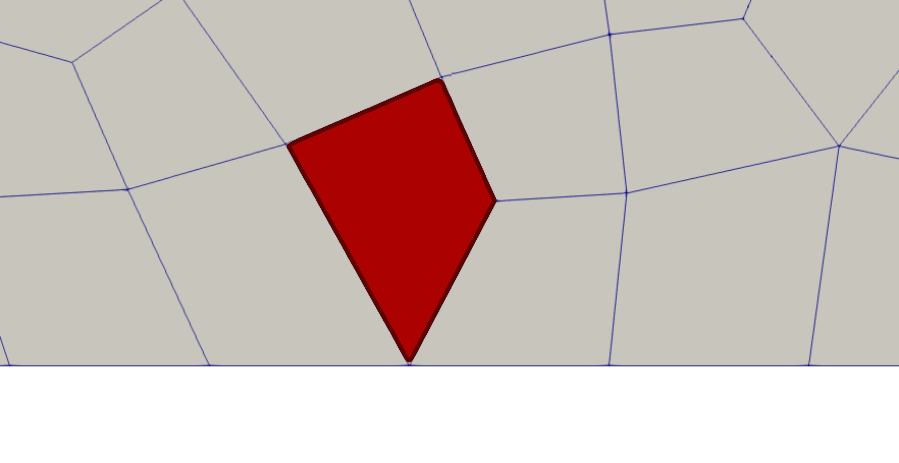
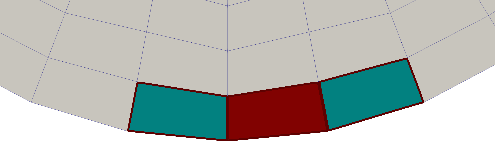

====
Mesh
====

The mesh subsection of DEM simulations is almost identical to the `CFD <https://chaos-polymtl.github.io/lethe/documentation/parameters/cfd/mesh.html>`_ in Lethe. There are two additional parameters mainly used in DEM and CFD-DEM simulations. These parameters are ``check diamond cells`` and ``expand particle-wall contact search``.

.. code-block:: text

 subsection mesh
    set check diamond cells                 = false

    set expand particle-wall contact search = false
 end

* ``check diamond cells`` parameter enables searching for diamond-shaped boundary cells and adding them to particle-wall contact search cells. The following image shows a diamond-shaped boundary cell colored in red. A diamond cell is defined as a cell that has a vertex or an edge on the boundary, but no face lying on the boundary.

* ``expand particle-wall contact search`` enables adding the neighboring cells of boundary cells to the particle-wall contact search list. This feature should only be activated in geometries with convex boundaries (for example, particles flowing inside a cylinder or sphere). The following image shows the boundary neighbor cells (colored in teal) of the red boundary cell. In concave geometries, enabling this feature leads to unphysical contacts between particles and the imaginary (unreal) extension of the boundary faces from neighboring cells.

.. warning:: 
     In geometries with convex boundaries, this feature MUST NOT be activated.