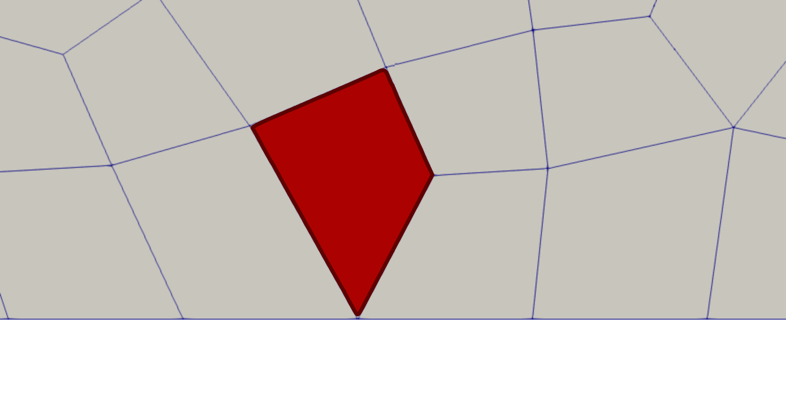
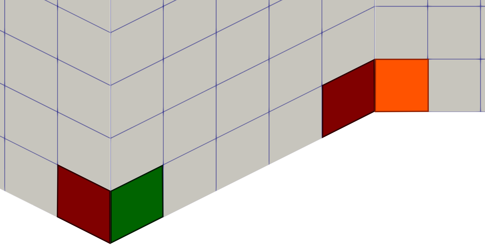

====
Mesh
====

The mesh subsection of DEM simulations is almost identical to the `CFD <https://chaos-polymtl.github.io/lethe/documentation/parameters/cfd/mesh.html>`_ in Lethe. There are two additional parameters mainly used in DEM and CFD-DEM simulations. These parameters are ``check diamond cells`` and ``expand particle-wall contact search``.

.. code-block:: text

 subsection mesh
    set check diamond cells                 = false

    set expand particle-wall contact search = false
 end

* ``check diamond cells`` parameter enables searching for diamond-shaped boundary cells and adding them to particle-wall contact search cells. The following image shows a diamond-shaped boundary cell colored in red. A diamond cell is defined as a cell that has a vertex or an edge on the boundary, but no face lying on the boundary.

* ``expand particle-wall contact search`` enables adding the boundary faces of cells neighboring the boundary cell containing the particle, to the particle-wall contact search list. Only neighboring boundary faces that form a convex boundary with the current cell are added; non-convex boundary faces are excluded. The following figure illustrates this concept. When a particle is located in the red boundary cell, the boundary faces of its neighboring cells that form a convex boundary (shown in teal) are also considered during the particle-wall contact search. This is necessary because a particle whose centroid lies in the red cell can simultaneously contact both the boundary face of the current cell and that of a neighboring cell when the two faces form a convex boundary.

